<div align="center">

# 🎨 Logos Apps

### A free, open collection of **2,094** clean SVG logos for apps, tools & tech brands.

<p>
  
  
  
</p>

<p>
  <a href="https://github.com/ln-dev7/logos-apps/archive/refs/heads/master.zip">
    
  </a>
  <a href="https://logos.lndev.me/">
    
  </a>
</p>

**[🖼️ Open the interactive gallery](https://logos.lndev.me/)** — search, filter by category, and download any logo in one click.

</div>

---

## 🚀 Quick start

**Download everything:** [grab the full pack (.zip)](https://github.com/ln-dev7/logos-apps/archive/refs/heads/master.zip) · **Clone:** `git clone https://github.com/ln-dev7/logos-apps.git`

**Hotlink a single logo:**

```html

```

**Naming convention:** `brand.svg` = icon only · `brand-wordmark.svg` = logotype (icon + name).

> 💡 In the tables below, **click any icon** to open its file — then use GitHub's download button, or visit the [gallery](https://logos.lndev.me/) for true 1-click downloads.

---

<a id="toc"></a>

## 📚 Categories

- [🤖 AI & Machine Learning](#cat-ai) — **56**
- [💻 Languages & Runtimes](#cat-lang) — **83**
- [⚛️ Frameworks & UI Libraries](#cat-fw) — **322**
- [🛠️ Dev Tools, CI/CD & Testing](#cat-dev) — **512**
- [☁️ Cloud, Hosting & Infrastructure](#cat-cloud) — **207**
- [🗄️ Databases & Data](#cat-db) — **155**
- [🎨 Design & Creative](#cat-design) — **52**
- [💬 Social & Communication](#cat-social) — **74**
- [💳 Payments, Fintech & Crypto](#cat-pay) — **56**
- [📋 Productivity & Collaboration](#cat-prod) — **91**
- [🛒 E-commerce & CMS](#cat-shop) — **67**
- [🎵 Media & Entertainment](#cat-media) — **32**
- [🖥️ OS, Platforms & Browsers](#cat-os) — **57**
- [📊 Analytics, Marketing & CRM](#cat-mkt) — **125**
- [🔐 Security & Identity](#cat-sec) — **38**
- [🌐 Web Standards & Protocols](#cat-web) — **52**
- [🏢 Companies & Services](#cat-corp) — **79**
- [📦 Others](#cat-other) — **36**

> ⚠️ Categories are auto-generated — spotted a logo in the wrong place? PRs welcome!

---

<a id="cat-ai"></a>

## 🤖 AI & Machine Learning <sub>(56)</sub>

<table>
<tr><td align="center"><a href="./logos/ai.svg"><br/><sub><code>ai</code></sub></a></td><td align="center"><a href="./logos/anthropic.svg"><br/><sub><code>anthropic</code></sub></a></td><td align="center"><a href="./logos/anthropic-wordmark.svg"><br/><sub><code>anthropic-wordmark</code></sub></a></td><td align="center"><a href="./logos/api-ai.svg"><br/><sub><code>api-ai</code></sub></a></td><td align="center"><a href="./logos/brainjs.svg">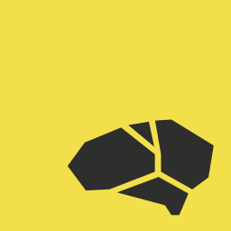<br/><sub><code>brainjs</code></sub></a></td><td align="center"><a href="./logos/caffe2.svg"><br/><sub><code>caffe2</code></sub></a></td></tr>
<tr><td align="center"><a href="./logos/claude.svg">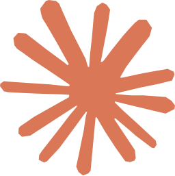<br/><sub><code>claude</code></sub></a></td><td align="center"><a href="./logos/claude-wordmark.svg"><br/><sub><code>claude-wordmark</code></sub></a></td><td align="center"><a href="./logos/danfo.svg"><br/><sub><code>danfo</code></sub></a></td><td align="center"><a href="./logos/deepseek.svg"><br/><sub><code>deepseek</code></sub></a></td><td align="center"><a href="./logos/deepseek-wordmark.svg"><br/><sub><code>deepseek-wordmark</code></sub></a></td><td align="center"><a href="./logos/dialogflow.svg"><br/><sub><code>dialogflow</code></sub></a></td></tr>
<tr><td align="center"><a href="./logos/floydhub.svg"><br/><sub><code>floydhub</code></sub></a></td><td align="center"><a href="./logos/github-copilot.svg"><br/><sub><code>github-copilot</code></sub></a></td><td align="center"><a href="./logos/google-bard.svg"><br/><sub><code>google-bard</code></sub></a></td><td align="center"><a href="./logos/google-bard-wordmark.svg"><br/><sub><code>google-bard-wordmark</code></sub></a></td><td align="center"><a href="./logos/google-gemini.svg"><br/><sub><code>google-gemini</code></sub></a></td><td align="center"><a href="./logos/google-palm.svg"><br/><sub><code>google-palm</code></sub></a></td></tr>
<tr><td align="center"><a href="./logos/gradio.svg"><br/><sub><code>gradio</code></sub></a></td><td align="center"><a href="./logos/gradio-wordmark.svg"><br/><sub><code>gradio-wordmark</code></sub></a></td><td align="center"><a href="./logos/grok.svg"><br/><sub><code>grok</code></sub></a></td><td align="center"><a href="./logos/grok-wordmark.svg"><br/><sub><code>grok-wordmark</code></sub></a></td><td align="center"><a href="./logos/hugging-face.svg"><br/><sub><code>hugging-face</code></sub></a></td><td align="center"><a href="./logos/hugging-face-wordmark.svg"><br/><sub><code>hugging-face-wordmark</code></sub></a></td></tr>
<tr><td align="center"><a href="./logos/jupyter.svg">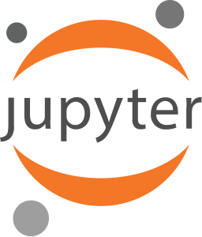<br/><sub><code>jupyter</code></sub></a></td><td align="center"><a href="./logos/matplotlib.svg"><br/><sub><code>matplotlib</code></sub></a></td><td align="center"><a href="./logos/matplotlib-wordmark.svg"><br/><sub><code>matplotlib-wordmark</code></sub></a></td><td align="center"><a href="./logos/midjourney.svg"><br/><sub><code>midjourney</code></sub></a></td><td align="center"><a href="./logos/mindsdb.svg">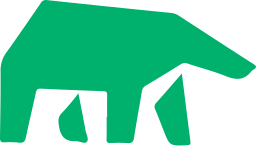<br/><sub><code>mindsdb</code></sub></a></td><td align="center"><a href="./logos/mindsdb-wordmark.svg"><br/><sub><code>mindsdb-wordmark</code></sub></a></td></tr>
<tr><td align="center"><a href="./logos/mistral-ai.svg">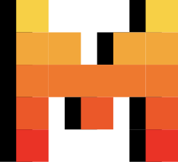<br/><sub><code>mistral-ai</code></sub></a></td><td align="center"><a href="./logos/mistral-ai-wordmark.svg"><br/><sub><code>mistral-ai-wordmark</code></sub></a></td><td align="center"><a href="./logos/model-context-protocol.svg"><br/><sub><code>model-context-protocol</code></sub></a></td><td align="center"><a href="./logos/model-context-protocol-wordmark.svg"><br/><sub><code>model-context-protocol-wordmark</code></sub></a></td><td align="center"><a href="./logos/moonshot-ai.svg"><br/><sub><code>moonshot-ai</code></sub></a></td><td align="center"><a href="./logos/moonshot-ai-wordmark.svg"><br/><sub><code>moonshot-ai-wordmark</code></sub></a></td></tr>
<tr><td align="center"><a href="./logos/nanonets.svg">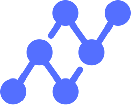<br/><sub><code>nanonets</code></sub></a></td><td align="center"><a href="./logos/numpy.svg"><br/><sub><code>numpy</code></sub></a></td><td align="center"><a href="./logos/openai.svg"><br/><sub><code>openai</code></sub></a></td><td align="center"><a href="./logos/openai-wordmark.svg"><br/><sub><code>openai-wordmark</code></sub></a></td><td align="center"><a href="./logos/opencv.svg"><br/><sub><code>opencv</code></sub></a></td><td align="center"><a href="./logos/pandas.svg"><br/><sub><code>pandas</code></sub></a></td></tr>
<tr><td align="center"><a href="./logos/pandas-wordmark.svg"><br/><sub><code>pandas-wordmark</code></sub></a></td><td align="center"><a href="./logos/perplexity.svg">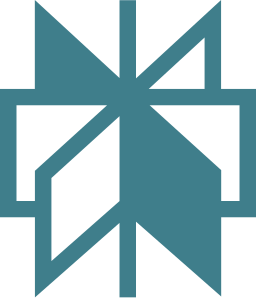<br/><sub><code>perplexity</code></sub></a></td><td align="center"><a href="./logos/perplexity-wordmark.svg"><br/><sub><code>perplexity-wordmark</code></sub></a></td><td align="center"><a href="./logos/pytorch.svg"><br/><sub><code>pytorch</code></sub></a></td><td align="center"><a href="./logos/pytorch-wordmark.svg"><br/><sub><code>pytorch-wordmark</code></sub></a></td><td align="center"><a href="./logos/qwen.svg"><br/><sub><code>qwen</code></sub></a></td></tr>
<tr><td align="center"><a href="./logos/qwen-wordmark.svg"><br/><sub><code>qwen-wordmark</code></sub></a></td><td align="center"><a href="./logos/seaborn.svg">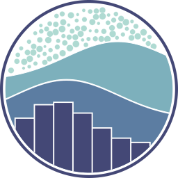<br/><sub><code>seaborn</code></sub></a></td><td align="center"><a href="./logos/seaborn-wordmark.svg"><br/><sub><code>seaborn-wordmark</code></sub></a></td><td align="center"><a href="./logos/stability-ai.svg">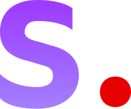<br/><sub><code>stability-ai</code></sub></a></td><td align="center"><a href="./logos/stability-ai-wordmark.svg"><br/><sub><code>stability-ai-wordmark</code></sub></a></td><td align="center"><a href="./logos/streamlit.svg"><br/><sub><code>streamlit</code></sub></a></td></tr>
<tr><td align="center"><a href="./logos/tensorflow.svg"><br/><sub><code>tensorflow</code></sub></a></td><td align="center"><a href="./logos/x-ai.svg"><br/><sub><code>x-ai</code></sub></a></td></tr>
</table>

<p align="right"><a href="#toc">⬆️ Back to top</a></p>
<a id="cat-lang"></a>

## 💻 Languages & Runtimes <sub>(83)</sub>

<table>
<tr><td align="center"><a href="./logos/autoit.svg"><br/><sub><code>autoit</code></sub></a></td><td align="center"><a href="./logos/bun.svg"><br/><sub><code>bun</code></sub></a></td><td align="center"><a href="./logos/c.svg"><br/><sub><code>c</code></sub></a></td><td align="center"><a href="./logos/c-plusplus.svg"><br/><sub><code>c-plusplus</code></sub></a></td><td align="center"><a href="./logos/c-sharp.svg"><br/><sub><code>c-sharp</code></sub></a></td><td align="center"><a href="./logos/ceylon.svg"><br/><sub><code>ceylon</code></sub></a></td></tr>
<tr><td align="center"><a href="./logos/clio-lang.svg"><br/><sub><code>clio-lang</code></sub></a></td><td align="center"><a href="./logos/cljs.svg"><br/><sub><code>cljs</code></sub></a></td><td align="center"><a href="./logos/clojure.svg"><br/><sub><code>clojure</code></sub></a></td><td align="center"><a href="./logos/coffeescript.svg"><br/><sub><code>coffeescript</code></sub></a></td><td align="center"><a href="./logos/crystal.svg"><br/><sub><code>crystal</code></sub></a></td><td align="center"><a href="./logos/dart.svg"><br/><sub><code>dart</code></sub></a></td></tr>
<tr><td align="center"><a href="./logos/deno.svg"><br/><sub><code>deno</code></sub></a></td><td align="center"><a href="./logos/dotnet.svg"><br/><sub><code>dotnet</code></sub></a></td><td align="center"><a href="./logos/ecma.svg"><br/><sub><code>ecma</code></sub></a></td><td align="center"><a href="./logos/elm.svg"><br/><sub><code>elm</code></sub></a></td><td align="center"><a href="./logos/elm-classic.svg"><br/><sub><code>elm-classic</code></sub></a></td><td align="center"><a href="./logos/erlang.svg"><br/><sub><code>erlang</code></sub></a></td></tr>
<tr><td align="center"><a href="./logos/es6.svg"><br/><sub><code>es6</code></sub></a></td><td align="center"><a href="./logos/fortran.svg"><br/><sub><code>fortran</code></sub></a></td><td align="center"><a href="./logos/fsharp.svg"><br/><sub><code>fsharp</code></sub></a></td><td align="center"><a href="./logos/gleam.svg"><br/><sub><code>gleam</code></sub></a></td><td align="center"><a href="./logos/go.svg"><br/><sub><code>go</code></sub></a></td><td align="center"><a href="./logos/gopher.svg"><br/><sub><code>gopher</code></sub></a></td></tr>
<tr><td align="center"><a href="./logos/hack.svg"><br/><sub><code>hack</code></sub></a></td><td align="center"><a href="./logos/haskell.svg"><br/><sub><code>haskell</code></sub></a></td><td align="center"><a href="./logos/haskell-wordmark.svg"><br/><sub><code>haskell-wordmark</code></sub></a></td><td align="center"><a href="./logos/haxe.svg"><br/><sub><code>haxe</code></sub></a></td><td align="center"><a href="./logos/hermes.svg"><br/><sub><code>hermes</code></sub></a></td><td align="center"><a href="./logos/hhvm.svg"><br/><sub><code>hhvm</code></sub></a></td></tr>
<tr><td align="center"><a href="./logos/hoa.svg"><br/><sub><code>hoa</code></sub></a></td><td align="center"><a href="./logos/imba.svg"><br/><sub><code>imba</code></sub></a></td><td align="center"><a href="./logos/imba-wordmark.svg"><br/><sub><code>imba-wordmark</code></sub></a></td><td align="center"><a href="./logos/io.svg"><br/><sub><code>io</code></sub></a></td><td align="center"><a href="./logos/java.svg"><br/><sub><code>java</code></sub></a></td><td align="center"><a href="./logos/javascript.svg"><br/><sub><code>javascript</code></sub></a></td></tr>
<tr><td align="center"><a href="./logos/jruby.svg"><br/><sub><code>jruby</code></sub></a></td><td align="center"><a href="./logos/julia.svg"><br/><sub><code>julia</code></sub></a></td><td align="center"><a href="./logos/kotlin.svg"><br/><sub><code>kotlin</code></sub></a></td><td align="center"><a href="./logos/kotlin-wordmark.svg"><br/><sub><code>kotlin-wordmark</code></sub></a></td><td align="center"><a href="./logos/lua.svg"><br/><sub><code>lua</code></sub></a></td><td align="center"><a href="./logos/micro-python.svg"><br/><sub><code>micro-python</code></sub></a></td></tr>
<tr><td align="center"><a href="./logos/mint-lang.svg"><br/><sub><code>mint-lang</code></sub></a></td><td align="center"><a href="./logos/mono.svg"><br/><sub><code>mono</code></sub></a></td><td align="center"><a href="./logos/nasm.svg"><br/><sub><code>nasm</code></sub></a></td><td align="center"><a href="./logos/net.svg"><br/><sub><code>net</code></sub></a></td><td align="center"><a href="./logos/nim-lang.svg"><br/><sub><code>nim-lang</code></sub></a></td><td align="center"><a href="./logos/nodejs.svg"><br/><sub><code>nodejs</code></sub></a></td></tr>
<tr><td align="center"><a href="./logos/nodejs-icon-alt.svg"><br/><sub><code>nodejs-icon-alt</code></sub></a></td><td align="center"><a href="./logos/nodejs-wordmark.svg"><br/><sub><code>nodejs-wordmark</code></sub></a></td><td align="center"><a href="./logos/ocaml.svg"><br/><sub><code>ocaml</code></sub></a></td><td align="center"><a href="./logos/perl.svg"><br/><sub><code>perl</code></sub></a></td><td align="center"><a href="./logos/php.svg"><br/><sub><code>php</code></sub></a></td><td align="center"><a href="./logos/php-alt.svg"><br/><sub><code>php-alt</code></sub></a></td></tr>
<tr><td align="center"><a href="./logos/purescript.svg"><br/><sub><code>purescript</code></sub></a></td><td align="center"><a href="./logos/purescript-wordmark.svg"><br/><sub><code>purescript-wordmark</code></sub></a></td><td align="center"><a href="./logos/pyscript.svg"><br/><sub><code>pyscript</code></sub></a></td><td align="center"><a href="./logos/python.svg"><br/><sub><code>python</code></sub></a></td><td align="center"><a href="./logos/r-lang.svg"><br/><sub><code>r-lang</code></sub></a></td><td align="center"><a href="./logos/reasonml.svg"><br/><sub><code>reasonml</code></sub></a></td></tr>
<tr><td align="center"><a href="./logos/reasonml-wordmark.svg"><br/><sub><code>reasonml-wordmark</code></sub></a></td><td align="center"><a href="./logos/rescript.svg"><br/><sub><code>rescript</code></sub></a></td><td align="center"><a href="./logos/rescript-wordmark.svg"><br/><sub><code>rescript-wordmark</code></sub></a></td><td align="center"><a href="./logos/ruby.svg"><br/><sub><code>ruby</code></sub></a></td><td align="center"><a href="./logos/rust.svg"><br/><sub><code>rust</code></sub></a></td><td align="center"><a href="./logos/scala.svg"><br/><sub><code>scala</code></sub></a></td></tr>
<tr><td align="center"><a href="./logos/solidity.svg"><br/><sub><code>solidity</code></sub></a></td><td align="center"><a href="./logos/spidermonkey.svg"><br/><sub><code>spidermonkey</code></sub></a></td><td align="center"><a href="./logos/spidermonkey-wordmark.svg"><br/><sub><code>spidermonkey-wordmark</code></sub></a></td><td align="center"><a href="./logos/swift.svg"><br/><sub><code>swift</code></sub></a></td><td align="center"><a href="./logos/tsnode.svg"><br/><sub><code>tsnode</code></sub></a></td><td align="center"><a href="./logos/typescript.svg"><br/><sub><code>typescript</code></sub></a></td></tr>
<tr><td align="center"><a href="./logos/typescript-icon-round.svg"><br/><sub><code>typescript-icon-round</code></sub></a></td><td align="center"><a href="./logos/typescript-wordmark.svg"><br/><sub><code>typescript-wordmark</code></sub></a></td><td align="center"><a href="./logos/v8.svg"><br/><sub><code>v8</code></sub></a></td><td align="center"><a href="./logos/v8-ignition.svg"><br/><sub><code>v8-ignition</code></sub></a></td><td align="center"><a href="./logos/v8-turbofan.svg"><br/><sub><code>v8-turbofan</code></sub></a></td><td align="center"><a href="./logos/vlang.svg"><br/><sub><code>vlang</code></sub></a></td></tr>
<tr><td align="center"><a href="./logos/webassembly.svg"><br/><sub><code>webassembly</code></sub></a></td><td align="center"><a href="./logos/winglang.svg"><br/><sub><code>winglang</code></sub></a></td><td align="center"><a href="./logos/winglang-wordmark.svg"><br/><sub><code>winglang-wordmark</code></sub></a></td><td align="center"><a href="./logos/xtend.svg"><br/><sub><code>xtend</code></sub></a></td><td align="center"><a href="./logos/zig.svg"><br/><sub><code>zig</code></sub></a></td></tr>
</table>

<p align="right"><a href="#toc">⬆️ Back to top</a></p>
<a id="cat-fw"></a>

## ⚛️ Frameworks & UI Libraries <sub>(322)</sub>

<table>
<tr><td align="center"><a href="./logos/adonisjs.svg">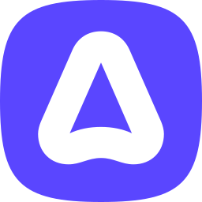<br/><sub><code>adonisjs</code></sub></a></td><td align="center"><a href="./logos/adonisjs-wordmark.svg"><br/><sub><code>adonisjs-wordmark</code></sub></a></td><td align="center"><a href="./logos/akka.svg"><br/><sub><code>akka</code></sub></a></td><td align="center"><a href="./logos/alpinejs.svg"><br/><sub><code>alpinejs</code></sub></a></td><td align="center"><a href="./logos/alpinejs-wordmark.svg"><br/><sub><code>alpinejs-wordmark</code></sub></a></td><td align="center"><a href="./logos/ampersand.svg"><br/><sub><code>ampersand</code></sub></a></td></tr>
<tr><td align="center"><a href="./logos/analog.svg"><br/><sub><code>analog</code></sub></a></td><td align="center"><a href="./logos/angular.svg"><br/><sub><code>angular</code></sub></a></td><td align="center"><a href="./logos/angular-wordmark.svg"><br/><sub><code>angular-wordmark</code></sub></a></td><td align="center"><a href="./logos/ant-design.svg">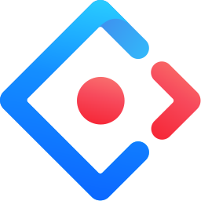<br/><sub><code>ant-design</code></sub></a></td><td align="center"><a href="./logos/apollostack.svg">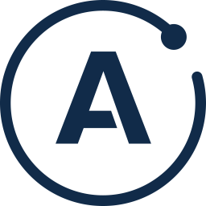<br/><sub><code>apollostack</code></sub></a></td><td align="center"><a href="./logos/astro.svg">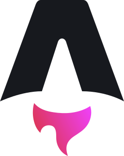<br/><sub><code>astro</code></sub></a></td></tr>
<tr><td align="center"><a href="./logos/astro-wordmark.svg"><br/><sub><code>astro-wordmark</code></sub></a></td><td align="center"><a href="./logos/atomicojs.svg"><br/><sub><code>atomicojs</code></sub></a></td><td align="center"><a href="./logos/atomicojs-wordmark.svg"><br/><sub><code>atomicojs-wordmark</code></sub></a></td><td align="center"><a href="./logos/aurelia.svg"><br/><sub><code>aurelia</code></sub></a></td><td align="center"><a href="./logos/autoprefixer.svg"><br/><sub><code>autoprefixer</code></sub></a></td><td align="center"><a href="./logos/axios.svg"><br/><sub><code>axios</code></sub></a></td></tr>
<tr><td align="center"><a href="./logos/backbone.svg"><br/><sub><code>backbone</code></sub></a></td><td align="center"><a href="./logos/backbone-wordmark.svg"><br/><sub><code>backbone-wordmark</code></sub></a></td><td align="center"><a href="./logos/bem.svg"><br/><sub><code>bem</code></sub></a></td><td align="center"><a href="./logos/bem-2.svg"><br/><sub><code>bem-2</code></sub></a></td><td align="center"><a href="./logos/blitzjs.svg"><br/><sub><code>blitzjs</code></sub></a></td><td align="center"><a href="./logos/blitzjs-wordmark.svg"><br/><sub><code>blitzjs-wordmark</code></sub></a></td></tr>
<tr><td align="center"><a href="./logos/blockus.svg"><br/><sub><code>blockus</code></sub></a></td><td align="center"><a href="./logos/blueprint.svg"><br/><sub><code>blueprint</code></sub></a></td><td align="center"><a href="./logos/bootstrap.svg"><br/><sub><code>bootstrap</code></sub></a></td><td align="center"><a href="./logos/bourbon.svg"><br/><sub><code>bourbon</code></sub></a></td><td align="center"><a href="./logos/bulma.svg"><br/><sub><code>bulma</code></sub></a></td><td align="center"><a href="./logos/cakephp.svg"><br/><sub><code>cakephp</code></sub></a></td></tr>
<tr><td align="center"><a href="./logos/cakephp-wordmark.svg"><br/><sub><code>cakephp-wordmark</code></sub></a></td><td align="center"><a href="./logos/canjs.svg"><br/><sub><code>canjs</code></sub></a></td><td align="center"><a href="./logos/capacitorjs.svg"><br/><sub><code>capacitorjs</code></sub></a></td><td align="center"><a href="./logos/capacitorjs-wordmark.svg"><br/><sub><code>capacitorjs-wordmark</code></sub></a></td><td align="center"><a href="./logos/celluloid.svg"><br/><sub><code>celluloid</code></sub></a></td><td align="center"><a href="./logos/chartjs.svg"><br/><sub><code>chartjs</code></sub></a></td></tr>
<tr><td align="center"><a href="./logos/cinder.svg"><br/><sub><code>cinder</code></sub></a></td><td align="center"><a href="./logos/codeigniter.svg"><br/><sub><code>codeigniter</code></sub></a></td><td align="center"><a href="./logos/codeigniter-wordmark.svg"><br/><sub><code>codeigniter-wordmark</code></sub></a></td><td align="center"><a href="./logos/compass.svg"><br/><sub><code>compass</code></sub></a></td><td align="center"><a href="./logos/component.svg"><br/><sub><code>component</code></sub></a></td><td align="center"><a href="./logos/componentkit.svg"><br/><sub><code>componentkit</code></sub></a></td></tr>
<tr><td align="center"><a href="./logos/compose-multiplatform.svg"><br/><sub><code>compose-multiplatform</code></sub></a></td><td align="center"><a href="./logos/cordova.svg">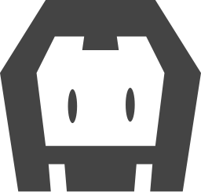<br/><sub><code>cordova</code></sub></a></td><td align="center"><a href="./logos/create-react-app.svg"><br/><sub><code>create-react-app</code></sub></a></td><td align="center"><a href="./logos/createjs.svg"><br/><sub><code>createjs</code></sub></a></td><td align="center"><a href="./logos/cssnext.svg"><br/><sub><code>cssnext</code></sub></a></td><td align="center"><a href="./logos/cyclejs.svg">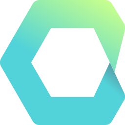<br/><sub><code>cyclejs</code></sub></a></td></tr>
<tr><td align="center"><a href="./logos/d3.svg"><br/><sub><code>d3</code></sub></a></td><td align="center"><a href="./logos/daisyui.svg"><br/><sub><code>daisyui</code></sub></a></td><td align="center"><a href="./logos/daisyui-wordmark.svg"><br/><sub><code>daisyui-wordmark</code></sub></a></td><td align="center"><a href="./logos/derby.svg"><br/><sub><code>derby</code></sub></a></td><td align="center"><a href="./logos/django.svg"><br/><sub><code>django</code></sub></a></td><td align="center"><a href="./logos/django-wordmark.svg"><br/><sub><code>django-wordmark</code></sub></a></td></tr>
<tr><td align="center"><a href="./logos/dojo.svg"><br/><sub><code>dojo</code></sub></a></td><td align="center"><a href="./logos/dojo-toolkit.svg"><br/><sub><code>dojo-toolkit</code></sub></a></td><td align="center"><a href="./logos/dojo-wordmark.svg"><br/><sub><code>dojo-wordmark</code></sub></a></td><td align="center"><a href="./logos/dropzone.svg"><br/><sub><code>dropzone</code></sub></a></td><td align="center"><a href="./logos/effect.svg"><br/><sub><code>effect</code></sub></a></td><td align="center"><a href="./logos/effect-wordmark.svg"><br/><sub><code>effect-wordmark</code></sub></a></td></tr>
<tr><td align="center"><a href="./logos/effector.svg"><br/><sub><code>effector</code></sub></a></td><td align="center"><a href="./logos/electron.svg"><br/><sub><code>electron</code></sub></a></td><td align="center"><a href="./logos/element.svg"><br/><sub><code>element</code></sub></a></td><td align="center"><a href="./logos/elemental-ui.svg"><br/><sub><code>elemental-ui</code></sub></a></td><td align="center"><a href="./logos/eleventy.svg"><br/><sub><code>eleventy</code></sub></a></td><td align="center"><a href="./logos/ember.svg">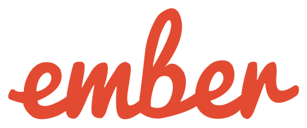<br/><sub><code>ember</code></sub></a></td></tr>
<tr><td align="center"><a href="./logos/ember-tomster.svg"><br/><sub><code>ember-tomster</code></sub></a></td><td align="center"><a href="./logos/enact.svg"><br/><sub><code>enact</code></sub></a></td><td align="center"><a href="./logos/enyo.svg"><br/><sub><code>enyo</code></sub></a></td><td align="center"><a href="./logos/eta.svg">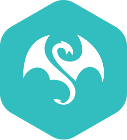<br/><sub><code>eta</code></sub></a></td><td align="center"><a href="./logos/eta-wordmark.svg"><br/><sub><code>eta-wordmark</code></sub></a></td><td align="center"><a href="./logos/evergreen.svg">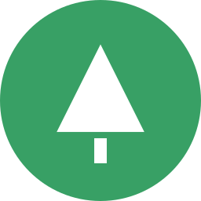<br/><sub><code>evergreen</code></sub></a></td></tr>
<tr><td align="center"><a href="./logos/evergreen-wordmark.svg"><br/><sub><code>evergreen-wordmark</code></sub></a></td><td align="center"><a href="./logos/expo.svg"><br/><sub><code>expo</code></sub></a></td><td align="center"><a href="./logos/expo-wordmark.svg"><br/><sub><code>expo-wordmark</code></sub></a></td><td align="center"><a href="./logos/exponent.svg"><br/><sub><code>exponent</code></sub></a></td><td align="center"><a href="./logos/express.svg"><br/><sub><code>express</code></sub></a></td><td align="center"><a href="./logos/falcor.svg"><br/><sub><code>falcor</code></sub></a></td></tr>
<tr><td align="center"><a href="./logos/famous.svg"><br/><sub><code>famous</code></sub></a></td><td align="center"><a href="./logos/fastapi.svg"><br/><sub><code>fastapi</code></sub></a></td><td align="center"><a href="./logos/fastapi-wordmark.svg"><br/><sub><code>fastapi-wordmark</code></sub></a></td><td align="center"><a href="./logos/fastify.svg"><br/><sub><code>fastify</code></sub></a></td><td align="center"><a href="./logos/fastify-wordmark.svg"><br/><sub><code>fastify-wordmark</code></sub></a></td><td align="center"><a href="./logos/feathersjs.svg"><br/><sub><code>feathersjs</code></sub></a></td></tr>
<tr><td align="center"><a href="./logos/flask.svg"><br/><sub><code>flask</code></sub></a></td><td align="center"><a href="./logos/flat-ui.svg"><br/><sub><code>flat-ui</code></sub></a></td><td align="center"><a href="./logos/flight.svg"><br/><sub><code>flight</code></sub></a></td><td align="center"><a href="./logos/flutter.svg"><br/><sub><code>flutter</code></sub></a></td><td align="center"><a href="./logos/flux.svg"><br/><sub><code>flux</code></sub></a></td><td align="center"><a href="./logos/fluxxor.svg"><br/><sub><code>fluxxor</code></sub></a></td></tr>
<tr><td align="center"><a href="./logos/flyjs.svg"><br/><sub><code>flyjs</code></sub></a></td><td align="center"><a href="./logos/foundation.svg"><br/><sub><code>foundation</code></sub></a></td><td align="center"><a href="./logos/framework7.svg"><br/><sub><code>framework7</code></sub></a></td><td align="center"><a href="./logos/framework7-wordmark.svg">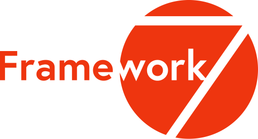<br/><sub><code>framework7-wordmark</code></sub></a></td><td align="center"><a href="./logos/fresh.svg"><br/><sub><code>fresh</code></sub></a></td><td align="center"><a href="./logos/gatsby.svg"><br/><sub><code>gatsby</code></sub></a></td></tr>
<tr><td align="center"><a href="./logos/gin.svg"><br/><sub><code>gin</code></sub></a></td><td align="center"><a href="./logos/glamorous.svg"><br/><sub><code>glamorous</code></sub></a></td><td align="center"><a href="./logos/glamorous-wordmark.svg"><br/><sub><code>glamorous-wordmark</code></sub></a></td><td align="center"><a href="./logos/glimmerjs.svg"><br/><sub><code>glimmerjs</code></sub></a></td><td align="center"><a href="./logos/godot.svg"><br/><sub><code>godot</code></sub></a></td><td align="center"><a href="./logos/godot-wordmark.svg"><br/><sub><code>godot-wordmark</code></sub></a></td></tr>
<tr><td align="center"><a href="./logos/grails.svg"><br/><sub><code>grails</code></sub></a></td><td align="center"><a href="./logos/grape.svg"><br/><sub><code>grape</code></sub></a></td><td align="center"><a href="./logos/graphene.svg"><br/><sub><code>graphene</code></sub></a></td><td align="center"><a href="./logos/graphql.svg"><br/><sub><code>graphql</code></sub></a></td><td align="center"><a href="./logos/greensock.svg"><br/><sub><code>greensock</code></sub></a></td><td align="center"><a href="./logos/greensock-wordmark.svg"><br/><sub><code>greensock-wordmark</code></sub></a></td></tr>
<tr><td align="center"><a href="./logos/gridsome.svg"><br/><sub><code>gridsome</code></sub></a></td><td align="center"><a href="./logos/gridsome-wordmark.svg"><br/><sub><code>gridsome-wordmark</code></sub></a></td><td align="center"><a href="./logos/grommet.svg"><br/><sub><code>grommet</code></sub></a></td><td align="center"><a href="./logos/grpc.svg"><br/><sub><code>grpc</code></sub></a></td><td align="center"><a href="./logos/gwt.svg"><br/><sub><code>gwt</code></sub></a></td><td align="center"><a href="./logos/haml.svg"><br/><sub><code>haml</code></sub></a></td></tr>
<tr><td align="center"><a href="./logos/hanami.svg"><br/><sub><code>hanami</code></sub></a></td><td align="center"><a href="./logos/handlebars.svg"><br/><sub><code>handlebars</code></sub></a></td><td align="center"><a href="./logos/hapi.svg"><br/><sub><code>hapi</code></sub></a></td><td align="center"><a href="./logos/haxl.svg"><br/><sub><code>haxl</code></sub></a></td><td align="center"><a href="./logos/headlessui.svg"><br/><sub><code>headlessui</code></sub></a></td><td align="center"><a href="./logos/headlessui-wordmark.svg"><br/><sub><code>headlessui-wordmark</code></sub></a></td></tr>
<tr><td align="center"><a href="./logos/hexo.svg"><br/><sub><code>hexo</code></sub></a></td><td align="center"><a href="./logos/highcharts.svg"><br/><sub><code>highcharts</code></sub></a></td><td align="center"><a href="./logos/hono.svg"><br/><sub><code>hono</code></sub></a></td><td align="center"><a href="./logos/hoodie.svg"><br/><sub><code>hoodie</code></sub></a></td><td align="center"><a href="./logos/hookstate.svg"><br/><sub><code>hookstate</code></sub></a></td><td align="center"><a href="./logos/horizon.svg"><br/><sub><code>horizon</code></sub></a></td></tr>
<tr><td align="center"><a href="./logos/htmx.svg"><br/><sub><code>htmx</code></sub></a></td><td align="center"><a href="./logos/htmx-wordmark.svg"><br/><sub><code>htmx-wordmark</code></sub></a></td><td align="center"><a href="./logos/hugo.svg"><br/><sub><code>hugo</code></sub></a></td><td align="center"><a href="./logos/hyperapp.svg"><br/><sub><code>hyperapp</code></sub></a></td><td align="center"><a href="./logos/immer.svg"><br/><sub><code>immer</code></sub></a></td><td align="center"><a href="./logos/immer-wordmark.svg"><br/><sub><code>immer-wordmark</code></sub></a></td></tr>
<tr><td align="center"><a href="./logos/immutable.svg"><br/><sub><code>immutable</code></sub></a></td><td align="center"><a href="./logos/inferno.svg"><br/><sub><code>inferno</code></sub></a></td><td align="center"><a href="./logos/ink.svg"><br/><sub><code>ink</code></sub></a></td><td align="center"><a href="./logos/ionic.svg"><br/><sub><code>ionic</code></sub></a></td><td align="center"><a href="./logos/ionic-wordmark.svg"><br/><sub><code>ionic-wordmark</code></sub></a></td><td align="center"><a href="./logos/jade.svg"><br/><sub><code>jade</code></sub></a></td></tr>
<tr><td align="center"><a href="./logos/jekyll.svg"><br/><sub><code>jekyll</code></sub></a></td><td align="center"><a href="./logos/jhipster.svg"><br/><sub><code>jhipster</code></sub></a></td><td align="center"><a href="./logos/jhipster-wordmark.svg"><br/><sub><code>jhipster-wordmark</code></sub></a></td><td align="center"><a href="./logos/jotai.svg"><br/><sub><code>jotai</code></sub></a></td><td align="center"><a href="./logos/jquery.svg"><br/><sub><code>jquery</code></sub></a></td><td align="center"><a href="./logos/jquery-mobile.svg"><br/><sub><code>jquery-mobile</code></sub></a></td></tr>
<tr><td align="center"><a href="./logos/jss.svg"><br/><sub><code>jss</code></sub></a></td><td align="center"><a href="./logos/kemal.svg"><br/><sub><code>kemal</code></sub></a></td><td align="center"><a href="./logos/knockout.svg"><br/><sub><code>knockout</code></sub></a></td><td align="center"><a href="./logos/koa.svg"><br/><sub><code>koa</code></sub></a></td><td align="center"><a href="./logos/kore.svg"><br/><sub><code>kore</code></sub></a></td><td align="center"><a href="./logos/koreio.svg"><br/><sub><code>koreio</code></sub></a></td></tr>
<tr><td align="center"><a href="./logos/kraken.svg"><br/><sub><code>kraken</code></sub></a></td><td align="center"><a href="./logos/krakenjs.svg"><br/><sub><code>krakenjs</code></sub></a></td><td align="center"><a href="./logos/ktor.svg"><br/><sub><code>ktor</code></sub></a></td><td align="center"><a href="./logos/ktor-wordmark.svg"><br/><sub><code>ktor-wordmark</code></sub></a></td><td align="center"><a href="./logos/laravel.svg">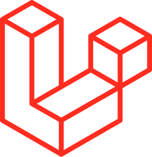<br/><sub><code>laravel</code></sub></a></td><td align="center"><a href="./logos/leaflet.svg"><br/><sub><code>leaflet</code></sub></a></td></tr>
<tr><td align="center"><a href="./logos/less.svg"><br/><sub><code>less</code></sub></a></td><td align="center"><a href="./logos/lexical.svg">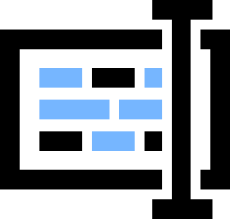<br/><sub><code>lexical</code></sub></a></td><td align="center"><a href="./logos/lexical-wordmark.svg"><br/><sub><code>lexical-wordmark</code></sub></a></td><td align="center"><a href="./logos/liftweb.svg"><br/><sub><code>liftweb</code></sub></a></td><td align="center"><a href="./logos/lit.svg">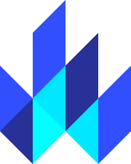<br/><sub><code>lit</code></sub></a></td><td align="center"><a href="./logos/lit-wordmark.svg"><br/><sub><code>lit-wordmark</code></sub></a></td></tr>
<tr><td align="center"><a href="./logos/lndev-ui.svg"><br/><sub><code>lndev-ui</code></sub></a></td><td align="center"><a href="./logos/lodash.svg"><br/><sub><code>lodash</code></sub></a></td><td align="center"><a href="./logos/loopback.svg"><br/><sub><code>loopback</code></sub></a></td><td align="center"><a href="./logos/loopback-wordmark.svg"><br/><sub><code>loopback-wordmark</code></sub></a></td><td align="center"><a href="./logos/lotus.svg"><br/><sub><code>lotus</code></sub></a></td><td align="center"><a href="./logos/lumen.svg">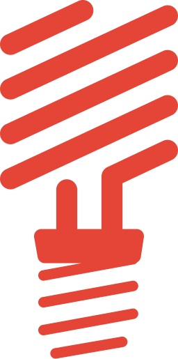<br/><sub><code>lumen</code></sub></a></td></tr>
<tr><td align="center"><a href="./logos/malinajs.svg">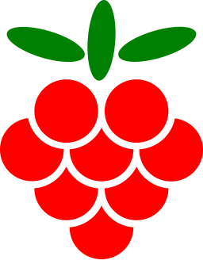<br/><sub><code>malinajs</code></sub></a></td><td align="center"><a href="./logos/mantine.svg"><br/><sub><code>mantine</code></sub></a></td><td align="center"><a href="./logos/mantine-wordmark.svg"><br/><sub><code>mantine-wordmark</code></sub></a></td><td align="center"><a href="./logos/marionette.svg">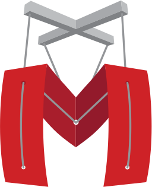<br/><sub><code>marionette</code></sub></a></td><td align="center"><a href="./logos/marko.svg"><br/><sub><code>marko</code></sub></a></td><td align="center"><a href="./logos/marko-wordmark.svg"><br/><sub><code>marko-wordmark</code></sub></a></td></tr>
<tr><td align="center"><a href="./logos/material-ui.svg"><br/><sub><code>material-ui</code></sub></a></td><td align="center"><a href="./logos/materializecss.svg"><br/><sub><code>materializecss</code></sub></a></td><td align="center"><a href="./logos/meanio.svg"><br/><sub><code>meanio</code></sub></a></td><td align="center"><a href="./logos/mern.svg"><br/><sub><code>mern</code></sub></a></td><td align="center"><a href="./logos/meteor.svg">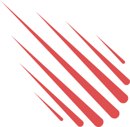<br/><sub><code>meteor</code></sub></a></td><td align="center"><a href="./logos/meteor-wordmark.svg"><br/><sub><code>meteor-wordmark</code></sub></a></td></tr>
<tr><td align="center"><a href="./logos/micro.svg"><br/><sub><code>micro</code></sub></a></td><td align="center"><a href="./logos/micro-wordmark.svg"><br/><sub><code>micro-wordmark</code></sub></a></td><td align="center"><a href="./logos/microcosm.svg"><br/><sub><code>microcosm</code></sub></a></td><td align="center"><a href="./logos/middleman.svg"><br/><sub><code>middleman</code></sub></a></td><td align="center"><a href="./logos/milligram.svg"><br/><sub><code>milligram</code></sub></a></td><td align="center"><a href="./logos/million.svg"><br/><sub><code>million</code></sub></a></td></tr>
<tr><td align="center"><a href="./logos/million-wordmark.svg"><br/><sub><code>million-wordmark</code></sub></a></td><td align="center"><a href="./logos/mithril.svg"><br/><sub><code>mithril</code></sub></a></td><td align="center"><a href="./logos/mobx.svg"><br/><sub><code>mobx</code></sub></a></td><td align="center"><a href="./logos/momentjs.svg"><br/><sub><code>momentjs</code></sub></a></td><td align="center"><a href="./logos/moon.svg">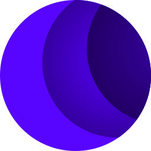<br/><sub><code>moon</code></sub></a></td><td align="center"><a href="./logos/mootools.svg"><br/><sub><code>mootools</code></sub></a></td></tr>
<tr><td align="center"><a href="./logos/myth.svg"><br/><sub><code>myth</code></sub></a></td><td align="center"><a href="./logos/naiveui.svg">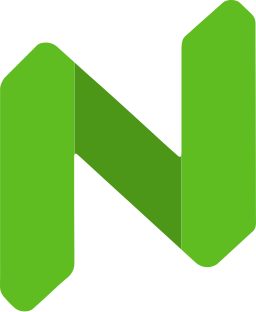<br/><sub><code>naiveui</code></sub></a></td><td align="center"><a href="./logos/nativescript.svg"><br/><sub><code>nativescript</code></sub></a></td><td align="center"><a href="./logos/neat.svg"><br/><sub><code>neat</code></sub></a></td><td align="center"><a href="./logos/nestjs.svg"><br/><sub><code>nestjs</code></sub></a></td><td align="center"><a href="./logos/nextjs.svg">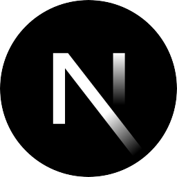<br/><sub><code>nextjs</code></sub></a></td></tr>
<tr><td align="center"><a href="./logos/nextjs-wordmark.svg"><br/><sub><code>nextjs-wordmark</code></sub></a></td><td align="center"><a href="./logos/nodal.svg"><br/><sub><code>nodal</code></sub></a></td><td align="center"><a href="./logos/node-sass.svg"><br/><sub><code>node-sass</code></sub></a></td><td align="center"><a href="./logos/nodewebkit.svg"><br/><sub><code>nodewebkit</code></sub></a></td><td align="center"><a href="./logos/nuxt.svg"><br/><sub><code>nuxt</code></sub></a></td><td align="center"><a href="./logos/nuxt-wordmark.svg"><br/><sub><code>nuxt-wordmark</code></sub></a></td></tr>
<tr><td align="center"><a href="./logos/openframeworks.svg"><br/><sub><code>openframeworks</code></sub></a></td><td align="center"><a href="./logos/opengl.svg"><br/><sub><code>opengl</code></sub></a></td><td align="center"><a href="./logos/openlayers.svg"><br/><sub><code>openlayers</code></sub></a></td><td align="center"><a href="./logos/p5js.svg">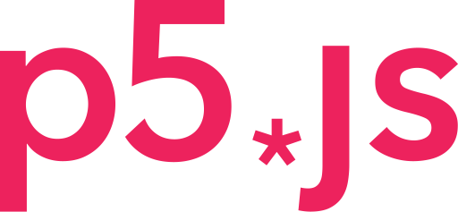<br/><sub><code>p5js</code></sub></a></td><td align="center"><a href="./logos/pandacss.svg"><br/><sub><code>pandacss</code></sub></a></td><td align="center"><a href="./logos/pandacss-wordmark.svg"><br/><sub><code>pandacss-wordmark</code></sub></a></td></tr>
<tr><td align="center"><a href="./logos/partytown.svg"><br/><sub><code>partytown</code></sub></a></td><td align="center"><a href="./logos/partytown-wordmark.svg"><br/><sub><code>partytown-wordmark</code></sub></a></td><td align="center"><a href="./logos/pepperoni.svg"><br/><sub><code>pepperoni</code></sub></a></td><td align="center"><a href="./logos/phalcon.svg"><br/><sub><code>phalcon</code></sub></a></td><td align="center"><a href="./logos/phoenix.svg"><br/><sub><code>phoenix</code></sub></a></td><td align="center"><a href="./logos/phonegap.svg"><br/><sub><code>phonegap</code></sub></a></td></tr>
<tr><td align="center"><a href="./logos/phonegap-bot.svg"><br/><sub><code>phonegap-bot</code></sub></a></td><td align="center"><a href="./logos/pinia.svg"><br/><sub><code>pinia</code></sub></a></td><td align="center"><a href="./logos/pixijs.svg"><br/><sub><code>pixijs</code></sub></a></td><td align="center"><a href="./logos/play.svg"><br/><sub><code>play</code></sub></a></td><td align="center"><a href="./logos/polymer.svg"><br/><sub><code>polymer</code></sub></a></td><td align="center"><a href="./logos/postcss.svg"><br/><sub><code>postcss</code></sub></a></td></tr>
<tr><td align="center"><a href="./logos/preact.svg"><br/><sub><code>preact</code></sub></a></td><td align="center"><a href="./logos/processing.svg"><br/><sub><code>processing</code></sub></a></td><td align="center"><a href="./logos/pug.svg"><br/><sub><code>pug</code></sub></a></td><td align="center"><a href="./logos/q.svg">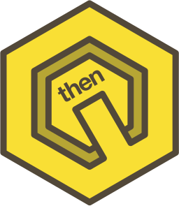<br/><sub><code>q</code></sub></a></td><td align="center"><a href="./logos/qt.svg"><br/><sub><code>qt</code></sub></a></td><td align="center"><a href="./logos/quarkus.svg"><br/><sub><code>quarkus</code></sub></a></td></tr>
<tr><td align="center"><a href="./logos/quarkus-wordmark.svg"><br/><sub><code>quarkus-wordmark</code></sub></a></td><td align="center"><a href="./logos/qwik.svg"><br/><sub><code>qwik</code></sub></a></td><td align="center"><a href="./logos/qwik-wordmark.svg"><br/><sub><code>qwik-wordmark</code></sub></a></td><td align="center"><a href="./logos/rails.svg"><br/><sub><code>rails</code></sub></a></td><td align="center"><a href="./logos/ramda.svg"><br/><sub><code>ramda</code></sub></a></td><td align="center"><a href="./logos/randomcolor.svg">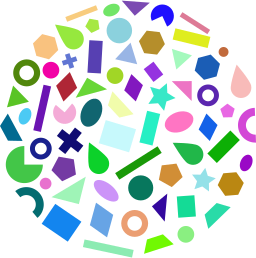<br/><sub><code>randomcolor</code></sub></a></td></tr>
<tr><td align="center"><a href="./logos/raphael.svg"><br/><sub><code>raphael</code></sub></a></td><td align="center"><a href="./logos/rax.svg"><br/><sub><code>rax</code></sub></a></td><td align="center"><a href="./logos/react.svg"><br/><sub><code>react</code></sub></a></td><td align="center"><a href="./logos/react-query.svg"><br/><sub><code>react-query</code></sub></a></td><td align="center"><a href="./logos/react-query-wordmark.svg"><br/><sub><code>react-query-wordmark</code></sub></a></td><td align="center"><a href="./logos/react-router.svg"><br/><sub><code>react-router</code></sub></a></td></tr>
<tr><td align="center"><a href="./logos/react-spring.svg"><br/><sub><code>react-spring</code></sub></a></td><td align="center"><a href="./logos/react-styleguidist.svg">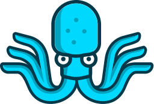<br/><sub><code>react-styleguidist</code></sub></a></td><td align="center"><a href="./logos/reactivex.svg">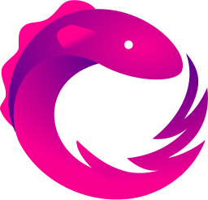<br/><sub><code>reactivex</code></sub></a></td><td align="center"><a href="./logos/reapp.svg"><br/><sub><code>reapp</code></sub></a></td><td align="center"><a href="./logos/recoil.svg"><br/><sub><code>recoil</code></sub></a></td><td align="center"><a href="./logos/recoil-wordmark.svg"><br/><sub><code>recoil-wordmark</code></sub></a></td></tr>
<tr><td align="center"><a href="./logos/redux.svg"><br/><sub><code>redux</code></sub></a></td><td align="center"><a href="./logos/redux-observable.svg"><br/><sub><code>redux-observable</code></sub></a></td><td align="center"><a href="./logos/redux-saga.svg"><br/><sub><code>redux-saga</code></sub></a></td><td align="center"><a href="./logos/redwoodjs.svg"><br/><sub><code>redwoodjs</code></sub></a></td><td align="center"><a href="./logos/relay.svg">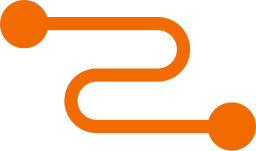<br/><sub><code>relay</code></sub></a></td><td align="center"><a href="./logos/remix.svg"><br/><sub><code>remix</code></sub></a></td></tr>
<tr><td align="center"><a href="./logos/remix-wordmark.svg"><br/><sub><code>remix-wordmark</code></sub></a></td><td align="center"><a href="./logos/require.svg"><br/><sub><code>require</code></sub></a></td><td align="center"><a href="./logos/rest-li.svg"><br/><sub><code>rest-li</code></sub></a></td><td align="center"><a href="./logos/riot.svg"><br/><sub><code>riot</code></sub></a></td><td align="center"><a href="./logos/sagui.svg">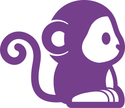<br/><sub><code>sagui</code></sub></a></td><td align="center"><a href="./logos/sails.svg"><br/><sub><code>sails</code></sub></a></td></tr>
<tr><td align="center"><a href="./logos/sass.svg"><br/><sub><code>sass</code></sub></a></td><td align="center"><a href="./logos/sass-doc.svg"><br/><sub><code>sass-doc</code></sub></a></td><td align="center"><a href="./logos/semantic-ui.svg"><br/><sub><code>semantic-ui</code></sub></a></td><td align="center"><a href="./logos/sencha.svg"><br/><sub><code>sencha</code></sub></a></td><td align="center"><a href="./logos/seneca.svg"><br/><sub><code>seneca</code></sub></a></td><td align="center"><a href="./logos/shadcn-ui.svg"><br/><sub><code>shadcn-ui</code></sub></a></td></tr>
<tr><td align="center"><a href="./logos/sinatra.svg"><br/><sub><code>sinatra</code></sub></a></td><td align="center"><a href="./logos/slim.svg"><br/><sub><code>slim</code></sub></a></td><td align="center"><a href="./logos/snap-svg.svg"><br/><sub><code>snap-svg</code></sub></a></td><td align="center"><a href="./logos/socket-io.svg"><br/><sub><code>socket-io</code></sub></a></td><td align="center"><a href="./logos/solidjs.svg"><br/><sub><code>solidjs</code></sub></a></td><td align="center"><a href="./logos/solidjs-wordmark.svg"><br/><sub><code>solidjs-wordmark</code></sub></a></td></tr>
<tr><td align="center"><a href="./logos/spring.svg"><br/><sub><code>spring</code></sub></a></td><td align="center"><a href="./logos/spring-wordmark.svg"><br/><sub><code>spring-wordmark</code></sub></a></td><td align="center"><a href="./logos/stately.svg"><br/><sub><code>stately</code></sub></a></td><td align="center"><a href="./logos/stately-wordmark.svg"><br/><sub><code>stately-wordmark</code></sub></a></td><td align="center"><a href="./logos/stenciljs.svg"><br/><sub><code>stenciljs</code></sub></a></td><td align="center"><a href="./logos/stenciljs-wordmark.svg"><br/><sub><code>stenciljs-wordmark</code></sub></a></td></tr>
<tr><td align="center"><a href="./logos/steroids.svg"><br/><sub><code>steroids</code></sub></a></td><td align="center"><a href="./logos/stimulus.svg"><br/><sub><code>stimulus</code></sub></a></td><td align="center"><a href="./logos/stimulus-wordmark.svg"><br/><sub><code>stimulus-wordmark</code></sub></a></td><td align="center"><a href="./logos/strongloop.svg"><br/><sub><code>strongloop</code></sub></a></td><td align="center"><a href="./logos/struts.svg">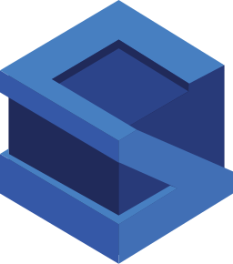<br/><sub><code>struts</code></sub></a></td><td align="center"><a href="./logos/stylis.svg"><br/><sub><code>stylis</code></sub></a></td></tr>
<tr><td align="center"><a href="./logos/stylus.svg"><br/><sub><code>stylus</code></sub></a></td><td align="center"><a href="./logos/sugarss.svg"><br/><sub><code>sugarss</code></sub></a></td><td align="center"><a href="./logos/supersonic.svg"><br/><sub><code>supersonic</code></sub></a></td><td align="center"><a href="./logos/susy.svg"><br/><sub><code>susy</code></sub></a></td><td align="center"><a href="./logos/svelte.svg"><br/><sub><code>svelte</code></sub></a></td><td align="center"><a href="./logos/svelte-kit.svg"><br/><sub><code>svelte-kit</code></sub></a></td></tr>
<tr><td align="center"><a href="./logos/svelte-wordmark.svg"><br/><sub><code>svelte-wordmark</code></sub></a></td><td align="center"><a href="./logos/swr.svg"><br/><sub><code>swr</code></sub></a></td><td align="center"><a href="./logos/symfony.svg"><br/><sub><code>symfony</code></sub></a></td><td align="center"><a href="./logos/t3.svg"><br/><sub><code>t3</code></sub></a></td><td align="center"><a href="./logos/tailwindcss.svg"><br/><sub><code>tailwindcss</code></sub></a></td><td align="center"><a href="./logos/tailwindcss-wordmark.svg"><br/><sub><code>tailwindcss-wordmark</code></sub></a></td></tr>
<tr><td align="center"><a href="./logos/tauri.svg"><br/><sub><code>tauri</code></sub></a></td><td align="center"><a href="./logos/threejs.svg"><br/><sub><code>threejs</code></sub></a></td><td align="center"><a href="./logos/thymeleaf.svg"><br/><sub><code>thymeleaf</code></sub></a></td><td align="center"><a href="./logos/thymeleaf-wordmark.svg"><br/><sub><code>thymeleaf-wordmark</code></sub></a></td><td align="center"><a href="./logos/titon.svg"><br/><sub><code>titon</code></sub></a></td><td align="center"><a href="./logos/trpc.svg"><br/><sub><code>trpc</code></sub></a></td></tr>
<tr><td align="center"><a href="./logos/turret.svg"><br/><sub><code>turret</code></sub></a></td><td align="center"><a href="./logos/uikit.svg">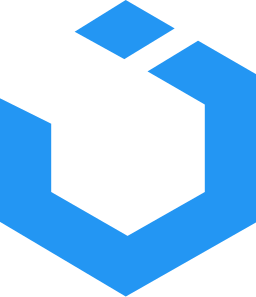<br/><sub><code>uikit</code></sub></a></td><td align="center"><a href="./logos/unity.svg">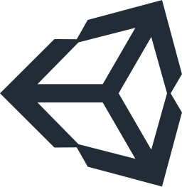<br/><sub><code>unity</code></sub></a></td><td align="center"><a href="./logos/unjs.svg"><br/><sub><code>unjs</code></sub></a></td><td align="center"><a href="./logos/unocss.svg"><br/><sub><code>unocss</code></sub></a></td><td align="center"><a href="./logos/unrealengine.svg"><br/><sub><code>unrealengine</code></sub></a></td></tr>
<tr><td align="center"><a href="./logos/unrealengine-wordmark.svg"><br/><sub><code>unrealengine-wordmark</code></sub></a></td><td align="center"><a href="./logos/vaadin.svg"><br/><sub><code>vaadin</code></sub></a></td><td align="center"><a href="./logos/vue.svg"><br/><sub><code>vue</code></sub></a></td><td align="center"><a href="./logos/vuetifyjs.svg"><br/><sub><code>vuetifyjs</code></sub></a></td><td align="center"><a href="./logos/vueuse.svg"><br/><sub><code>vueuse</code></sub></a></td><td align="center"><a href="./logos/vulkan.svg"><br/><sub><code>vulkan</code></sub></a></td></tr>
<tr><td align="center"><a href="./logos/webix.svg"><br/><sub><code>webix</code></sub></a></td><td align="center"><a href="./logos/webix-wordmark.svg"><br/><sub><code>webix-wordmark</code></sub></a></td><td align="center"><a href="./logos/wicket.svg"><br/><sub><code>wicket</code></sub></a></td><td align="center"><a href="./logos/wicket-wordmark.svg"><br/><sub><code>wicket-wordmark</code></sub></a></td><td align="center"><a href="./logos/windi-css.svg"><br/><sub><code>windi-css</code></sub></a></td><td align="center"><a href="./logos/xamarin.svg"><br/><sub><code>xamarin</code></sub></a></td></tr>
<tr><td align="center"><a href="./logos/xstate.svg"><br/><sub><code>xstate</code></sub></a></td><td align="center"><a href="./logos/yii.svg"><br/><sub><code>yii</code></sub></a></td><td align="center"><a href="./logos/zend-framework.svg"><br/><sub><code>zend-framework</code></sub></a></td><td align="center"><a href="./logos/zod.svg"><br/><sub><code>zod</code></sub></a></td></tr>
</table>

<p align="right"><a href="#toc">⬆️ Back to top</a></p>
<a id="cat-dev"></a>

## 🛠️ Dev Tools, CI/CD & Testing <sub>(512)</sub>

<table>
<tr><td align="center"><a href="./logos/aerogear.svg"><br/><sub><code>aerogear</code></sub></a></td><td align="center"><a href="./logos/airbrake.svg"><br/><sub><code>airbrake</code></sub></a></td><td align="center"><a href="./logos/amplication.svg"><br/><sub><code>amplication</code></sub></a></td><td align="center"><a href="./logos/amplication-wordmark.svg"><br/><sub><code>amplication-wordmark</code></sub></a></td><td align="center"><a href="./logos/ansible.svg">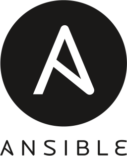<br/><sub><code>ansible</code></sub></a></td><td align="center"><a href="./logos/apache.svg"><br/><sub><code>apache</code></sub></a></td></tr>
<tr><td align="center"><a href="./logos/apache-camel.svg"><br/><sub><code>apache-camel</code></sub></a></td><td align="center"><a href="./logos/apache-cloudstack.svg"><br/><sub><code>apache-cloudstack</code></sub></a></td><td align="center"><a href="./logos/apiary.svg"><br/><sub><code>apiary</code></sub></a></td><td align="center"><a href="./logos/apidog.svg"><br/><sub><code>apidog</code></sub></a></td><td align="center"><a href="./logos/apidog-wordmark.svg"><br/><sub><code>apidog-wordmark</code></sub></a></td><td align="center"><a href="./logos/apigee.svg"><br/><sub><code>apigee</code></sub></a></td></tr>
<tr><td align="center"><a href="./logos/apitools.svg"><br/><sub><code>apitools</code></sub></a></td><td align="center"><a href="./logos/appcelerator.svg">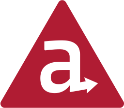<br/><sub><code>appcelerator</code></sub></a></td><td align="center"><a href="./logos/appcenter.svg"><br/><sub><code>appcenter</code></sub></a></td><td align="center"><a href="./logos/appcenter-wordmark.svg"><br/><sub><code>appcenter-wordmark</code></sub></a></td><td align="center"><a href="./logos/appcircle.svg"><br/><sub><code>appcircle</code></sub></a></td><td align="center"><a href="./logos/appcircle-wordmark.svg"><br/><sub><code>appcircle-wordmark</code></sub></a></td></tr>
<tr><td align="center"><a href="./logos/appcode.svg"><br/><sub><code>appcode</code></sub></a></td><td align="center"><a href="./logos/appdynamics.svg"><br/><sub><code>appdynamics</code></sub></a></td><td align="center"><a href="./logos/appdynamics-wordmark.svg"><br/><sub><code>appdynamics-wordmark</code></sub></a></td><td align="center"><a href="./logos/apphub.svg">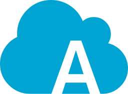<br/><sub><code>apphub</code></sub></a></td><td align="center"><a href="./logos/appium.svg"><br/><sub><code>appium</code></sub></a></td><td align="center"><a href="./logos/applitools.svg">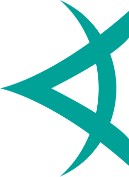<br/><sub><code>applitools</code></sub></a></td></tr>
<tr><td align="center"><a href="./logos/applitools-wordmark.svg"><br/><sub><code>applitools-wordmark</code></sub></a></td><td align="center"><a href="./logos/appmaker.svg"><br/><sub><code>appmaker</code></sub></a></td><td align="center"><a href="./logos/apportable.svg"><br/><sub><code>apportable</code></sub></a></td><td align="center"><a href="./logos/appsignal.svg"><br/><sub><code>appsignal</code></sub></a></td><td align="center"><a href="./logos/appsignal-wordmark.svg"><br/><sub><code>appsignal-wordmark</code></sub></a></td><td align="center"><a href="./logos/appveyor.svg">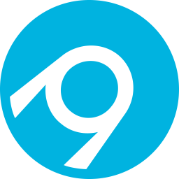<br/><sub><code>appveyor</code></sub></a></td></tr>
<tr><td align="center"><a href="./logos/architect.svg"><br/><sub><code>architect</code></sub></a></td><td align="center"><a href="./logos/architect-wordmark.svg"><br/><sub><code>architect-wordmark</code></sub></a></td><td align="center"><a href="./logos/argo.svg">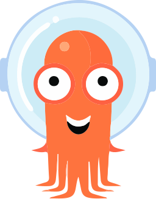<br/><sub><code>argo</code></sub></a></td><td align="center"><a href="./logos/argo-wordmark.svg"><br/><sub><code>argo-wordmark</code></sub></a></td><td align="center"><a href="./logos/armory.svg"><br/><sub><code>armory</code></sub></a></td><td align="center"><a href="./logos/armory-wordmark.svg"><br/><sub><code>armory-wordmark</code></sub></a></td></tr>
<tr><td align="center"><a href="./logos/asciidoctor.svg"><br/><sub><code>asciidoctor</code></sub></a></td><td align="center"><a href="./logos/assembla.svg"><br/><sub><code>assembla</code></sub></a></td><td align="center"><a href="./logos/assembla-wordmark.svg"><br/><sub><code>assembla-wordmark</code></sub></a></td><td align="center"><a href="./logos/async-api.svg">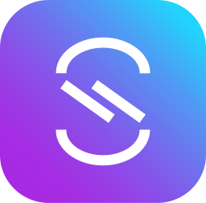<br/><sub><code>async-api</code></sub></a></td><td align="center"><a href="./logos/async-api-wordmark.svg"><br/><sub><code>async-api-wordmark</code></sub></a></td><td align="center"><a href="./logos/atom.svg"><br/><sub><code>atom</code></sub></a></td></tr>
<tr><td align="center"><a href="./logos/atom-wordmark.svg"><br/><sub><code>atom-wordmark</code></sub></a></td><td align="center"><a href="./logos/autocode.svg"><br/><sub><code>autocode</code></sub></a></td><td align="center"><a href="./logos/ava.svg">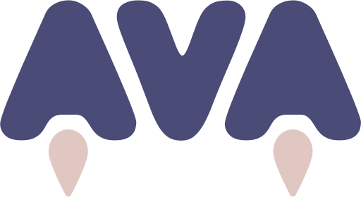<br/><sub><code>ava</code></sub></a></td><td align="center"><a href="./logos/babel.svg"><br/><sub><code>babel</code></sub></a></td><td align="center"><a href="./logos/bamboo.svg"><br/><sub><code>bamboo</code></sub></a></td><td align="center"><a href="./logos/bash.svg"><br/><sub><code>bash</code></sub></a></td></tr>
<tr><td align="center"><a href="./logos/bash-wordmark.svg">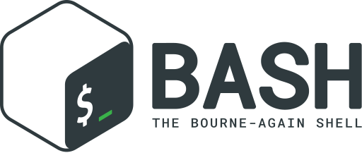<br/><sub><code>bash-wordmark</code></sub></a></td><td align="center"><a href="./logos/beats.svg">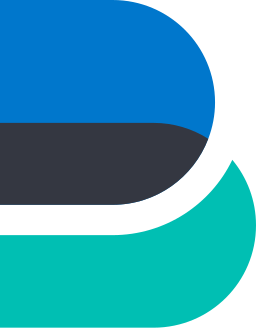<br/><sub><code>beats</code></sub></a></td><td align="center"><a href="./logos/bigpanda.svg"><br/><sub><code>bigpanda</code></sub></a></td><td align="center"><a href="./logos/biomejs.svg"><br/><sub><code>biomejs</code></sub></a></td><td align="center"><a href="./logos/biomejs-wordmark.svg"><br/><sub><code>biomejs-wordmark</code></sub></a></td><td align="center"><a href="./logos/bitbar.svg"><br/><sub><code>bitbar</code></sub></a></td></tr>
<tr><td align="center"><a href="./logos/bitbucket.svg"><br/><sub><code>bitbucket</code></sub></a></td><td align="center"><a href="./logos/bitnami.svg"><br/><sub><code>bitnami</code></sub></a></td><td align="center"><a href="./logos/bitrise.svg"><br/><sub><code>bitrise</code></sub></a></td><td align="center"><a href="./logos/bitrise-wordmark.svg"><br/><sub><code>bitrise-wordmark</code></sub></a></td><td align="center"><a href="./logos/bosun.svg"><br/><sub><code>bosun</code></sub></a></td><td align="center"><a href="./logos/bower.svg">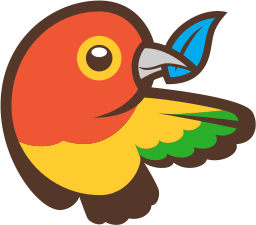<br/><sub><code>bower</code></sub></a></td></tr>
<tr><td align="center"><a href="./logos/brackets.svg"><br/><sub><code>brackets</code></sub></a></td><td align="center"><a href="./logos/broccoli.svg"><br/><sub><code>broccoli</code></sub></a></td><td align="center"><a href="./logos/brotli.svg"><br/><sub><code>brotli</code></sub></a></td><td align="center"><a href="./logos/browserify.svg"><br/><sub><code>browserify</code></sub></a></td><td align="center"><a href="./logos/browserify-wordmark.svg"><br/><sub><code>browserify-wordmark</code></sub></a></td><td align="center"><a href="./logos/browserling.svg"><br/><sub><code>browserling</code></sub></a></td></tr>
<tr><td align="center"><a href="./logos/browserslist.svg"><br/><sub><code>browserslist</code></sub></a></td><td align="center"><a href="./logos/browserstack.svg"><br/><sub><code>browserstack</code></sub></a></td><td align="center"><a href="./logos/browsersync.svg"><br/><sub><code>browsersync</code></sub></a></td><td align="center"><a href="./logos/brunch.svg"><br/><sub><code>brunch</code></sub></a></td><td align="center"><a href="./logos/buck.svg"><br/><sub><code>buck</code></sub></a></td><td align="center"><a href="./logos/buddy.svg"><br/><sub><code>buddy</code></sub></a></td></tr>
<tr><td align="center"><a href="./logos/bugherd.svg"><br/><sub><code>bugherd</code></sub></a></td><td align="center"><a href="./logos/bugherd-wordmark.svg"><br/><sub><code>bugherd-wordmark</code></sub></a></td><td align="center"><a href="./logos/bugsee.svg"><br/><sub><code>bugsee</code></sub></a></td><td align="center"><a href="./logos/bugsnag.svg"><br/><sub><code>bugsnag</code></sub></a></td><td align="center"><a href="./logos/bugsnag-wordmark.svg"><br/><sub><code>bugsnag-wordmark</code></sub></a></td><td align="center"><a href="./logos/buildkite.svg"><br/><sub><code>buildkite</code></sub></a></td></tr>
<tr><td align="center"><a href="./logos/buildkite-wordmark.svg"><br/><sub><code>buildkite-wordmark</code></sub></a></td><td align="center"><a href="./logos/cachet.svg"><br/><sub><code>cachet</code></sub></a></td><td align="center"><a href="./logos/calibre.svg"><br/><sub><code>calibre</code></sub></a></td><td align="center"><a href="./logos/calibre-wordmark.svg"><br/><sub><code>calibre-wordmark</code></sub></a></td><td align="center"><a href="./logos/capistrano.svg"><br/><sub><code>capistrano</code></sub></a></td><td align="center"><a href="./logos/carbide.svg"><br/><sub><code>carbide</code></sub></a></td></tr>
<tr><td align="center"><a href="./logos/chai.svg"><br/><sub><code>chai</code></sub></a></td><td align="center"><a href="./logos/chalk.svg"><br/><sub><code>chalk</code></sub></a></td><td align="center"><a href="./logos/chef.svg"><br/><sub><code>chef</code></sub></a></td><td align="center"><a href="./logos/chromatic.svg"><br/><sub><code>chromatic</code></sub></a></td><td align="center"><a href="./logos/chromatic-wordmark.svg"><br/><sub><code>chromatic-wordmark</code></sub></a></td><td align="center"><a href="./logos/circleci.svg"><br/><sub><code>circleci</code></sub></a></td></tr>
<tr><td align="center"><a href="./logos/cirrus.svg"><br/><sub><code>cirrus</code></sub></a></td><td align="center"><a href="./logos/cirrus-ci.svg"><br/><sub><code>cirrus-ci</code></sub></a></td><td align="center"><a href="./logos/clickdeploy.svg"><br/><sub><code>clickdeploy</code></sub></a></td><td align="center"><a href="./logos/clion.svg"><br/><sub><code>clion</code></sub></a></td><td align="center"><a href="./logos/cloud9.svg"><br/><sub><code>cloud9</code></sub></a></td><td align="center"><a href="./logos/cocoapods.svg"><br/><sub><code>cocoapods</code></sub></a></td></tr>
<tr><td align="center"><a href="./logos/codacy.svg"><br/><sub><code>codacy</code></sub></a></td><td align="center"><a href="./logos/codebase.svg"><br/><sub><code>codebase</code></sub></a></td><td align="center"><a href="./logos/codebeat.svg"><br/><sub><code>codebeat</code></sub></a></td><td align="center"><a href="./logos/codeception.svg"><br/><sub><code>codeception</code></sub></a></td><td align="center"><a href="./logos/codeclimate.svg"><br/><sub><code>codeclimate</code></sub></a></td><td align="center"><a href="./logos/codeclimate-wordmark.svg"><br/><sub><code>codeclimate-wordmark</code></sub></a></td></tr>
<tr><td align="center"><a href="./logos/codecov.svg"><br/><sub><code>codecov</code></sub></a></td><td align="center"><a href="./logos/codecov-wordmark.svg"><br/><sub><code>codecov-wordmark</code></sub></a></td><td align="center"><a href="./logos/codefactor.svg"><br/><sub><code>codefactor</code></sub></a></td><td align="center"><a href="./logos/codefactor-wordmark.svg"><br/><sub><code>codefactor-wordmark</code></sub></a></td><td align="center"><a href="./logos/codepen.svg"><br/><sub><code>codepen</code></sub></a></td><td align="center"><a href="./logos/codepen-wordmark.svg"><br/><sub><code>codepen-wordmark</code></sub></a></td></tr>
<tr><td align="center"><a href="./logos/codepicnic.svg"><br/><sub><code>codepicnic</code></sub></a></td><td align="center"><a href="./logos/codepush.svg"><br/><sub><code>codepush</code></sub></a></td><td align="center"><a href="./logos/codersrank.svg"><br/><sub><code>codersrank</code></sub></a></td><td align="center"><a href="./logos/codersrank-wordmark.svg"><br/><sub><code>codersrank-wordmark</code></sub></a></td><td align="center"><a href="./logos/coderwall.svg"><br/><sub><code>coderwall</code></sub></a></td><td align="center"><a href="./logos/codesandbox.svg"><br/><sub><code>codesandbox</code></sub></a></td></tr>
<tr><td align="center"><a href="./logos/codesandbox-wordmark.svg"><br/><sub><code>codesandbox-wordmark</code></sub></a></td><td align="center"><a href="./logos/codeschool.svg"><br/><sub><code>codeschool</code></sub></a></td><td align="center"><a href="./logos/codesee.svg"><br/><sub><code>codesee</code></sub></a></td><td align="center"><a href="./logos/codesee-wordmark.svg"><br/><sub><code>codesee-wordmark</code></sub></a></td><td align="center"><a href="./logos/codeship.svg"><br/><sub><code>codeship</code></sub></a></td><td align="center"><a href="./logos/codio.svg"><br/><sub><code>codio</code></sub></a></td></tr>
<tr><td align="center"><a href="./logos/codium.svg"><br/><sub><code>codium</code></sub></a></td><td align="center"><a href="./logos/codium-wordmark.svg"><br/><sub><code>codium-wordmark</code></sub></a></td><td align="center"><a href="./logos/commitizen.svg"><br/><sub><code>commitizen</code></sub></a></td><td align="center"><a href="./logos/compose.svg"><br/><sub><code>compose</code></sub></a></td><td align="center"><a href="./logos/composer.svg"><br/><sub><code>composer</code></sub></a></td><td align="center"><a href="./logos/conan-io.svg"><br/><sub><code>conan-io</code></sub></a></td></tr>
<tr><td align="center"><a href="./logos/concourse.svg"><br/><sub><code>concourse</code></sub></a></td><td align="center"><a href="./logos/conda.svg"><br/><sub><code>conda</code></sub></a></td><td align="center"><a href="./logos/consul.svg"><br/><sub><code>consul</code></sub></a></td><td align="center"><a href="./logos/coveralls.svg"><br/><sub><code>coveralls</code></sub></a></td><td align="center"><a href="./logos/coverity.svg"><br/><sub><code>coverity</code></sub></a></td><td align="center"><a href="./logos/crashlytics.svg"><br/><sub><code>crashlytics</code></sub></a></td></tr>
<tr><td align="center"><a href="./logos/crittercism.svg"><br/><sub><code>crittercism</code></sub></a></td><td align="center"><a href="./logos/cross-browser-testing.svg"><br/><sub><code>cross-browser-testing</code></sub></a></td><td align="center"><a href="./logos/crossbrowsertesting.svg"><br/><sub><code>crossbrowsertesting</code></sub></a></td><td align="center"><a href="./logos/crossplane.svg"><br/><sub><code>crossplane</code></sub></a></td><td align="center"><a href="./logos/crossplane-wordmark.svg"><br/><sub><code>crossplane-wordmark</code></sub></a></td><td align="center"><a href="./logos/crucible.svg"><br/><sub><code>crucible</code></sub></a></td></tr>
<tr><td align="center"><a href="./logos/cucumber.svg"><br/><sub><code>cucumber</code></sub></a></td><td align="center"><a href="./logos/curl.svg"><br/><sub><code>curl</code></sub></a></td><td align="center"><a href="./logos/cypress.svg"><br/><sub><code>cypress</code></sub></a></td><td align="center"><a href="./logos/cypress-wordmark.svg"><br/><sub><code>cypress-wordmark</code></sub></a></td><td align="center"><a href="./logos/dat.svg"><br/><sub><code>dat</code></sub></a></td><td align="center"><a href="./logos/datadog.svg"><br/><sub><code>datadog</code></sub></a></td></tr>
<tr><td align="center"><a href="./logos/datadog-wordmark.svg"><br/><sub><code>datadog-wordmark</code></sub></a></td><td align="center"><a href="./logos/datagrip.svg"><br/><sub><code>datagrip</code></sub></a></td><td align="center"><a href="./logos/dataspell.svg"><br/><sub><code>dataspell</code></sub></a></td><td align="center"><a href="./logos/dependabot.svg"><br/><sub><code>dependabot</code></sub></a></td><td align="center"><a href="./logos/dependencyci.svg"><br/><sub><code>dependencyci</code></sub></a></td><td align="center"><a href="./logos/deploy.svg"><br/><sub><code>deploy</code></sub></a></td></tr>
<tr><td align="center"><a href="./logos/deployhq.svg"><br/><sub><code>deployhq</code></sub></a></td><td align="center"><a href="./logos/deployhq-wordmark.svg"><br/><sub><code>deployhq-wordmark</code></sub></a></td><td align="center"><a href="./logos/deppbot.svg"><br/><sub><code>deppbot</code></sub></a></td><td align="center"><a href="./logos/dimer.svg"><br/><sub><code>dimer</code></sub></a></td><td align="center"><a href="./logos/distelli.svg"><br/><sub><code>distelli</code></sub></a></td><td align="center"><a href="./logos/dockbit.svg"><br/><sub><code>dockbit</code></sub></a></td></tr>
<tr><td align="center"><a href="./logos/docker.svg"><br/><sub><code>docker</code></sub></a></td><td align="center"><a href="./logos/docker-wordmark.svg"><br/><sub><code>docker-wordmark</code></sub></a></td><td align="center"><a href="./logos/docusaurus.svg"><br/><sub><code>docusaurus</code></sub></a></td><td align="center"><a href="./logos/dreamfactory.svg"><br/><sub><code>dreamfactory</code></sub></a></td><td align="center"><a href="./logos/drone.svg"><br/><sub><code>drone</code></sub></a></td><td align="center"><a href="./logos/drone-wordmark.svg"><br/><sub><code>drone-wordmark</code></sub></a></td></tr>
<tr><td align="center"><a href="./logos/drools.svg"><br/><sub><code>drools</code></sub></a></td><td align="center"><a href="./logos/drools-wordmark.svg"><br/><sub><code>drools-wordmark</code></sub></a></td><td align="center"><a href="./logos/dynatrace.svg"><br/><sub><code>dynatrace</code></sub></a></td><td align="center"><a href="./logos/dynatrace-wordmark.svg"><br/><sub><code>dynatrace-wordmark</code></sub></a></td><td align="center"><a href="./logos/eclipse.svg"><br/><sub><code>eclipse</code></sub></a></td><td align="center"><a href="./logos/eclipse-wordmark.svg"><br/><sub><code>eclipse-wordmark</code></sub></a></td></tr>
<tr><td align="center"><a href="./logos/editorconfig.svg"><br/><sub><code>editorconfig</code></sub></a></td><td align="center"><a href="./logos/emacs.svg"><br/><sub><code>emacs</code></sub></a></td><td align="center"><a href="./logos/emacs-classic.svg"><br/><sub><code>emacs-classic</code></sub></a></td><td align="center"><a href="./logos/embedly.svg"><br/><sub><code>embedly</code></sub></a></td><td align="center"><a href="./logos/emmet.svg"><br/><sub><code>emmet</code></sub></a></td><td align="center"><a href="./logos/envoy.svg"><br/><sub><code>envoy</code></sub></a></td></tr>
<tr><td align="center"><a href="./logos/envoy-wordmark.svg"><br/><sub><code>envoy-wordmark</code></sub></a></td><td align="center"><a href="./logos/envoyer.svg"><br/><sub><code>envoyer</code></sub></a></td><td align="center"><a href="./logos/envoyproxy.svg"><br/><sub><code>envoyproxy</code></sub></a></td><td align="center"><a href="./logos/epsagon.svg"><br/><sub><code>epsagon</code></sub></a></td><td align="center"><a href="./logos/epsagon-wordmark.svg"><br/><sub><code>epsagon-wordmark</code></sub></a></td><td align="center"><a href="./logos/esbuild.svg"><br/><sub><code>esbuild</code></sub></a></td></tr>
<tr><td align="center"><a href="./logos/esdoc.svg"><br/><sub><code>esdoc</code></sub></a></td><td align="center"><a href="./logos/eslint.svg"><br/><sub><code>eslint</code></sub></a></td><td align="center"><a href="./logos/eslint-old.svg"><br/><sub><code>eslint-old</code></sub></a></td><td align="center"><a href="./logos/etcd.svg"><br/><sub><code>etcd</code></sub></a></td><td align="center"><a href="./logos/eventsentry.svg"><br/><sub><code>eventsentry</code></sub></a></td><td align="center"><a href="./logos/fabric.svg"><br/><sub><code>fabric</code></sub></a></td></tr>
<tr><td align="center"><a href="./logos/fabric-io.svg"><br/><sub><code>fabric-io</code></sub></a></td><td align="center"><a href="./logos/faker.svg"><br/><sub><code>faker</code></sub></a></td><td align="center"><a href="./logos/fastlane.svg"><br/><sub><code>fastlane</code></sub></a></td><td align="center"><a href="./logos/floodio.svg"><br/><sub><code>floodio</code></sub></a></td><td align="center"><a href="./logos/flow.svg"><br/><sub><code>flow</code></sub></a></td><td align="center"><a href="./logos/fogbugz.svg"><br/><sub><code>fogbugz</code></sub></a></td></tr>
<tr><td align="center"><a href="./logos/fogbugz-wordmark.svg"><br/><sub><code>fogbugz-wordmark</code></sub></a></td><td align="center"><a href="./logos/forest.svg"><br/><sub><code>forest</code></sub></a></td><td align="center"><a href="./logos/forestadmin.svg"><br/><sub><code>forestadmin</code></sub></a></td><td align="center"><a href="./logos/forestadmin-wordmark.svg"><br/><sub><code>forestadmin-wordmark</code></sub></a></td><td align="center"><a href="./logos/forever.svg"><br/><sub><code>forever</code></sub></a></td><td align="center"><a href="./logos/formkeep.svg"><br/><sub><code>formkeep</code></sub></a></td></tr>
<tr><td align="center"><a href="./logos/gaugeio.svg"><br/><sub><code>gaugeio</code></sub></a></td><td align="center"><a href="./logos/git.svg"><br/><sub><code>git</code></sub></a></td><td align="center"><a href="./logos/git-wordmark.svg"><br/><sub><code>git-wordmark</code></sub></a></td><td align="center"><a href="./logos/gitboard.svg"><br/><sub><code>gitboard</code></sub></a></td><td align="center"><a href="./logos/github.svg"><br/><sub><code>github</code></sub></a></td><td align="center"><a href="./logos/github-actions.svg"><br/><sub><code>github-actions</code></sub></a></td></tr>
<tr><td align="center"><a href="./logos/github-octocat.svg"><br/><sub><code>github-octocat</code></sub></a></td><td align="center"><a href="./logos/github-wordmark.svg"><br/><sub><code>github-wordmark</code></sub></a></td><td align="center"><a href="./logos/gitkraken.svg"><br/><sub><code>gitkraken</code></sub></a></td><td align="center"><a href="./logos/gitlab.svg"><br/><sub><code>gitlab</code></sub></a></td><td align="center"><a href="./logos/gitlab-wordmark.svg"><br/><sub><code>gitlab-wordmark</code></sub></a></td><td align="center"><a href="./logos/gitup.svg"><br/><sub><code>gitup</code></sub></a></td></tr>
<tr><td align="center"><a href="./logos/glint.svg"><br/><sub><code>glint</code></sub></a></td><td align="center"><a href="./logos/glitch.svg"><br/><sub><code>glitch</code></sub></a></td><td align="center"><a href="./logos/glitch-wordmark.svg"><br/><sub><code>glitch-wordmark</code></sub></a></td><td align="center"><a href="./logos/gocd.svg"><br/><sub><code>gocd</code></sub></a></td><td align="center"><a href="./logos/goland.svg"><br/><sub><code>goland</code></sub></a></td><td align="center"><a href="./logos/gomix.svg"><br/><sub><code>gomix</code></sub></a></td></tr>
<tr><td align="center"><a href="./logos/gradle.svg"><br/><sub><code>gradle</code></sub></a></td><td align="center"><a href="./logos/grafana.svg"><br/><sub><code>grafana</code></sub></a></td><td align="center"><a href="./logos/graylog.svg"><br/><sub><code>graylog</code></sub></a></td><td align="center"><a href="./logos/graylog-wordmark.svg"><br/><sub><code>graylog-wordmark</code></sub></a></td><td align="center"><a href="./logos/growth-book.svg"><br/><sub><code>growth-book</code></sub></a></td><td align="center"><a href="./logos/growth-book-wordmark.svg"><br/><sub><code>growth-book-wordmark</code></sub></a></td></tr>
<tr><td align="center"><a href="./logos/grunt.svg"><br/><sub><code>grunt</code></sub></a></td><td align="center"><a href="./logos/gulp.svg"><br/><sub><code>gulp</code></sub></a></td><td align="center"><a href="./logos/gunicorn.svg"><br/><sub><code>gunicorn</code></sub></a></td><td align="center"><a href="./logos/harness.svg"><br/><sub><code>harness</code></sub></a></td><td align="center"><a href="./logos/harness-wordmark.svg"><br/><sub><code>harness-wordmark</code></sub></a></td><td align="center"><a href="./logos/harrow.svg"><br/><sub><code>harrow</code></sub></a></td></tr>
<tr><td align="center"><a href="./logos/helm.svg"><br/><sub><code>helm</code></sub></a></td><td align="center"><a href="./logos/homebrew.svg"><br/><sub><code>homebrew</code></sub></a></td><td align="center"><a href="./logos/hosted-graphite.svg"><br/><sub><code>hosted-graphite</code></sub></a></td><td align="center"><a href="./logos/houndci.svg"><br/><sub><code>houndci</code></sub></a></td><td align="center"><a href="./logos/httpie.svg"><br/><sub><code>httpie</code></sub></a></td><td align="center"><a href="./logos/httpie-wordmark.svg"><br/><sub><code>httpie-wordmark</code></sub></a></td></tr>
<tr><td align="center"><a href="./logos/hyper.svg"><br/><sub><code>hyper</code></sub></a></td><td align="center"><a href="./logos/imagemin.svg"><br/><sub><code>imagemin</code></sub></a></td><td align="center"><a href="./logos/incident.svg"><br/><sub><code>incident</code></sub></a></td><td align="center"><a href="./logos/incident-wordmark.svg"><br/><sub><code>incident-wordmark</code></sub></a></td><td align="center"><a href="./logos/infer.svg"><br/><sub><code>infer</code></sub></a></td><td align="center"><a href="./logos/insomnia.svg"><br/><sub><code>insomnia</code></sub></a></td></tr>
<tr><td align="center"><a href="./logos/intellij-idea.svg"><br/><sub><code>intellij-idea</code></sub></a></td><td align="center"><a href="./logos/jasmine.svg"><br/><sub><code>jasmine</code></sub></a></td><td align="center"><a href="./logos/jenkins.svg"><br/><sub><code>jenkins</code></sub></a></td><td align="center"><a href="./logos/jest.svg"><br/><sub><code>jest</code></sub></a></td><td align="center"><a href="./logos/jetbrains.svg"><br/><sub><code>jetbrains</code></sub></a></td><td align="center"><a href="./logos/jetbrains-space.svg"><br/><sub><code>jetbrains-space</code></sub></a></td></tr>
<tr><td align="center"><a href="./logos/jetbrains-space-wordmark.svg"><br/><sub><code>jetbrains-space-wordmark</code></sub></a></td><td align="center"><a href="./logos/jetbrains-wordmark.svg"><br/><sub><code>jetbrains-wordmark</code></sub></a></td><td align="center"><a href="./logos/jfrog.svg"><br/><sub><code>jfrog</code></sub></a></td><td align="center"><a href="./logos/jsbin.svg"><br/><sub><code>jsbin</code></sub></a></td><td align="center"><a href="./logos/jscs.svg"><br/><sub><code>jscs</code></sub></a></td><td align="center"><a href="./logos/jsdom.svg"><br/><sub><code>jsdom</code></sub></a></td></tr>
<tr><td align="center"><a href="./logos/jsfiddle.svg"><br/><sub><code>jsfiddle</code></sub></a></td><td align="center"><a href="./logos/jspm.svg"><br/><sub><code>jspm</code></sub></a></td><td align="center"><a href="./logos/kallithea.svg"><br/><sub><code>kallithea</code></sub></a></td><td align="center"><a href="./logos/karma.svg"><br/><sub><code>karma</code></sub></a></td><td align="center"><a href="./logos/katalon.svg"><br/><sub><code>katalon</code></sub></a></td><td align="center"><a href="./logos/katalon-wordmark.svg"><br/><sub><code>katalon-wordmark</code></sub></a></td></tr>
<tr><td align="center"><a href="./logos/keymetrics.svg"><br/><sub><code>keymetrics</code></sub></a></td><td align="center"><a href="./logos/kibana.svg"><br/><sub><code>kibana</code></sub></a></td><td align="center"><a href="./logos/kitematic.svg"><br/><sub><code>kitematic</code></sub></a></td><td align="center"><a href="./logos/kong.svg"><br/><sub><code>kong</code></sub></a></td><td align="center"><a href="./logos/kong-wordmark.svg"><br/><sub><code>kong-wordmark</code></sub></a></td><td align="center"><a href="./logos/kops.svg"><br/><sub><code>kops</code></sub></a></td></tr>
<tr><td align="center"><a href="./logos/kubernetes.svg"><br/><sub><code>kubernetes</code></sub></a></td><td align="center"><a href="./logos/kustomer.svg"><br/><sub><code>kustomer</code></sub></a></td><td align="center"><a href="./logos/launchdarkly.svg"><br/><sub><code>launchdarkly</code></sub></a></td><td align="center"><a href="./logos/launchdarkly-wordmark.svg"><br/><sub><code>launchdarkly-wordmark</code></sub></a></td><td align="center"><a href="./logos/launchkit.svg"><br/><sub><code>launchkit</code></sub></a></td><td align="center"><a href="./logos/lerna.svg"><br/><sub><code>lerna</code></sub></a></td></tr>
<tr><td align="center"><a href="./logos/librato.svg"><br/><sub><code>librato</code></sub></a></td><td align="center"><a href="./logos/lighthouse.svg"><br/><sub><code>lighthouse</code></sub></a></td><td align="center"><a href="./logos/lightstep.svg"><br/><sub><code>lightstep</code></sub></a></td><td align="center"><a href="./logos/lightstep-wordmark.svg"><br/><sub><code>lightstep-wordmark</code></sub></a></td><td align="center"><a href="./logos/lighttpd.svg"><br/><sub><code>lighttpd</code></sub></a></td><td align="center"><a href="./logos/loader.svg"><br/><sub><code>loader</code></sub></a></td></tr>
<tr><td align="center"><a href="./logos/logentries.svg"><br/><sub><code>logentries</code></sub></a></td><td align="center"><a href="./logos/loggly.svg"><br/><sub><code>loggly</code></sub></a></td><td align="center"><a href="./logos/logmatic.svg"><br/><sub><code>logmatic</code></sub></a></td><td align="center"><a href="./logos/logstash.svg"><br/><sub><code>logstash</code></sub></a></td><td align="center"><a href="./logos/madge.svg"><br/><sub><code>madge</code></sub></a></td><td align="center"><a href="./logos/maestro.svg"><br/><sub><code>maestro</code></sub></a></td></tr>
<tr><td align="center"><a href="./logos/maildeveloper.svg"><br/><sub><code>maildeveloper</code></sub></a></td><td align="center"><a href="./logos/manifoldjs.svg"><br/><sub><code>manifoldjs</code></sub></a></td><td align="center"><a href="./logos/manuscript.svg"><br/><sub><code>manuscript</code></sub></a></td><td align="center"><a href="./logos/maven.svg"><br/><sub><code>maven</code></sub></a></td><td align="center"><a href="./logos/mercurial.svg"><br/><sub><code>mercurial</code></sub></a></td><td align="center"><a href="./logos/mocha.svg"><br/><sub><code>mocha</code></sub></a></td></tr>
<tr><td align="center"><a href="./logos/modernizr.svg"><br/><sub><code>modernizr</code></sub></a></td><td align="center"><a href="./logos/mps.svg"><br/><sub><code>mps</code></sub></a></td><td align="center"><a href="./logos/mps-wordmark.svg"><br/><sub><code>mps-wordmark</code></sub></a></td><td align="center"><a href="./logos/msw.svg"><br/><sub><code>msw</code></sub></a></td><td align="center"><a href="./logos/msw-wordmark.svg"><br/><sub><code>msw-wordmark</code></sub></a></td><td align="center"><a href="./logos/neovim.svg"><br/><sub><code>neovim</code></sub></a></td></tr>
<tr><td align="center"><a href="./logos/netbeans.svg"><br/><sub><code>netbeans</code></sub></a></td><td align="center"><a href="./logos/netuitive.svg"><br/><sub><code>netuitive</code></sub></a></td><td align="center"><a href="./logos/new-relic.svg"><br/><sub><code>new-relic</code></sub></a></td><td align="center"><a href="./logos/new-relic-wordmark.svg"><br/><sub><code>new-relic-wordmark</code></sub></a></td><td align="center"><a href="./logos/nginx.svg"><br/><sub><code>nginx</code></sub></a></td><td align="center"><a href="./logos/ngrok.svg"><br/><sub><code>ngrok</code></sub></a></td></tr>
<tr><td align="center"><a href="./logos/nightwatch.svg"><br/><sub><code>nightwatch</code></sub></a></td><td align="center"><a href="./logos/nodebots.svg"><br/><sub><code>nodebots</code></sub></a></td><td align="center"><a href="./logos/nodemon.svg"><br/><sub><code>nodemon</code></sub></a></td><td align="center"><a href="./logos/npm.svg"><br/><sub><code>npm</code></sub></a></td><td align="center"><a href="./logos/npm-2.svg"><br/><sub><code>npm-2</code></sub></a></td><td align="center"><a href="./logos/npm-wordmark.svg"><br/><sub><code>npm-wordmark</code></sub></a></td></tr>
<tr><td align="center"><a href="./logos/nuclide.svg"><br/><sub><code>nuclide</code></sub></a></td><td align="center"><a href="./logos/nvm.svg"><br/><sub><code>nvm</code></sub></a></td><td align="center"><a href="./logos/nx.svg"><br/><sub><code>nx</code></sub></a></td><td align="center"><a href="./logos/octopus-deploy.svg"><br/><sub><code>octopus-deploy</code></sub></a></td><td align="center"><a href="./logos/opbeat.svg"><br/><sub><code>opbeat</code></sub></a></td><td align="center"><a href="./logos/openapi.svg"><br/><sub><code>openapi</code></sub></a></td></tr>
<tr><td align="center"><a href="./logos/openapi-wordmark.svg"><br/><sub><code>openapi-wordmark</code></sub></a></td><td align="center"><a href="./logos/opentelemetry.svg"><br/><sub><code>opentelemetry</code></sub></a></td><td align="center"><a href="./logos/opentelemetry-wordmark.svg"><br/><sub><code>opentelemetry-wordmark</code></sub></a></td><td align="center"><a href="./logos/opsee.svg"><br/><sub><code>opsee</code></sub></a></td><td align="center"><a href="./logos/opsgenie.svg"><br/><sub><code>opsgenie</code></sub></a></td><td align="center"><a href="./logos/opsmatic.svg"><br/><sub><code>opsmatic</code></sub></a></td></tr>
<tr><td align="center"><a href="./logos/otto.svg"><br/><sub><code>otto</code></sub></a></td><td align="center"><a href="./logos/oxc.svg"><br/><sub><code>oxc</code></sub></a></td><td align="center"><a href="./logos/oxc-dark.svg"><br/><sub><code>oxc-dark</code></sub></a></td><td align="center"><a href="./logos/oxc-icon-dark.svg"><br/><sub><code>oxc-icon-dark</code></sub></a></td><td align="center"><a href="./logos/oxc-wordmark.svg"><br/><sub><code>oxc-wordmark</code></sub></a></td><td align="center"><a href="./logos/packer.svg"><br/><sub><code>packer</code></sub></a></td></tr>
<tr><td align="center"><a href="./logos/pagerduty.svg"><br/><sub><code>pagerduty</code></sub></a></td><td align="center"><a href="./logos/pagerduty-wordmark.svg"><br/><sub><code>pagerduty-wordmark</code></sub></a></td><td align="center"><a href="./logos/parcel.svg"><br/><sub><code>parcel</code></sub></a></td><td align="center"><a href="./logos/parcel-wordmark.svg"><br/><sub><code>parcel-wordmark</code></sub></a></td><td align="center"><a href="./logos/percy.svg"><br/><sub><code>percy</code></sub></a></td><td align="center"><a href="./logos/percy-wordmark.svg"><br/><sub><code>percy-wordmark</code></sub></a></td></tr>
<tr><td align="center"><a href="./logos/perf-rocks.svg"><br/><sub><code>perf-rocks</code></sub></a></td><td align="center"><a href="./logos/phpstorm.svg"><br/><sub><code>phpstorm</code></sub></a></td><td align="center"><a href="./logos/pingdom.svg"><br/><sub><code>pingdom</code></sub></a></td><td align="center"><a href="./logos/pingy.svg"><br/><sub><code>pingy</code></sub></a></td><td align="center"><a href="./logos/pipedream.svg"><br/><sub><code>pipedream</code></sub></a></td><td align="center"><a href="./logos/pkg.svg"><br/><sub><code>pkg</code></sub></a></td></tr>
<tr><td align="center"><a href="./logos/plastic-scm.svg"><br/><sub><code>plastic-scm</code></sub></a></td><td align="center"><a href="./logos/platformio.svg"><br/><sub><code>platformio</code></sub></a></td><td align="center"><a href="./logos/playwright.svg"><br/><sub><code>playwright</code></sub></a></td><td align="center"><a href="./logos/pm2.svg"><br/><sub><code>pm2</code></sub></a></td><td align="center"><a href="./logos/pm2-wordmark.svg"><br/><sub><code>pm2-wordmark</code></sub></a></td><td align="center"><a href="./logos/pnpm.svg"><br/><sub><code>pnpm</code></sub></a></td></tr>
<tr><td align="center"><a href="./logos/postman.svg"><br/><sub><code>postman</code></sub></a></td><td align="center"><a href="./logos/postman-wordmark.svg"><br/><sub><code>postman-wordmark</code></sub></a></td><td align="center"><a href="./logos/prerender.svg"><br/><sub><code>prerender</code></sub></a></td><td align="center"><a href="./logos/prerender-wordmark.svg"><br/><sub><code>prerender-wordmark</code></sub></a></td><td align="center"><a href="./logos/prettier.svg"><br/><sub><code>prettier</code></sub></a></td><td align="center"><a href="./logos/prometheus.svg"><br/><sub><code>prometheus</code></sub></a></td></tr>
<tr><td align="center"><a href="./logos/protractor.svg"><br/><sub><code>protractor</code></sub></a></td><td align="center"><a href="./logos/pulumi.svg"><br/><sub><code>pulumi</code></sub></a></td><td align="center"><a href="./logos/pulumi-wordmark.svg"><br/><sub><code>pulumi-wordmark</code></sub></a></td><td align="center"><a href="./logos/puppet.svg"><br/><sub><code>puppet</code></sub></a></td><td align="center"><a href="./logos/puppet-wordmark.svg"><br/><sub><code>puppet-wordmark</code></sub></a></td><td align="center"><a href="./logos/puppeteer.svg"><br/><sub><code>puppeteer</code></sub></a></td></tr>
<tr><td align="center"><a href="./logos/pycharm.svg"><br/><sub><code>pycharm</code></sub></a></td><td align="center"><a href="./logos/pypi.svg"><br/><sub><code>pypi</code></sub></a></td><td align="center"><a href="./logos/pyup.svg"><br/><sub><code>pyup</code></sub></a></td><td align="center"><a href="./logos/quay.svg"><br/><sub><code>quay</code></sub></a></td><td align="center"><a href="./logos/raml.svg"><br/><sub><code>raml</code></sub></a></td><td align="center"><a href="./logos/rancher.svg"><br/><sub><code>rancher</code></sub></a></td></tr>
<tr><td align="center"><a href="./logos/rancher-wordmark.svg"><br/><sub><code>rancher-wordmark</code></sub></a></td><td align="center"><a href="./logos/refactor.svg"><br/><sub><code>refactor</code></sub></a></td><td align="center"><a href="./logos/release.svg"><br/><sub><code>release</code></sub></a></td><td align="center"><a href="./logos/renovatebot.svg"><br/><sub><code>renovatebot</code></sub></a></td><td align="center"><a href="./logos/replay.svg"><br/><sub><code>replay</code></sub></a></td><td align="center"><a href="./logos/replay-wordmark.svg"><br/><sub><code>replay-wordmark</code></sub></a></td></tr>
<tr><td align="center"><a href="./logos/replit.svg"><br/><sub><code>replit</code></sub></a></td><td align="center"><a href="./logos/replit-wordmark.svg"><br/><sub><code>replit-wordmark</code></sub></a></td><td align="center"><a href="./logos/rider.svg"><br/><sub><code>rider</code></sub></a></td><td align="center"><a href="./logos/rollbar.svg"><br/><sub><code>rollbar</code></sub></a></td><td align="center"><a href="./logos/rollbar-wordmark.svg"><br/><sub><code>rollbar-wordmark</code></sub></a></td><td align="center"><a href="./logos/rolldown.svg"><br/><sub><code>rolldown</code></sub></a></td></tr>
<tr><td align="center"><a href="./logos/rolldown-dark.svg"><br/><sub><code>rolldown-dark</code></sub></a></td><td align="center"><a href="./logos/rolldown-icon-dark.svg"><br/><sub><code>rolldown-icon-dark</code></sub></a></td><td align="center"><a href="./logos/rolldown-wordmark.svg"><br/><sub><code>rolldown-wordmark</code></sub></a></td><td align="center"><a href="./logos/rollupjs.svg"><br/><sub><code>rollupjs</code></sub></a></td><td align="center"><a href="./logos/rome.svg"><br/><sub><code>rome</code></sub></a></td><td align="center"><a href="./logos/rome-wordmark.svg"><br/><sub><code>rome-wordmark</code></sub></a></td></tr>
<tr><td align="center"><a href="./logos/ros.svg"><br/><sub><code>ros</code></sub></a></td><td align="center"><a href="./logos/rubocop.svg"><br/><sub><code>rubocop</code></sub></a></td><td align="center"><a href="./logos/rubygems.svg"><br/><sub><code>rubygems</code></sub></a></td><td align="center"><a href="./logos/rubymine.svg"><br/><sub><code>rubymine</code></sub></a></td><td align="center"><a href="./logos/run-above.svg"><br/><sub><code>run-above</code></sub></a></td><td align="center"><a href="./logos/runnable.svg"><br/><sub><code>runnable</code></sub></a></td></tr>
<tr><td align="center"><a href="./logos/runscope.svg"><br/><sub><code>runscope</code></sub></a></td><td align="center"><a href="./logos/rush.svg"><br/><sub><code>rush</code></sub></a></td><td align="center"><a href="./logos/rush-wordmark.svg"><br/><sub><code>rush-wordmark</code></sub></a></td><td align="center"><a href="./logos/saltstack.svg"><br/><sub><code>saltstack</code></sub></a></td><td align="center"><a href="./logos/saucelabs.svg"><br/><sub><code>saucelabs</code></sub></a></td><td align="center"><a href="./logos/selenium.svg"><br/><sub><code>selenium</code></sub></a></td></tr>
<tr><td align="center"><a href="./logos/semantic-release.svg"><br/><sub><code>semantic-release</code></sub></a></td><td align="center"><a href="./logos/semaphore.svg"><br/><sub><code>semaphore</code></sub></a></td><td align="center"><a href="./logos/semaphoreci.svg"><br/><sub><code>semaphoreci</code></sub></a></td><td align="center"><a href="./logos/sensu.svg"><br/><sub><code>sensu</code></sub></a></td><td align="center"><a href="./logos/sensu-wordmark.svg"><br/><sub><code>sensu-wordmark</code></sub></a></td><td align="center"><a href="./logos/sentry.svg"><br/><sub><code>sentry</code></sub></a></td></tr>
<tr><td align="center"><a href="./logos/sentry-wordmark.svg"><br/><sub><code>sentry-wordmark</code></sub></a></td><td align="center"><a href="./logos/shields.svg"><br/><sub><code>shields</code></sub></a></td><td align="center"><a href="./logos/shipit.svg"><br/><sub><code>shipit</code></sub></a></td><td align="center"><a href="./logos/shippable.svg"><br/><sub><code>shippable</code></sub></a></td><td align="center"><a href="./logos/sidekick.svg"><br/><sub><code>sidekick</code></sub></a></td><td align="center"><a href="./logos/sidekiq.svg"><br/><sub><code>sidekiq</code></sub></a></td></tr>
<tr><td align="center"><a href="./logos/sidekiq-wordmark.svg"><br/><sub><code>sidekiq-wordmark</code></sub></a></td><td align="center"><a href="./logos/siphon.svg"><br/><sub><code>siphon</code></sub></a></td><td align="center"><a href="./logos/skaffolder.svg"><br/><sub><code>skaffolder</code></sub></a></td><td align="center"><a href="./logos/skylight.svg"><br/><sub><code>skylight</code></sub></a></td><td align="center"><a href="./logos/slidev.svg"><br/><sub><code>slidev</code></sub></a></td><td align="center"><a href="./logos/snowpack.svg"><br/><sub><code>snowpack</code></sub></a></td></tr>
<tr><td align="center"><a href="./logos/solarwinds.svg"><br/><sub><code>solarwinds</code></sub></a></td><td align="center"><a href="./logos/sonarcloud.svg"><br/><sub><code>sonarcloud</code></sub></a></td><td align="center"><a href="./logos/sonarcloud-wordmark.svg"><br/><sub><code>sonarcloud-wordmark</code></sub></a></td><td align="center"><a href="./logos/sonarlint.svg"><br/><sub><code>sonarlint</code></sub></a></td><td align="center"><a href="./logos/sonarlint-wordmark.svg"><br/><sub><code>sonarlint-wordmark</code></sub></a></td><td align="center"><a href="./logos/sonarqube.svg"><br/><sub><code>sonarqube</code></sub></a></td></tr>
<tr><td align="center"><a href="./logos/sourcegraph.svg"><br/><sub><code>sourcegraph</code></sub></a></td><td align="center"><a href="./logos/sourcetrail.svg"><br/><sub><code>sourcetrail</code></sub></a></td><td align="center"><a href="./logos/sourcetree.svg"><br/><sub><code>sourcetree</code></sub></a></td><td align="center"><a href="./logos/speedcurve.svg"><br/><sub><code>speedcurve</code></sub></a></td><td align="center"><a href="./logos/spinnaker.svg"><br/><sub><code>spinnaker</code></sub></a></td><td align="center"><a href="./logos/splunk.svg"><br/><sub><code>splunk</code></sub></a></td></tr>
<tr><td align="center"><a href="./logos/stackblitz.svg"><br/><sub><code>stackblitz</code></sub></a></td><td align="center"><a href="./logos/stackblitz-wordmark.svg"><br/><sub><code>stackblitz-wordmark</code></sub></a></td><td align="center"><a href="./logos/stash.svg"><br/><sub><code>stash</code></sub></a></td><td align="center"><a href="./logos/statuspage.svg"><br/><sub><code>statuspage</code></sub></a></td><td align="center"><a href="./logos/stdlib.svg"><br/><sub><code>stdlib</code></sub></a></td><td align="center"><a href="./logos/stdlib-wordmark.svg"><br/><sub><code>stdlib-wordmark</code></sub></a></td></tr>
<tr><td align="center"><a href="./logos/stepsize.svg"><br/><sub><code>stepsize</code></sub></a></td><td align="center"><a href="./logos/stepsize-wordmark.svg"><br/><sub><code>stepsize-wordmark</code></sub></a></td><td align="center"><a href="./logos/stetho.svg"><br/><sub><code>stetho</code></sub></a></td><td align="center"><a href="./logos/stigg.svg"><br/><sub><code>stigg</code></sub></a></td><td align="center"><a href="./logos/stigg-wordmark.svg"><br/><sub><code>stigg-wordmark</code></sub></a></td><td align="center"><a href="./logos/stoplight.svg"><br/><sub><code>stoplight</code></sub></a></td></tr>
<tr><td align="center"><a href="./logos/storybook.svg"><br/><sub><code>storybook</code></sub></a></td><td align="center"><a href="./logos/storybook-wordmark.svg"><br/><sub><code>storybook-wordmark</code></sub></a></td><td align="center"><a href="./logos/strider.svg"><br/><sub><code>strider</code></sub></a></td><td align="center"><a href="./logos/styleci.svg"><br/><sub><code>styleci</code></sub></a></td><td align="center"><a href="./logos/stylefmt.svg"><br/><sub><code>stylefmt</code></sub></a></td><td align="center"><a href="./logos/stylelint.svg"><br/><sub><code>stylelint</code></sub></a></td></tr>
<tr><td align="center"><a href="./logos/sublimetext.svg"><br/><sub><code>sublimetext</code></sub></a></td><td align="center"><a href="./logos/sublimetext-wordmark.svg"><br/><sub><code>sublimetext-wordmark</code></sub></a></td><td align="center"><a href="./logos/subversion.svg"><br/><sub><code>subversion</code></sub></a></td><td align="center"><a href="./logos/swagger.svg"><br/><sub><code>swagger</code></sub></a></td><td align="center"><a href="./logos/swc.svg"><br/><sub><code>swc</code></sub></a></td><td align="center"><a href="./logos/swiftype.svg"><br/><sub><code>swiftype</code></sub></a></td></tr>
<tr><td align="center"><a href="./logos/swimm.svg"><br/><sub><code>swimm</code></sub></a></td><td align="center"><a href="./logos/sysdig.svg"><br/><sub><code>sysdig</code></sub></a></td><td align="center"><a href="./logos/sysdig-wordmark.svg"><br/><sub><code>sysdig-wordmark</code></sub></a></td><td align="center"><a href="./logos/tastejs.svg"><br/><sub><code>tastejs</code></sub></a></td><td align="center"><a href="./logos/teamcity.svg"><br/><sub><code>teamcity</code></sub></a></td><td align="center"><a href="./logos/terminal.svg"><br/><sub><code>terminal</code></sub></a></td></tr>
<tr><td align="center"><a href="./logos/terraform.svg"><br/><sub><code>terraform</code></sub></a></td><td align="center"><a href="./logos/terraform-wordmark.svg"><br/><sub><code>terraform-wordmark</code></sub></a></td><td align="center"><a href="./logos/terser.svg"><br/><sub><code>terser</code></sub></a></td><td align="center"><a href="./logos/terser-wordmark.svg"><br/><sub><code>terser-wordmark</code></sub></a></td><td align="center"><a href="./logos/testcafe.svg"><br/><sub><code>testcafe</code></sub></a></td><td align="center"><a href="./logos/testing-library.svg"><br/><sub><code>testing-library</code></sub></a></td></tr>
<tr><td align="center"><a href="./logos/testlodge.svg"><br/><sub><code>testlodge</code></sub></a></td><td align="center"><a href="./logos/testmunk.svg"><br/><sub><code>testmunk</code></sub></a></td><td align="center"><a href="./logos/thimble.svg"><br/><sub><code>thimble</code></sub></a></td><td align="center"><a href="./logos/todomvc.svg"><br/><sub><code>todomvc</code></sub></a></td><td align="center"><a href="./logos/tomcat.svg"><br/><sub><code>tomcat</code></sub></a></td><td align="center"><a href="./logos/trac.svg"><br/><sub><code>trac</code></sub></a></td></tr>
<tr><td align="center"><a href="./logos/trace.svg"><br/><sub><code>trace</code></sub></a></td><td align="center"><a href="./logos/travis-ci.svg"><br/><sub><code>travis-ci</code></sub></a></td><td align="center"><a href="./logos/travis-ci-monochrome.svg"><br/><sub><code>travis-ci-monochrome</code></sub></a></td><td align="center"><a href="./logos/turbopack.svg"><br/><sub><code>turbopack</code></sub></a></td><td align="center"><a href="./logos/turbopack-wordmark.svg"><br/><sub><code>turbopack-wordmark</code></sub></a></td><td align="center"><a href="./logos/turborepo.svg"><br/><sub><code>turborepo</code></sub></a></td></tr>
<tr><td align="center"><a href="./logos/turborepo-wordmark.svg"><br/><sub><code>turborepo-wordmark</code></sub></a></td><td align="center"><a href="./logos/undertow.svg"><br/><sub><code>undertow</code></sub></a></td><td align="center"><a href="./logos/unitjs.svg"><br/><sub><code>unitjs</code></sub></a></td><td align="center"><a href="./logos/uwsgi.svg"><br/><sub><code>uwsgi</code></sub></a></td><td align="center"><a href="./logos/vagrant.svg"><br/><sub><code>vagrant</code></sub></a></td><td align="center"><a href="./logos/vagrant-wordmark.svg"><br/><sub><code>vagrant-wordmark</code></sub></a></td></tr>
<tr><td align="center"><a href="./logos/vector.svg"><br/><sub><code>vector</code></sub></a></td><td align="center"><a href="./logos/vector-timber.svg"><br/><sub><code>vector-timber</code></sub></a></td><td align="center"><a href="./logos/verdaccio.svg"><br/><sub><code>verdaccio</code></sub></a></td><td align="center"><a href="./logos/verdaccio-wordmark.svg"><br/><sub><code>verdaccio-wordmark</code></sub></a></td><td align="center"><a href="./logos/victorops.svg"><br/><sub><code>victorops</code></sub></a></td><td align="center"><a href="./logos/vim.svg"><br/><sub><code>vim</code></sub></a></td></tr>
<tr><td align="center"><a href="./logos/visual-studio.svg"><br/><sub><code>visual-studio</code></sub></a></td><td align="center"><a href="./logos/visual-studio-code.svg"><br/><sub><code>visual-studio-code</code></sub></a></td><td align="center"><a href="./logos/vite.svg"><br/><sub><code>vite</code></sub></a></td><td align="center"><a href="./logos/vite-dark.svg"><br/><sub><code>vite-dark</code></sub></a></td><td align="center"><a href="./logos/vite-icon-dark.svg"><br/><sub><code>vite-icon-dark</code></sub></a></td><td align="center"><a href="./logos/vite-wordmark.svg"><br/><sub><code>vite-wordmark</code></sub></a></td></tr>
<tr><td align="center"><a href="./logos/vitejs.svg"><br/><sub><code>vitejs</code></sub></a></td><td align="center"><a href="./logos/vitest.svg"><br/><sub><code>vitest</code></sub></a></td><td align="center"><a href="./logos/volar.svg"><br/><sub><code>volar</code></sub></a></td><td align="center"><a href="./logos/wakatime.svg"><br/><sub><code>wakatime</code></sub></a></td><td align="center"><a href="./logos/watchman.svg"><br/><sub><code>watchman</code></sub></a></td><td align="center"><a href="./logos/waypoint.svg"><br/><sub><code>waypoint</code></sub></a></td></tr>
<tr><td align="center"><a href="./logos/waypoint-wordmark.svg"><br/><sub><code>waypoint-wordmark</code></sub></a></td><td align="center"><a href="./logos/wayscript.svg"><br/><sub><code>wayscript</code></sub></a></td><td align="center"><a href="./logos/wayscript-wordmark.svg"><br/><sub><code>wayscript-wordmark</code></sub></a></td><td align="center"><a href="./logos/webdriverio.svg"><br/><sub><code>webdriverio</code></sub></a></td><td align="center"><a href="./logos/webdriverio-wordmark.svg"><br/><sub><code>webdriverio-wordmark</code></sub></a></td><td align="center"><a href="./logos/webhint.svg"><br/><sub><code>webhint</code></sub></a></td></tr>
<tr><td align="center"><a href="./logos/webhint-wordmark.svg"><br/><sub><code>webhint-wordmark</code></sub></a></td><td align="center"><a href="./logos/webpack.svg"><br/><sub><code>webpack</code></sub></a></td><td align="center"><a href="./logos/webstorm.svg"><br/><sub><code>webstorm</code></sub></a></td><td align="center"><a href="./logos/wercker.svg"><br/><sub><code>wercker</code></sub></a></td><td align="center"><a href="./logos/wildfly.svg"><br/><sub><code>wildfly</code></sub></a></td><td align="center"><a href="./logos/wmr.svg"><br/><sub><code>wmr</code></sub></a></td></tr>
<tr><td align="center"><a href="./logos/x-ray-goggles.svg"><br/><sub><code>x-ray-goggles</code></sub></a></td><td align="center"><a href="./logos/xampp.svg"><br/><sub><code>xampp</code></sub></a></td><td align="center"><a href="./logos/xcode.svg"><br/><sub><code>xcode</code></sub></a></td><td align="center"><a href="./logos/xray-for-jira.svg"><br/><sub><code>xray-for-jira</code></sub></a></td><td align="center"><a href="./logos/yarn.svg"><br/><sub><code>yarn</code></sub></a></td><td align="center"><a href="./logos/yeoman.svg"><br/><sub><code>yeoman</code></sub></a></td></tr>
<tr><td align="center"><a href="./logos/zabbix.svg"><br/><sub><code>zabbix</code></sub></a></td><td align="center"><a href="./logos/zsh.svg"><br/><sub><code>zsh</code></sub></a></td></tr>
</table>

<p align="right"><a href="#toc">⬆️ Back to top</a></p>
<a id="cat-cloud"></a>

## ☁️ Cloud, Hosting & Infrastructure <sub>(207)</sub>

<table>
<tr><td align="center"><a href="./logos/100tb.svg"><br/><sub><code>100tb</code></sub></a></td><td align="center"><a href="./logos/akamai.svg"><br/><sub><code>akamai</code></sub></a></td><td align="center"><a href="./logos/appfog.svg"><br/><sub><code>appfog</code></sub></a></td><td align="center"><a href="./logos/appwrite.svg"><br/><sub><code>appwrite</code></sub></a></td><td align="center"><a href="./logos/appwrite-wordmark.svg"><br/><sub><code>appwrite-wordmark</code></sub></a></td><td align="center"><a href="./logos/aws.svg"><br/><sub><code>aws</code></sub></a></td></tr>
<tr><td align="center"><a href="./logos/aws-amplify.svg"><br/><sub><code>aws-amplify</code></sub></a></td><td align="center"><a href="./logos/aws-api-gateway.svg"><br/><sub><code>aws-api-gateway</code></sub></a></td><td align="center"><a href="./logos/aws-app-mesh.svg"><br/><sub><code>aws-app-mesh</code></sub></a></td><td align="center"><a href="./logos/aws-appflow.svg"><br/><sub><code>aws-appflow</code></sub></a></td><td align="center"><a href="./logos/aws-appsync.svg"><br/><sub><code>aws-appsync</code></sub></a></td><td align="center"><a href="./logos/aws-athena.svg"><br/><sub><code>aws-athena</code></sub></a></td></tr>
<tr><td align="center"><a href="./logos/aws-aurora.svg"><br/><sub><code>aws-aurora</code></sub></a></td><td align="center"><a href="./logos/aws-backup.svg"><br/><sub><code>aws-backup</code></sub></a></td><td align="center"><a href="./logos/aws-batch.svg"><br/><sub><code>aws-batch</code></sub></a></td><td align="center"><a href="./logos/aws-certificate-manager.svg"><br/><sub><code>aws-certificate-manager</code></sub></a></td><td align="center"><a href="./logos/aws-cloudformation.svg"><br/><sub><code>aws-cloudformation</code></sub></a></td><td align="center"><a href="./logos/aws-cloudfront.svg"><br/><sub><code>aws-cloudfront</code></sub></a></td></tr>
<tr><td align="center"><a href="./logos/aws-cloudsearch.svg"><br/><sub><code>aws-cloudsearch</code></sub></a></td><td align="center"><a href="./logos/aws-cloudtrail.svg"><br/><sub><code>aws-cloudtrail</code></sub></a></td><td align="center"><a href="./logos/aws-cloudwatch.svg"><br/><sub><code>aws-cloudwatch</code></sub></a></td><td align="center"><a href="./logos/aws-codebuild.svg"><br/><sub><code>aws-codebuild</code></sub></a></td><td align="center"><a href="./logos/aws-codecommit.svg"><br/><sub><code>aws-codecommit</code></sub></a></td><td align="center"><a href="./logos/aws-codedeploy.svg"><br/><sub><code>aws-codedeploy</code></sub></a></td></tr>
<tr><td align="center"><a href="./logos/aws-codepipeline.svg"><br/><sub><code>aws-codepipeline</code></sub></a></td><td align="center"><a href="./logos/aws-codestar.svg"><br/><sub><code>aws-codestar</code></sub></a></td><td align="center"><a href="./logos/aws-cognito.svg"><br/><sub><code>aws-cognito</code></sub></a></td><td align="center"><a href="./logos/aws-config.svg"><br/><sub><code>aws-config</code></sub></a></td><td align="center"><a href="./logos/aws-documentdb.svg"><br/><sub><code>aws-documentdb</code></sub></a></td><td align="center"><a href="./logos/aws-dynamodb.svg"><br/><sub><code>aws-dynamodb</code></sub></a></td></tr>
<tr><td align="center"><a href="./logos/aws-ec2.svg"><br/><sub><code>aws-ec2</code></sub></a></td><td align="center"><a href="./logos/aws-ecs.svg"><br/><sub><code>aws-ecs</code></sub></a></td><td align="center"><a href="./logos/aws-eks.svg"><br/><sub><code>aws-eks</code></sub></a></td><td align="center"><a href="./logos/aws-elastic-beanstalk.svg"><br/><sub><code>aws-elastic-beanstalk</code></sub></a></td><td align="center"><a href="./logos/aws-elastic-cache.svg"><br/><sub><code>aws-elastic-cache</code></sub></a></td><td align="center"><a href="./logos/aws-elasticache.svg"><br/><sub><code>aws-elasticache</code></sub></a></td></tr>
<tr><td align="center"><a href="./logos/aws-elb.svg"><br/><sub><code>aws-elb</code></sub></a></td><td align="center"><a href="./logos/aws-eventbridge.svg"><br/><sub><code>aws-eventbridge</code></sub></a></td><td align="center"><a href="./logos/aws-fargate.svg"><br/><sub><code>aws-fargate</code></sub></a></td><td align="center"><a href="./logos/aws-glacier.svg"><br/><sub><code>aws-glacier</code></sub></a></td><td align="center"><a href="./logos/aws-glue.svg"><br/><sub><code>aws-glue</code></sub></a></td><td align="center"><a href="./logos/aws-iam.svg"><br/><sub><code>aws-iam</code></sub></a></td></tr>
<tr><td align="center"><a href="./logos/aws-keyspaces.svg"><br/><sub><code>aws-keyspaces</code></sub></a></td><td align="center"><a href="./logos/aws-kinesis.svg"><br/><sub><code>aws-kinesis</code></sub></a></td><td align="center"><a href="./logos/aws-kms.svg"><br/><sub><code>aws-kms</code></sub></a></td><td align="center"><a href="./logos/aws-lake-formation.svg"><br/><sub><code>aws-lake-formation</code></sub></a></td><td align="center"><a href="./logos/aws-lambda.svg"><br/><sub><code>aws-lambda</code></sub></a></td><td align="center"><a href="./logos/aws-lightsail.svg"><br/><sub><code>aws-lightsail</code></sub></a></td></tr>
<tr><td align="center"><a href="./logos/aws-mobilehub.svg"><br/><sub><code>aws-mobilehub</code></sub></a></td><td align="center"><a href="./logos/aws-mq.svg"><br/><sub><code>aws-mq</code></sub></a></td><td align="center"><a href="./logos/aws-msk.svg"><br/><sub><code>aws-msk</code></sub></a></td><td align="center"><a href="./logos/aws-neptune.svg"><br/><sub><code>aws-neptune</code></sub></a></td><td align="center"><a href="./logos/aws-open-search.svg"><br/><sub><code>aws-open-search</code></sub></a></td><td align="center"><a href="./logos/aws-opsworks.svg"><br/><sub><code>aws-opsworks</code></sub></a></td></tr>
<tr><td align="center"><a href="./logos/aws-quicksight.svg"><br/><sub><code>aws-quicksight</code></sub></a></td><td align="center"><a href="./logos/aws-rds.svg"><br/><sub><code>aws-rds</code></sub></a></td><td align="center"><a href="./logos/aws-redshift.svg"><br/><sub><code>aws-redshift</code></sub></a></td><td align="center"><a href="./logos/aws-route53.svg"><br/><sub><code>aws-route53</code></sub></a></td><td align="center"><a href="./logos/aws-s3.svg"><br/><sub><code>aws-s3</code></sub></a></td><td align="center"><a href="./logos/aws-secrets-manager.svg"><br/><sub><code>aws-secrets-manager</code></sub></a></td></tr>
<tr><td align="center"><a href="./logos/aws-ses.svg"><br/><sub><code>aws-ses</code></sub></a></td><td align="center"><a href="./logos/aws-shield.svg"><br/><sub><code>aws-shield</code></sub></a></td><td align="center"><a href="./logos/aws-sns.svg"><br/><sub><code>aws-sns</code></sub></a></td><td align="center"><a href="./logos/aws-sqs.svg"><br/><sub><code>aws-sqs</code></sub></a></td><td align="center"><a href="./logos/aws-step-functions.svg"><br/><sub><code>aws-step-functions</code></sub></a></td><td align="center"><a href="./logos/aws-systems-manager.svg"><br/><sub><code>aws-systems-manager</code></sub></a></td></tr>
<tr><td align="center"><a href="./logos/aws-timestream.svg"><br/><sub><code>aws-timestream</code></sub></a></td><td align="center"><a href="./logos/aws-vpc.svg"><br/><sub><code>aws-vpc</code></sub></a></td><td align="center"><a href="./logos/aws-waf.svg"><br/><sub><code>aws-waf</code></sub></a></td><td align="center"><a href="./logos/aws-xray.svg"><br/><sub><code>aws-xray</code></sub></a></td><td align="center"><a href="./logos/azure.svg"><br/><sub><code>azure</code></sub></a></td><td align="center"><a href="./logos/azure-wordmark.svg"><br/><sub><code>azure-wordmark</code></sub></a></td></tr>
<tr><td align="center"><a href="./logos/balena.svg"><br/><sub><code>balena</code></sub></a></td><td align="center"><a href="./logos/bitballoon.svg"><br/><sub><code>bitballoon</code></sub></a></td><td align="center"><a href="./logos/bluemix.svg"><br/><sub><code>bluemix</code></sub></a></td><td align="center"><a href="./logos/bunny-net.svg"><br/><sub><code>bunny-net</code></sub></a></td><td align="center"><a href="./logos/bunny-net-wordmark.svg"><br/><sub><code>bunny-net-wordmark</code></sub></a></td><td align="center"><a href="./logos/cloudflare.svg"><br/><sub><code>cloudflare</code></sub></a></td></tr>
<tr><td align="center"><a href="./logos/cloudflare-wordmark.svg"><br/><sub><code>cloudflare-wordmark</code></sub></a></td><td align="center"><a href="./logos/cloudflare-workers.svg"><br/><sub><code>cloudflare-workers</code></sub></a></td><td align="center"><a href="./logos/cloudflare-workers-wordmark.svg"><br/><sub><code>cloudflare-workers-wordmark</code></sub></a></td><td align="center"><a href="./logos/cloudinary.svg"><br/><sub><code>cloudinary</code></sub></a></td><td align="center"><a href="./logos/cloudinary-wordmark.svg"><br/><sub><code>cloudinary-wordmark</code></sub></a></td><td align="center"><a href="./logos/cloudlinux.svg"><br/><sub><code>cloudlinux</code></sub></a></td></tr>
<tr><td align="center"><a href="./logos/clusterhq.svg"><br/><sub><code>clusterhq</code></sub></a></td><td align="center"><a href="./logos/containership.svg"><br/><sub><code>containership</code></sub></a></td><td align="center"><a href="./logos/convox.svg"><br/><sub><code>convox</code></sub></a></td><td align="center"><a href="./logos/convox-wordmark.svg"><br/><sub><code>convox-wordmark</code></sub></a></td><td align="center"><a href="./logos/coreos.svg"><br/><sub><code>coreos</code></sub></a></td><td align="center"><a href="./logos/coreos-wordmark.svg"><br/><sub><code>coreos-wordmark</code></sub></a></td></tr>
<tr><td align="center"><a href="./logos/cpanel.svg"><br/><sub><code>cpanel</code></sub></a></td><td align="center"><a href="./logos/dcos.svg"><br/><sub><code>dcos</code></sub></a></td><td align="center"><a href="./logos/dcos-wordmark.svg"><br/><sub><code>dcos-wordmark</code></sub></a></td><td align="center"><a href="./logos/digital-ocean.svg"><br/><sub><code>digital-ocean</code></sub></a></td><td align="center"><a href="./logos/digital-ocean-wordmark.svg"><br/><sub><code>digital-ocean-wordmark</code></sub></a></td><td align="center"><a href="./logos/divshot.svg"><br/><sub><code>divshot</code></sub></a></td></tr>
<tr><td align="center"><a href="./logos/dotcloud.svg"><br/><sub><code>dotcloud</code></sub></a></td><td align="center"><a href="./logos/dreamhost.svg"><br/><sub><code>dreamhost</code></sub></a></td><td align="center"><a href="./logos/dyndns.svg"><br/><sub><code>dyndns</code></sub></a></td><td align="center"><a href="./logos/edgio.svg"><br/><sub><code>edgio</code></sub></a></td><td align="center"><a href="./logos/edgio-wordmark.svg"><br/><sub><code>edgio-wordmark</code></sub></a></td><td align="center"><a href="./logos/elasticbox.svg"><br/><sub><code>elasticbox</code></sub></a></td></tr>
<tr><td align="center"><a href="./logos/engine-yard.svg"><br/><sub><code>engine-yard</code></sub></a></td><td align="center"><a href="./logos/engine-yard-wordmark.svg"><br/><sub><code>engine-yard-wordmark</code></sub></a></td><td align="center"><a href="./logos/fastly.svg"><br/><sub><code>fastly</code></sub></a></td><td align="center"><a href="./logos/firebase.svg"><br/><sub><code>firebase</code></sub></a></td><td align="center"><a href="./logos/firebase-wordmark.svg"><br/><sub><code>firebase-wordmark</code></sub></a></td><td align="center"><a href="./logos/flannel.svg"><br/><sub><code>flannel</code></sub></a></td></tr>
<tr><td align="center"><a href="./logos/flocker.svg"><br/><sub><code>flocker</code></sub></a></td><td align="center"><a href="./logos/fly.svg"><br/><sub><code>fly</code></sub></a></td><td align="center"><a href="./logos/fly-wordmark.svg"><br/><sub><code>fly-wordmark</code></sub></a></td><td align="center"><a href="./logos/giantswarm.svg"><br/><sub><code>giantswarm</code></sub></a></td><td align="center"><a href="./logos/google-cloud.svg"><br/><sub><code>google-cloud</code></sub></a></td><td align="center"><a href="./logos/google-cloud-functions.svg"><br/><sub><code>google-cloud-functions</code></sub></a></td></tr>
<tr><td align="center"><a href="./logos/google-cloud-platform.svg"><br/><sub><code>google-cloud-platform</code></sub></a></td><td align="center"><a href="./logos/google-cloud-run.svg"><br/><sub><code>google-cloud-run</code></sub></a></td><td align="center"><a href="./logos/graphcool.svg"><br/><sub><code>graphcool</code></sub></a></td><td align="center"><a href="./logos/hasura.svg"><br/><sub><code>hasura</code></sub></a></td><td align="center"><a href="./logos/hasura-wordmark.svg"><br/><sub><code>hasura-wordmark</code></sub></a></td><td align="center"><a href="./logos/heroku.svg"><br/><sub><code>heroku</code></sub></a></td></tr>
<tr><td align="center"><a href="./logos/heroku-redis.svg"><br/><sub><code>heroku-redis</code></sub></a></td><td align="center"><a href="./logos/heroku-wordmark.svg"><br/><sub><code>heroku-wordmark</code></sub></a></td><td align="center"><a href="./logos/hostgator.svg"><br/><sub><code>hostgator</code></sub></a></td><td align="center"><a href="./logos/hostgator-wordmark.svg"><br/><sub><code>hostgator-wordmark</code></sub></a></td><td align="center"><a href="./logos/iron.svg"><br/><sub><code>iron</code></sub></a></td><td align="center"><a href="./logos/iron-wordmark.svg"><br/><sub><code>iron-wordmark</code></sub></a></td></tr>
<tr><td align="center"><a href="./logos/jelastic.svg"><br/><sub><code>jelastic</code></sub></a></td><td align="center"><a href="./logos/jelastic-wordmark.svg"><br/><sub><code>jelastic-wordmark</code></sub></a></td><td align="center"><a href="./logos/jsdelivr.svg"><br/><sub><code>jsdelivr</code></sub></a></td><td align="center"><a href="./logos/juju.svg"><br/><sub><code>juju</code></sub></a></td><td align="center"><a href="./logos/keycdn.svg"><br/><sub><code>keycdn</code></sub></a></td><td align="center"><a href="./logos/keycdn-wordmark.svg"><br/><sub><code>keycdn-wordmark</code></sub></a></td></tr>
<tr><td align="center"><a href="./logos/kinvey.svg"><br/><sub><code>kinvey</code></sub></a></td><td align="center"><a href="./logos/kloudless.svg"><br/><sub><code>kloudless</code></sub></a></td><td align="center"><a href="./logos/kontena.svg"><br/><sub><code>kontena</code></sub></a></td><td align="center"><a href="./logos/lets-cloud.svg"><br/><sub><code>lets-cloud</code></sub></a></td><td align="center"><a href="./logos/linkerd.svg"><br/><sub><code>linkerd</code></sub></a></td><td align="center"><a href="./logos/linode.svg"><br/><sub><code>linode</code></sub></a></td></tr>
<tr><td align="center"><a href="./logos/losant.svg"><br/><sub><code>losant</code></sub></a></td><td align="center"><a href="./logos/mantl.svg"><br/><sub><code>mantl</code></sub></a></td><td align="center"><a href="./logos/mapbox.svg"><br/><sub><code>mapbox</code></sub></a></td><td align="center"><a href="./logos/mapbox-wordmark.svg"><br/><sub><code>mapbox-wordmark</code></sub></a></td><td align="center"><a href="./logos/mapzen.svg"><br/><sub><code>mapzen</code></sub></a></td><td align="center"><a href="./logos/mapzen-wordmark.svg"><br/><sub><code>mapzen-wordmark</code></sub></a></td></tr>
<tr><td align="center"><a href="./logos/maxcdn.svg"><br/><sub><code>maxcdn</code></sub></a></td><td align="center"><a href="./logos/mesos.svg"><br/><sub><code>mesos</code></sub></a></td><td align="center"><a href="./logos/mesosphere.svg"><br/><sub><code>mesosphere</code></sub></a></td><td align="center"><a href="./logos/modulus.svg"><br/><sub><code>modulus</code></sub></a></td><td align="center"><a href="./logos/morpheus.svg"><br/><sub><code>morpheus</code></sub></a></td><td align="center"><a href="./logos/morpheus-wordmark.svg"><br/><sub><code>morpheus-wordmark</code></sub></a></td></tr>
<tr><td align="center"><a href="./logos/multipass.svg"><br/><sub><code>multipass</code></sub></a></td><td align="center"><a href="./logos/namecheap.svg"><br/><sub><code>namecheap</code></sub></a></td><td align="center"><a href="./logos/netlify.svg"><br/><sub><code>netlify</code></sub></a></td><td align="center"><a href="./logos/netlify-wordmark.svg"><br/><sub><code>netlify-wordmark</code></sub></a></td><td align="center"><a href="./logos/neverinstall.svg"><br/><sub><code>neverinstall</code></sub></a></td><td align="center"><a href="./logos/neverinstall-wordmark.svg"><br/><sub><code>neverinstall-wordmark</code></sub></a></td></tr>
<tr><td align="center"><a href="./logos/nhost.svg"><br/><sub><code>nhost</code></sub></a></td><td align="center"><a href="./logos/nhost-wordmark.svg"><br/><sub><code>nhost-wordmark</code></sub></a></td><td align="center"><a href="./logos/nodejitsu.svg"><br/><sub><code>nodejitsu</code></sub></a></td><td align="center"><a href="./logos/nomad.svg"><br/><sub><code>nomad</code></sub></a></td><td align="center"><a href="./logos/nomad-wordmark.svg"><br/><sub><code>nomad-wordmark</code></sub></a></td><td align="center"><a href="./logos/now.svg"><br/><sub><code>now</code></sub></a></td></tr>
<tr><td align="center"><a href="./logos/octodns.svg"><br/><sub><code>octodns</code></sub></a></td><td align="center"><a href="./logos/openshift.svg"><br/><sub><code>openshift</code></sub></a></td><td align="center"><a href="./logos/openstack.svg"><br/><sub><code>openstack</code></sub></a></td><td align="center"><a href="./logos/openstack-wordmark.svg"><br/><sub><code>openstack-wordmark</code></sub></a></td><td align="center"><a href="./logos/pagekite.svg"><br/><sub><code>pagekite</code></sub></a></td><td align="center"><a href="./logos/parse.svg"><br/><sub><code>parse</code></sub></a></td></tr>
<tr><td align="center"><a href="./logos/peer5.svg"><br/><sub><code>peer5</code></sub></a></td><td align="center"><a href="./logos/pocket-base.svg"><br/><sub><code>pocket-base</code></sub></a></td><td align="center"><a href="./logos/pusher.svg"><br/><sub><code>pusher</code></sub></a></td><td align="center"><a href="./logos/pusher-wordmark.svg"><br/><sub><code>pusher-wordmark</code></sub></a></td><td align="center"><a href="./logos/rackspace.svg"><br/><sub><code>rackspace</code></sub></a></td><td align="center"><a href="./logos/rackspace-wordmark.svg"><br/><sub><code>rackspace-wordmark</code></sub></a></td></tr>
<tr><td align="center"><a href="./logos/redspread.svg"><br/><sub><code>redspread</code></sub></a></td><td align="center"><a href="./logos/reindex.svg"><br/><sub><code>reindex</code></sub></a></td><td align="center"><a href="./logos/rkt.svg"><br/><sub><code>rkt</code></sub></a></td><td align="center"><a href="./logos/scaledrone.svg"><br/><sub><code>scaledrone</code></sub></a></td><td align="center"><a href="./logos/scaphold.svg"><br/><sub><code>scaphold</code></sub></a></td><td align="center"><a href="./logos/section.svg"><br/><sub><code>section</code></sub></a></td></tr>
<tr><td align="center"><a href="./logos/section-wordmark.svg"><br/><sub><code>section-wordmark</code></sub></a></td><td align="center"><a href="./logos/sectionio.svg"><br/><sub><code>sectionio</code></sub></a></td><td align="center"><a href="./logos/serveless.svg"><br/><sub><code>serveless</code></sub></a></td><td align="center"><a href="./logos/serverless.svg"><br/><sub><code>serverless</code></sub></a></td><td align="center"><a href="./logos/sst.svg"><br/><sub><code>sst</code></sub></a></td><td align="center"><a href="./logos/sst-wordmark.svg"><br/><sub><code>sst-wordmark</code></sub></a></td></tr>
<tr><td align="center"><a href="./logos/stacksmith.svg"><br/><sub><code>stacksmith</code></sub></a></td><td align="center"><a href="./logos/supabase.svg"><br/><sub><code>supabase</code></sub></a></td><td align="center"><a href="./logos/supabase-wordmark.svg"><br/><sub><code>supabase-wordmark</code></sub></a></td><td align="center"><a href="./logos/supergiant.svg"><br/><sub><code>supergiant</code></sub></a></td><td align="center"><a href="./logos/surge.svg"><br/><sub><code>surge</code></sub></a></td><td align="center"><a href="./logos/tectonic.svg"><br/><sub><code>tectonic</code></sub></a></td></tr>
<tr><td align="center"><a href="./logos/tsuru.svg"><br/><sub><code>tsuru</code></sub></a></td><td align="center"><a href="./logos/tutum.svg"><br/><sub><code>tutum</code></sub></a></td><td align="center"><a href="./logos/twilio.svg"><br/><sub><code>twilio</code></sub></a></td><td align="center"><a href="./logos/twilio-wordmark.svg"><br/><sub><code>twilio-wordmark</code></sub></a></td><td align="center"><a href="./logos/vercel.svg"><br/><sub><code>vercel</code></sub></a></td><td align="center"><a href="./logos/vercel-wordmark.svg"><br/><sub><code>vercel-wordmark</code></sub></a></td></tr>
<tr><td align="center"><a href="./logos/vultr.svg"><br/><sub><code>vultr</code></sub></a></td><td align="center"><a href="./logos/vultr-wordmark.svg"><br/><sub><code>vultr-wordmark</code></sub></a></td><td align="center"><a href="./logos/weave.svg"><br/><sub><code>weave</code></sub></a></td><td align="center"><a href="./logos/webmin.svg"><br/><sub><code>webmin</code></sub></a></td><td align="center"><a href="./logos/webtask.svg"><br/><sub><code>webtask</code></sub></a></td><td align="center"><a href="./logos/wiredtree.svg"><br/><sub><code>wiredtree</code></sub></a></td></tr>
<tr><td align="center"><a href="./logos/wpengine.svg"><br/><sub><code>wpengine</code></sub></a></td><td align="center"><a href="./logos/zeit.svg"><br/><sub><code>zeit</code></sub></a></td><td align="center"><a href="./logos/zeit-wordmark.svg"><br/><sub><code>zeit-wordmark</code></sub></a></td></tr>
</table>

<p align="right"><a href="#toc">⬆️ Back to top</a></p>
<a id="cat-db"></a>

## 🗄️ Databases & Data <sub>(155)</sub>

<table>
<tr><td align="center"><a href="./logos/aerospike.svg"><br/><sub><code>aerospike</code></sub></a></td><td align="center"><a href="./logos/aerospike-wordmark.svg"><br/><sub><code>aerospike-wordmark</code></sub></a></td><td align="center"><a href="./logos/airflow.svg"><br/><sub><code>airflow</code></sub></a></td><td align="center"><a href="./logos/airflow-wordmark.svg"><br/><sub><code>airflow-wordmark</code></sub></a></td><td align="center"><a href="./logos/algolia.svg"><br/><sub><code>algolia</code></sub></a></td><td align="center"><a href="./logos/altair.svg"><br/><sub><code>altair</code></sub></a></td></tr>
<tr><td align="center"><a href="./logos/apache-flink.svg"><br/><sub><code>apache-flink</code></sub></a></td><td align="center"><a href="./logos/apache-flink-wordmark.svg"><br/><sub><code>apache-flink-wordmark</code></sub></a></td><td align="center"><a href="./logos/apache-spark.svg"><br/><sub><code>apache-spark</code></sub></a></td><td align="center"><a href="./logos/apache-superset.svg"><br/><sub><code>apache-superset</code></sub></a></td><td align="center"><a href="./logos/apache-superset-wordmark.svg"><br/><sub><code>apache-superset-wordmark</code></sub></a></td><td align="center"><a href="./logos/appbase.svg"><br/><sub><code>appbase</code></sub></a></td></tr>
<tr><td align="center"><a href="./logos/appbaseio.svg"><br/><sub><code>appbaseio</code></sub></a></td><td align="center"><a href="./logos/appbaseio-wordmark.svg"><br/><sub><code>appbaseio-wordmark</code></sub></a></td><td align="center"><a href="./logos/arangodb.svg"><br/><sub><code>arangodb</code></sub></a></td><td align="center"><a href="./logos/arangodb-wordmark.svg"><br/><sub><code>arangodb-wordmark</code></sub></a></td><td align="center"><a href="./logos/astronomer.svg"><br/><sub><code>astronomer</code></sub></a></td><td align="center"><a href="./logos/aurora.svg"><br/><sub><code>aurora</code></sub></a></td></tr>
<tr><td align="center"><a href="./logos/cassandra.svg"><br/><sub><code>cassandra</code></sub></a></td><td align="center"><a href="./logos/chroma.svg"><br/><sub><code>chroma</code></sub></a></td><td align="center"><a href="./logos/cloudant.svg"><br/><sub><code>cloudant</code></sub></a></td><td align="center"><a href="./logos/cloudera.svg"><br/><sub><code>cloudera</code></sub></a></td><td align="center"><a href="./logos/couchbase.svg"><br/><sub><code>couchbase</code></sub></a></td><td align="center"><a href="./logos/couchdb.svg"><br/><sub><code>couchdb</code></sub></a></td></tr>
<tr><td align="center"><a href="./logos/couchdb-wordmark.svg"><br/><sub><code>couchdb-wordmark</code></sub></a></td><td align="center"><a href="./logos/crateio.svg"><br/><sub><code>crateio</code></sub></a></td><td align="center"><a href="./logos/cube.svg"><br/><sub><code>cube</code></sub></a></td><td align="center"><a href="./logos/cube-wordmark.svg"><br/><sub><code>cube-wordmark</code></sub></a></td><td align="center"><a href="./logos/data-station.svg"><br/><sub><code>data-station</code></sub></a></td><td align="center"><a href="./logos/database-labs.svg"><br/><sub><code>database-labs</code></sub></a></td></tr>
<tr><td align="center"><a href="./logos/datasette.svg"><br/><sub><code>datasette</code></sub></a></td><td align="center"><a href="./logos/datasette-wordmark.svg"><br/><sub><code>datasette-wordmark</code></sub></a></td><td align="center"><a href="./logos/dbt.svg"><br/><sub><code>dbt</code></sub></a></td><td align="center"><a href="./logos/dbt-wordmark.svg"><br/><sub><code>dbt-wordmark</code></sub></a></td><td align="center"><a href="./logos/dgraph.svg"><br/><sub><code>dgraph</code></sub></a></td><td align="center"><a href="./logos/dgraph-wordmark.svg"><br/><sub><code>dgraph-wordmark</code></sub></a></td></tr>
<tr><td align="center"><a href="./logos/doctrine.svg"><br/><sub><code>doctrine</code></sub></a></td><td align="center"><a href="./logos/dolt.svg"><br/><sub><code>dolt</code></sub></a></td><td align="center"><a href="./logos/drizzle.svg"><br/><sub><code>drizzle</code></sub></a></td><td align="center"><a href="./logos/drizzle-wordmark.svg"><br/><sub><code>drizzle-wordmark</code></sub></a></td><td align="center"><a href="./logos/edgedb.svg"><br/><sub><code>edgedb</code></sub></a></td><td align="center"><a href="./logos/elasticsearch.svg"><br/><sub><code>elasticsearch</code></sub></a></td></tr>
<tr><td align="center"><a href="./logos/fauna.svg"><br/><sub><code>fauna</code></sub></a></td><td align="center"><a href="./logos/fauna-wordmark.svg"><br/><sub><code>fauna-wordmark</code></sub></a></td><td align="center"><a href="./logos/foundationdb.svg"><br/><sub><code>foundationdb</code></sub></a></td><td align="center"><a href="./logos/foundationdb-wordmark.svg"><br/><sub><code>foundationdb-wordmark</code></sub></a></td><td align="center"><a href="./logos/google-data-studio.svg"><br/><sub><code>google-data-studio</code></sub></a></td><td align="center"><a href="./logos/gunjs.svg"><br/><sub><code>gunjs</code></sub></a></td></tr>
<tr><td align="center"><a href="./logos/hadoop.svg"><br/><sub><code>hadoop</code></sub></a></td><td align="center"><a href="./logos/hbase.svg"><br/><sub><code>hbase</code></sub></a></td><td align="center"><a href="./logos/heron.svg"><br/><sub><code>heron</code></sub></a></td><td align="center"><a href="./logos/hibernate.svg"><br/><sub><code>hibernate</code></sub></a></td><td align="center"><a href="./logos/humongous.svg"><br/><sub><code>humongous</code></sub></a></td><td align="center"><a href="./logos/impala.svg"><br/><sub><code>impala</code></sub></a></td></tr>
<tr><td align="center"><a href="./logos/importio.svg"><br/><sub><code>importio</code></sub></a></td><td align="center"><a href="./logos/importio-wordmark.svg"><br/><sub><code>importio-wordmark</code></sub></a></td><td align="center"><a href="./logos/influxdb.svg"><br/><sub><code>influxdb</code></sub></a></td><td align="center"><a href="./logos/influxdb-wordmark.svg"><br/><sub><code>influxdb-wordmark</code></sub></a></td><td align="center"><a href="./logos/kafka.svg"><br/><sub><code>kafka</code></sub></a></td><td align="center"><a href="./logos/kafka-wordmark.svg"><br/><sub><code>kafka-wordmark</code></sub></a></td></tr>
<tr><td align="center"><a href="./logos/keydb.svg"><br/><sub><code>keydb</code></sub></a></td><td align="center"><a href="./logos/keydb-wordmark.svg"><br/><sub><code>keydb-wordmark</code></sub></a></td><td align="center"><a href="./logos/kinto.svg"><br/><sub><code>kinto</code></sub></a></td><td align="center"><a href="./logos/kinto-wordmark.svg"><br/><sub><code>kinto-wordmark</code></sub></a></td><td align="center"><a href="./logos/knex.svg"><br/><sub><code>knex</code></sub></a></td><td align="center"><a href="./logos/leveldb.svg"><br/><sub><code>leveldb</code></sub></a></td></tr>
<tr><td align="center"><a href="./logos/looker.svg"><br/><sub><code>looker</code></sub></a></td><td align="center"><a href="./logos/looker-wordmark.svg"><br/><sub><code>looker-wordmark</code></sub></a></td><td align="center"><a href="./logos/lucene.svg"><br/><sub><code>lucene</code></sub></a></td><td align="center"><a href="./logos/lucene-net.svg"><br/><sub><code>lucene-net</code></sub></a></td><td align="center"><a href="./logos/mariadb.svg"><br/><sub><code>mariadb</code></sub></a></td><td align="center"><a href="./logos/mariadb-wordmark.svg"><br/><sub><code>mariadb-wordmark</code></sub></a></td></tr>
<tr><td align="center"><a href="./logos/meilisearch.svg"><br/><sub><code>meilisearch</code></sub></a></td><td align="center"><a href="./logos/memcached.svg"><br/><sub><code>memcached</code></sub></a></td><td align="center"><a href="./logos/memgraph.svg"><br/><sub><code>memgraph</code></sub></a></td><td align="center"><a href="./logos/memsql.svg"><br/><sub><code>memsql</code></sub></a></td><td align="center"><a href="./logos/memsql-wordmark.svg"><br/><sub><code>memsql-wordmark</code></sub></a></td><td align="center"><a href="./logos/metabase.svg"><br/><sub><code>metabase</code></sub></a></td></tr>
<tr><td align="center"><a href="./logos/microsoft-power-bi.svg"><br/><sub><code>microsoft-power-bi</code></sub></a></td><td align="center"><a href="./logos/milvus.svg"><br/><sub><code>milvus</code></sub></a></td><td align="center"><a href="./logos/milvus-wordmark.svg"><br/><sub><code>milvus-wordmark</code></sub></a></td><td align="center"><a href="./logos/mlab.svg"><br/><sub><code>mlab</code></sub></a></td><td align="center"><a href="./logos/mongodb.svg"><br/><sub><code>mongodb</code></sub></a></td><td align="center"><a href="./logos/mongodb-wordmark.svg"><br/><sub><code>mongodb-wordmark</code></sub></a></td></tr>
<tr><td align="center"><a href="./logos/mongolab.svg"><br/><sub><code>mongolab</code></sub></a></td><td align="center"><a href="./logos/mysql.svg"><br/><sub><code>mysql</code></sub></a></td><td align="center"><a href="./logos/mysql-wordmark.svg"><br/><sub><code>mysql-wordmark</code></sub></a></td><td align="center"><a href="./logos/nats.svg"><br/><sub><code>nats</code></sub></a></td><td align="center"><a href="./logos/nats-wordmark.svg"><br/><sub><code>nats-wordmark</code></sub></a></td><td align="center"><a href="./logos/neo4j.svg"><br/><sub><code>neo4j</code></sub></a></td></tr>
<tr><td align="center"><a href="./logos/neon.svg"><br/><sub><code>neon</code></sub></a></td><td align="center"><a href="./logos/neon-wordmark.svg"><br/><sub><code>neon-wordmark</code></sub></a></td><td align="center"><a href="./logos/nocodb.svg"><br/><sub><code>nocodb</code></sub></a></td><td align="center"><a href="./logos/nuodb.svg"><br/><sub><code>nuodb</code></sub></a></td><td align="center"><a href="./logos/observablehq.svg"><br/><sub><code>observablehq</code></sub></a></td><td align="center"><a href="./logos/opensearch.svg"><br/><sub><code>opensearch</code></sub></a></td></tr>
<tr><td align="center"><a href="./logos/opensearch-wordmark.svg"><br/><sub><code>opensearch-wordmark</code></sub></a></td><td align="center"><a href="./logos/parsehub.svg"><br/><sub><code>parsehub</code></sub></a></td><td align="center"><a href="./logos/percona.svg"><br/><sub><code>percona</code></sub></a></td><td align="center"><a href="./logos/pinecone.svg"><br/><sub><code>pinecone</code></sub></a></td><td align="center"><a href="./logos/pinecone-wordmark.svg"><br/><sub><code>pinecone-wordmark</code></sub></a></td><td align="center"><a href="./logos/planetscale.svg"><br/><sub><code>planetscale</code></sub></a></td></tr>
<tr><td align="center"><a href="./logos/postgraphile.svg"><br/><sub><code>postgraphile</code></sub></a></td><td align="center"><a href="./logos/postgresql.svg"><br/><sub><code>postgresql</code></sub></a></td><td align="center"><a href="./logos/pouchdb.svg"><br/><sub><code>pouchdb</code></sub></a></td><td align="center"><a href="./logos/presto.svg"><br/><sub><code>presto</code></sub></a></td><td align="center"><a href="./logos/presto-wordmark.svg"><br/><sub><code>presto-wordmark</code></sub></a></td><td align="center"><a href="./logos/prisma.svg"><br/><sub><code>prisma</code></sub></a></td></tr>
<tr><td align="center"><a href="./logos/pumpkindb.svg"><br/><sub><code>pumpkindb</code></sub></a></td><td align="center"><a href="./logos/qdrant.svg"><br/><sub><code>qdrant</code></sub></a></td><td align="center"><a href="./logos/qdrant-wordmark.svg"><br/><sub><code>qdrant-wordmark</code></sub></a></td><td align="center"><a href="./logos/qlik.svg"><br/><sub><code>qlik</code></sub></a></td><td align="center"><a href="./logos/quobyte.svg"><br/><sub><code>quobyte</code></sub></a></td><td align="center"><a href="./logos/rabbitmq.svg"><br/><sub><code>rabbitmq</code></sub></a></td></tr>
<tr><td align="center"><a href="./logos/rabbitmq-wordmark.svg"><br/><sub><code>rabbitmq-wordmark</code></sub></a></td><td align="center"><a href="./logos/realm.svg"><br/><sub><code>realm</code></sub></a></td><td align="center"><a href="./logos/redis.svg"><br/><sub><code>redis</code></sub></a></td><td align="center"><a href="./logos/redsmin.svg"><br/><sub><code>redsmin</code></sub></a></td><td align="center"><a href="./logos/rethinkdb.svg"><br/><sub><code>rethinkdb</code></sub></a></td><td align="center"><a href="./logos/riak.svg"><br/><sub><code>riak</code></sub></a></td></tr>
<tr><td align="center"><a href="./logos/risingwave.svg"><br/><sub><code>risingwave</code></sub></a></td><td align="center"><a href="./logos/risingwave-wordmark.svg"><br/><sub><code>risingwave-wordmark</code></sub></a></td><td align="center"><a href="./logos/rocksdb.svg"><br/><sub><code>rocksdb</code></sub></a></td><td align="center"><a href="./logos/rsmq.svg"><br/><sub><code>rsmq</code></sub></a></td><td align="center"><a href="./logos/rxdb.svg"><br/><sub><code>rxdb</code></sub></a></td><td align="center"><a href="./logos/sequelize.svg"><br/><sub><code>sequelize</code></sub></a></td></tr>
<tr><td align="center"><a href="./logos/singlestore.svg"><br/><sub><code>singlestore</code></sub></a></td><td align="center"><a href="./logos/singlestore-wordmark.svg"><br/><sub><code>singlestore-wordmark</code></sub></a></td><td align="center"><a href="./logos/snaplet.svg"><br/><sub><code>snaplet</code></sub></a></td><td align="center"><a href="./logos/snaplet-wordmark.svg"><br/><sub><code>snaplet-wordmark</code></sub></a></td><td align="center"><a href="./logos/snowflake.svg"><br/><sub><code>snowflake</code></sub></a></td><td align="center"><a href="./logos/snowflake-wordmark.svg"><br/><sub><code>snowflake-wordmark</code></sub></a></td></tr>
<tr><td align="center"><a href="./logos/solr.svg"><br/><sub><code>solr</code></sub></a></td><td align="center"><a href="./logos/spark.svg"><br/><sub><code>spark</code></sub></a></td><td align="center"><a href="./logos/sqldep.svg"><br/><sub><code>sqldep</code></sub></a></td><td align="center"><a href="./logos/sqlite.svg"><br/><sub><code>sqlite</code></sub></a></td><td align="center"><a href="./logos/stitch.svg"><br/><sub><code>stitch</code></sub></a></td><td align="center"><a href="./logos/surrealdb.svg"><br/><sub><code>surrealdb</code></sub></a></td></tr>
<tr><td align="center"><a href="./logos/surrealdb-wordmark.svg"><br/><sub><code>surrealdb-wordmark</code></sub></a></td><td align="center"><a href="./logos/tableau.svg"><br/><sub><code>tableau</code></sub></a></td><td align="center"><a href="./logos/tableau-wordmark.svg"><br/><sub><code>tableau-wordmark</code></sub></a></td><td align="center"><a href="./logos/treasuredata.svg"><br/><sub><code>treasuredata</code></sub></a></td><td align="center"><a href="./logos/treasuredata-wordmark.svg"><br/><sub><code>treasuredata-wordmark</code></sub></a></td><td align="center"><a href="./logos/typeorm.svg"><br/><sub><code>typeorm</code></sub></a></td></tr>
<tr><td align="center"><a href="./logos/typesense.svg"><br/><sub><code>typesense</code></sub></a></td><td align="center"><a href="./logos/typesense-wordmark.svg"><br/><sub><code>typesense-wordmark</code></sub></a></td><td align="center"><a href="./logos/upstash.svg"><br/><sub><code>upstash</code></sub></a></td><td align="center"><a href="./logos/upstash-wordmark.svg"><br/><sub><code>upstash-wordmark</code></sub></a></td><td align="center"><a href="./logos/vernemq.svg"><br/><sub><code>vernemq</code></sub></a></td><td align="center"><a href="./logos/vitess.svg"><br/><sub><code>vitess</code></sub></a></td></tr>
<tr><td align="center"><a href="./logos/xata.svg"><br/><sub><code>xata</code></sub></a></td><td align="center"><a href="./logos/xata-wordmark.svg"><br/><sub><code>xata-wordmark</code></sub></a></td><td align="center"><a href="./logos/xplenty.svg"><br/><sub><code>xplenty</code></sub></a></td><td align="center"><a href="./logos/yugabyte.svg"><br/><sub><code>yugabyte</code></sub></a></td><td align="center"><a href="./logos/yugabyte-wordmark.svg"><br/><sub><code>yugabyte-wordmark</code></sub></a></td></tr>
</table>

<p align="right"><a href="#toc">⬆️ Back to top</a></p>
<a id="cat-design"></a>

## 🎨 Design & Creative <sub>(52)</sub>

<table>
<tr><td align="center"><a href="./logos/adobe.svg"><br/><sub><code>adobe</code></sub></a></td><td align="center"><a href="./logos/adobe-after-effects.svg"><br/><sub><code>adobe-after-effects</code></sub></a></td><td align="center"><a href="./logos/adobe-animate.svg"><br/><sub><code>adobe-animate</code></sub></a></td><td align="center"><a href="./logos/adobe-dreamweaver.svg"><br/><sub><code>adobe-dreamweaver</code></sub></a></td><td align="center"><a href="./logos/adobe-illustrator.svg"><br/><sub><code>adobe-illustrator</code></sub></a></td><td align="center"><a href="./logos/adobe-incopy.svg"><br/><sub><code>adobe-incopy</code></sub></a></td></tr>
<tr><td align="center"><a href="./logos/adobe-indesign.svg"><br/><sub><code>adobe-indesign</code></sub></a></td><td align="center"><a href="./logos/adobe-lightroom.svg"><br/><sub><code>adobe-lightroom</code></sub></a></td><td align="center"><a href="./logos/adobe-photoshop.svg"><br/><sub><code>adobe-photoshop</code></sub></a></td><td align="center"><a href="./logos/adobe-premiere.svg"><br/><sub><code>adobe-premiere</code></sub></a></td><td align="center"><a href="./logos/adobe-wordmark.svg"><br/><sub><code>adobe-wordmark</code></sub></a></td><td align="center"><a href="./logos/adobe-xd.svg"><br/><sub><code>adobe-xd</code></sub></a></td></tr>
<tr><td align="center"><a href="./logos/atomic.svg"><br/><sub><code>atomic</code></sub></a></td><td align="center"><a href="./logos/atomic-wordmark.svg"><br/><sub><code>atomic-wordmark</code></sub></a></td><td align="center"><a href="./logos/behance.svg"><br/><sub><code>behance</code></sub></a></td><td align="center"><a href="./logos/blender.svg"><br/><sub><code>blender</code></sub></a></td><td align="center"><a href="./logos/blocs.svg"><br/><sub><code>blocs</code></sub></a></td><td align="center"><a href="./logos/builder-io.svg"><br/><sub><code>builder-io</code></sub></a></td></tr>
<tr><td align="center"><a href="./logos/builder-io-wordmark.svg"><br/><sub><code>builder-io-wordmark</code></sub></a></td><td align="center"><a href="./logos/cloudcraft.svg"><br/><sub><code>cloudcraft</code></sub></a></td><td align="center"><a href="./logos/codrops.svg"><br/><sub><code>codrops</code></sub></a></td><td align="center"><a href="./logos/designernews.svg"><br/><sub><code>designernews</code></sub></a></td><td align="center"><a href="./logos/deviantart.svg"><br/><sub><code>deviantart</code></sub></a></td><td align="center"><a href="./logos/deviantart-wordmark.svg"><br/><sub><code>deviantart-wordmark</code></sub></a></td></tr>
<tr><td align="center"><a href="./logos/dribbble.svg"><br/><sub><code>dribbble</code></sub></a></td><td align="center"><a href="./logos/dribbble-wordmark.svg"><br/><sub><code>dribbble-wordmark</code></sub></a></td><td align="center"><a href="./logos/eraser.svg"><br/><sub><code>eraser</code></sub></a></td><td align="center"><a href="./logos/eraser-wordmark.svg"><br/><sub><code>eraser-wordmark</code></sub></a></td><td align="center"><a href="./logos/figma.svg"><br/><sub><code>figma</code></sub></a></td><td align="center"><a href="./logos/font-awesome.svg"><br/><sub><code>font-awesome</code></sub></a></td></tr>
<tr><td align="center"><a href="./logos/framed.svg"><br/><sub><code>framed</code></sub></a></td><td align="center"><a href="./logos/framer.svg"><br/><sub><code>framer</code></sub></a></td><td align="center"><a href="./logos/invision.svg"><br/><sub><code>invision</code></sub></a></td><td align="center"><a href="./logos/invision-wordmark.svg"><br/><sub><code>invision-wordmark</code></sub></a></td><td align="center"><a href="./logos/marvel.svg"><br/><sub><code>marvel</code></sub></a></td><td align="center"><a href="./logos/mockflow.svg"><br/><sub><code>mockflow</code></sub></a></td></tr>
<tr><td align="center"><a href="./logos/mockflow-wordmark.svg"><br/><sub><code>mockflow-wordmark</code></sub></a></td><td align="center"><a href="./logos/origami.svg"><br/><sub><code>origami</code></sub></a></td><td align="center"><a href="./logos/pixate.svg"><br/><sub><code>pixate</code></sub></a></td><td align="center"><a href="./logos/pixelapse.svg"><br/><sub><code>pixelapse</code></sub></a></td><td align="center"><a href="./logos/plasmic.svg"><br/><sub><code>plasmic</code></sub></a></td><td align="center"><a href="./logos/precursor.svg"><br/><sub><code>precursor</code></sub></a></td></tr>
<tr><td align="center"><a href="./logos/protoio.svg"><br/><sub><code>protoio</code></sub></a></td><td align="center"><a href="./logos/prott.svg"><br/><sub><code>prott</code></sub></a></td><td align="center"><a href="./logos/sketch.svg"><br/><sub><code>sketch</code></sub></a></td><td align="center"><a href="./logos/sketchapp.svg"><br/><sub><code>sketchapp</code></sub></a></td><td align="center"><a href="./logos/smashingmagazine.svg"><br/><sub><code>smashingmagazine</code></sub></a></td><td align="center"><a href="./logos/svgator.svg"><br/><sub><code>svgator</code></sub></a></td></tr>
<tr><td align="center"><a href="./logos/webflow.svg"><br/><sub><code>webflow</code></sub></a></td><td align="center"><a href="./logos/zeplin.svg"><br/><sub><code>zeplin</code></sub></a></td><td align="center"><a href="./logos/zeroheight.svg"><br/><sub><code>zeroheight</code></sub></a></td><td align="center"><a href="./logos/zeroheight-wordmark.svg"><br/><sub><code>zeroheight-wordmark</code></sub></a></td></tr>
</table>

<p align="right"><a href="#toc">⬆️ Back to top</a></p>
<a id="cat-social"></a>

## 💬 Social & Communication <sub>(74)</sub>

<table>
<tr><td align="center"><a href="./logos/amazon-chime.svg"><br/><sub><code>amazon-chime</code></sub></a></td><td align="center"><a href="./logos/bluesky.svg"><br/><sub><code>bluesky</code></sub></a></td><td align="center"><a href="./logos/campfire.svg"><br/><sub><code>campfire</code></sub></a></td><td align="center"><a href="./logos/dailydev.svg"><br/><sub><code>dailydev</code></sub></a></td><td align="center"><a href="./logos/dailydev-wordmark.svg"><br/><sub><code>dailydev-wordmark</code></sub></a></td><td align="center"><a href="./logos/delicious.svg"><br/><sub><code>delicious</code></sub></a></td></tr>
<tr><td align="center"><a href="./logos/delicious-burger.svg"><br/><sub><code>delicious-burger</code></sub></a></td><td align="center"><a href="./logos/dev.svg"><br/><sub><code>dev</code></sub></a></td><td align="center"><a href="./logos/dev-wordmark.svg"><br/><sub><code>dev-wordmark</code></sub></a></td><td align="center"><a href="./logos/discord.svg"><br/><sub><code>discord</code></sub></a></td><td align="center"><a href="./logos/discord-wordmark.svg"><br/><sub><code>discord-wordmark</code></sub></a></td><td align="center"><a href="./logos/discourse.svg"><br/><sub><code>discourse</code></sub></a></td></tr>
<tr><td align="center"><a href="./logos/discourse-wordmark.svg"><br/><sub><code>discourse-wordmark</code></sub></a></td><td align="center"><a href="./logos/disqus.svg"><br/><sub><code>disqus</code></sub></a></td><td align="center"><a href="./logos/ello.svg"><br/><sub><code>ello</code></sub></a></td><td align="center"><a href="./logos/facebook.svg"><br/><sub><code>facebook</code></sub></a></td><td align="center"><a href="./logos/fleep.svg"><br/><sub><code>fleep</code></sub></a></td><td align="center"><a href="./logos/gitter.svg"><br/><sub><code>gitter</code></sub></a></td></tr>
<tr><td align="center"><a href="./logos/google-meet.svg"><br/><sub><code>google-meet</code></sub></a></td><td align="center"><a href="./logos/google-plus.svg"><br/><sub><code>google-plus</code></sub></a></td><td align="center"><a href="./logos/hashnode.svg"><br/><sub><code>hashnode</code></sub></a></td><td align="center"><a href="./logos/hashnode-wordmark.svg"><br/><sub><code>hashnode-wordmark</code></sub></a></td><td align="center"><a href="./logos/hipchat.svg"><br/><sub><code>hipchat</code></sub></a></td><td align="center"><a href="./logos/instagram.svg"><br/><sub><code>instagram</code></sub></a></td></tr>
<tr><td align="center"><a href="./logos/instagram-wordmark.svg"><br/><sub><code>instagram-wordmark</code></sub></a></td><td align="center"><a href="./logos/linkedin.svg"><br/><sub><code>linkedin</code></sub></a></td><td align="center"><a href="./logos/linkedin-wordmark.svg"><br/><sub><code>linkedin-wordmark</code></sub></a></td><td align="center"><a href="./logos/mastodon.svg"><br/><sub><code>mastodon</code></sub></a></td><td align="center"><a href="./logos/mastodon-wordmark.svg"><br/><sub><code>mastodon-wordmark</code></sub></a></td><td align="center"><a href="./logos/mattermost.svg"><br/><sub><code>mattermost</code></sub></a></td></tr>
<tr><td align="center"><a href="./logos/mattermost-wordmark.svg"><br/><sub><code>mattermost-wordmark</code></sub></a></td><td align="center"><a href="./logos/medium.svg"><br/><sub><code>medium</code></sub></a></td><td align="center"><a href="./logos/medium-wordmark.svg"><br/><sub><code>medium-wordmark</code></sub></a></td><td align="center"><a href="./logos/messenger.svg"><br/><sub><code>messenger</code></sub></a></td><td align="center"><a href="./logos/microsoft-teams.svg"><br/><sub><code>microsoft-teams</code></sub></a></td><td align="center"><a href="./logos/noysi.svg"><br/><sub><code>noysi</code></sub></a></td></tr>
<tr><td align="center"><a href="./logos/periscope.svg"><br/><sub><code>periscope</code></sub></a></td><td align="center"><a href="./logos/pinterest.svg"><br/><sub><code>pinterest</code></sub></a></td><td align="center"><a href="./logos/producthunt.svg"><br/><sub><code>producthunt</code></sub></a></td><td align="center"><a href="./logos/quora.svg"><br/><sub><code>quora</code></sub></a></td><td align="center"><a href="./logos/reddit.svg"><br/><sub><code>reddit</code></sub></a></td><td align="center"><a href="./logos/reddit-wordmark.svg"><br/><sub><code>reddit-wordmark</code></sub></a></td></tr>
<tr><td align="center"><a href="./logos/rocket-chat.svg"><br/><sub><code>rocket-chat</code></sub></a></td><td align="center"><a href="./logos/rocket-chat-wordmark.svg"><br/><sub><code>rocket-chat-wordmark</code></sub></a></td><td align="center"><a href="./logos/sameroom.svg"><br/><sub><code>sameroom</code></sub></a></td><td align="center"><a href="./logos/signal.svg"><br/><sub><code>signal</code></sub></a></td><td align="center"><a href="./logos/skype.svg"><br/><sub><code>skype</code></sub></a></td><td align="center"><a href="./logos/slack.svg"><br/><sub><code>slack</code></sub></a></td></tr>
<tr><td align="center"><a href="./logos/slack-wordmark.svg"><br/><sub><code>slack-wordmark</code></sub></a></td><td align="center"><a href="./logos/stackoverflow.svg"><br/><sub><code>stackoverflow</code></sub></a></td><td align="center"><a href="./logos/stackoverflow-wordmark.svg"><br/><sub><code>stackoverflow-wordmark</code></sub></a></td><td align="center"><a href="./logos/stackshare.svg"><br/><sub><code>stackshare</code></sub></a></td><td align="center"><a href="./logos/steemit.svg"><br/><sub><code>steemit</code></sub></a></td><td align="center"><a href="./logos/telegram.svg"><br/><sub><code>telegram</code></sub></a></td></tr>
<tr><td align="center"><a href="./logos/threads.svg"><br/><sub><code>threads</code></sub></a></td><td align="center"><a href="./logos/threads-wordmark.svg"><br/><sub><code>threads-wordmark</code></sub></a></td><td align="center"><a href="./logos/tiktok.svg"><br/><sub><code>tiktok</code></sub></a></td><td align="center"><a href="./logos/tiktok-wordmark.svg"><br/><sub><code>tiktok-wordmark</code></sub></a></td><td align="center"><a href="./logos/tumblr.svg"><br/><sub><code>tumblr</code></sub></a></td><td align="center"><a href="./logos/tumblr-wordmark.svg"><br/><sub><code>tumblr-wordmark</code></sub></a></td></tr>
<tr><td align="center"><a href="./logos/twitter.svg"><br/><sub><code>twitter</code></sub></a></td><td align="center"><a href="./logos/vine.svg"><br/><sub><code>vine</code></sub></a></td><td align="center"><a href="./logos/whatsapp.svg"><br/><sub><code>whatsapp</code></sub></a></td><td align="center"><a href="./logos/whatsapp-monochrome.svg"><br/><sub><code>whatsapp-monochrome</code></sub></a></td><td align="center"><a href="./logos/whatsapp-wordmark.svg"><br/><sub><code>whatsapp-wordmark</code></sub></a></td><td align="center"><a href="./logos/wire.svg"><br/><sub><code>wire</code></sub></a></td></tr>
<tr><td align="center"><a href="./logos/workplace.svg"><br/><sub><code>workplace</code></sub></a></td><td align="center"><a href="./logos/workplace-wordmark.svg"><br/><sub><code>workplace-wordmark</code></sub></a></td><td align="center"><a href="./logos/x.svg"><br/><sub><code>x</code></sub></a></td><td align="center"><a href="./logos/yammer.svg"><br/><sub><code>yammer</code></sub></a></td><td align="center"><a href="./logos/zoom.svg"><br/><sub><code>zoom</code></sub></a></td><td align="center"><a href="./logos/zoom-wordmark.svg"><br/><sub><code>zoom-wordmark</code></sub></a></td></tr>
<tr><td align="center"><a href="./logos/zulip.svg"><br/><sub><code>zulip</code></sub></a></td><td align="center"><a href="./logos/zulip-wordmark.svg"><br/><sub><code>zulip-wordmark</code></sub></a></td></tr>
</table>

<p align="right"><a href="#toc">⬆️ Back to top</a></p>
<a id="cat-pay"></a>

## 💳 Payments, Fintech & Crypto <sub>(56)</sub>

<table>
<tr><td align="center"><a href="./logos/adyen.svg"><br/><sub><code>adyen</code></sub></a></td><td align="center"><a href="./logos/amex.svg"><br/><sub><code>amex</code></sub></a></td><td align="center"><a href="./logos/amex-digital.svg"><br/><sub><code>amex-digital</code></sub></a></td><td align="center"><a href="./logos/apple-pay.svg"><br/><sub><code>apple-pay</code></sub></a></td><td align="center"><a href="./logos/backerkit.svg"><br/><sub><code>backerkit</code></sub></a></td><td align="center"><a href="./logos/bitcoin.svg"><br/><sub><code>bitcoin</code></sub></a></td></tr>
<tr><td align="center"><a href="./logos/cardano.svg"><br/><sub><code>cardano</code></sub></a></td><td align="center"><a href="./logos/cardano-wordmark.svg"><br/><sub><code>cardano-wordmark</code></sub></a></td><td align="center"><a href="./logos/changetip.svg"><br/><sub><code>changetip</code></sub></a></td><td align="center"><a href="./logos/chargebee.svg"><br/><sub><code>chargebee</code></sub></a></td><td align="center"><a href="./logos/chargebee-wordmark.svg"><br/><sub><code>chargebee-wordmark</code></sub></a></td><td align="center"><a href="./logos/corda.svg"><br/><sub><code>corda</code></sub></a></td></tr>
<tr><td align="center"><a href="./logos/dinersclub.svg"><br/><sub><code>dinersclub</code></sub></a></td><td align="center"><a href="./logos/discover.svg"><br/><sub><code>discover</code></sub></a></td><td align="center"><a href="./logos/ebanx.svg"><br/><sub><code>ebanx</code></sub></a></td><td align="center"><a href="./logos/elo.svg"><br/><sub><code>elo</code></sub></a></td><td align="center"><a href="./logos/ethereum.svg"><br/><sub><code>ethereum</code></sub></a></td><td align="center"><a href="./logos/ethereum-color.svg"><br/><sub><code>ethereum-color</code></sub></a></td></tr>
<tr><td align="center"><a href="./logos/ethers.svg"><br/><sub><code>ethers</code></sub></a></td><td align="center"><a href="./logos/flattr.svg"><br/><sub><code>flattr</code></sub></a></td><td align="center"><a href="./logos/flattr-wordmark.svg"><br/><sub><code>flattr-wordmark</code></sub></a></td><td align="center"><a href="./logos/ganache.svg"><br/><sub><code>ganache</code></sub></a></td><td align="center"><a href="./logos/ganache-wordmark.svg"><br/><sub><code>ganache-wordmark</code></sub></a></td><td align="center"><a href="./logos/google-pay.svg"><br/><sub><code>google-pay</code></sub></a></td></tr>
<tr><td align="center"><a href="./logos/google-pay-wordmark.svg"><br/><sub><code>google-pay-wordmark</code></sub></a></td><td align="center"><a href="./logos/google-wallet.svg"><br/><sub><code>google-wallet</code></sub></a></td><td align="center"><a href="./logos/gratipay.svg"><br/><sub><code>gratipay</code></sub></a></td><td align="center"><a href="./logos/gusto.svg"><br/><sub><code>gusto</code></sub></a></td><td align="center"><a href="./logos/hardhat.svg"><br/><sub><code>hardhat</code></sub></a></td><td align="center"><a href="./logos/hardhat-wordmark.svg"><br/><sub><code>hardhat-wordmark</code></sub></a></td></tr>
<tr><td align="center"><a href="./logos/hipercard.svg"><br/><sub><code>hipercard</code></sub></a></td><td align="center"><a href="./logos/internet-computer.svg"><br/><sub><code>internet-computer</code></sub></a></td><td align="center"><a href="./logos/internet-computer-wordmark.svg"><br/><sub><code>internet-computer-wordmark</code></sub></a></td><td align="center"><a href="./logos/jcb.svg"><br/><sub><code>jcb</code></sub></a></td><td align="center"><a href="./logos/kickstarter.svg"><br/><sub><code>kickstarter</code></sub></a></td><td align="center"><a href="./logos/kickstarter-wordmark.svg"><br/><sub><code>kickstarter-wordmark</code></sub></a></td></tr>
<tr><td align="center"><a href="./logos/mastercard.svg"><br/><sub><code>mastercard</code></sub></a></td><td align="center"><a href="./logos/metamask.svg"><br/><sub><code>metamask</code></sub></a></td><td align="center"><a href="./logos/metamask-wordmark.svg"><br/><sub><code>metamask-wordmark</code></sub></a></td><td align="center"><a href="./logos/mist.svg"><br/><sub><code>mist</code></sub></a></td><td align="center"><a href="./logos/monero.svg"><br/><sub><code>monero</code></sub></a></td><td align="center"><a href="./logos/open-zeppelin.svg"><br/><sub><code>open-zeppelin</code></sub></a></td></tr>
<tr><td align="center"><a href="./logos/open-zeppelin-wordmark.svg"><br/><sub><code>open-zeppelin-wordmark</code></sub></a></td><td align="center"><a href="./logos/opencollective.svg"><br/><sub><code>opencollective</code></sub></a></td><td align="center"><a href="./logos/patreon.svg"><br/><sub><code>patreon</code></sub></a></td><td align="center"><a href="./logos/paypal.svg"><br/><sub><code>paypal</code></sub></a></td><td align="center"><a href="./logos/square.svg"><br/><sub><code>square</code></sub></a></td><td align="center"><a href="./logos/stripe.svg"><br/><sub><code>stripe</code></sub></a></td></tr>
<tr><td align="center"><a href="./logos/torus.svg"><br/><sub><code>torus</code></sub></a></td><td align="center"><a href="./logos/truffle.svg"><br/><sub><code>truffle</code></sub></a></td><td align="center"><a href="./logos/truffle-wordmark.svg"><br/><sub><code>truffle-wordmark</code></sub></a></td><td align="center"><a href="./logos/unionpay.svg"><br/><sub><code>unionpay</code></sub></a></td><td align="center"><a href="./logos/visa.svg"><br/><sub><code>visa</code></sub></a></td><td align="center"><a href="./logos/visaelectron.svg"><br/><sub><code>visaelectron</code></sub></a></td></tr>
<tr><td align="center"><a href="./logos/web3js.svg"><br/><sub><code>web3js</code></sub></a></td><td align="center"><a href="./logos/xero.svg"><br/><sub><code>xero</code></sub></a></td></tr>
</table>

<p align="right"><a href="#toc">⬆️ Back to top</a></p>
<a id="cat-prod"></a>

## 📋 Productivity & Collaboration <sub>(91)</sub>

<table>
<tr><td align="center"><a href="./logos/aha.svg"><br/><sub><code>aha</code></sub></a></td><td align="center"><a href="./logos/airtable.svg"><br/><sub><code>airtable</code></sub></a></td><td align="center"><a href="./logos/asana.svg"><br/><sub><code>asana</code></sub></a></td><td align="center"><a href="./logos/asana-wordmark.svg"><br/><sub><code>asana-wordmark</code></sub></a></td><td align="center"><a href="./logos/basecamp.svg"><br/><sub><code>basecamp</code></sub></a></td><td align="center"><a href="./logos/basecamp-wordmark.svg"><br/><sub><code>basecamp-wordmark</code></sub></a></td></tr>
<tr><td align="center"><a href="./logos/batch.svg"><br/><sub><code>batch</code></sub></a></td><td align="center"><a href="./logos/blossom.svg"><br/><sub><code>blossom</code></sub></a></td><td align="center"><a href="./logos/box.svg"><br/><sub><code>box</code></sub></a></td><td align="center"><a href="./logos/coda.svg"><br/><sub><code>coda</code></sub></a></td><td align="center"><a href="./logos/coda-wordmark.svg"><br/><sub><code>coda-wordmark</code></sub></a></td><td align="center"><a href="./logos/confluence.svg"><br/><sub><code>confluence</code></sub></a></td></tr>
<tr><td align="center"><a href="./logos/dapulse.svg"><br/><sub><code>dapulse</code></sub></a></td><td align="center"><a href="./logos/dovetail.svg"><br/><sub><code>dovetail</code></sub></a></td><td align="center"><a href="./logos/dovetail-wordmark.svg"><br/><sub><code>dovetail-wordmark</code></sub></a></td><td align="center"><a href="./logos/dropbox.svg"><br/><sub><code>dropbox</code></sub></a></td><td align="center"><a href="./logos/dropmark.svg"><br/><sub><code>dropmark</code></sub></a></td><td align="center"><a href="./logos/freedcamp.svg"><br/><sub><code>freedcamp</code></sub></a></td></tr>
<tr><td align="center"><a href="./logos/freedcamp-wordmark.svg"><br/><sub><code>freedcamp-wordmark</code></sub></a></td><td align="center"><a href="./logos/frontapp.svg"><br/><sub><code>frontapp</code></sub></a></td><td align="center"><a href="./logos/geekbot.svg"><br/><sub><code>geekbot</code></sub></a></td><td align="center"><a href="./logos/google-360suite.svg"><br/><sub><code>google-360suite</code></sub></a></td><td align="center"><a href="./logos/google-calendar.svg"><br/><sub><code>google-calendar</code></sub></a></td><td align="center"><a href="./logos/google-currents.svg"><br/><sub><code>google-currents</code></sub></a></td></tr>
<tr><td align="center"><a href="./logos/google-drive.svg"><br/><sub><code>google-drive</code></sub></a></td><td align="center"><a href="./logos/google-gmail.svg"><br/><sub><code>google-gmail</code></sub></a></td><td align="center"><a href="./logos/google-gsuite.svg"><br/><sub><code>google-gsuite</code></sub></a></td><td align="center"><a href="./logos/google-inbox.svg"><br/><sub><code>google-inbox</code></sub></a></td><td align="center"><a href="./logos/google-keep.svg"><br/><sub><code>google-keep</code></sub></a></td><td align="center"><a href="./logos/google-workspace.svg"><br/><sub><code>google-workspace</code></sub></a></td></tr>
<tr><td align="center"><a href="./logos/grammarly.svg"><br/><sub><code>grammarly</code></sub></a></td><td align="center"><a href="./logos/grammarly-wordmark.svg"><br/><sub><code>grammarly-wordmark</code></sub></a></td><td align="center"><a href="./logos/ifttt.svg"><br/><sub><code>ifttt</code></sub></a></td><td align="center"><a href="./logos/jira.svg"><br/><sub><code>jira</code></sub></a></td><td align="center"><a href="./logos/languagetool.svg"><br/><sub><code>languagetool</code></sub></a></td><td align="center"><a href="./logos/leankit.svg"><br/><sub><code>leankit</code></sub></a></td></tr>
<tr><td align="center"><a href="./logos/leankit-wordmark.svg"><br/><sub><code>leankit-wordmark</code></sub></a></td><td align="center"><a href="./logos/linear.svg"><br/><sub><code>linear</code></sub></a></td><td align="center"><a href="./logos/linear-wordmark.svg"><br/><sub><code>linear-wordmark</code></sub></a></td><td align="center"><a href="./logos/loom.svg"><br/><sub><code>loom</code></sub></a></td><td align="center"><a href="./logos/loom-wordmark.svg"><br/><sub><code>loom-wordmark</code></sub></a></td><td align="center"><a href="./logos/microsoft-onedrive.svg"><br/><sub><code>microsoft-onedrive</code></sub></a></td></tr>
<tr><td align="center"><a href="./logos/miro.svg"><br/><sub><code>miro</code></sub></a></td><td align="center"><a href="./logos/miro-wordmark.svg"><br/><sub><code>miro-wordmark</code></sub></a></td><td align="center"><a href="./logos/monday.svg"><br/><sub><code>monday</code></sub></a></td><td align="center"><a href="./logos/monday-wordmark.svg"><br/><sub><code>monday-wordmark</code></sub></a></td><td align="center"><a href="./logos/notion.svg"><br/><sub><code>notion</code></sub></a></td><td align="center"><a href="./logos/notion-wordmark.svg"><br/><sub><code>notion-wordmark</code></sub></a></td></tr>
<tr><td align="center"><a href="./logos/obsidian.svg"><br/><sub><code>obsidian</code></sub></a></td><td align="center"><a href="./logos/obsidian-wordmark.svg"><br/><sub><code>obsidian-wordmark</code></sub></a></td><td align="center"><a href="./logos/pipefy.svg"><br/><sub><code>pipefy</code></sub></a></td><td align="center"><a href="./logos/pivotal-tracker.svg"><br/><sub><code>pivotal-tracker</code></sub></a></td><td align="center"><a href="./logos/planless.svg"><br/><sub><code>planless</code></sub></a></td><td align="center"><a href="./logos/planless-wordmark.svg"><br/><sub><code>planless-wordmark</code></sub></a></td></tr>
<tr><td align="center"><a href="./logos/podio.svg"><br/><sub><code>podio</code></sub></a></td><td align="center"><a href="./logos/poeditor.svg"><br/><sub><code>poeditor</code></sub></a></td><td align="center"><a href="./logos/productboard.svg"><br/><sub><code>productboard</code></sub></a></td><td align="center"><a href="./logos/productboard-wordmark.svg"><br/><sub><code>productboard-wordmark</code></sub></a></td><td align="center"><a href="./logos/producteev.svg"><br/><sub><code>producteev</code></sub></a></td><td align="center"><a href="./logos/pushbullet.svg"><br/><sub><code>pushbullet</code></sub></a></td></tr>
<tr><td align="center"><a href="./logos/qordoba.svg"><br/><sub><code>qordoba</code></sub></a></td><td align="center"><a href="./logos/retool.svg"><br/><sub><code>retool</code></sub></a></td><td align="center"><a href="./logos/retool-wordmark.svg"><br/><sub><code>retool-wordmark</code></sub></a></td><td align="center"><a href="./logos/shortcut.svg"><br/><sub><code>shortcut</code></sub></a></td><td align="center"><a href="./logos/shortcut-wordmark.svg"><br/><sub><code>shortcut-wordmark</code></sub></a></td><td align="center"><a href="./logos/smartling.svg"><br/><sub><code>smartling</code></sub></a></td></tr>
<tr><td align="center"><a href="./logos/taiga.svg"><br/><sub><code>taiga</code></sub></a></td><td align="center"><a href="./logos/targetprocess.svg"><br/><sub><code>targetprocess</code></sub></a></td><td align="center"><a href="./logos/taskade.svg"><br/><sub><code>taskade</code></sub></a></td><td align="center"><a href="./logos/taskade-wordmark.svg"><br/><sub><code>taskade-wordmark</code></sub></a></td><td align="center"><a href="./logos/teamgrid.svg"><br/><sub><code>teamgrid</code></sub></a></td><td align="center"><a href="./logos/teamwork.svg"><br/><sub><code>teamwork</code></sub></a></td></tr>
<tr><td align="center"><a href="./logos/teamwork-wordmark.svg"><br/><sub><code>teamwork-wordmark</code></sub></a></td><td align="center"><a href="./logos/todoist.svg"><br/><sub><code>todoist</code></sub></a></td><td align="center"><a href="./logos/todoist-wordmark.svg"><br/><sub><code>todoist-wordmark</code></sub></a></td><td align="center"><a href="./logos/trello.svg"><br/><sub><code>trello</code></sub></a></td><td align="center"><a href="./logos/tuple.svg"><br/><sub><code>tuple</code></sub></a></td><td align="center"><a href="./logos/unito.svg"><br/><sub><code>unito</code></sub></a></td></tr>
<tr><td align="center"><a href="./logos/unito-wordmark.svg"><br/><sub><code>unito-wordmark</code></sub></a></td><td align="center"><a href="./logos/waffle.svg"><br/><sub><code>waffle</code></sub></a></td><td align="center"><a href="./logos/waffle-wordmark.svg"><br/><sub><code>waffle-wordmark</code></sub></a></td><td align="center"><a href="./logos/workboard.svg"><br/><sub><code>workboard</code></sub></a></td><td align="center"><a href="./logos/xwiki.svg"><br/><sub><code>xwiki</code></sub></a></td><td align="center"><a href="./logos/xwiki-wordmark.svg"><br/><sub><code>xwiki-wordmark</code></sub></a></td></tr>
<tr><td align="center"><a href="./logos/youtrack.svg"><br/><sub><code>youtrack</code></sub></a></td><td align="center"><a href="./logos/zapier.svg"><br/><sub><code>zapier</code></sub></a></td><td align="center"><a href="./logos/zapier-wordmark.svg"><br/><sub><code>zapier-wordmark</code></sub></a></td><td align="center"><a href="./logos/zenhub.svg"><br/><sub><code>zenhub</code></sub></a></td><td align="center"><a href="./logos/zenhub-wordmark.svg"><br/><sub><code>zenhub-wordmark</code></sub></a></td><td align="center"><a href="./logos/zoho.svg"><br/><sub><code>zoho</code></sub></a></td></tr>
<tr><td align="center"><a href="./logos/zube.svg"><br/><sub><code>zube</code></sub></a></td></tr>
</table>

<p align="right"><a href="#toc">⬆️ Back to top</a></p>
<a id="cat-shop"></a>

## 🛒 E-commerce & CMS <sub>(67)</sub>

<table>
<tr><td align="center"><a href="./logos/alfresco.svg"><br/><sub><code>alfresco</code></sub></a></td><td align="center"><a href="./logos/apostrophe.svg"><br/><sub><code>apostrophe</code></sub></a></td><td align="center"><a href="./logos/basekit.svg"><br/><sub><code>basekit</code></sub></a></td><td align="center"><a href="./logos/blogger.svg"><br/><sub><code>blogger</code></sub></a></td><td align="center"><a href="./logos/bubble.svg"><br/><sub><code>bubble</code></sub></a></td><td align="center"><a href="./logos/bubble-wordmark.svg"><br/><sub><code>bubble-wordmark</code></sub></a></td></tr>
<tr><td align="center"><a href="./logos/chevereto.svg"><br/><sub><code>chevereto</code></sub></a></td><td align="center"><a href="./logos/cockpit.svg"><br/><sub><code>cockpit</code></sub></a></td><td align="center"><a href="./logos/concrete5.svg"><br/><sub><code>concrete5</code></sub></a></td><td align="center"><a href="./logos/concretecms.svg"><br/><sub><code>concretecms</code></sub></a></td><td align="center"><a href="./logos/concretecms-wordmark.svg"><br/><sub><code>concretecms-wordmark</code></sub></a></td><td align="center"><a href="./logos/contentful.svg"><br/><sub><code>contentful</code></sub></a></td></tr>
<tr><td align="center"><a href="./logos/craft.svg"><br/><sub><code>craft</code></sub></a></td><td align="center"><a href="./logos/craftcms.svg"><br/><sub><code>craftcms</code></sub></a></td><td align="center"><a href="./logos/datocms.svg"><br/><sub><code>datocms</code></sub></a></td><td align="center"><a href="./logos/datocms-wordmark.svg"><br/><sub><code>datocms-wordmark</code></sub></a></td><td align="center"><a href="./logos/drupal.svg"><br/><sub><code>drupal</code></sub></a></td><td align="center"><a href="./logos/drupal-wordmark.svg"><br/><sub><code>drupal-wordmark</code></sub></a></td></tr>
<tr><td align="center"><a href="./logos/elasticpath.svg"><br/><sub><code>elasticpath</code></sub></a></td><td align="center"><a href="./logos/elasticpath-wordmark.svg"><br/><sub><code>elasticpath-wordmark</code></sub></a></td><td align="center"><a href="./logos/flarum.svg"><br/><sub><code>flarum</code></sub></a></td><td align="center"><a href="./logos/ghost.svg"><br/><sub><code>ghost</code></sub></a></td><td align="center"><a href="./logos/grav.svg"><br/><sub><code>grav</code></sub></a></td><td align="center"><a href="./logos/joomla.svg"><br/><sub><code>joomla</code></sub></a></td></tr>
<tr><td align="center"><a href="./logos/keystonejs.svg"><br/><sub><code>keystonejs</code></sub></a></td><td align="center"><a href="./logos/kirby.svg"><br/><sub><code>kirby</code></sub></a></td><td align="center"><a href="./logos/kirby-wordmark.svg"><br/><sub><code>kirby-wordmark</code></sub></a></td><td align="center"><a href="./logos/magento.svg"><br/><sub><code>magento</code></sub></a></td><td align="center"><a href="./logos/medusa.svg"><br/><sub><code>medusa</code></sub></a></td><td align="center"><a href="./logos/medusa-wordmark.svg"><br/><sub><code>medusa-wordmark</code></sub></a></td></tr>
<tr><td align="center"><a href="./logos/modx.svg"><br/><sub><code>modx</code></sub></a></td><td align="center"><a href="./logos/modx-wordmark.svg"><br/><sub><code>modx-wordmark</code></sub></a></td><td align="center"><a href="./logos/moltin.svg"><br/><sub><code>moltin</code></sub></a></td><td align="center"><a href="./logos/moltin-wordmark.svg"><br/><sub><code>moltin-wordmark</code></sub></a></td><td align="center"><a href="./logos/opencart.svg"><br/><sub><code>opencart</code></sub></a></td><td align="center"><a href="./logos/pagekit.svg"><br/><sub><code>pagekit</code></sub></a></td></tr>
<tr><td align="center"><a href="./logos/payload.svg"><br/><sub><code>payload</code></sub></a></td><td align="center"><a href="./logos/prestashop.svg"><br/><sub><code>prestashop</code></sub></a></td><td align="center"><a href="./logos/prestashop-wordmark.svg"><br/><sub><code>prestashop-wordmark</code></sub></a></td><td align="center"><a href="./logos/prismic.svg"><br/><sub><code>prismic</code></sub></a></td><td align="center"><a href="./logos/prismic-wordmark.svg"><br/><sub><code>prismic-wordmark</code></sub></a></td><td align="center"><a href="./logos/processwire.svg"><br/><sub><code>processwire</code></sub></a></td></tr>
<tr><td align="center"><a href="./logos/processwire-wordmark.svg"><br/><sub><code>processwire-wordmark</code></sub></a></td><td align="center"><a href="./logos/sanity.svg"><br/><sub><code>sanity</code></sub></a></td><td align="center"><a href="./logos/shogun.svg"><br/><sub><code>shogun</code></sub></a></td><td align="center"><a href="./logos/shopify.svg"><br/><sub><code>shopify</code></sub></a></td><td align="center"><a href="./logos/spree.svg"><br/><sub><code>spree</code></sub></a></td><td align="center"><a href="./logos/squarespace.svg"><br/><sub><code>squarespace</code></sub></a></td></tr>
<tr><td align="center"><a href="./logos/stackbit.svg"><br/><sub><code>stackbit</code></sub></a></td><td align="center"><a href="./logos/stackbit-wordmark.svg"><br/><sub><code>stackbit-wordmark</code></sub></a></td><td align="center"><a href="./logos/storyblok.svg"><br/><sub><code>storyblok</code></sub></a></td><td align="center"><a href="./logos/storyblok-wordmark.svg"><br/><sub><code>storyblok-wordmark</code></sub></a></td><td align="center"><a href="./logos/strapi.svg"><br/><sub><code>strapi</code></sub></a></td><td align="center"><a href="./logos/strapi-wordmark.svg"><br/><sub><code>strapi-wordmark</code></sub></a></td></tr>
<tr><td align="center"><a href="./logos/tapcart.svg"><br/><sub><code>tapcart</code></sub></a></td><td align="center"><a href="./logos/tapcart-wordmark.svg"><br/><sub><code>tapcart-wordmark</code></sub></a></td><td align="center"><a href="./logos/typo3.svg"><br/><sub><code>typo3</code></sub></a></td><td align="center"><a href="./logos/typo3-wordmark.svg"><br/><sub><code>typo3-wordmark</code></sub></a></td><td align="center"><a href="./logos/wagtail.svg"><br/><sub><code>wagtail</code></sub></a></td><td align="center"><a href="./logos/weebly.svg"><br/><sub><code>weebly</code></sub></a></td></tr>
<tr><td align="center"><a href="./logos/wix.svg"><br/><sub><code>wix</code></sub></a></td><td align="center"><a href="./logos/woocommerce.svg"><br/><sub><code>woocommerce</code></sub></a></td><td align="center"><a href="./logos/woocommerce-wordmark.svg"><br/><sub><code>woocommerce-wordmark</code></sub></a></td><td align="center"><a href="./logos/wordpress.svg"><br/><sub><code>wordpress</code></sub></a></td><td align="center"><a href="./logos/wordpress-icon-alt.svg"><br/><sub><code>wordpress-icon-alt</code></sub></a></td><td align="center"><a href="./logos/wordpress-wordmark.svg"><br/><sub><code>wordpress-wordmark</code></sub></a></td></tr>
<tr><td align="center"><a href="./logos/xcart.svg"><br/><sub><code>xcart</code></sub></a></td></tr>
</table>

<p align="right"><a href="#toc">⬆️ Back to top</a></p>
<a id="cat-media"></a>

## 🎵 Media & Entertainment <sub>(32)</sub>

<table>
<tr><td align="center"><a href="./logos/500px.svg"><br/><sub><code>500px</code></sub></a></td><td align="center"><a href="./logos/descript.svg"><br/><sub><code>descript</code></sub></a></td><td align="center"><a href="./logos/descript-wordmark.svg"><br/><sub><code>descript-wordmark</code></sub></a></td><td align="center"><a href="./logos/envato.svg"><br/><sub><code>envato</code></sub></a></td><td align="center"><a href="./logos/ffmpeg.svg"><br/><sub><code>ffmpeg</code></sub></a></td><td align="center"><a href="./logos/ffmpeg-wordmark.svg"><br/><sub><code>ffmpeg-wordmark</code></sub></a></td></tr>
<tr><td align="center"><a href="./logos/flickr.svg"><br/><sub><code>flickr</code></sub></a></td><td align="center"><a href="./logos/flickr-wordmark.svg"><br/><sub><code>flickr-wordmark</code></sub></a></td><td align="center"><a href="./logos/google-photos.svg"><br/><sub><code>google-photos</code></sub></a></td><td align="center"><a href="./logos/lastfm.svg"><br/><sub><code>lastfm</code></sub></a></td><td align="center"><a href="./logos/netflix.svg"><br/><sub><code>netflix</code></sub></a></td><td align="center"><a href="./logos/netflix-wordmark.svg"><br/><sub><code>netflix-wordmark</code></sub></a></td></tr>
<tr><td align="center"><a href="./logos/picasa.svg"><br/><sub><code>picasa</code></sub></a></td><td align="center"><a href="./logos/scribd.svg"><br/><sub><code>scribd</code></sub></a></td><td align="center"><a href="./logos/scribd-wordmark.svg"><br/><sub><code>scribd-wordmark</code></sub></a></td><td align="center"><a href="./logos/slides.svg"><br/><sub><code>slides</code></sub></a></td><td align="center"><a href="./logos/soundcloud.svg"><br/><sub><code>soundcloud</code></sub></a></td><td align="center"><a href="./logos/speakerdeck.svg"><br/><sub><code>speakerdeck</code></sub></a></td></tr>
<tr><td align="center"><a href="./logos/spotify.svg"><br/><sub><code>spotify</code></sub></a></td><td align="center"><a href="./logos/spotify-wordmark.svg"><br/><sub><code>spotify-wordmark</code></sub></a></td><td align="center"><a href="./logos/steam.svg"><br/><sub><code>steam</code></sub></a></td><td align="center"><a href="./logos/storyblocks.svg"><br/><sub><code>storyblocks</code></sub></a></td><td align="center"><a href="./logos/storyblocks-wordmark.svg"><br/><sub><code>storyblocks-wordmark</code></sub></a></td><td align="center"><a href="./logos/tidal.svg"><br/><sub><code>tidal</code></sub></a></td></tr>
<tr><td align="center"><a href="./logos/tidal-wordmark.svg"><br/><sub><code>tidal-wordmark</code></sub></a></td><td align="center"><a href="./logos/tunein.svg"><br/><sub><code>tunein</code></sub></a></td><td align="center"><a href="./logos/twitch.svg"><br/><sub><code>twitch</code></sub></a></td><td align="center"><a href="./logos/vimeo.svg"><br/><sub><code>vimeo</code></sub></a></td><td align="center"><a href="./logos/vimeo-wordmark.svg"><br/><sub><code>vimeo-wordmark</code></sub></a></td><td align="center"><a href="./logos/webtorrent.svg"><br/><sub><code>webtorrent</code></sub></a></td></tr>
<tr><td align="center"><a href="./logos/youtube.svg"><br/><sub><code>youtube</code></sub></a></td><td align="center"><a href="./logos/youtube-wordmark.svg"><br/><sub><code>youtube-wordmark</code></sub></a></td></tr>
</table>

<p align="right"><a href="#toc">⬆️ Back to top</a></p>
<a id="cat-os"></a>

## 🖥️ OS, Platforms & Browsers <sub>(57)</sub>

<table>
<tr><td align="center"><a href="./logos/aix.svg"><br/><sub><code>aix</code></sub></a></td><td align="center"><a href="./logos/android.svg"><br/><sub><code>android</code></sub></a></td><td align="center"><a href="./logos/android-vertical.svg"><br/><sub><code>android-vertical</code></sub></a></td><td align="center"><a href="./logos/android-wordmark.svg"><br/><sub><code>android-wordmark</code></sub></a></td><td align="center"><a href="./logos/apple-app-store.svg"><br/><sub><code>apple-app-store</code></sub></a></td><td align="center"><a href="./logos/arc.svg"><br/><sub><code>arc</code></sub></a></td></tr>
<tr><td align="center"><a href="./logos/archlinux.svg"><br/><sub><code>archlinux</code></sub></a></td><td align="center"><a href="./logos/arduino.svg"><br/><sub><code>arduino</code></sub></a></td><td align="center"><a href="./logos/brave.svg"><br/><sub><code>brave</code></sub></a></td><td align="center"><a href="./logos/centos.svg"><br/><sub><code>centos</code></sub></a></td><td align="center"><a href="./logos/centos-wordmark.svg"><br/><sub><code>centos-wordmark</code></sub></a></td><td align="center"><a href="./logos/chrome.svg"><br/><sub><code>chrome</code></sub></a></td></tr>
<tr><td align="center"><a href="./logos/chrome-web-store.svg"><br/><sub><code>chrome-web-store</code></sub></a></td><td align="center"><a href="./logos/debian.svg"><br/><sub><code>debian</code></sub></a></td><td align="center"><a href="./logos/duckduckgo.svg"><br/><sub><code>duckduckgo</code></sub></a></td><td align="center"><a href="./logos/elementary.svg"><br/><sub><code>elementary</code></sub></a></td><td align="center"><a href="./logos/fedora.svg"><br/><sub><code>fedora</code></sub></a></td><td align="center"><a href="./logos/firefox.svg"><br/><sub><code>firefox</code></sub></a></td></tr>
<tr><td align="center"><a href="./logos/freebsd.svg"><br/><sub><code>freebsd</code></sub></a></td><td align="center"><a href="./logos/fuchsia.svg"><br/><sub><code>fuchsia</code></sub></a></td><td align="center"><a href="./logos/galliumos.svg"><br/><sub><code>galliumos</code></sub></a></td><td align="center"><a href="./logos/gnome.svg"><br/><sub><code>gnome</code></sub></a></td><td align="center"><a href="./logos/gnome-wordmark.svg"><br/><sub><code>gnome-wordmark</code></sub></a></td><td align="center"><a href="./logos/gnu.svg"><br/><sub><code>gnu</code></sub></a></td></tr>
<tr><td align="center"><a href="./logos/gnu-net.svg"><br/><sub><code>gnu-net</code></sub></a></td><td align="center"><a href="./logos/google-play.svg"><br/><sub><code>google-play</code></sub></a></td><td align="center"><a href="./logos/google-play-wordmark.svg"><br/><sub><code>google-play-wordmark</code></sub></a></td><td align="center"><a href="./logos/haiku.svg"><br/><sub><code>haiku</code></sub></a></td><td align="center"><a href="./logos/haiku-wordmark.svg"><br/><sub><code>haiku-wordmark</code></sub></a></td><td align="center"><a href="./logos/internetexplorer.svg"><br/><sub><code>internetexplorer</code></sub></a></td></tr>
<tr><td align="center"><a href="./logos/ios.svg"><br/><sub><code>ios</code></sub></a></td><td align="center"><a href="./logos/kaios.svg"><br/><sub><code>kaios</code></sub></a></td><td align="center"><a href="./logos/kde.svg"><br/><sub><code>kde</code></sub></a></td><td align="center"><a href="./logos/linux-mint.svg"><br/><sub><code>linux-mint</code></sub></a></td><td align="center"><a href="./logos/linux-tux.svg"><br/><sub><code>linux-tux</code></sub></a></td><td align="center"><a href="./logos/macos.svg"><br/><sub><code>macos</code></sub></a></td></tr>
<tr><td align="center"><a href="./logos/macosx.svg"><br/><sub><code>macosx</code></sub></a></td><td align="center"><a href="./logos/mageia.svg"><br/><sub><code>mageia</code></sub></a></td><td align="center"><a href="./logos/manjaro.svg"><br/><sub><code>manjaro</code></sub></a></td><td align="center"><a href="./logos/microsoft-edge.svg"><br/><sub><code>microsoft-edge</code></sub></a></td><td align="center"><a href="./logos/microsoft-windows.svg"><br/><sub><code>microsoft-windows</code></sub></a></td><td align="center"><a href="./logos/microsoft-windows-wordmark.svg"><br/><sub><code>microsoft-windows-wordmark</code></sub></a></td></tr>
<tr><td align="center"><a href="./logos/nodeos.svg"><br/><sub><code>nodeos</code></sub></a></td><td align="center"><a href="./logos/opera.svg"><br/><sub><code>opera</code></sub></a></td><td align="center"><a href="./logos/puppy-linux.svg"><br/><sub><code>puppy-linux</code></sub></a></td><td align="center"><a href="./logos/raspberry-pi.svg"><br/><sub><code>raspberry-pi</code></sub></a></td><td align="center"><a href="./logos/rocky-linux.svg"><br/><sub><code>rocky-linux</code></sub></a></td><td align="center"><a href="./logos/rocky-linux-wordmark.svg"><br/><sub><code>rocky-linux-wordmark</code></sub></a></td></tr>
<tr><td align="center"><a href="./logos/safari.svg"><br/><sub><code>safari</code></sub></a></td><td align="center"><a href="./logos/tor-browser.svg"><br/><sub><code>tor-browser</code></sub></a></td><td align="center"><a href="./logos/ubuntu.svg"><br/><sub><code>ubuntu</code></sub></a></td><td align="center"><a href="./logos/vivaldi.svg"><br/><sub><code>vivaldi</code></sub></a></td><td align="center"><a href="./logos/vivaldi-wordmark.svg"><br/><sub><code>vivaldi-wordmark</code></sub></a></td><td align="center"><a href="./logos/void.svg"><br/><sub><code>void</code></sub></a></td></tr>
<tr><td align="center"><a href="./logos/wearos.svg"><br/><sub><code>wearos</code></sub></a></td><td align="center"><a href="./logos/webkit.svg"><br/><sub><code>webkit</code></sub></a></td><td align="center"><a href="./logos/zorin-os.svg"><br/><sub><code>zorin-os</code></sub></a></td></tr>
</table>

<p align="right"><a href="#toc">⬆️ Back to top</a></p>
<a id="cat-mkt"></a>

## 📊 Analytics, Marketing & CRM <sub>(125)</sub>

<table>
<tr><td align="center"><a href="./logos/active-campaign.svg"><br/><sub><code>active-campaign</code></sub></a></td><td align="center"><a href="./logos/active-campaign-wordmark.svg"><br/><sub><code>active-campaign-wordmark</code></sub></a></td><td align="center"><a href="./logos/admob.svg"><br/><sub><code>admob</code></sub></a></td><td align="center"><a href="./logos/adroll.svg"><br/><sub><code>adroll</code></sub></a></td><td align="center"><a href="./logos/amazon-connect.svg"><br/><sub><code>amazon-connect</code></sub></a></td><td align="center"><a href="./logos/amplitude.svg"><br/><sub><code>amplitude</code></sub></a></td></tr>
<tr><td align="center"><a href="./logos/amplitude-wordmark.svg"><br/><sub><code>amplitude-wordmark</code></sub></a></td><td align="center"><a href="./logos/apptentive.svg"><br/><sub><code>apptentive</code></sub></a></td><td align="center"><a href="./logos/base.svg"><br/><sub><code>base</code></sub></a></td><td align="center"><a href="./logos/botanalytics.svg"><br/><sub><code>botanalytics</code></sub></a></td><td align="center"><a href="./logos/branch.svg"><br/><sub><code>branch</code></sub></a></td><td align="center"><a href="./logos/branch-wordmark.svg"><br/><sub><code>branch-wordmark</code></sub></a></td></tr>
<tr><td align="center"><a href="./logos/brandfolder.svg"><br/><sub><code>brandfolder</code></sub></a></td><td align="center"><a href="./logos/brandfolder-wordmark.svg"><br/><sub><code>brandfolder-wordmark</code></sub></a></td><td align="center"><a href="./logos/braze.svg"><br/><sub><code>braze</code></sub></a></td><td align="center"><a href="./logos/braze-wordmark.svg"><br/><sub><code>braze-wordmark</code></sub></a></td><td align="center"><a href="./logos/buffer.svg"><br/><sub><code>buffer</code></sub></a></td><td align="center"><a href="./logos/campaignmonitor.svg"><br/><sub><code>campaignmonitor</code></sub></a></td></tr>
<tr><td align="center"><a href="./logos/campaignmonitor-wordmark.svg"><br/><sub><code>campaignmonitor-wordmark</code></sub></a></td><td align="center"><a href="./logos/close.svg"><br/><sub><code>close</code></sub></a></td><td align="center"><a href="./logos/customerio.svg"><br/><sub><code>customerio</code></sub></a></td><td align="center"><a href="./logos/customerio-wordmark.svg"><br/><sub><code>customerio-wordmark</code></sub></a></td><td align="center"><a href="./logos/delighted.svg"><br/><sub><code>delighted</code></sub></a></td><td align="center"><a href="./logos/delighted-wordmark.svg"><br/><sub><code>delighted-wordmark</code></sub></a></td></tr>
<tr><td align="center"><a href="./logos/desk.svg"><br/><sub><code>desk</code></sub></a></td><td align="center"><a href="./logos/doubleclick.svg"><br/><sub><code>doubleclick</code></sub></a></td><td align="center"><a href="./logos/drift.svg"><br/><sub><code>drift</code></sub></a></td><td align="center"><a href="./logos/drip.svg"><br/><sub><code>drip</code></sub></a></td><td align="center"><a href="./logos/ethnio.svg"><br/><sub><code>ethnio</code></sub></a></td><td align="center"><a href="./logos/flowxo.svg"><br/><sub><code>flowxo</code></sub></a></td></tr>
<tr><td align="center"><a href="./logos/fomo.svg"><br/><sub><code>fomo</code></sub></a></td><td align="center"><a href="./logos/fomo-wordmark.svg"><br/><sub><code>fomo-wordmark</code></sub></a></td><td align="center"><a href="./logos/game-analytics.svg"><br/><sub><code>game-analytics</code></sub></a></td><td align="center"><a href="./logos/game-analytics-wordmark.svg"><br/><sub><code>game-analytics-wordmark</code></sub></a></td><td align="center"><a href="./logos/get-satisfaction.svg"><br/><sub><code>get-satisfaction</code></sub></a></td><td align="center"><a href="./logos/google-admob.svg"><br/><sub><code>google-admob</code></sub></a></td></tr>
<tr><td align="center"><a href="./logos/google-ads.svg"><br/><sub><code>google-ads</code></sub></a></td><td align="center"><a href="./logos/google-adsense.svg"><br/><sub><code>google-adsense</code></sub></a></td><td align="center"><a href="./logos/google-adwords.svg"><br/><sub><code>google-adwords</code></sub></a></td><td align="center"><a href="./logos/google-analytics.svg"><br/><sub><code>google-analytics</code></sub></a></td><td align="center"><a href="./logos/google-marketing-platform.svg"><br/><sub><code>google-marketing-platform</code></sub></a></td><td align="center"><a href="./logos/google-optimize.svg"><br/><sub><code>google-optimize</code></sub></a></td></tr>
<tr><td align="center"><a href="./logos/google-search-console.svg"><br/><sub><code>google-search-console</code></sub></a></td><td align="center"><a href="./logos/google-tag-manager.svg"><br/><sub><code>google-tag-manager</code></sub></a></td><td align="center"><a href="./logos/groovehq.svg"><br/><sub><code>groovehq</code></sub></a></td><td align="center"><a href="./logos/heap.svg"><br/><sub><code>heap</code></sub></a></td><td align="center"><a href="./logos/heap-wordmark.svg"><br/><sub><code>heap-wordmark</code></sub></a></td><td align="center"><a href="./logos/helpscout.svg"><br/><sub><code>helpscout</code></sub></a></td></tr>
<tr><td align="center"><a href="./logos/helpscout-wordmark.svg"><br/><sub><code>helpscout-wordmark</code></sub></a></td><td align="center"><a href="./logos/hootsuite.svg"><br/><sub><code>hootsuite</code></sub></a></td><td align="center"><a href="./logos/hootsuite-wordmark.svg"><br/><sub><code>hootsuite-wordmark</code></sub></a></td><td align="center"><a href="./logos/hotjar.svg"><br/><sub><code>hotjar</code></sub></a></td><td align="center"><a href="./logos/hotjar-wordmark.svg"><br/><sub><code>hotjar-wordmark</code></sub></a></td><td align="center"><a href="./logos/hubspot.svg"><br/><sub><code>hubspot</code></sub></a></td></tr>
<tr><td align="center"><a href="./logos/intercom.svg"><br/><sub><code>intercom</code></sub></a></td><td align="center"><a href="./logos/intercom-wordmark.svg"><br/><sub><code>intercom-wordmark</code></sub></a></td><td align="center"><a href="./logos/itsalive.svg"><br/><sub><code>itsalive</code></sub></a></td><td align="center"><a href="./logos/itsalive-wordmark.svg"><br/><sub><code>itsalive-wordmark</code></sub></a></td><td align="center"><a href="./logos/keen.svg"><br/><sub><code>keen</code></sub></a></td><td align="center"><a href="./logos/kissmetrics.svg"><br/><sub><code>kissmetrics</code></sub></a></td></tr>
<tr><td align="center"><a href="./logos/kissmetrics-monochromatic.svg"><br/><sub><code>kissmetrics-monochromatic</code></sub></a></td><td align="center"><a href="./logos/launchrock.svg"><br/><sub><code>launchrock</code></sub></a></td><td align="center"><a href="./logos/litmus.svg"><br/><sub><code>litmus</code></sub></a></td><td align="center"><a href="./logos/locent.svg"><br/><sub><code>locent</code></sub></a></td><td align="center"><a href="./logos/lookback.svg"><br/><sub><code>lookback</code></sub></a></td><td align="center"><a href="./logos/mailchimp.svg"><br/><sub><code>mailchimp</code></sub></a></td></tr>
<tr><td align="center"><a href="./logos/mailchimp-freddie.svg"><br/><sub><code>mailchimp-freddie</code></sub></a></td><td align="center"><a href="./logos/mailgun.svg"><br/><sub><code>mailgun</code></sub></a></td><td align="center"><a href="./logos/mailgun-wordmark.svg"><br/><sub><code>mailgun-wordmark</code></sub></a></td><td align="center"><a href="./logos/mailjet.svg"><br/><sub><code>mailjet</code></sub></a></td><td align="center"><a href="./logos/mailjet-wordmark.svg"><br/><sub><code>mailjet-wordmark</code></sub></a></td><td align="center"><a href="./logos/mandrill.svg"><br/><sub><code>mandrill</code></sub></a></td></tr>
<tr><td align="center"><a href="./logos/mandrill-shield.svg"><br/><sub><code>mandrill-shield</code></sub></a></td><td align="center"><a href="./logos/matomo.svg"><br/><sub><code>matomo</code></sub></a></td><td align="center"><a href="./logos/matomo-wordmark.svg"><br/><sub><code>matomo-wordmark</code></sub></a></td><td align="center"><a href="./logos/mautic.svg"><br/><sub><code>mautic</code></sub></a></td><td align="center"><a href="./logos/mautic-wordmark.svg"><br/><sub><code>mautic-wordmark</code></sub></a></td><td align="center"><a href="./logos/mention.svg"><br/><sub><code>mention</code></sub></a></td></tr>
<tr><td align="center"><a href="./logos/mixmax.svg"><br/><sub><code>mixmax</code></sub></a></td><td align="center"><a href="./logos/mixpanel.svg"><br/><sub><code>mixpanel</code></sub></a></td><td align="center"><a href="./logos/mparticle.svg"><br/><sub><code>mparticle</code></sub></a></td><td align="center"><a href="./logos/mparticle-wordmark.svg"><br/><sub><code>mparticle-wordmark</code></sub></a></td><td align="center"><a href="./logos/neonmetrics.svg"><br/><sub><code>neonmetrics</code></sub></a></td><td align="center"><a href="./logos/olapic.svg"><br/><sub><code>olapic</code></sub></a></td></tr>
<tr><td align="center"><a href="./logos/olark.svg"><br/><sub><code>olark</code></sub></a></td><td align="center"><a href="./logos/onesignal.svg"><br/><sub><code>onesignal</code></sub></a></td><td align="center"><a href="./logos/optimizely.svg"><br/><sub><code>optimizely</code></sub></a></td><td align="center"><a href="./logos/optimizely-wordmark.svg"><br/><sub><code>optimizely-wordmark</code></sub></a></td><td align="center"><a href="./logos/overloop.svg"><br/><sub><code>overloop</code></sub></a></td><td align="center"><a href="./logos/overloop-wordmark.svg"><br/><sub><code>overloop-wordmark</code></sub></a></td></tr>
<tr><td align="center"><a href="./logos/pipedrive.svg"><br/><sub><code>pipedrive</code></sub></a></td><td align="center"><a href="./logos/positionly.svg"><br/><sub><code>positionly</code></sub></a></td><td align="center"><a href="./logos/posthog.svg"><br/><sub><code>posthog</code></sub></a></td><td align="center"><a href="./logos/posthog-wordmark.svg"><br/><sub><code>posthog-wordmark</code></sub></a></td><td align="center"><a href="./logos/proofy.svg"><br/><sub><code>proofy</code></sub></a></td><td align="center"><a href="./logos/prospect.svg"><br/><sub><code>prospect</code></sub></a></td></tr>
<tr><td align="center"><a href="./logos/salesforce.svg"><br/><sub><code>salesforce</code></sub></a></td><td align="center"><a href="./logos/segment.svg"><br/><sub><code>segment</code></sub></a></td><td align="center"><a href="./logos/segment-wordmark.svg"><br/><sub><code>segment-wordmark</code></sub></a></td><td align="center"><a href="./logos/sendgrid.svg"><br/><sub><code>sendgrid</code></sub></a></td><td align="center"><a href="./logos/sendgrid-wordmark.svg"><br/><sub><code>sendgrid-wordmark</code></sub></a></td><td align="center"><a href="./logos/sparkcentral.svg"><br/><sub><code>sparkcentral</code></sub></a></td></tr>
<tr><td align="center"><a href="./logos/sparkpost.svg"><br/><sub><code>sparkpost</code></sub></a></td><td align="center"><a href="./logos/supportkit.svg"><br/><sub><code>supportkit</code></sub></a></td><td align="center"><a href="./logos/survicate.svg"><br/><sub><code>survicate</code></sub></a></td><td align="center"><a href="./logos/survicate-wordmark.svg"><br/><sub><code>survicate-wordmark</code></sub></a></td><td align="center"><a href="./logos/tealium.svg"><br/><sub><code>tealium</code></sub></a></td><td align="center"><a href="./logos/traackr.svg"><br/><sub><code>traackr</code></sub></a></td></tr>
<tr><td align="center"><a href="./logos/typeform.svg"><br/><sub><code>typeform</code></sub></a></td><td align="center"><a href="./logos/typeform-wordmark.svg"><br/><sub><code>typeform-wordmark</code></sub></a></td><td align="center"><a href="./logos/unbounce.svg"><br/><sub><code>unbounce</code></sub></a></td><td align="center"><a href="./logos/unbounce-wordmark.svg"><br/><sub><code>unbounce-wordmark</code></sub></a></td><td align="center"><a href="./logos/user-testing.svg"><br/><sub><code>user-testing</code></sub></a></td><td align="center"><a href="./logos/user-testing-wordmark.svg"><br/><sub><code>user-testing-wordmark</code></sub></a></td></tr>
<tr><td align="center"><a href="./logos/uservoice.svg"><br/><sub><code>uservoice</code></sub></a></td><td align="center"><a href="./logos/uservoice-wordmark.svg"><br/><sub><code>uservoice-wordmark</code></sub></a></td><td align="center"><a href="./logos/visual-website-optimizer.svg"><br/><sub><code>visual-website-optimizer</code></sub></a></td><td align="center"><a href="./logos/vwo.svg"><br/><sub><code>vwo</code></sub></a></td><td align="center"><a href="./logos/walkme.svg"><br/><sub><code>walkme</code></sub></a></td><td align="center"><a href="./logos/whalar.svg"><br/><sub><code>whalar</code></sub></a></td></tr>
<tr><td align="center"><a href="./logos/whalar-wordmark.svg"><br/><sub><code>whalar-wordmark</code></sub></a></td><td align="center"><a href="./logos/woopra.svg"><br/><sub><code>woopra</code></sub></a></td><td align="center"><a href="./logos/wufoo.svg"><br/><sub><code>wufoo</code></sub></a></td><td align="center"><a href="./logos/zendesk.svg"><br/><sub><code>zendesk</code></sub></a></td><td align="center"><a href="./logos/zendesk-wordmark.svg"><br/><sub><code>zendesk-wordmark</code></sub></a></td></tr>
</table>

<p align="right"><a href="#toc">⬆️ Back to top</a></p>
<a id="cat-sec"></a>

## 🔐 Security & Identity <sub>(38)</sub>

<table>
<tr><td align="center"><a href="./logos/auth0.svg"><br/><sub><code>auth0</code></sub></a></td><td align="center"><a href="./logos/auth0-wordmark.svg"><br/><sub><code>auth0-wordmark</code></sub></a></td><td align="center"><a href="./logos/authy.svg"><br/><sub><code>authy</code></sub></a></td><td align="center"><a href="./logos/certbot.svg"><br/><sub><code>certbot</code></sub></a></td><td align="center"><a href="./logos/dashlane.svg"><br/><sub><code>dashlane</code></sub></a></td><td align="center"><a href="./logos/dashlane-wordmark.svg"><br/><sub><code>dashlane-wordmark</code></sub></a></td></tr>
<tr><td align="center"><a href="./logos/geetest.svg"><br/><sub><code>geetest</code></sub></a></td><td align="center"><a href="./logos/geetest-wordmark.svg"><br/><sub><code>geetest-wordmark</code></sub></a></td><td align="center"><a href="./logos/gnupg.svg"><br/><sub><code>gnupg</code></sub></a></td><td align="center"><a href="./logos/gnupg-wordmark.svg"><br/><sub><code>gnupg-wordmark</code></sub></a></td><td align="center"><a href="./logos/hacker-one.svg"><br/><sub><code>hacker-one</code></sub></a></td><td align="center"><a href="./logos/hcaptcha.svg"><br/><sub><code>hcaptcha</code></sub></a></td></tr>
<tr><td align="center"><a href="./logos/hcaptcha-wordmark.svg"><br/><sub><code>hcaptcha-wordmark</code></sub></a></td><td align="center"><a href="./logos/jwt.svg"><br/><sub><code>jwt</code></sub></a></td><td align="center"><a href="./logos/jwt-wordmark.svg"><br/><sub><code>jwt-wordmark</code></sub></a></td><td align="center"><a href="./logos/letsencrypt.svg"><br/><sub><code>letsencrypt</code></sub></a></td><td align="center"><a href="./logos/oauth.svg"><br/><sub><code>oauth</code></sub></a></td><td align="center"><a href="./logos/okta.svg"><br/><sub><code>okta</code></sub></a></td></tr>
<tr><td align="center"><a href="./logos/okta-wordmark.svg"><br/><sub><code>okta-wordmark</code></sub></a></td><td align="center"><a href="./logos/osquery.svg"><br/><sub><code>osquery</code></sub></a></td><td align="center"><a href="./logos/passbolt.svg"><br/><sub><code>passbolt</code></sub></a></td><td align="center"><a href="./logos/passbolt-wordmark.svg"><br/><sub><code>passbolt-wordmark</code></sub></a></td><td align="center"><a href="./logos/passport.svg"><br/><sub><code>passport</code></sub></a></td><td align="center"><a href="./logos/recaptcha.svg"><br/><sub><code>recaptcha</code></sub></a></td></tr>
<tr><td align="center"><a href="./logos/rsa.svg"><br/><sub><code>rsa</code></sub></a></td><td align="center"><a href="./logos/sigstore.svg"><br/><sub><code>sigstore</code></sub></a></td><td align="center"><a href="./logos/sigstore-wordmark.svg"><br/><sub><code>sigstore-wordmark</code></sub></a></td><td align="center"><a href="./logos/snyk.svg"><br/><sub><code>snyk</code></sub></a></td><td align="center"><a href="./logos/stormpath.svg"><br/><sub><code>stormpath</code></sub></a></td><td align="center"><a href="./logos/stytch.svg"><br/><sub><code>stytch</code></sub></a></td></tr>
<tr><td align="center"><a href="./logos/supertokens.svg"><br/><sub><code>supertokens</code></sub></a></td><td align="center"><a href="./logos/supertokens-wordmark.svg"><br/><sub><code>supertokens-wordmark</code></sub></a></td><td align="center"><a href="./logos/tor.svg"><br/><sub><code>tor</code></sub></a></td><td align="center"><a href="./logos/vaddy.svg"><br/><sub><code>vaddy</code></sub></a></td><td align="center"><a href="./logos/vault.svg"><br/><sub><code>vault</code></sub></a></td><td align="center"><a href="./logos/vault-wordmark.svg"><br/><sub><code>vault-wordmark</code></sub></a></td></tr>
<tr><td align="center"><a href="./logos/workos.svg"><br/><sub><code>workos</code></sub></a></td><td align="center"><a href="./logos/workos-wordmark.svg"><br/><sub><code>workos-wordmark</code></sub></a></td></tr>
</table>

<p align="right"><a href="#toc">⬆️ Back to top</a></p>
<a id="cat-web"></a>

## 🌐 Web Standards & Protocols <sub>(52)</sub>

<table>
<tr><td align="center"><a href="./logos/amp.svg"><br/><sub><code>amp</code></sub></a></td><td align="center"><a href="./logos/amp-wordmark.svg"><br/><sub><code>amp-wordmark</code></sub></a></td><td align="center"><a href="./logos/bluetooth.svg"><br/><sub><code>bluetooth</code></sub></a></td><td align="center"><a href="./logos/copyleft.svg"><br/><sub><code>copyleft</code></sub></a></td><td align="center"><a href="./logos/copyleft-pirate.svg"><br/><sub><code>copyleft-pirate</code></sub></a></td><td align="center"><a href="./logos/css.svg"><br/><sub><code>css</code></sub></a></td></tr>
<tr><td align="center"><a href="./logos/css-3.svg"><br/><sub><code>css-3</code></sub></a></td><td align="center"><a href="./logos/css-3-official.svg"><br/><sub><code>css-3-official</code></sub></a></td><td align="center"><a href="./logos/fetch.svg"><br/><sub><code>fetch</code></sub></a></td><td align="center"><a href="./logos/freedomdefined.svg"><br/><sub><code>freedomdefined</code></sub></a></td><td align="center"><a href="./logos/gravatar.svg"><br/><sub><code>gravatar</code></sub></a></td><td align="center"><a href="./logos/gravatar-wordmark.svg"><br/><sub><code>gravatar-wordmark</code></sub></a></td></tr>
<tr><td align="center"><a href="./logos/html-5.svg"><br/><sub><code>html-5</code></sub></a></td><td align="center"><a href="./logos/html5-boilerplate.svg"><br/><sub><code>html5-boilerplate</code></sub></a></td><td align="center"><a href="./logos/ieee.svg"><br/><sub><code>ieee</code></sub></a></td><td align="center"><a href="./logos/ietf.svg"><br/><sub><code>ietf</code></sub></a></td><td align="center"><a href="./logos/jamstack.svg"><br/><sub><code>jamstack</code></sub></a></td><td align="center"><a href="./logos/jamstack-wordmark.svg"><br/><sub><code>jamstack-wordmark</code></sub></a></td></tr>
<tr><td align="center"><a href="./logos/json.svg"><br/><sub><code>json</code></sub></a></td><td align="center"><a href="./logos/json-ld.svg"><br/><sub><code>json-ld</code></sub></a></td><td align="center"><a href="./logos/json-schema.svg"><br/><sub><code>json-schema</code></sub></a></td><td align="center"><a href="./logos/json-schema-wordmark.svg"><br/><sub><code>json-schema-wordmark</code></sub></a></td><td align="center"><a href="./logos/markdown.svg"><br/><sub><code>markdown</code></sub></a></td><td align="center"><a href="./logos/mdn.svg"><br/><sub><code>mdn</code></sub></a></td></tr>
<tr><td align="center"><a href="./logos/mdx.svg"><br/><sub><code>mdx</code></sub></a></td><td align="center"><a href="./logos/open-graph.svg"><br/><sub><code>open-graph</code></sub></a></td><td align="center"><a href="./logos/openjs-foundation.svg"><br/><sub><code>openjs-foundation</code></sub></a></td><td align="center"><a href="./logos/openjs-foundation-wordmark.svg"><br/><sub><code>openjs-foundation-wordmark</code></sub></a></td><td align="center"><a href="./logos/opensource.svg"><br/><sub><code>opensource</code></sub></a></td><td align="center"><a href="./logos/oshw.svg"><br/><sub><code>oshw</code></sub></a></td></tr>
<tr><td align="center"><a href="./logos/promises.svg"><br/><sub><code>promises</code></sub></a></td><td align="center"><a href="./logos/pwa.svg"><br/><sub><code>pwa</code></sub></a></td><td align="center"><a href="./logos/rest.svg"><br/><sub><code>rest</code></sub></a></td><td align="center"><a href="./logos/semantic-web.svg"><br/><sub><code>semantic-web</code></sub></a></td><td align="center"><a href="./logos/solid.svg"><br/><sub><code>solid</code></sub></a></td><td align="center"><a href="./logos/svg.svg"><br/><sub><code>svg</code></sub></a></td></tr>
<tr><td align="center"><a href="./logos/toml.svg"><br/><sub><code>toml</code></sub></a></td><td align="center"><a href="./logos/w3c.svg"><br/><sub><code>w3c</code></sub></a></td><td align="center"><a href="./logos/web-dev.svg"><br/><sub><code>web-dev</code></sub></a></td><td align="center"><a href="./logos/web-dev-wordmark.svg"><br/><sub><code>web-dev-wordmark</code></sub></a></td><td align="center"><a href="./logos/web-fundamentals.svg"><br/><sub><code>web-fundamentals</code></sub></a></td><td align="center"><a href="./logos/webcomponents.svg"><br/><sub><code>webcomponents</code></sub></a></td></tr>
<tr><td align="center"><a href="./logos/webgpu.svg"><br/><sub><code>webgpu</code></sub></a></td><td align="center"><a href="./logos/webhooks.svg"><br/><sub><code>webhooks</code></sub></a></td><td align="center"><a href="./logos/webplatform.svg"><br/><sub><code>webplatform</code></sub></a></td><td align="center"><a href="./logos/webrtc.svg"><br/><sub><code>webrtc</code></sub></a></td><td align="center"><a href="./logos/websocket.svg"><br/><sub><code>websocket</code></sub></a></td><td align="center"><a href="./logos/whatwg.svg"><br/><sub><code>whatwg</code></sub></a></td></tr>
<tr><td align="center"><a href="./logos/wifi.svg"><br/><sub><code>wifi</code></sub></a></td><td align="center"><a href="./logos/yaml.svg"><br/><sub><code>yaml</code></sub></a></td><td align="center"><a href="./logos/zigbee.svg"><br/><sub><code>zigbee</code></sub></a></td><td align="center"><a href="./logos/zwave.svg"><br/><sub><code>zwave</code></sub></a></td></tr>
</table>

<p align="right"><a href="#toc">⬆️ Back to top</a></p>
<a id="cat-corp"></a>

## 🏢 Companies & Services <sub>(79)</sub>

<table>
<tr><td align="center"><a href="./logos/airbnb.svg"><br/><sub><code>airbnb</code></sub></a></td><td align="center"><a href="./logos/airbnb-wordmark.svg"><br/><sub><code>airbnb-wordmark</code></sub></a></td><td align="center"><a href="./logos/amd.svg"><br/><sub><code>amd</code></sub></a></td><td align="center"><a href="./logos/angellist.svg"><br/><sub><code>angellist</code></sub></a></td><td align="center"><a href="./logos/apple.svg"><br/><sub><code>apple</code></sub></a></td><td align="center"><a href="./logos/arm.svg"><br/><sub><code>arm</code></sub></a></td></tr>
<tr><td align="center"><a href="./logos/atlassian.svg"><br/><sub><code>atlassian</code></sub></a></td><td align="center"><a href="./logos/bing.svg"><br/><sub><code>bing</code></sub></a></td><td align="center"><a href="./logos/booqable.svg"><br/><sub><code>booqable</code></sub></a></td><td align="center"><a href="./logos/booqable-wordmark.svg"><br/><sub><code>booqable-wordmark</code></sub></a></td><td align="center"><a href="./logos/broadcom.svg"><br/><sub><code>broadcom</code></sub></a></td><td align="center"><a href="./logos/broadcom-wordmark.svg"><br/><sub><code>broadcom-wordmark</code></sub></a></td></tr>
<tr><td align="center"><a href="./logos/cloudacademy.svg"><br/><sub><code>cloudacademy</code></sub></a></td><td align="center"><a href="./logos/cloudacademy-wordmark.svg"><br/><sub><code>cloudacademy-wordmark</code></sub></a></td><td align="center"><a href="./logos/codecademy.svg"><br/><sub><code>codecademy</code></sub></a></td><td align="center"><a href="./logos/coursera.svg"><br/><sub><code>coursera</code></sub></a></td><td align="center"><a href="./logos/egghead.svg"><br/><sub><code>egghead</code></sub></a></td><td align="center"><a href="./logos/eventbrite.svg"><br/><sub><code>eventbrite</code></sub></a></td></tr>
<tr><td align="center"><a href="./logos/eventbrite-wordmark.svg"><br/><sub><code>eventbrite-wordmark</code></sub></a></td><td align="center"><a href="./logos/getyourguide.svg"><br/><sub><code>getyourguide</code></sub></a></td><td align="center"><a href="./logos/google.svg"><br/><sub><code>google</code></sub></a></td><td align="center"><a href="./logos/google-2014.svg"><br/><sub><code>google-2014</code></sub></a></td><td align="center"><a href="./logos/google-developers.svg"><br/><sub><code>google-developers</code></sub></a></td><td align="center"><a href="./logos/google-developers-wordmark.svg"><br/><sub><code>google-developers-wordmark</code></sub></a></td></tr>
<tr><td align="center"><a href="./logos/google-domains.svg"><br/><sub><code>google-domains</code></sub></a></td><td align="center"><a href="./logos/google-domains-wordmark.svg"><br/><sub><code>google-domains-wordmark</code></sub></a></td><td align="center"><a href="./logos/google-fit.svg"><br/><sub><code>google-fit</code></sub></a></td><td align="center"><a href="./logos/google-home.svg"><br/><sub><code>google-home</code></sub></a></td><td align="center"><a href="./logos/google-maps.svg"><br/><sub><code>google-maps</code></sub></a></td><td align="center"><a href="./logos/google-one.svg"><br/><sub><code>google-one</code></sub></a></td></tr>
<tr><td align="center"><a href="./logos/google-play-console.svg"><br/><sub><code>google-play-console</code></sub></a></td><td align="center"><a href="./logos/google-play-console-wordmark.svg"><br/><sub><code>google-play-console-wordmark</code></sub></a></td><td align="center"><a href="./logos/google-wordmark.svg"><br/><sub><code>google-wordmark</code></sub></a></td><td align="center"><a href="./logos/hashicorp.svg"><br/><sub><code>hashicorp</code></sub></a></td><td align="center"><a href="./logos/hashicorp-wordmark.svg"><br/><sub><code>hashicorp-wordmark</code></sub></a></td><td align="center"><a href="./logos/ibm.svg"><br/><sub><code>ibm</code></sub></a></td></tr>
<tr><td align="center"><a href="./logos/intel.svg"><br/><sub><code>intel</code></sub></a></td><td align="center"><a href="./logos/khan-academy.svg"><br/><sub><code>khan-academy</code></sub></a></td><td align="center"><a href="./logos/khan-academy-wordmark.svg"><br/><sub><code>khan-academy-wordmark</code></sub></a></td><td align="center"><a href="./logos/lynda.svg"><br/><sub><code>lynda</code></sub></a></td><td align="center"><a href="./logos/maps-me.svg"><br/><sub><code>maps-me</code></sub></a></td><td align="center"><a href="./logos/meta.svg"><br/><sub><code>meta</code></sub></a></td></tr>
<tr><td align="center"><a href="./logos/meta-wordmark.svg"><br/><sub><code>meta-wordmark</code></sub></a></td><td align="center"><a href="./logos/micron.svg"><br/><sub><code>micron</code></sub></a></td><td align="center"><a href="./logos/micron-wordmark.svg"><br/><sub><code>micron-wordmark</code></sub></a></td><td align="center"><a href="./logos/microsoft.svg"><br/><sub><code>microsoft</code></sub></a></td><td align="center"><a href="./logos/microsoft-azure.svg"><br/><sub><code>microsoft-azure</code></sub></a></td><td align="center"><a href="./logos/microsoft-wordmark.svg"><br/><sub><code>microsoft-wordmark</code></sub></a></td></tr>
<tr><td align="center"><a href="./logos/mozilla.svg"><br/><sub><code>mozilla</code></sub></a></td><td align="center"><a href="./logos/nvidia.svg"><br/><sub><code>nvidia</code></sub></a></td><td align="center"><a href="./logos/oracle.svg"><br/><sub><code>oracle</code></sub></a></td><td align="center"><a href="./logos/oreilly.svg"><br/><sub><code>oreilly</code></sub></a></td><td align="center"><a href="./logos/pluralsight.svg"><br/><sub><code>pluralsight</code></sub></a></td><td align="center"><a href="./logos/pluralsight-wordmark.svg"><br/><sub><code>pluralsight-wordmark</code></sub></a></td></tr>
<tr><td align="center"><a href="./logos/progress.svg"><br/><sub><code>progress</code></sub></a></td><td align="center"><a href="./logos/qualcomm.svg"><br/><sub><code>qualcomm</code></sub></a></td><td align="center"><a href="./logos/redhat.svg"><br/><sub><code>redhat</code></sub></a></td><td align="center"><a href="./logos/redhat-wordmark.svg"><br/><sub><code>redhat-wordmark</code></sub></a></td><td align="center"><a href="./logos/samsung.svg"><br/><sub><code>samsung</code></sub></a></td><td align="center"><a href="./logos/sap.svg"><br/><sub><code>sap</code></sub></a></td></tr>
<tr><td align="center"><a href="./logos/sitepoint.svg"><br/><sub><code>sitepoint</code></sub></a></td><td align="center"><a href="./logos/sk-hynix.svg"><br/><sub><code>sk-hynix</code></sub></a></td><td align="center"><a href="./logos/stickermule.svg"><br/><sub><code>stickermule</code></sub></a></td><td align="center"><a href="./logos/suse.svg"><br/><sub><code>suse</code></sub></a></td><td align="center"><a href="./logos/tnw.svg"><br/><sub><code>tnw</code></sub></a></td><td align="center"><a href="./logos/treehouse.svg"><br/><sub><code>treehouse</code></sub></a></td></tr>
<tr><td align="center"><a href="./logos/treehouse-wordmark.svg"><br/><sub><code>treehouse-wordmark</code></sub></a></td><td align="center"><a href="./logos/tsmc.svg"><br/><sub><code>tsmc</code></sub></a></td><td align="center"><a href="./logos/tutsplus.svg"><br/><sub><code>tutsplus</code></sub></a></td><td align="center"><a href="./logos/udacity.svg"><br/><sub><code>udacity</code></sub></a></td><td align="center"><a href="./logos/udacity-wordmark.svg"><br/><sub><code>udacity-wordmark</code></sub></a></td><td align="center"><a href="./logos/udemy.svg"><br/><sub><code>udemy</code></sub></a></td></tr>
<tr><td align="center"><a href="./logos/udemy-wordmark.svg"><br/><sub><code>udemy-wordmark</code></sub></a></td><td align="center"><a href="./logos/upcase.svg"><br/><sub><code>upcase</code></sub></a></td><td align="center"><a href="./logos/upwork.svg"><br/><sub><code>upwork</code></sub></a></td><td align="center"><a href="./logos/vmware.svg"><br/><sub><code>vmware</code></sub></a></td><td align="center"><a href="./logos/yahoo.svg"><br/><sub><code>yahoo</code></sub></a></td><td align="center"><a href="./logos/yandex-ru.svg"><br/><sub><code>yandex-ru</code></sub></a></td></tr>
<tr><td align="center"><a href="./logos/ycombinator.svg"><br/><sub><code>ycombinator</code></sub></a></td></tr>
</table>

<p align="right"><a href="#toc">⬆️ Back to top</a></p>
<a id="cat-other"></a>

## 📦 Others <sub>(36)</sub>

<table>
<tr><td align="center"><a href="./logos/6px.svg"><br/><sub><code>6px</code></sub></a></td><td align="center"><a href="./logos/aurous.svg"><br/><sub><code>aurous</code></sub></a></td><td align="center"><a href="./logos/awesome.svg"><br/><sub><code>awesome</code></sub></a></td><td align="center"><a href="./logos/baker-street.svg"><br/><sub><code>baker-street</code></sub></a></td><td align="center"><a href="./logos/baseline.svg"><br/><sub><code>baseline</code></sub></a></td><td align="center"><a href="./logos/bowtie.svg"><br/><sub><code>bowtie</code></sub></a></td></tr>
<tr><td align="center"><a href="./logos/chartblocks.svg"><br/><sub><code>chartblocks</code></sub></a></td><td align="center"><a href="./logos/cobalt.svg"><br/><sub><code>cobalt</code></sub></a></td><td align="center"><a href="./logos/codefund.svg"><br/><sub><code>codefund</code></sub></a></td><td align="center"><a href="./logos/codefund-wordmark.svg"><br/><sub><code>codefund-wordmark</code></sub></a></td><td align="center"><a href="./logos/crowdprocess.svg"><br/><sub><code>crowdprocess</code></sub></a></td><td align="center"><a href="./logos/eager.svg"><br/><sub><code>eager</code></sub></a></td></tr>
<tr><td align="center"><a href="./logos/flexible-gs.svg"><br/><sub><code>flexible-gs</code></sub></a></td><td align="center"><a href="./logos/gohorse.svg"><br/><sub><code>gohorse</code></sub></a></td><td align="center"><a href="./logos/gordon.svg"><br/><sub><code>gordon</code></sub></a></td><td align="center"><a href="./logos/grove.svg"><br/><sub><code>grove</code></sub></a></td><td align="center"><a href="./logos/huggy.svg"><br/><sub><code>huggy</code></sub></a></td><td align="center"><a href="./logos/lateral.svg"><br/><sub><code>lateral</code></sub></a></td></tr>
<tr><td align="center"><a href="./logos/lateral-wordmark.svg"><br/><sub><code>lateral-wordmark</code></sub></a></td><td align="center"><a href="./logos/magneto.svg"><br/><sub><code>magneto</code></sub></a></td><td align="center"><a href="./logos/matter.svg"><br/><sub><code>matter</code></sub></a></td><td align="center"><a href="./logos/matter-wordmark.svg"><br/><sub><code>matter-wordmark</code></sub></a></td><td align="center"><a href="./logos/mida.svg"><br/><sub><code>mida</code></sub></a></td><td align="center"><a href="./logos/mida-wordmark.svg"><br/><sub><code>mida-wordmark</code></sub></a></td></tr>
<tr><td align="center"><a href="./logos/mio.svg"><br/><sub><code>mio</code></sub></a></td><td align="center"><a href="./logos/origin.svg"><br/><sub><code>origin</code></sub></a></td><td align="center"><a href="./logos/panda.svg"><br/><sub><code>panda</code></sub></a></td><td align="center"><a href="./logos/protonet.svg"><br/><sub><code>protonet</code></sub></a></td><td align="center"><a href="./logos/remergr.svg"><br/><sub><code>remergr</code></sub></a></td><td align="center"><a href="./logos/rum.svg"><br/><sub><code>rum</code></sub></a></td></tr>
<tr><td align="center"><a href="./logos/sherlock.svg"><br/><sub><code>sherlock</code></sub></a></td><td align="center"><a href="./logos/sherlock-wordmark.svg"><br/><sub><code>sherlock-wordmark</code></sub></a></td><td align="center"><a href="./logos/snupps.svg"><br/><sub><code>snupps</code></sub></a></td><td align="center"><a href="./logos/tsu.svg"><br/><sub><code>tsu</code></sub></a></td><td align="center"><a href="./logos/umu.svg"><br/><sub><code>umu</code></sub></a></td><td align="center"><a href="./logos/zest.svg"><br/><sub><code>zest</code></sub></a></td></tr>
</table>

<p align="right"><a href="#toc">⬆️ Back to top</a></p>

---

## 🤝 Contributing

Missing a logo? Fork → add `brand.svg` (lowercase, hyphenated, [SVGO](https://github.com/svg/svgo)-optimized, no raster images) → open a PR 🎉

## ⚖️ License & trademarks

The code, website and organization of this repository are released under the [MIT License](./LICENSE).

**The logos themselves are trademarks and property of their respective owners** and are **not** covered by the MIT license. They are provided for convenience only — check each brand's guidelines before use. Inclusion here does **not** grant usage rights nor imply affiliation or endorsement.

---

<div align="center">

Made with ❤️ by [**ln-dev7**](https://github.com/ln-dev7) — if this saved you time, drop a ⭐!

</div>
