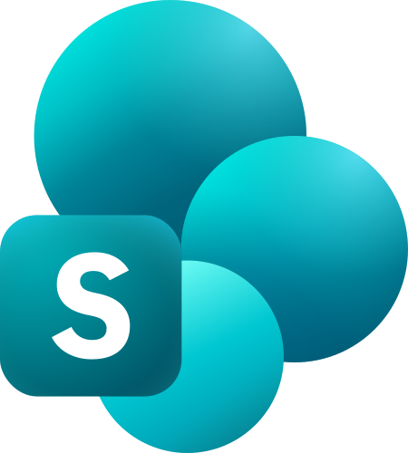
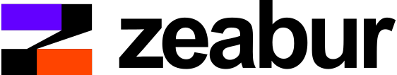

# ☁️ Cloud, Hosting & Infrastructure (268)

[⬅️ Back to the full catalog](../README.md) · [🖼️ Browse & download on the website](https://logos.lndev.me/)

<table>
<tr><td align="center"><a href="../logos/100tb.svg"> <code>100tb</code></a></td><td align="center"><a href="../logos/adobe-experience-platform.svg"> <code>adobe-experience-platform</code></a></td><td align="center"><a href="../logos/ahrefs.svg"> <code>ahrefs</code></a></td><td align="center"><a href="../logos/ahrefs-wordmark.svg"> <code>ahrefs-wordmark</code></a></td><td align="center"><a href="../logos/akamai.svg"> <code>akamai</code></a></td><td align="center"><a href="../logos/alibabacloud.svg"> <code>alibabacloud</code></a></td></tr>
<tr><td align="center"><a href="../logos/alidns.svg"> <code>alidns</code></a></td><td align="center"><a href="../logos/alternate-dns.svg"> <code>alternate-dns</code></a></td><td align="center"><a href="../logos/amazon-s3.svg"> <code>amazon-s3</code></a></td><td align="center"><a href="../logos/appfog.svg"> <code>appfog</code></a></td><td align="center"><a href="../logos/appwrite.svg"> <code>appwrite</code></a></td><td align="center"><a href="../logos/appwrite-wordmark.svg"> <code>appwrite-wordmark</code></a></td></tr>
<tr><td align="center"><a href="../logos/aws.svg"> <code>aws</code></a></td><td align="center"><a href="../logos/aws-amplify.svg"> <code>aws-amplify</code></a></td><td align="center"><a href="../logos/aws-api-gateway.svg"> <code>aws-api-gateway</code></a></td><td align="center"><a href="../logos/aws-app-mesh.svg"> <code>aws-app-mesh</code></a></td><td align="center"><a href="../logos/aws-appflow.svg"> <code>aws-appflow</code></a></td><td align="center"><a href="../logos/aws-appsync.svg"> <code>aws-appsync</code></a></td></tr>
<tr><td align="center"><a href="../logos/aws-athena.svg"> <code>aws-athena</code></a></td><td align="center"><a href="../logos/aws-aurora.svg"> <code>aws-aurora</code></a></td><td align="center"><a href="../logos/aws-backup.svg"> <code>aws-backup</code></a></td><td align="center"><a href="../logos/aws-batch.svg"> <code>aws-batch</code></a></td><td align="center"><a href="../logos/aws-certificate-manager.svg"> <code>aws-certificate-manager</code></a></td><td align="center"><a href="../logos/aws-cloudformation.svg"> <code>aws-cloudformation</code></a></td></tr>
<tr><td align="center"><a href="../logos/aws-cloudfront.svg"> <code>aws-cloudfront</code></a></td><td align="center"><a href="../logos/aws-cloudsearch.svg"> <code>aws-cloudsearch</code></a></td><td align="center"><a href="../logos/aws-cloudtrail.svg"> <code>aws-cloudtrail</code></a></td><td align="center"><a href="../logos/aws-cloudwatch.svg"> <code>aws-cloudwatch</code></a></td><td align="center"><a href="../logos/aws-codebuild.svg"> <code>aws-codebuild</code></a></td><td align="center"><a href="../logos/aws-codecommit.svg"> <code>aws-codecommit</code></a></td></tr>
<tr><td align="center"><a href="../logos/aws-codedeploy.svg"> <code>aws-codedeploy</code></a></td><td align="center"><a href="../logos/aws-codepipeline.svg"> <code>aws-codepipeline</code></a></td><td align="center"><a href="../logos/aws-codestar.svg"> <code>aws-codestar</code></a></td><td align="center"><a href="../logos/aws-cognito.svg"> <code>aws-cognito</code></a></td><td align="center"><a href="../logos/aws-config.svg"> <code>aws-config</code></a></td><td align="center"><a href="../logos/aws-documentdb.svg"> <code>aws-documentdb</code></a></td></tr>
<tr><td align="center"><a href="../logos/aws-dynamodb.svg"> <code>aws-dynamodb</code></a></td><td align="center"><a href="../logos/aws-ec2.svg"> <code>aws-ec2</code></a></td><td align="center"><a href="../logos/aws-ecs.svg"> <code>aws-ecs</code></a></td><td align="center"><a href="../logos/aws-eks.svg"> <code>aws-eks</code></a></td><td align="center"><a href="../logos/aws-elastic-beanstalk.svg"> <code>aws-elastic-beanstalk</code></a></td><td align="center"><a href="../logos/aws-elastic-cache.svg"> <code>aws-elastic-cache</code></a></td></tr>
<tr><td align="center"><a href="../logos/aws-elasticache.svg"> <code>aws-elasticache</code></a></td><td align="center"><a href="../logos/aws-elb.svg"> <code>aws-elb</code></a></td><td align="center"><a href="../logos/aws-eventbridge.svg"> <code>aws-eventbridge</code></a></td><td align="center"><a href="../logos/aws-fargate.svg"> <code>aws-fargate</code></a></td><td align="center"><a href="../logos/aws-glacier.svg"> <code>aws-glacier</code></a></td><td align="center"><a href="../logos/aws-glue.svg"> <code>aws-glue</code></a></td></tr>
<tr><td align="center"><a href="../logos/aws-iam.svg"> <code>aws-iam</code></a></td><td align="center"><a href="../logos/aws-keyspaces.svg"> <code>aws-keyspaces</code></a></td><td align="center"><a href="../logos/aws-kinesis.svg"> <code>aws-kinesis</code></a></td><td align="center"><a href="../logos/aws-kms.svg"> <code>aws-kms</code></a></td><td align="center"><a href="../logos/aws-lake-formation.svg"> <code>aws-lake-formation</code></a></td><td align="center"><a href="../logos/aws-lambda.svg"> <code>aws-lambda</code></a></td></tr>
<tr><td align="center"><a href="../logos/aws-lightsail.svg"> <code>aws-lightsail</code></a></td><td align="center"><a href="../logos/aws-mobilehub.svg"> <code>aws-mobilehub</code></a></td><td align="center"><a href="../logos/aws-mq.svg"> <code>aws-mq</code></a></td><td align="center"><a href="../logos/aws-msk.svg"> <code>aws-msk</code></a></td><td align="center"><a href="../logos/aws-neptune.svg"> <code>aws-neptune</code></a></td><td align="center"><a href="../logos/aws-open-search.svg"> <code>aws-open-search</code></a></td></tr>
<tr><td align="center"><a href="../logos/aws-opsworks.svg"> <code>aws-opsworks</code></a></td><td align="center"><a href="../logos/aws-quicksight.svg"> <code>aws-quicksight</code></a></td><td align="center"><a href="../logos/aws-rds.svg"> <code>aws-rds</code></a></td><td align="center"><a href="../logos/aws-redshift.svg"> <code>aws-redshift</code></a></td><td align="center"><a href="../logos/aws-route53.svg"> <code>aws-route53</code></a></td><td align="center"><a href="../logos/aws-s3.svg"> <code>aws-s3</code></a></td></tr>
<tr><td align="center"><a href="../logos/aws-secrets-manager.svg"> <code>aws-secrets-manager</code></a></td><td align="center"><a href="../logos/aws-ses.svg"> <code>aws-ses</code></a></td><td align="center"><a href="../logos/aws-shield.svg"> <code>aws-shield</code></a></td><td align="center"><a href="../logos/aws-sns.svg"> <code>aws-sns</code></a></td><td align="center"><a href="../logos/aws-sqs.svg"> <code>aws-sqs</code></a></td><td align="center"><a href="../logos/aws-step-functions.svg"> <code>aws-step-functions</code></a></td></tr>
<tr><td align="center"><a href="../logos/aws-systems-manager.svg"> <code>aws-systems-manager</code></a></td><td align="center"><a href="../logos/aws-timestream.svg"> <code>aws-timestream</code></a></td><td align="center"><a href="../logos/aws-vpc.svg"> <code>aws-vpc</code></a></td><td align="center"><a href="../logos/aws-waf.svg"> <code>aws-waf</code></a></td><td align="center"><a href="../logos/aws-xray.svg"> <code>aws-xray</code></a></td><td align="center"><a href="../logos/azure.svg"> <code>azure</code></a></td></tr>
<tr><td align="center"><a href="../logos/azure-wordmark.svg"> <code>azure-wordmark</code></a></td><td align="center"><a href="../logos/balena.svg"> <code>balena</code></a></td><td align="center"><a href="../logos/banzaicloud.svg"> <code>banzaicloud</code></a></td><td align="center"><a href="../logos/belugacdn.svg"> <code>belugacdn</code></a></td><td align="center"><a href="../logos/bettercloud.svg"> <code>bettercloud</code></a></td><td align="center"><a href="../logos/bitballoon.svg"> <code>bitballoon</code></a></td></tr>
<tr><td align="center"><a href="../logos/bluemix.svg"> <code>bluemix</code></a></td><td align="center"><a href="../logos/bocloudcomcn.svg"> <code>bocloudcomcn</code></a></td><td align="center"><a href="../logos/bunny-net.svg"> <code>bunny-net</code></a></td><td align="center"><a href="../logos/bunny-net-wordmark.svg"> <code>bunny-net-wordmark</code></a></td><td align="center"><a href="../logos/caicloudio.svg"> <code>caicloudio</code></a></td><td align="center"><a href="../logos/catalystcloud.svg"> <code>catalystcloud</code></a></td></tr>
<tr><td align="center"><a href="../logos/cloud66-maestro.svg"> <code>cloud66-maestro</code></a></td><td align="center"><a href="../logos/cloud66-skycap.svg"> <code>cloud66-skycap</code></a></td><td align="center"><a href="../logos/cloudbees.svg"> <code>cloudbees</code></a></td><td align="center"><a href="../logos/cloudboostio.svg"> <code>cloudboostio</code></a></td><td align="center"><a href="../logos/cloudcannon.svg"> <code>cloudcannon</code></a></td><td align="center"><a href="../logos/cloudeventsio.svg"> <code>cloudeventsio</code></a></td></tr>
<tr><td align="center"><a href="../logos/cloudflare.svg"> <code>cloudflare</code></a></td><td align="center"><a href="../logos/cloudflare-wordmark.svg"> <code>cloudflare-wordmark</code></a></td><td align="center"><a href="../logos/cloudflare-workers.svg"> <code>cloudflare-workers</code></a></td><td align="center"><a href="../logos/cloudflare-workers-wordmark.svg"> <code>cloudflare-workers-wordmark</code></a></td><td align="center"><a href="../logos/cloudfoundry.svg"> <code>cloudfoundry</code></a></td><td align="center"><a href="../logos/cloudfoundry-application-runtime.svg"> <code>cloudfoundry-application-runtime</code></a></td></tr>
<tr><td align="center"><a href="../logos/cloudfoundry-container-runtime.svg"> <code>cloudfoundry-container-runtime</code></a></td><td align="center"><a href="../logos/cloudhealthtech.svg"> <code>cloudhealthtech</code></a></td><td align="center"><a href="../logos/cloudifyco.svg"> <code>cloudifyco</code></a></td><td align="center"><a href="../logos/cloudinary.svg"> <code>cloudinary</code></a></td><td align="center"><a href="../logos/cloudinary-wordmark.svg"> <code>cloudinary-wordmark</code></a></td><td align="center"><a href="../logos/cloudlinux.svg"> <code>cloudlinux</code></a></td></tr>
<tr><td align="center"><a href="../logos/cloudops.svg"> <code>cloudops</code></a></td><td align="center"><a href="../logos/cloudreach.svg"> <code>cloudreach</code></a></td><td align="center"><a href="../logos/cloudsmithio.svg"> <code>cloudsmithio</code></a></td><td align="center"><a href="../logos/cloudzero.svg"> <code>cloudzero</code></a></td><td align="center"><a href="../logos/cloudzoneio.svg"> <code>cloudzoneio</code></a></td><td align="center"><a href="../logos/clusterhq.svg"> <code>clusterhq</code></a></td></tr>
<tr><td align="center"><a href="../logos/containership.svg"> <code>containership</code></a></td><td align="center"><a href="../logos/convox.svg"> <code>convox</code></a></td><td align="center"><a href="../logos/convox-wordmark.svg"> <code>convox-wordmark</code></a></td><td align="center"><a href="../logos/corednsio.svg"> <code>corednsio</code></a></td><td align="center"><a href="../logos/coreos.svg"> <code>coreos</code></a></td><td align="center"><a href="../logos/coreos-wordmark.svg"> <code>coreos-wordmark</code></a></td></tr>
<tr><td align="center"><a href="../logos/cpanel.svg"> <code>cpanel</code></a></td><td align="center"><a href="../logos/dcos.svg"> <code>dcos</code></a></td><td align="center"><a href="../logos/dcos-wordmark.svg"> <code>dcos-wordmark</code></a></td><td align="center"><a href="../logos/digital-ocean.svg"> <code>digital-ocean</code></a></td><td align="center"><a href="../logos/digital-ocean-wordmark.svg"> <code>digital-ocean-wordmark</code></a></td><td align="center"><a href="../logos/divshot.svg"> <code>divshot</code></a></td></tr>
<tr><td align="center"><a href="../logos/dnsfilter.svg"> <code>dnsfilter</code></a></td><td align="center"><a href="../logos/dnsimple.svg"> <code>dnsimple</code></a></td><td align="center"><a href="../logos/dnsmadeeasy.svg"> <code>dnsmadeeasy</code></a></td><td align="center"><a href="../logos/dnsnetworksca.svg"> <code>dnsnetworksca</code></a></td><td align="center"><a href="../logos/dnstoys.svg"> <code>dnstoys</code></a></td><td align="center"><a href="../logos/dnswatch.svg"> <code>dnswatch</code></a></td></tr>
<tr><td align="center"><a href="../logos/dotcloud.svg"> <code>dotcloud</code></a></td><td align="center"><a href="../logos/dreamhost.svg"> <code>dreamhost</code></a></td><td align="center"><a href="../logos/dyndns.svg"> <code>dyndns</code></a></td><td align="center"><a href="../logos/edgio.svg"> <code>edgio</code></a></td><td align="center"><a href="../logos/edgio-wordmark.svg"> <code>edgio-wordmark</code></a></td><td align="center"><a href="../logos/elasticbox.svg"> <code>elasticbox</code></a></td></tr>
<tr><td align="center"><a href="../logos/engine-yard.svg"> <code>engine-yard</code></a></td><td align="center"><a href="../logos/engine-yard-wordmark.svg"> <code>engine-yard-wordmark</code></a></td><td align="center"><a href="../logos/fastly.svg"> <code>fastly</code></a></td><td align="center"><a href="../logos/firebase.svg"> <code>firebase</code></a></td><td align="center"><a href="../logos/firebase-wordmark.svg"> <code>firebase-wordmark</code></a></td><td align="center"><a href="../logos/flannel.svg"> <code>flannel</code></a></td></tr>
<tr><td align="center"><a href="../logos/flocker.svg"> <code>flocker</code></a></td><td align="center"><a href="../logos/fly.svg"> <code>fly</code></a></td><td align="center"><a href="../logos/fly-wordmark.svg"> <code>fly-wordmark</code></a></td><td align="center"><a href="../logos/gandi.svg"> <code>gandi</code></a></td><td align="center"><a href="../logos/ghostery.svg"> <code>ghostery</code></a></td><td align="center"><a href="../logos/ghostscript.svg"> <code>ghostscript</code></a></td></tr>
<tr><td align="center"><a href="../logos/giantswarm.svg"> <code>giantswarm</code></a></td><td align="center"><a href="../logos/godaddy.svg"> <code>godaddy</code></a></td><td align="center"><a href="../logos/google-cloud.svg"> <code>google-cloud</code></a></td><td align="center"><a href="../logos/google-cloud-functions.svg"> <code>google-cloud-functions</code></a></td><td align="center"><a href="../logos/google-cloud-platform.svg"> <code>google-cloud-platform</code></a></td><td align="center"><a href="../logos/google-cloud-run.svg"> <code>google-cloud-run</code></a></td></tr>
<tr><td align="center"><a href="../logos/graphcool.svg"> <code>graphcool</code></a></td><td align="center"><a href="../logos/hasura.svg"> <code>hasura</code></a></td><td align="center"><a href="../logos/hasura-wordmark.svg"> <code>hasura-wordmark</code></a></td><td align="center"><a href="../logos/heroku.svg"> <code>heroku</code></a></td><td align="center"><a href="../logos/heroku-redis.svg"> <code>heroku-redis</code></a></td><td align="center"><a href="../logos/heroku-wordmark.svg"> <code>heroku-wordmark</code></a></td></tr>
<tr><td align="center"><a href="../logos/hostgator.svg"> <code>hostgator</code></a></td><td align="center"><a href="../logos/hostgator-wordmark.svg"> <code>hostgator-wordmark</code></a></td><td align="center"><a href="../logos/ibm-cloud.svg"> <code>ibm-cloud</code></a></td><td align="center"><a href="../logos/intello.svg"> <code>intello</code></a></td><td align="center"><a href="../logos/intello-wordmark.svg"> <code>intello-wordmark</code></a></td><td align="center"><a href="../logos/iron.svg"> <code>iron</code></a></td></tr>
<tr><td align="center"><a href="../logos/iron-wordmark.svg"> <code>iron-wordmark</code></a></td><td align="center"><a href="../logos/jelastic.svg"> <code>jelastic</code></a></td><td align="center"><a href="../logos/jelastic-wordmark.svg"> <code>jelastic-wordmark</code></a></td><td align="center"><a href="../logos/jsdelivr.svg"> <code>jsdelivr</code></a></td><td align="center"><a href="../logos/juju.svg"> <code>juju</code></a></td><td align="center"><a href="../logos/jumpcloud.svg"> <code>jumpcloud</code></a></td></tr>
<tr><td align="center"><a href="../logos/keycdn.svg"> <code>keycdn</code></a></td><td align="center"><a href="../logos/keycdn-wordmark.svg"> <code>keycdn-wordmark</code></a></td><td align="center"><a href="../logos/kinvey.svg"> <code>kinvey</code></a></td><td align="center"><a href="../logos/kloudless.svg"> <code>kloudless</code></a></td><td align="center"><a href="../logos/knot-dnscz.svg"> <code>knot-dnscz</code></a></td><td align="center"><a href="../logos/kontena.svg"> <code>kontena</code></a></td></tr>
<tr><td align="center"><a href="../logos/lets-cloud.svg"> <code>lets-cloud</code></a></td><td align="center"><a href="../logos/linkerd.svg"> <code>linkerd</code></a></td><td align="center"><a href="../logos/linode.svg"> <code>linode</code></a></td><td align="center"><a href="../logos/losant.svg"> <code>losant</code></a></td><td align="center"><a href="../logos/mantl.svg"> <code>mantl</code></a></td><td align="center"><a href="../logos/mapbox.svg"> <code>mapbox</code></a></td></tr>
<tr><td align="center"><a href="../logos/mapbox-wordmark.svg"> <code>mapbox-wordmark</code></a></td><td align="center"><a href="../logos/mapzen.svg"> <code>mapzen</code></a></td><td align="center"><a href="../logos/mapzen-wordmark.svg"> <code>mapzen-wordmark</code></a></td><td align="center"><a href="../logos/maxcdn.svg"> <code>maxcdn</code></a></td><td align="center"><a href="../logos/mesos.svg"> <code>mesos</code></a></td><td align="center"><a href="../logos/mesosphere.svg"> <code>mesosphere</code></a></td></tr>
<tr><td align="center"><a href="../logos/microsoft-sharepoint.svg"> <code>microsoft-sharepoint</code></a></td><td align="center"><a href="../logos/modulus.svg"> <code>modulus</code></a></td><td align="center"><a href="../logos/morpheus.svg"> <code>morpheus</code></a></td><td align="center"><a href="../logos/morpheus-wordmark.svg"> <code>morpheus-wordmark</code></a></td><td align="center"><a href="../logos/multipass.svg"> <code>multipass</code></a></td><td align="center"><a href="../logos/namecheap.svg"> <code>namecheap</code></a></td></tr>
<tr><td align="center"><a href="../logos/netlify.svg"> <code>netlify</code></a></td><td align="center"><a href="../logos/netlify-wordmark.svg"> <code>netlify-wordmark</code></a></td><td align="center"><a href="../logos/neverinstall.svg"> <code>neverinstall</code></a></td><td align="center"><a href="../logos/neverinstall-wordmark.svg"> <code>neverinstall-wordmark</code></a></td><td align="center"><a href="../logos/nextdnsio.svg"> <code>nextdnsio</code></a></td><td align="center"><a href="../logos/nhost.svg"> <code>nhost</code></a></td></tr>
<tr><td align="center"><a href="../logos/nhost-wordmark.svg"> <code>nhost-wordmark</code></a></td><td align="center"><a href="../logos/nodejitsu.svg"> <code>nodejitsu</code></a></td><td align="center"><a href="../logos/nomad.svg"> <code>nomad</code></a></td><td align="center"><a href="../logos/nomad-wordmark.svg"> <code>nomad-wordmark</code></a></td><td align="center"><a href="../logos/now.svg"> <code>now</code></a></td><td align="center"><a href="../logos/octodns.svg"> <code>octodns</code></a></td></tr>
<tr><td align="center"><a href="../logos/opendns.svg"> <code>opendns</code></a></td><td align="center"><a href="../logos/openshift.svg"> <code>openshift</code></a></td><td align="center"><a href="../logos/openstack.svg"> <code>openstack</code></a></td><td align="center"><a href="../logos/openstack-wordmark.svg"> <code>openstack-wordmark</code></a></td><td align="center"><a href="../logos/orshot.svg"> <code>orshot</code></a></td><td align="center"><a href="../logos/orshot-wordmark.svg"> <code>orshot-wordmark</code></a></td></tr>
<tr><td align="center"><a href="../logos/owncloud.svg"> <code>owncloud</code></a></td><td align="center"><a href="../logos/pagekite.svg"> <code>pagekite</code></a></td><td align="center"><a href="../logos/parse.svg"> <code>parse</code></a></td><td align="center"><a href="../logos/peer5.svg"> <code>peer5</code></a></td><td align="center"><a href="../logos/pocket-base.svg"> <code>pocket-base</code></a></td><td align="center"><a href="../logos/powerdns.svg"> <code>powerdns</code></a></td></tr>
<tr><td align="center"><a href="../logos/proxmox.svg"> <code>proxmox</code></a></td><td align="center"><a href="../logos/pusher.svg"> <code>pusher</code></a></td><td align="center"><a href="../logos/pusher-wordmark.svg"> <code>pusher-wordmark</code></a></td><td align="center"><a href="../logos/rackspace.svg"> <code>rackspace</code></a></td><td align="center"><a href="../logos/rackspace-wordmark.svg"> <code>rackspace-wordmark</code></a></td><td align="center"><a href="../logos/railway.svg"> <code>railway</code></a></td></tr>
<tr><td align="center"><a href="../logos/redspread.svg"> <code>redspread</code></a></td><td align="center"><a href="../logos/reindex.svg"> <code>reindex</code></a></td><td align="center"><a href="../logos/render.svg"> <code>render</code></a></td><td align="center"><a href="../logos/render-wordmark.svg"> <code>render-wordmark</code></a></td><td align="center"><a href="../logos/rkt.svg"> <code>rkt</code></a></td><td align="center"><a href="../logos/scaledrone.svg"> <code>scaledrone</code></a></td></tr>
<tr><td align="center"><a href="../logos/scaphold.svg"> <code>scaphold</code></a></td><td align="center"><a href="../logos/section.svg"> <code>section</code></a></td><td align="center"><a href="../logos/section-wordmark.svg"> <code>section-wordmark</code></a></td><td align="center"><a href="../logos/sectionio.svg"> <code>sectionio</code></a></td><td align="center"><a href="../logos/serveless.svg"> <code>serveless</code></a></td><td align="center"><a href="../logos/serverless.svg"> <code>serverless</code></a></td></tr>
<tr><td align="center"><a href="../logos/soldera.svg"> <code>soldera</code></a></td><td align="center"><a href="../logos/soldera-wordmark.svg"> <code>soldera-wordmark</code></a></td><td align="center"><a href="../logos/sst.svg"> <code>sst</code></a></td><td align="center"><a href="../logos/sst-wordmark.svg"> <code>sst-wordmark</code></a></td><td align="center"><a href="../logos/stacksmith.svg"> <code>stacksmith</code></a></td><td align="center"><a href="../logos/supabase.svg"> <code>supabase</code></a></td></tr>
<tr><td align="center"><a href="../logos/supabase-wordmark.svg"> <code>supabase-wordmark</code></a></td><td align="center"><a href="../logos/supergiant.svg"> <code>supergiant</code></a></td><td align="center"><a href="../logos/surge.svg"> <code>surge</code></a></td><td align="center"><a href="../logos/tectonic.svg"> <code>tectonic</code></a></td><td align="center"><a href="../logos/truenas.svg"> <code>truenas</code></a></td><td align="center"><a href="../logos/tsuru.svg"> <code>tsuru</code></a></td></tr>
<tr><td align="center"><a href="../logos/tutum.svg"> <code>tutum</code></a></td><td align="center"><a href="../logos/twilio.svg"> <code>twilio</code></a></td><td align="center"><a href="../logos/twilio-wordmark.svg"> <code>twilio-wordmark</code></a></td><td align="center"><a href="../logos/vercel.svg"> <code>vercel</code></a></td><td align="center"><a href="../logos/vercel-wordmark.svg"> <code>vercel-wordmark</code></a></td><td align="center"><a href="../logos/vultr.svg"> <code>vultr</code></a></td></tr>
<tr><td align="center"><a href="../logos/vultr-wordmark.svg"> <code>vultr-wordmark</code></a></td><td align="center"><a href="../logos/weave.svg"> <code>weave</code></a></td><td align="center"><a href="../logos/webmin.svg"> <code>webmin</code></a></td><td align="center"><a href="../logos/webtask.svg"> <code>webtask</code></a></td><td align="center"><a href="../logos/wiredtree.svg"> <code>wiredtree</code></a></td><td align="center"><a href="../logos/wpengine.svg"> <code>wpengine</code></a></td></tr>
<tr><td align="center"><a href="../logos/zeabur.svg"> <code>zeabur</code></a></td><td align="center"><a href="../logos/zeabur-wordmark.svg"> <code>zeabur-wordmark</code></a></td><td align="center"><a href="../logos/zeit.svg"> <code>zeit</code></a></td><td align="center"><a href="../logos/zeit-wordmark.svg"> <code>zeit-wordmark</code></a></td></tr>
</table>

[⬅️ Back to the full catalog](../README.md)
