# 💻 Languages & Runtimes (86)

[⬅️ Back to the full catalog](../README.md) · [🖼️ Browse & download on the website](https://logos.lndev.me/)

<table>
<tr><td align="center"><a href="../logos/autoit.svg"> <code>autoit</code></a></td><td align="center"><a href="../logos/bun.svg"> <code>bun</code></a></td><td align="center"><a href="../logos/c.svg"> <code>c</code></a></td><td align="center"><a href="../logos/c-plusplus.svg"> <code>c-plusplus</code></a></td><td align="center"><a href="../logos/c-sharp.svg"> <code>c-sharp</code></a></td><td align="center"><a href="../logos/ceylon.svg"> <code>ceylon</code></a></td></tr>
<tr><td align="center"><a href="../logos/clio-lang.svg"> <code>clio-lang</code></a></td><td align="center"><a href="../logos/cljs.svg">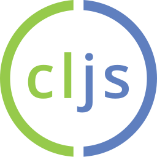 <code>cljs</code></a></td><td align="center"><a href="../logos/clojure.svg"> <code>clojure</code></a></td><td align="center"><a href="../logos/cobol.svg"> <code>cobol</code></a></td><td align="center"><a href="../logos/coffeescript.svg"> <code>coffeescript</code></a></td><td align="center"><a href="../logos/crystal.svg"> <code>crystal</code></a></td></tr>
<tr><td align="center"><a href="../logos/dart.svg">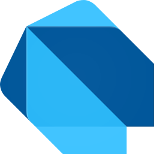 <code>dart</code></a></td><td align="center"><a href="../logos/deno.svg"> <code>deno</code></a></td><td align="center"><a href="../logos/dotnet.svg"> <code>dotnet</code></a></td><td align="center"><a href="../logos/ecma.svg"> <code>ecma</code></a></td><td align="center"><a href="../logos/elm.svg"> <code>elm</code></a></td><td align="center"><a href="../logos/elm-classic.svg"> <code>elm-classic</code></a></td></tr>
<tr><td align="center"><a href="../logos/erlang.svg"> <code>erlang</code></a></td><td align="center"><a href="../logos/es6.svg">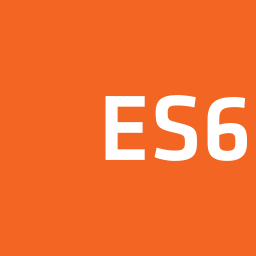 <code>es6</code></a></td><td align="center"><a href="../logos/fortran.svg"> <code>fortran</code></a></td><td align="center"><a href="../logos/fsharp.svg"> <code>fsharp</code></a></td><td align="center"><a href="../logos/gleam.svg"> <code>gleam</code></a></td><td align="center"><a href="../logos/go.svg"> <code>go</code></a></td></tr>
<tr><td align="center"><a href="../logos/gopher.svg"> <code>gopher</code></a></td><td align="center"><a href="../logos/hack.svg">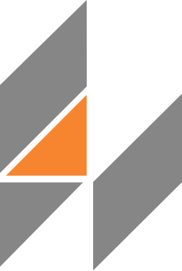 <code>hack</code></a></td><td align="center"><a href="../logos/haskell.svg"> <code>haskell</code></a></td><td align="center"><a href="../logos/haskell-wordmark.svg"> <code>haskell-wordmark</code></a></td><td align="center"><a href="../logos/haxe.svg">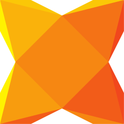 <code>haxe</code></a></td><td align="center"><a href="../logos/hermes.svg"> <code>hermes</code></a></td></tr>
<tr><td align="center"><a href="../logos/hhvm.svg">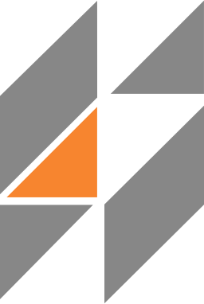 <code>hhvm</code></a></td><td align="center"><a href="../logos/hoa.svg"> <code>hoa</code></a></td><td align="center"><a href="../logos/imba.svg">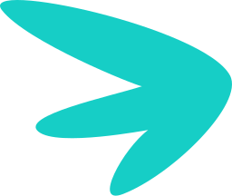 <code>imba</code></a></td><td align="center"><a href="../logos/imba-wordmark.svg"> <code>imba-wordmark</code></a></td><td align="center"><a href="../logos/io.svg"> <code>io</code></a></td><td align="center"><a href="../logos/java.svg"> <code>java</code></a></td></tr>
<tr><td align="center"><a href="../logos/javascript.svg">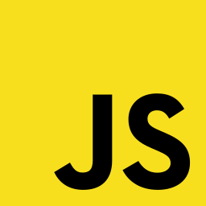 <code>javascript</code></a></td><td align="center"><a href="../logos/jruby.svg"> <code>jruby</code></a></td><td align="center"><a href="../logos/julia.svg"> <code>julia</code></a></td><td align="center"><a href="../logos/kotlin.svg"> <code>kotlin</code></a></td><td align="center"><a href="../logos/kotlin-wordmark.svg"> <code>kotlin-wordmark</code></a></td><td align="center"><a href="../logos/lua.svg"> <code>lua</code></a></td></tr>
<tr><td align="center"><a href="../logos/matlab.svg"> <code>matlab</code></a></td><td align="center"><a href="../logos/micro-python.svg"> <code>micro-python</code></a></td><td align="center"><a href="../logos/mint-lang.svg"> <code>mint-lang</code></a></td><td align="center"><a href="../logos/mono.svg"> <code>mono</code></a></td><td align="center"><a href="../logos/nasm.svg">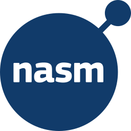 <code>nasm</code></a></td><td align="center"><a href="../logos/net.svg"> <code>net</code></a></td></tr>
<tr><td align="center"><a href="../logos/nim-lang.svg">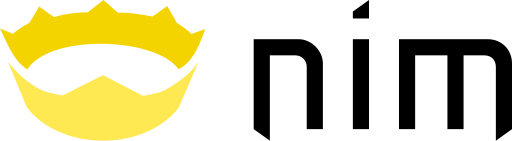 <code>nim-lang</code></a></td><td align="center"><a href="../logos/nodejs.svg"> <code>nodejs</code></a></td><td align="center"><a href="../logos/nodejs-icon-alt.svg">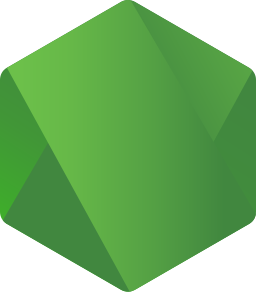 <code>nodejs-icon-alt</code></a></td><td align="center"><a href="../logos/nodejs-wordmark.svg"> <code>nodejs-wordmark</code></a></td><td align="center"><a href="../logos/ocaml.svg"> <code>ocaml</code></a></td><td align="center"><a href="../logos/perl.svg"> <code>perl</code></a></td></tr>
<tr><td align="center"><a href="../logos/php.svg"> <code>php</code></a></td><td align="center"><a href="../logos/php-alt.svg"> <code>php-alt</code></a></td><td align="center"><a href="../logos/powershell.svg"> <code>powershell</code></a></td><td align="center"><a href="../logos/purescript.svg"> <code>purescript</code></a></td><td align="center"><a href="../logos/purescript-wordmark.svg"> <code>purescript-wordmark</code></a></td><td align="center"><a href="../logos/pyscript.svg"> <code>pyscript</code></a></td></tr>
<tr><td align="center"><a href="../logos/python.svg"> <code>python</code></a></td><td align="center"><a href="../logos/r-lang.svg"> <code>r-lang</code></a></td><td align="center"><a href="../logos/reasonml.svg"> <code>reasonml</code></a></td><td align="center"><a href="../logos/reasonml-wordmark.svg"> <code>reasonml-wordmark</code></a></td><td align="center"><a href="../logos/rescript.svg"> <code>rescript</code></a></td><td align="center"><a href="../logos/rescript-wordmark.svg"> <code>rescript-wordmark</code></a></td></tr>
<tr><td align="center"><a href="../logos/ruby.svg"> <code>ruby</code></a></td><td align="center"><a href="../logos/rust.svg"> <code>rust</code></a></td><td align="center"><a href="../logos/scala.svg"> <code>scala</code></a></td><td align="center"><a href="../logos/solidity.svg"> <code>solidity</code></a></td><td align="center"><a href="../logos/spidermonkey.svg"> <code>spidermonkey</code></a></td><td align="center"><a href="../logos/spidermonkey-wordmark.svg"> <code>spidermonkey-wordmark</code></a></td></tr>
<tr><td align="center"><a href="../logos/swift.svg"> <code>swift</code></a></td><td align="center"><a href="../logos/tsnode.svg"> <code>tsnode</code></a></td><td align="center"><a href="../logos/typescript.svg"> <code>typescript</code></a></td><td align="center"><a href="../logos/typescript-icon-round.svg">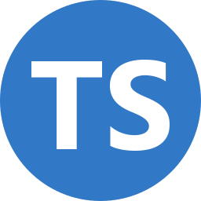 <code>typescript-icon-round</code></a></td><td align="center"><a href="../logos/typescript-wordmark.svg"> <code>typescript-wordmark</code></a></td><td align="center"><a href="../logos/v8.svg"> <code>v8</code></a></td></tr>
<tr><td align="center"><a href="../logos/v8-ignition.svg"> <code>v8-ignition</code></a></td><td align="center"><a href="../logos/v8-turbofan.svg"> <code>v8-turbofan</code></a></td><td align="center"><a href="../logos/vlang.svg">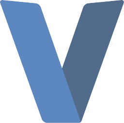 <code>vlang</code></a></td><td align="center"><a href="../logos/webassembly.svg"> <code>webassembly</code></a></td><td align="center"><a href="../logos/winglang.svg">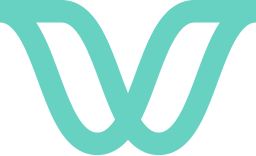 <code>winglang</code></a></td><td align="center"><a href="../logos/winglang-wordmark.svg"> <code>winglang-wordmark</code></a></td></tr>
<tr><td align="center"><a href="../logos/xtend.svg"> <code>xtend</code></a></td><td align="center"><a href="../logos/zig.svg"> <code>zig</code></a></td></tr>
</table>

[⬅️ Back to the full catalog](../README.md)
