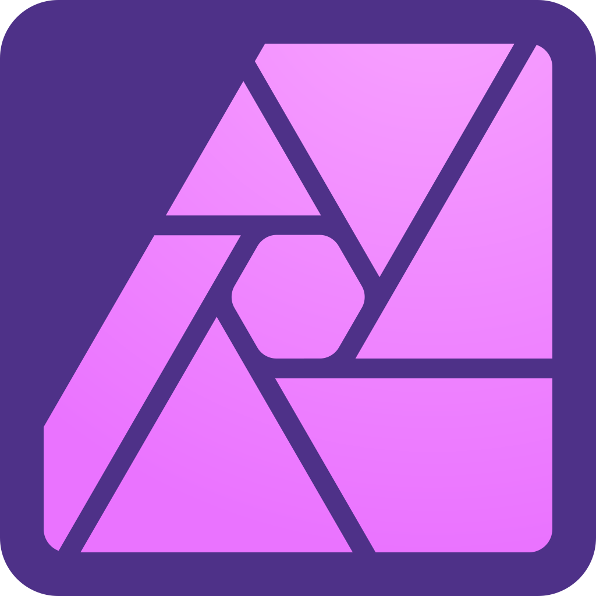
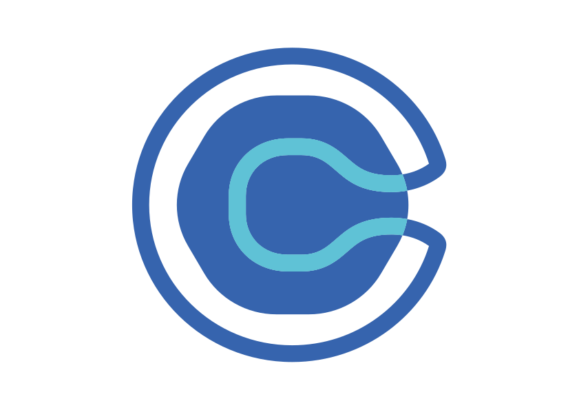
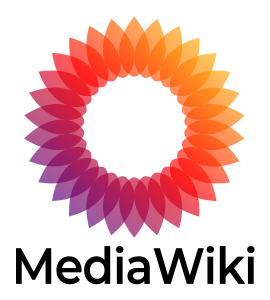
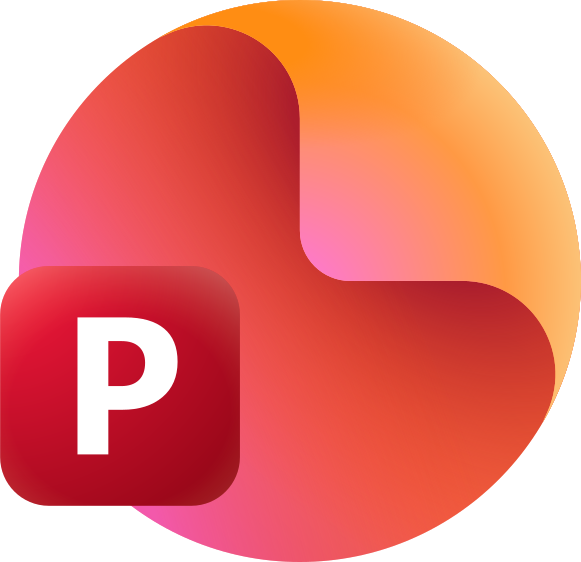
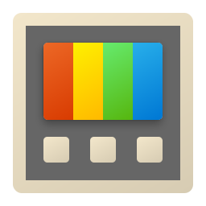
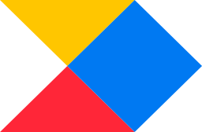
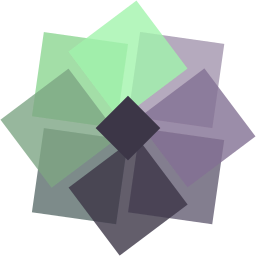
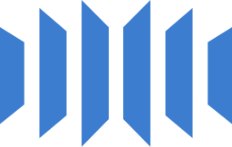
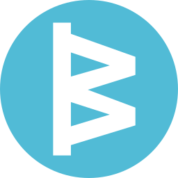
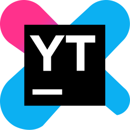

# 📋 Productivity & Collaboration (1836)

[⬅️ Back to the full catalog](../README.md) · [🖼️ Browse & download on the website](https://logos.lndev.me/)
<table>
<tr><td align="center"><a href="../logos/1337x.svg"> <code>1337x</code></a></td><td align="center"><a href="../logos/13ft.svg"> <code>13ft</code></a></td><td align="center"><a href="../logos/1panel.svg"> <code>1panel</code></a></td><td align="center"><a href="../logos/20i.svg"> <code>20i</code></a></td><td align="center"><a href="../logos/2dehands.svg"> <code>2dehands</code></a></td><td align="center"><a href="../logos/3cx.svg"> <code>3cx</code></a></td></tr>
<tr><td align="center"><a href="../logos/4chan.svg"> <code>4chan</code></a></td><td align="center"><a href="../logos/5etools.svg"> <code>5etools</code></a></td><td align="center"><a href="../logos/7zip.svg"> <code>7zip</code></a></td><td align="center"><a href="../logos/8311.svg"> <code>8311</code></a></td><td align="center"><a href="../logos/9router.svg"> <code>9router</code></a></td><td align="center"><a href="../logos/a-mule.svg"> <code>a-mule</code></a></td></tr>
<tr><td align="center"><a href="../logos/aboard.svg"> <code>aboard</code></a></td><td align="center"><a href="../logos/acrobat-reader.svg"> <code>acrobat-reader</code></a></td><td align="center"><a href="../logos/acrobat-scan.svg"> <code>acrobat-scan</code></a></td><td align="center"><a href="../logos/action1.svg"> <code>action1</code></a></td><td align="center"><a href="../logos/activepieces.svg"> <code>activepieces</code></a></td><td align="center"><a href="../logos/adminer.svg"> <code>adminer</code></a></td></tr>
<tr><td align="center"><a href="../logos/adobe-audition.svg"> <code>adobe-audition</code></a></td><td align="center"><a href="../logos/adobe-bridge.svg"> <code>adobe-bridge</code></a></td><td align="center"><a href="../logos/adobe-captivate.svg"> <code>adobe-captivate</code></a></td><td align="center"><a href="../logos/adobe-captivate-prime.svg"> <code>adobe-captivate-prime</code></a></td><td align="center"><a href="../logos/adobe-character-animator.svg"> <code>adobe-character-animator</code></a></td><td align="center"><a href="../logos/adobe-connect.svg"> <code>adobe-connect</code></a></td></tr>
<tr><td align="center"><a href="../logos/adobe-digital-editions.svg"> <code>adobe-digital-editions</code></a></td><td align="center"><a href="../logos/adobe-fill-and-sign.svg"> <code>adobe-fill-and-sign</code></a></td><td align="center"><a href="../logos/adobe-framemaker.svg"> <code>adobe-framemaker</code></a></td><td align="center"><a href="../logos/adobe-framemaker-server.svg"> <code>adobe-framemaker-server</code></a></td><td align="center"><a href="../logos/adobe-http-dynamic-streaming.svg"> <code>adobe-http-dynamic-streaming</code></a></td><td align="center"><a href="../logos/adobe-indesign-server.svg"> <code>adobe-indesign-server</code></a></td></tr>
<tr><td align="center"><a href="../logos/adobe-lightroom-classic.svg"> <code>adobe-lightroom-classic</code></a></td><td align="center"><a href="../logos/adobe-media-encoder.svg"> <code>adobe-media-encoder</code></a></td><td align="center"><a href="../logos/adobe-media-server.svg"> <code>adobe-media-server</code></a></td><td align="center"><a href="../logos/adobe-portfolio.svg"> <code>adobe-portfolio</code></a></td><td align="center"><a href="../logos/adobe-premiere-elements.svg"> <code>adobe-premiere-elements</code></a></td><td align="center"><a href="../logos/adobe-premiere-rush.svg"> <code>adobe-premiere-rush</code></a></td></tr>
<tr><td align="center"><a href="../logos/adobe-presenter-video-express.svg"> <code>adobe-presenter-video-express</code></a></td><td align="center"><a href="../logos/adobe-robohelp.svg"> <code>adobe-robohelp</code></a></td><td align="center"><a href="../logos/adobe-robohelp-server.svg"> <code>adobe-robohelp-server</code></a></td><td align="center"><a href="../logos/adobe-sign.svg"> <code>adobe-sign</code></a></td><td align="center"><a href="../logos/adobe-technical-communication-suite.svg"> <code>adobe-technical-communication-suite</code></a></td><td align="center"><a href="../logos/advanzia.svg"> <code>advanzia</code></a></td></tr>
<tr><td align="center"><a href="../logos/affine.svg"> <code>affine</code></a></td><td align="center"><a href="../logos/affinity-photo.svg"> <code>affinity-photo</code></a></td><td align="center"><a href="../logos/affinity-publisher.svg"> <code>affinity-publisher</code></a></td><td align="center"><a href="../logos/aha.svg"> <code>aha</code></a></td><td align="center"><a href="../logos/air-trail.svg"> <code>air-trail</code></a></td><td align="center"><a href="../logos/airsonic.svg"> <code>airsonic</code></a></td></tr>
<tr><td align="center"><a href="../logos/airtable.svg"> <code>airtable</code></a></td><td align="center"><a href="../logos/airtable-wordmark.svg"> <code>airtable-wordmark</code></a></td><td align="center"><a href="../logos/airtel.svg"> <code>airtel</code></a></td><td align="center"><a href="../logos/akaunting.svg"> <code>akaunting</code></a></td><td align="center"><a href="../logos/akkoma.svg"> <code>akkoma</code></a></td><td align="center"><a href="../logos/aks-automatic.svg"> <code>aks-automatic</code></a></td></tr>
<tr><td align="center"><a href="../logos/albert-heijn.svg"> <code>albert-heijn</code></a></td><td align="center"><a href="../logos/alertmanager.svg"> <code>alertmanager</code></a></td><td align="center"><a href="../logos/alexa.svg"> <code>alexa</code></a></td><td align="center"><a href="../logos/alexandrie.svg"> <code>alexandrie</code></a></td><td align="center"><a href="../logos/alist.svg"> <code>alist</code></a></td><td align="center"><a href="../logos/aliyun.svg"> <code>aliyun</code></a></td></tr>
<tr><td align="center"><a href="../logos/alloy.svg"> <code>alloy</code></a></td><td align="center"><a href="../logos/alma-linux.svg"> <code>alma-linux</code></a></td><td align="center"><a href="../logos/altcha.svg"> <code>altcha</code></a></td><td align="center"><a href="../logos/amazon-luna.svg"> <code>amazon-luna</code></a></td><td align="center"><a href="../logos/amazon-prime.svg"> <code>amazon-prime</code></a></td><td align="center"><a href="../logos/amazon-web-services.svg"> <code>amazon-web-services</code></a></td></tr>
<tr><td align="center"><a href="../logos/anaconda-wordmark.svg"> <code>anaconda-wordmark</code></a></td><td align="center"><a href="../logos/anchor.svg"> <code>anchor</code></a></td><td align="center"><a href="../logos/android-auto.svg"> <code>android-auto</code></a></td><td align="center"><a href="../logos/android-robot.svg"> <code>android-robot</code></a></td><td align="center"><a href="../logos/angel-studios.svg"> <code>angel-studios</code></a></td><td align="center"><a href="../logos/anonaddy.svg"> <code>anonaddy</code></a></td></tr>
<tr><td align="center"><a href="../logos/any-listen.svg"> <code>any-listen</code></a></td><td align="center"><a href="../logos/anydesk.svg"> <code>anydesk</code></a></td><td align="center"><a href="../logos/anything-llm.svg"> <code>anything-llm</code></a></td><td align="center"><a href="../logos/anytype.svg"> <code>anytype</code></a></td><td align="center"><a href="../logos/apache-airflow.svg"> <code>apache-airflow</code></a></td><td align="center"><a href="../logos/apache-answer.svg"> <code>apache-answer</code></a></td></tr>
<tr><td align="center"><a href="../logos/apache-druid.svg"> <code>apache-druid</code></a></td><td align="center"><a href="../logos/apache-iceberg.svg"> <code>apache-iceberg</code></a></td><td align="center"><a href="../logos/apache-jena.svg"> <code>apache-jena</code></a></td><td align="center"><a href="../logos/apache-jena-wordmark.svg"> <code>apache-jena-wordmark</code></a></td><td align="center"><a href="../logos/apache-openoffice.svg"> <code>apache-openoffice</code></a></td><td align="center"><a href="../logos/apc.svg"> <code>apc</code></a></td></tr>
<tr><td align="center"><a href="../logos/apiscp.svg"> <code>apiscp</code></a></td><td align="center"><a href="../logos/apollo-io.svg"> <code>apollo-io</code></a></td><td align="center"><a href="../logos/apollo-io-wordmark.svg"> <code>apollo-io-wordmark</code></a></td><td align="center"><a href="../logos/app-service.svg"> <code>app-service</code></a></td><td align="center"><a href="../logos/appflowy.svg"> <code>appflowy</code></a></td><td align="center"><a href="../logos/apple-alt.svg"> <code>apple-alt</code></a></td></tr>
<tr><td align="center"><a href="../logos/apple-maps.svg"> <code>apple-maps</code></a></td><td align="center"><a href="../logos/application-gateways.svg"> <code>application-gateways</code></a></td><td align="center"><a href="../logos/ara-records-ansible.svg"> <code>ara-records-ansible</code></a></td><td align="center"><a href="../logos/arcane.svg"> <code>arcane</code></a></td><td align="center"><a href="../logos/archidekt.svg"> <code>archidekt</code></a></td><td align="center"><a href="../logos/archivebox.svg"> <code>archivebox</code></a></td></tr>
<tr><td align="center"><a href="../logos/archivedotorg.svg"> <code>archivedotorg</code></a></td><td align="center"><a href="../logos/argo-cd.svg"> <code>argo-cd</code></a></td><td align="center"><a href="../logos/armbian.svg"> <code>armbian</code></a></td><td align="center"><a href="../logos/aroz-os.svg"> <code>aroz-os</code></a></td><td align="center"><a href="../logos/artifacthub.svg"> <code>artifacthub</code></a></td><td align="center"><a href="../logos/artifactory.svg"> <code>artifactory</code></a></td></tr>
<tr><td align="center"><a href="../logos/aruba.svg"> <code>aruba</code></a></td><td align="center"><a href="../logos/asana.svg"> <code>asana</code></a></td><td align="center"><a href="../logos/asana-wordmark.svg"> <code>asana-wordmark</code></a></td><td align="center"><a href="../logos/asciinema.svg"> <code>asciinema</code></a></td><td align="center"><a href="../logos/asrock-rack.svg"> <code>asrock-rack</code></a></td><td align="center"><a href="../logos/asrock-rack-ipmi.svg"> <code>asrock-rack-ipmi</code></a></td></tr>
<tr><td align="center"><a href="../logos/astral.svg"> <code>astral</code></a></td><td align="center"><a href="../logos/astrbot.svg"> <code>astrbot</code></a></td><td align="center"><a href="../logos/astuto.svg"> <code>astuto</code></a></td><td align="center"><a href="../logos/asus-full.svg"> <code>asus-full</code></a></td><td align="center"><a href="../logos/asus-rog.svg"> <code>asus-rog</code></a></td><td align="center"><a href="../logos/asus-router.svg"> <code>asus-router</code></a></td></tr>
<tr><td align="center"><a href="../logos/asustor.svg"> <code>asustor</code></a></td><td align="center"><a href="../logos/atlassian-bitbucket.svg"> <code>atlassian-bitbucket</code></a></td><td align="center"><a href="../logos/atlassian-confluence.svg"> <code>atlassian-confluence</code></a></td><td align="center"><a href="../logos/atlassian-opsgenie.svg"> <code>atlassian-opsgenie</code></a></td><td align="center"><a href="../logos/atlassian-trello.svg"> <code>atlassian-trello</code></a></td><td align="center"><a href="../logos/atuin.svg"> <code>atuin</code></a></td></tr>
<tr><td align="center"><a href="../logos/audacity.svg"> <code>audacity</code></a></td><td align="center"><a href="../logos/audora.svg"> <code>audora</code></a></td><td align="center"><a href="../logos/aura.svg"> <code>aura</code></a></td><td align="center"><a href="../logos/auracast.svg"> <code>auracast</code></a></td><td align="center"><a href="../logos/aurral.svg"> <code>aurral</code></a></td><td align="center"><a href="../logos/auto-cad.svg"> <code>auto-cad</code></a></td></tr>
<tr><td align="center"><a href="../logos/autobangumi.svg"> <code>autobangumi</code></a></td><td align="center"><a href="../logos/autobrr.svg"> <code>autobrr</code></a></td><td align="center"><a href="../logos/automad.svg"> <code>automad</code></a></td><td align="center"><a href="../logos/av1.svg"> <code>av1</code></a></td><td align="center"><a href="../logos/avg.svg"> <code>avg</code></a></td><td align="center"><a href="../logos/avif.svg"> <code>avif</code></a></td></tr>
<tr><td align="center"><a href="../logos/avigilon.svg"> <code>avigilon</code></a></td><td align="center"><a href="../logos/avm-fritzbox.svg"> <code>avm-fritzbox</code></a></td><td align="center"><a href="../logos/avm-fritzbox-4060.svg"> <code>avm-fritzbox-4060</code></a></td><td align="center"><a href="../logos/avm-fritzbox-5690.svg"> <code>avm-fritzbox-5690</code></a></td><td align="center"><a href="../logos/avm-fritzbox-6820.svg"> <code>avm-fritzbox-6820</code></a></td><td align="center"><a href="../logos/avm-fritzbox-6890.svg"> <code>avm-fritzbox-6890</code></a></td></tr>
<tr><td align="center"><a href="../logos/avm-fritzbox-7490.svg"> <code>avm-fritzbox-7490</code></a></td><td align="center"><a href="../logos/avm-fritzbox-7590.svg"> <code>avm-fritzbox-7590</code></a></td><td align="center"><a href="../logos/avm-fritzbox-7590oem.svg"> <code>avm-fritzbox-7590oem</code></a></td><td align="center"><a href="../logos/avm-fritzbox-7590real.svg"> <code>avm-fritzbox-7590real</code></a></td><td align="center"><a href="../logos/avm-powerline-1000.svg"> <code>avm-powerline-1000</code></a></td><td align="center"><a href="../logos/avm-powerline-546.svg"> <code>avm-powerline-546</code></a></td></tr>
<tr><td align="center"><a href="../logos/avm-repeater-2400.svg"> <code>avm-repeater-2400</code></a></td><td align="center"><a href="../logos/avm-repeater-3000.svg"> <code>avm-repeater-3000</code></a></td><td align="center"><a href="../logos/avm-repeater-310.svg"> <code>avm-repeater-310</code></a></td><td align="center"><a href="../logos/avm-repeater-600.svg"> <code>avm-repeater-600</code></a></td><td align="center"><a href="../logos/awwesome.svg"> <code>awwesome</code></a></td><td align="center"><a href="../logos/awx.svg"> <code>awx</code></a></td></tr>
<tr><td align="center"><a href="../logos/axiom.svg"> <code>axiom</code></a></td><td align="center"><a href="../logos/axiom-wordmark.svg"> <code>axiom-wordmark</code></a></td><td align="center"><a href="../logos/axis.svg"> <code>axis</code></a></td><td align="center"><a href="../logos/azuracast.svg"> <code>azuracast</code></a></td><td align="center"><a href="../logos/azure-application-insights.svg"> <code>azure-application-insights</code></a></td><td align="center"><a href="../logos/azure-bicep.svg"> <code>azure-bicep</code></a></td></tr>
<tr><td align="center"><a href="../logos/azure-cosmos-db.svg"> <code>azure-cosmos-db</code></a></td><td align="center"><a href="../logos/azure-cost-management.svg"> <code>azure-cost-management</code></a></td><td align="center"><a href="../logos/azure-data-factory.svg"> <code>azure-data-factory</code></a></td><td align="center"><a href="../logos/azure-expressroute-cirtcuits.svg"> <code>azure-expressroute-cirtcuits</code></a></td><td align="center"><a href="../logos/azure-front-door.svg"> <code>azure-front-door</code></a></td><td align="center"><a href="../logos/azure-postgres-server.svg"> <code>azure-postgres-server</code></a></td></tr>
<tr><td align="center"><a href="../logos/azure-service-bus.svg"> <code>azure-service-bus</code></a></td><td align="center"><a href="../logos/azure-storage-accounts.svg"> <code>azure-storage-accounts</code></a></td><td align="center"><a href="../logos/azure-traffic-manager.svg"> <code>azure-traffic-manager</code></a></td><td align="center"><a href="../logos/azure-virtual-desktop.svg"> <code>azure-virtual-desktop</code></a></td><td align="center"><a href="../logos/azure-virtual-network-gateways.svg"> <code>azure-virtual-network-gateways</code></a></td><td align="center"><a href="../logos/azure-vm.svg"> <code>azure-vm</code></a></td></tr>
<tr><td align="center"><a href="../logos/azure-vnet.svg"> <code>azure-vnet</code></a></td><td align="center"><a href="../logos/backrest.svg"> <code>backrest</code></a></td><td align="center"><a href="../logos/backstage.svg"> <code>backstage</code></a></td><td align="center"><a href="../logos/baikal.svg"> <code>baikal</code></a></td><td align="center"><a href="../logos/bale.svg"> <code>bale</code></a></td><td align="center"><a href="../logos/balena-etcher.svg"> <code>balena-etcher</code></a></td></tr>
<tr><td align="center"><a href="../logos/ballerina.svg"> <code>ballerina</code></a></td><td align="center"><a href="../logos/bar-assistant.svg"> <code>bar-assistant</code></a></td><td align="center"><a href="../logos/barco.svg"> <code>barco</code></a></td><td align="center"><a href="../logos/barrage.svg"> <code>barrage</code></a></td><td align="center"><a href="../logos/basecamp.svg"> <code>basecamp</code></a></td><td align="center"><a href="../logos/basecamp-wordmark.svg"> <code>basecamp-wordmark</code></a></td></tr>
<tr><td align="center"><a href="../logos/baserow.svg"> <code>baserow</code></a></td><td align="center"><a href="../logos/batch.svg"> <code>batch</code></a></td><td align="center"><a href="../logos/bazecor.svg"> <code>bazecor</code></a></td><td align="center"><a href="../logos/be-quiet.svg"> <code>be-quiet</code></a></td><td align="center"><a href="../logos/beacon.svg"> <code>beacon</code></a></td><td align="center"><a href="../logos/beaver-habit-tracker.svg"> <code>beaver-habit-tracker</code></a></td></tr>
<tr><td align="center"><a href="../logos/bechtle.svg"> <code>bechtle</code></a></td><td align="center"><a href="../logos/beef.svg"> <code>beef</code></a></td><td align="center"><a href="../logos/bento.svg"> <code>bento</code></a></td><td align="center"><a href="../logos/bentopdf.svg"> <code>bentopdf</code></a></td><td align="center"><a href="../logos/beszel.svg"> <code>beszel</code></a></td><td align="center"><a href="../logos/biblioreads.svg"> <code>biblioreads</code></a></td></tr>
<tr><td align="center"><a href="../logos/bigcapital.svg"> <code>bigcapital</code></a></td><td align="center"><a href="../logos/bikerouter.svg"> <code>bikerouter</code></a></td><td align="center"><a href="../logos/bilibili.svg"> <code>bilibili</code></a></td><td align="center"><a href="../logos/binner.svg"> <code>binner</code></a></td><td align="center"><a href="../logos/bitly.svg"> <code>bitly</code></a></td><td align="center"><a href="../logos/bitly-wordmark.svg"> <code>bitly-wordmark</code></a></td></tr>
<tr><td align="center"><a href="../logos/bitmagnet.svg"> <code>bitmagnet</code></a></td><td align="center"><a href="../logos/black-forest-labs.svg"> <code>black-forest-labs</code></a></td><td align="center"><a href="../logos/black-forest-labs-wordmark.svg"> <code>black-forest-labs-wordmark</code></a></td><td align="center"><a href="../logos/blocky.svg"> <code>blocky</code></a></td><td align="center"><a href="../logos/blossom.svg"> <code>blossom</code></a></td><td align="center"><a href="../logos/blu-ray.svg"> <code>blu-ray</code></a></td></tr>
<tr><td align="center"><a href="../logos/blu-ray-3d.svg"> <code>blu-ray-3d</code></a></td><td align="center"><a href="../logos/boltnew.svg"> <code>boltnew</code></a></td><td align="center"><a href="../logos/borg.svg"> <code>borg</code></a></td><td align="center"><a href="../logos/borgmatic.svg"> <code>borgmatic</code></a></td><td align="center"><a href="../logos/bottom.svg"> <code>bottom</code></a></td><td align="center"><a href="../logos/boundary.svg"> <code>boundary</code></a></td></tr>
<tr><td align="center"><a href="../logos/box.svg"> <code>box</code></a></td><td align="center"><a href="../logos/box-wordmark.svg"> <code>box-wordmark</code></a></td><td align="center"><a href="../logos/brick-tracker.svg"> <code>brick-tracker</code></a></td><td align="center"><a href="../logos/bright-move.svg"> <code>bright-move</code></a></td><td align="center"><a href="../logos/broadcastchannel.svg"> <code>broadcastchannel</code></a></td><td align="center"><a href="../logos/brocade.svg"> <code>brocade</code></a></td></tr>
<tr><td align="center"><a href="../logos/brother.svg"> <code>brother</code></a></td><td align="center"><a href="../logos/browserless.svg"> <code>browserless</code></a></td><td align="center"><a href="../logos/browsh.svg"> <code>browsh</code></a></td><td align="center"><a href="../logos/budibase.svg"> <code>budibase</code></a></td><td align="center"><a href="../logos/build-better.svg"> <code>build-better</code></a></td><td align="center"><a href="../logos/bunkerweb.svg"> <code>bunkerweb</code></a></td></tr>
<tr><td align="center"><a href="../logos/bunny.svg"> <code>bunny</code></a></td><td align="center"><a href="../logos/burpsuite.svg"> <code>burpsuite</code></a></td><td align="center"><a href="../logos/bytestash.svg"> <code>bytestash</code></a></td><td align="center"><a href="../logos/cabernet.svg"> <code>cabernet</code></a></td><td align="center"><a href="../logos/cachyos-linux.svg"> <code>cachyos-linux</code></a></td><td align="center"><a href="../logos/cacti.svg"> <code>cacti</code></a></td></tr>
<tr><td align="center"><a href="../logos/cal-com.svg"> <code>cal-com</code></a></td><td align="center"><a href="../logos/calendly.svg"> <code>calendly</code></a></td><td align="center"><a href="../logos/calibre-web.svg"> <code>calibre-web</code></a></td><td align="center"><a href="../logos/calyxos.svg"> <code>calyxos</code></a></td><td align="center"><a href="../logos/canvas-lms.svg"> <code>canvas-lms</code></a></td><td align="center"><a href="../logos/cap-cut.svg"> <code>cap-cut</code></a></td></tr>
<tr><td align="center"><a href="../logos/capacities.svg"> <code>capacities</code></a></td><td align="center"><a href="../logos/caprover.svg"> <code>caprover</code></a></td><td align="center"><a href="../logos/carousell.svg"> <code>carousell</code></a></td><td align="center"><a href="../logos/carrefour.svg"> <code>carrefour</code></a></td><td align="center"><a href="../logos/casaos.svg"> <code>casaos</code></a></td><td align="center"><a href="../logos/castopod.svg"> <code>castopod</code></a></td></tr>
<tr><td align="center"><a href="../logos/catppuccin.svg"> <code>catppuccin</code></a></td><td align="center"><a href="../logos/cc.svg"> <code>cc</code></a></td><td align="center"><a href="../logos/cd.svg"> <code>cd</code></a></td><td align="center"><a href="../logos/cert-manager.svg"> <code>cert-manager</code></a></td><td align="center"><a href="../logos/cert-warden.svg"> <code>cert-warden</code></a></td><td align="center"><a href="../logos/cessna.svg"> <code>cessna</code></a></td></tr>
<tr><td align="center"><a href="../logos/chainguard.svg"> <code>chainguard</code></a></td><td align="center"><a href="../logos/changedetection.svg"> <code>changedetection</code></a></td><td align="center"><a href="../logos/channels-dvr.svg"> <code>channels-dvr</code></a></td><td align="center"><a href="../logos/check-cle.svg"> <code>check-cle</code></a></td><td align="center"><a href="../logos/check-point.svg"> <code>check-point</code></a></td><td align="center"><a href="../logos/check-point-wordmark.svg"> <code>check-point-wordmark</code></a></td></tr>
<tr><td align="center"><a href="../logos/checkmate.svg"> <code>checkmate</code></a></td><td align="center"><a href="../logos/checkmk.svg"> <code>checkmk</code></a></td><td align="center"><a href="../logos/chess.svg"> <code>chess</code></a></td><td align="center"><a href="../logos/chhoto-url.svg"> <code>chhoto-url</code></a></td><td align="center"><a href="../logos/chibisafe.svg"> <code>chibisafe</code></a></td><td align="center"><a href="../logos/chimera-linux.svg"> <code>chimera-linux</code></a></td></tr>
<tr><td align="center"><a href="../logos/chirpy.svg"> <code>chirpy</code></a></td><td align="center"><a href="../logos/chocolate.svg"> <code>chocolate</code></a></td><td align="center"><a href="../logos/chrome-canary.svg"> <code>chrome-canary</code></a></td><td align="center"><a href="../logos/chrome-remote-desktop.svg"> <code>chrome-remote-desktop</code></a></td><td align="center"><a href="../logos/cilium.svg"> <code>cilium</code></a></td><td align="center"><a href="../logos/cinny.svg"> <code>cinny</code></a></td></tr>
<tr><td align="center"><a href="../logos/clam-av.svg"> <code>clam-av</code></a></td><td align="center"><a href="../logos/claude-ai.svg"> <code>claude-ai</code></a></td><td align="center"><a href="../logos/cleanuperr.svg"> <code>cleanuperr</code></a></td><td align="center"><a href="../logos/clickup.svg"> <code>clickup</code></a></td><td align="center"><a href="../logos/clickup-wordmark.svg"> <code>clickup-wordmark</code></a></td><td align="center"><a href="../logos/cockpit-cms.svg"> <code>cockpit-cms</code></a></td></tr>
<tr><td align="center"><a href="../logos/coda.svg"> <code>coda</code></a></td><td align="center"><a href="../logos/coda-wordmark.svg"> <code>coda-wordmark</code></a></td><td align="center"><a href="../logos/coldfusion.svg"> <code>coldfusion</code></a></td><td align="center"><a href="../logos/coldfusion-builder.svg"> <code>coldfusion-builder</code></a></td><td align="center"><a href="../logos/collabora-online.svg"> <code>collabora-online</code></a></td><td align="center"><a href="../logos/comfyui.svg"> <code>comfyui</code></a></td></tr>
<tr><td align="center"><a href="../logos/comfyui-wordmark.svg"> <code>comfyui-wordmark</code></a></td><td align="center"><a href="../logos/commafeed.svg"> <code>commafeed</code></a></td><td align="center"><a href="../logos/commento.svg"> <code>commento</code></a></td><td align="center"><a href="../logos/compreface.svg"> <code>compreface</code></a></td><td align="center"><a href="../logos/confix.svg"> <code>confix</code></a></td><td align="center"><a href="../logos/confluence.svg"> <code>confluence</code></a></td></tr>
<tr><td align="center"><a href="../logos/confluent.svg"> <code>confluent</code></a></td><td align="center"><a href="../logos/contabo.svg"> <code>contabo</code></a></td><td align="center"><a href="../logos/control-d.svg"> <code>control-d</code></a></td><td align="center"><a href="../logos/converse.svg"> <code>converse</code></a></td><td align="center"><a href="../logos/cooler-control.svg"> <code>cooler-control</code></a></td><td align="center"><a href="../logos/coolify.svg"> <code>coolify</code></a></td></tr>
<tr><td align="center"><a href="../logos/copyparty.svg"> <code>copyparty</code></a></td><td align="center"><a href="../logos/copyq.svg"> <code>copyq</code></a></td><td align="center"><a href="../logos/cosign.svg"> <code>cosign</code></a></td><td align="center"><a href="../logos/cosmic.svg"> <code>cosmic</code></a></td><td align="center"><a href="../logos/counter-analytics.svg"> <code>counter-analytics</code></a></td><td align="center"><a href="../logos/cozy.svg"> <code>cozy</code></a></td></tr>
<tr><td align="center"><a href="../logos/cpp.svg"> <code>cpp</code></a></td><td align="center"><a href="../logos/crafty-controller.svg"> <code>crafty-controller</code></a></td><td align="center"><a href="../logos/cronicle.svg"> <code>cronicle</code></a></td><td align="center"><a href="../logos/cronmaster.svg"> <code>cronmaster</code></a></td><td align="center"><a href="../logos/crosswatch.svg"> <code>crosswatch</code></a></td><td align="center"><a href="../logos/crowdin.svg"> <code>crowdin</code></a></td></tr>
<tr><td align="center"><a href="../logos/crowdsec.svg"> <code>crowdsec</code></a></td><td align="center"><a href="../logos/crowdsec-web-ui.svg"> <code>crowdsec-web-ui</code></a></td><td align="center"><a href="../logos/crowdstrike.svg"> <code>crowdstrike</code></a></td><td align="center"><a href="../logos/crowdstrike-wordmark.svg"> <code>crowdstrike-wordmark</code></a></td><td align="center"><a href="../logos/crunchyroll.svg"> <code>crunchyroll</code></a></td><td align="center"><a href="../logos/cryptpad.svg"> <code>cryptpad</code></a></td></tr>
<tr><td align="center"><a href="../logos/ctfreak.svg"> <code>ctfreak</code></a></td><td align="center"><a href="../logos/ctrader.svg"> <code>ctrader</code></a></td><td align="center"><a href="../logos/ctrader-wordmark.svg"> <code>ctrader-wordmark</code></a></td><td align="center"><a href="../logos/cup.svg"> <code>cup</code></a></td><td align="center"><a href="../logos/cups.svg"> <code>cups</code></a></td><td align="center"><a href="../logos/cura.svg"> <code>cura</code></a></td></tr>
<tr><td align="center"><a href="../logos/cyber-power-full.svg"> <code>cyber-power-full</code></a></td><td align="center"><a href="../logos/cyberchef.svg"> <code>cyberchef</code></a></td><td align="center"><a href="../logos/czkawka.svg"> <code>czkawka</code></a></td><td align="center"><a href="../logos/d-link.svg"> <code>d-link</code></a></td><td align="center"><a href="../logos/dagster.svg"> <code>dagster</code></a></td><td align="center"><a href="../logos/dalibo.svg"> <code>dalibo</code></a></td></tr>
<tr><td align="center"><a href="../logos/dall-e.svg"> <code>dall-e</code></a></td><td align="center"><a href="../logos/dapulse.svg"> <code>dapulse</code></a></td><td align="center"><a href="../logos/dashboard-icons.svg"> <code>dashboard-icons</code></a></td><td align="center"><a href="../logos/dashwise.svg"> <code>dashwise</code></a></td><td align="center"><a href="../logos/data-studio.svg"> <code>data-studio</code></a></td><td align="center"><a href="../logos/databasus.svg"> <code>databasus</code></a></td></tr>
<tr><td align="center"><a href="../logos/davical.svg"> <code>davical</code></a></td><td align="center"><a href="../logos/dawarich.svg"> <code>dawarich</code></a></td><td align="center"><a href="../logos/ddclient.svg"> <code>ddclient</code></a></td><td align="center"><a href="../logos/debian-linux.svg"> <code>debian-linux</code></a></td><td align="center"><a href="../logos/defguard.svg"> <code>defguard</code></a></td><td align="center"><a href="../logos/deluge.svg"> <code>deluge</code></a></td></tr>
<tr><td align="center"><a href="../logos/denodo.svg"> <code>denodo</code></a></td><td align="center"><a href="../logos/denon.svg"> <code>denon</code></a></td><td align="center"><a href="../logos/dependency-track.svg"> <code>dependency-track</code></a></td><td align="center"><a href="../logos/dependency-track-wordmark.svg"> <code>dependency-track-wordmark</code></a></td><td align="center"><a href="../logos/deq.svg"> <code>deq</code></a></td><td align="center"><a href="../logos/designali.svg"> <code>designali</code></a></td></tr>
<tr><td align="center"><a href="../logos/dia.svg"> <code>dia</code></a></td><td align="center"><a href="../logos/diagrams-net.svg"> <code>diagrams-net</code></a></td><td align="center"><a href="../logos/dictcc.svg"> <code>dictcc</code></a></td><td align="center"><a href="../logos/digi-kam.svg"> <code>digi-kam</code></a></td><td align="center"><a href="../logos/digikey.svg"> <code>digikey</code></a></td><td align="center"><a href="../logos/dilg.svg"> <code>dilg</code></a></td></tr>
<tr><td align="center"><a href="../logos/dillinger.svg"> <code>dillinger</code></a></td><td align="center"><a href="../logos/directadmin.svg"> <code>directadmin</code></a></td><td align="center"><a href="../logos/distribution.svg"> <code>distribution</code></a></td><td align="center"><a href="../logos/dixa.svg"> <code>dixa</code></a></td><td align="center"><a href="../logos/dkb.svg"> <code>dkb</code></a></td><td align="center"><a href="../logos/dlna.svg"> <code>dlna</code></a></td></tr>
<tr><td align="center"><a href="../logos/docassemble.svg"> <code>docassemble</code></a></td><td align="center"><a href="../logos/dockge.svg"> <code>dockge</code></a></td><td align="center"><a href="../logos/docking-station.svg"> <code>docking-station</code></a></td><td align="center"><a href="../logos/dockpeek.svg"> <code>dockpeek</code></a></td><td align="center"><a href="../logos/docling.svg"> <code>docling</code></a></td><td align="center"><a href="../logos/docsify.svg"> <code>docsify</code></a></td></tr>
<tr><td align="center"><a href="../logos/docspell.svg"> <code>docspell</code></a></td><td align="center"><a href="../logos/documenso.svg"> <code>documenso</code></a></td><td align="center"><a href="../logos/docus.svg"> <code>docus</code></a></td><td align="center"><a href="../logos/docus-wordmark.svg"> <code>docus-wordmark</code></a></td><td align="center"><a href="../logos/docuseal.svg"> <code>docuseal</code></a></td><td align="center"><a href="../logos/dokemon.svg"> <code>dokemon</code></a></td></tr>
<tr><td align="center"><a href="../logos/dokploy.svg"> <code>dokploy</code></a></td><td align="center"><a href="../logos/dokuwiki.svg"> <code>dokuwiki</code></a></td><td align="center"><a href="../logos/dolibarr.svg"> <code>dolibarr</code></a></td><td align="center"><a href="../logos/donetick.svg"> <code>donetick</code></a></td><td align="center"><a href="../logos/doozle.svg"> <code>doozle</code></a></td><td align="center"><a href="../logos/doppler.svg"> <code>doppler</code></a></td></tr>
<tr><td align="center"><a href="../logos/double-commander.svg"> <code>double-commander</code></a></td><td align="center"><a href="../logos/double-take.svg"> <code>double-take</code></a></td><td align="center"><a href="../logos/dovetail.svg"> <code>dovetail</code></a></td><td align="center"><a href="../logos/dovetail-wordmark.svg"> <code>dovetail-wordmark</code></a></td><td align="center"><a href="../logos/dozzle.svg"> <code>dozzle</code></a></td><td align="center"><a href="../logos/draytek.svg"> <code>draytek</code></a></td></tr>
<tr><td align="center"><a href="../logos/drop.svg"> <code>drop</code></a></td><td align="center"><a href="../logos/dropbox.svg"> <code>dropbox</code></a></td><td align="center"><a href="../logos/dropbox-wordmark.svg"> <code>dropbox-wordmark</code></a></td><td align="center"><a href="../logos/dropmark.svg"> <code>dropmark</code></a></td><td align="center"><a href="../logos/dropout.svg"> <code>dropout</code></a></td><td align="center"><a href="../logos/droppy.svg"> <code>droppy</code></a></td></tr>
<tr><td align="center"><a href="../logos/dub.svg"> <code>dub</code></a></td><td align="center"><a href="../logos/dub-wordmark.svg"> <code>dub-wordmark</code></a></td><td align="center"><a href="../logos/dufs.svg"> <code>dufs</code></a></td><td align="center"><a href="../logos/dumbassets.svg"> <code>dumbassets</code></a></td><td align="center"><a href="../logos/dumbpad.svg"> <code>dumbpad</code></a></td><td align="center"><a href="../logos/duo.svg"> <code>duo</code></a></td></tr>
<tr><td align="center"><a href="../logos/duplicati.svg"> <code>duplicati</code></a></td><td align="center"><a href="../logos/dvd.svg"> <code>dvd</code></a></td><td align="center"><a href="../logos/dynacat.svg"> <code>dynacat</code></a></td><td align="center"><a href="../logos/e-os.svg"> <code>e-os</code></a></td><td align="center"><a href="../logos/easy-gate.svg"> <code>easy-gate</code></a></td><td align="center"><a href="../logos/easyepg-lite.svg"> <code>easyepg-lite</code></a></td></tr>
<tr><td align="center"><a href="../logos/eblocker.svg"> <code>eblocker</code></a></td><td align="center"><a href="../logos/ecosia-wordmark.svg"> <code>ecosia-wordmark</code></a></td><td align="center"><a href="../logos/edge.svg"> <code>edge</code></a></td><td align="center"><a href="../logos/eisfair.svg"> <code>eisfair</code></a></td><td align="center"><a href="../logos/eitaa.svg"> <code>eitaa</code></a></td><td align="center"><a href="../logos/elabftw.svg"> <code>elabftw</code></a></td></tr>
<tr><td align="center"><a href="../logos/elastic-beats.svg"> <code>elastic-beats</code></a></td><td align="center"><a href="../logos/elastic-kibana.svg"> <code>elastic-kibana</code></a></td><td align="center"><a href="../logos/electronic-arts.svg"> <code>electronic-arts</code></a></td><td align="center"><a href="../logos/electrum.svg"> <code>electrum</code></a></td><td align="center"><a href="../logos/eleven-labs.svg"> <code>eleven-labs</code></a></td><td align="center"><a href="../logos/elgato-wave-link.svg"> <code>elgato-wave-link</code></a></td></tr>
<tr><td align="center"><a href="../logos/eliza-os.svg"> <code>eliza-os</code></a></td><td align="center"><a href="../logos/elysian.svg"> <code>elysian</code></a></td><td align="center"><a href="../logos/embraer.svg"> <code>embraer</code></a></td><td align="center"><a href="../logos/emq.svg"> <code>emq</code></a></td><td align="center"><a href="../logos/emqx.svg"> <code>emqx</code></a></td><td align="center"><a href="../logos/emsesp.svg"> <code>emsesp</code></a></td></tr>
<tr><td align="center"><a href="../logos/emulatorjs.svg"> <code>emulatorjs</code></a></td><td align="center"><a href="../logos/enbizcard.svg"> <code>enbizcard</code></a></td><td align="center"><a href="../logos/enclosed.svg"> <code>enclosed</code></a></td><td align="center"><a href="../logos/endeavouros-linux.svg"> <code>endeavouros-linux</code></a></td><td align="center"><a href="../logos/endel.svg"> <code>endel</code></a></td><td align="center"><a href="../logos/endless.svg"> <code>endless</code></a></td></tr>
<tr><td align="center"><a href="../logos/endurain.svg"> <code>endurain</code></a></td><td align="center"><a href="../logos/enhance.svg"> <code>enhance</code></a></td><td align="center"><a href="../logos/entergy.svg"> <code>entergy</code></a></td><td align="center"><a href="../logos/erste.svg"> <code>erste</code></a></td><td align="center"><a href="../logos/erste-george.svg"> <code>erste-george</code></a></td><td align="center"><a href="../logos/erugo.svg"> <code>erugo</code></a></td></tr>
<tr><td align="center"><a href="../logos/espocrm.svg"> <code>espocrm</code></a></td><td align="center"><a href="../logos/etesync.svg"> <code>etesync</code></a></td><td align="center"><a href="../logos/etherpad.svg"> <code>etherpad</code></a></td><td align="center"><a href="../logos/eu-calendar.svg"> <code>eu-calendar</code></a></td><td align="center"><a href="../logos/eu-docs.svg"> <code>eu-docs</code></a></td><td align="center"><a href="../logos/eu-drive.svg"> <code>eu-drive</code></a></td></tr>
<tr><td align="center"><a href="../logos/eu-presentation.svg"> <code>eu-presentation</code></a></td><td align="center"><a href="../logos/eu-spreadsheet.svg"> <code>eu-spreadsheet</code></a></td><td align="center"><a href="../logos/eu-talk.svg"> <code>eu-talk</code></a></td><td align="center"><a href="../logos/evcc.svg"> <code>evcc</code></a></td><td align="center"><a href="../logos/everhour.svg"> <code>everhour</code></a></td><td align="center"><a href="../logos/evernote.svg"> <code>evernote</code></a></td></tr>
<tr><td align="center"><a href="../logos/evernote-wordmark.svg"> <code>evernote-wordmark</code></a></td><td align="center"><a href="../logos/exercism.svg"> <code>exercism</code></a></td><td align="center"><a href="../logos/f1-dash.svg"> <code>f1-dash</code></a></td><td align="center"><a href="../logos/f4map.svg"> <code>f4map</code></a></td><td align="center"><a href="../logos/fairphone.svg"> <code>fairphone</code></a></td><td align="center"><a href="../logos/fairphone-wordmark.svg"> <code>fairphone-wordmark</code></a></td></tr>
<tr><td align="center"><a href="../logos/falcon-player.svg"> <code>falcon-player</code></a></td><td align="center"><a href="../logos/falkon-breeze.svg"> <code>falkon-breeze</code></a></td><td align="center"><a href="../logos/fast-com.svg"> <code>fast-com</code></a></td><td align="center"><a href="../logos/fasten-health.svg"> <code>fasten-health</code></a></td><td align="center"><a href="../logos/fedora-alt.svg"> <code>fedora-alt</code></a></td><td align="center"><a href="../logos/feedbase.svg"> <code>feedbase</code></a></td></tr>
<tr><td align="center"><a href="../logos/feedbin.svg"> <code>feedbin</code></a></td><td align="center"><a href="../logos/feedlynx.svg"> <code>feedlynx</code></a></td><td align="center"><a href="../logos/feishin.svg"> <code>feishin</code></a></td><td align="center"><a href="../logos/fenrus.svg"> <code>fenrus</code></a></td><td align="center"><a href="../logos/ferdium.svg"> <code>ferdium</code></a></td><td align="center"><a href="../logos/ferretdb.svg"> <code>ferretdb</code></a></td></tr>
<tr><td align="center"><a href="../logos/fhem.svg"> <code>fhem</code></a></td><td align="center"><a href="../logos/fidelity.svg"> <code>fidelity</code></a></td><td align="center"><a href="../logos/fider.svg"> <code>fider</code></a></td><td align="center"><a href="../logos/filebot.svg"> <code>filebot</code></a></td><td align="center"><a href="../logos/filebrowser.svg"> <code>filebrowser</code></a></td><td align="center"><a href="../logos/filebrowser-quantum.svg"> <code>filebrowser-quantum</code></a></td></tr>
<tr><td align="center"><a href="../logos/fileflows.svg"> <code>fileflows</code></a></td><td align="center"><a href="../logos/filegator.svg"> <code>filegator</code></a></td><td align="center"><a href="../logos/filen.svg"> <code>filen</code></a></td><td align="center"><a href="../logos/filerun.svg"> <code>filerun</code></a></td><td align="center"><a href="../logos/files.svg"> <code>files</code></a></td><td align="center"><a href="../logos/files-community.svg"> <code>files-community</code></a></td></tr>
<tr><td align="center"><a href="../logos/filestash.svg"> <code>filestash</code></a></td><td align="center"><a href="../logos/filezilla.svg"> <code>filezilla</code></a></td><td align="center"><a href="../logos/finamp.svg"> <code>finamp</code></a></td><td align="center"><a href="../logos/finanzen-zero.svg"> <code>finanzen-zero</code></a></td><td align="center"><a href="../logos/findroid.svg"> <code>findroid</code></a></td><td align="center"><a href="../logos/fios.svg"> <code>fios</code></a></td></tr>
<tr><td align="center"><a href="../logos/firefly.svg"> <code>firefly</code></a></td><td align="center"><a href="../logos/firefly-iii.svg"> <code>firefly-iii</code></a></td><td align="center"><a href="../logos/firefox-beta.svg"> <code>firefox-beta</code></a></td><td align="center"><a href="../logos/firefox-lite.svg"> <code>firefox-lite</code></a></td><td align="center"><a href="../logos/firefox-nightly.svg"> <code>firefox-nightly</code></a></td><td align="center"><a href="../logos/firefox-reality.svg"> <code>firefox-reality</code></a></td></tr>
<tr><td align="center"><a href="../logos/firefox-send.svg"> <code>firefox-send</code></a></td><td align="center"><a href="../logos/fittrackee.svg"> <code>fittrackee</code></a></td><td align="center"><a href="../logos/fladder.svg"> <code>fladder</code></a></td><td align="center"><a href="../logos/flaresolverr.svg"> <code>flaresolverr</code></a></td><td align="center"><a href="../logos/flatnotes.svg"> <code>flatnotes</code></a></td><td align="center"><a href="../logos/fleetdm.svg"> <code>fleetdm</code></a></td></tr>
<tr><td align="center"><a href="../logos/flightradar24.svg"> <code>flightradar24</code></a></td><td align="center"><a href="../logos/flood.svg"> <code>flood</code></a></td><td align="center"><a href="../logos/floorp.svg"> <code>floorp</code></a></td><td align="center"><a href="../logos/flow-launcher.svg"> <code>flow-launcher</code></a></td><td align="center"><a href="../logos/flowise.svg"> <code>flowise</code></a></td><td align="center"><a href="../logos/flowtunes.svg"> <code>flowtunes</code></a></td></tr>
<tr><td align="center"><a href="../logos/fluent-reader.svg"> <code>fluent-reader</code></a></td><td align="center"><a href="../logos/fluidd.svg"> <code>fluidd</code></a></td><td align="center"><a href="../logos/flutter-wordmark.svg"> <code>flutter-wordmark</code></a></td><td align="center"><a href="../logos/flux-cd.svg"> <code>flux-cd</code></a></td><td align="center"><a href="../logos/flux-operator.svg"> <code>flux-operator</code></a></td><td align="center"><a href="../logos/fmd.svg"> <code>fmd</code></a></td></tr>
<tr><td align="center"><a href="../logos/fnos.svg"> <code>fnos</code></a></td><td align="center"><a href="../logos/focalboard.svg"> <code>focalboard</code></a></td><td align="center"><a href="../logos/font-awesome-icons.svg"> <code>font-awesome-icons</code></a></td><td align="center"><a href="../logos/foreflight.svg"> <code>foreflight</code></a></td><td align="center"><a href="../logos/forgejo.svg"> <code>forgejo</code></a></td><td align="center"><a href="../logos/formance.svg"> <code>formance</code></a></td></tr>
<tr><td align="center"><a href="../logos/formance-wordmark.svg"> <code>formance-wordmark</code></a></td><td align="center"><a href="../logos/formbricks.svg"> <code>formbricks</code></a></td><td align="center"><a href="../logos/forte.svg"> <code>forte</code></a></td><td align="center"><a href="../logos/fortinet.svg"> <code>fortinet</code></a></td><td align="center"><a href="../logos/fossil.svg"> <code>fossil</code></a></td><td align="center"><a href="../logos/foxit.svg"> <code>foxit</code></a></td></tr>
<tr><td align="center"><a href="../logos/franz.svg"> <code>franz</code></a></td><td align="center"><a href="../logos/free-sas.svg"> <code>free-sas</code></a></td><td align="center"><a href="../logos/freecad.svg"> <code>freecad</code></a></td><td align="center"><a href="../logos/freedcamp.svg"> <code>freedcamp</code></a></td><td align="center"><a href="../logos/freedcamp-wordmark.svg"> <code>freedcamp-wordmark</code></a></td><td align="center"><a href="../logos/freeipa.svg"> <code>freeipa</code></a></td></tr>
<tr><td align="center"><a href="../logos/freenas.svg"> <code>freenas</code></a></td><td align="center"><a href="../logos/freenom.svg"> <code>freenom</code></a></td><td align="center"><a href="../logos/freepbx.svg"> <code>freepbx</code></a></td><td align="center"><a href="../logos/freshping.svg"> <code>freshping</code></a></td><td align="center"><a href="../logos/freshrss.svg"> <code>freshrss</code></a></td><td align="center"><a href="../logos/frigate.svg"> <code>frigate</code></a></td></tr>
<tr><td align="center"><a href="../logos/fritzbox.svg"> <code>fritzbox</code></a></td><td align="center"><a href="../logos/fronius.svg"> <code>fronius</code></a></td><td align="center"><a href="../logos/frontapp.svg"> <code>frontapp</code></a></td><td align="center"><a href="../logos/frontapp-wordmark.svg"> <code>frontapp-wordmark</code></a></td><td align="center"><a href="../logos/frp.svg"> <code>frp</code></a></td><td align="center"><a href="../logos/fruux.svg"> <code>fruux</code></a></td></tr>
<tr><td align="center"><a href="../logos/fulcio.svg"> <code>fulcio</code></a></td><td align="center"><a href="../logos/funkwhale.svg"> <code>funkwhale</code></a></td><td align="center"><a href="../logos/garage.svg"> <code>garage</code></a></td><td align="center"><a href="../logos/garuda-linux.svg"> <code>garuda-linux</code></a></td><td align="center"><a href="../logos/gatus.svg"> <code>gatus</code></a></td><td align="center"><a href="../logos/gboard.svg"> <code>gboard</code></a></td></tr>
<tr><td align="center"><a href="../logos/geckoview.svg"> <code>geckoview</code></a></td><td align="center"><a href="../logos/geekbot.svg"> <code>geekbot</code></a></td><td align="center"><a href="../logos/gentoo-linux.svg"> <code>gentoo-linux</code></a></td><td align="center"><a href="../logos/genua.svg"> <code>genua</code></a></td><td align="center"><a href="../logos/geo-guessr.svg"> <code>geo-guessr</code></a></td><td align="center"><a href="../logos/gerbera.svg"> <code>gerbera</code></a></td></tr>
<tr><td align="center"><a href="../logos/gerrit.svg"> <code>gerrit</code></a></td><td align="center"><a href="../logos/get-iplayer.svg"> <code>get-iplayer</code></a></td><td align="center"><a href="../logos/gigaset.svg"> <code>gigaset</code></a></td><td align="center"><a href="../logos/gladys-assistant.svg"> <code>gladys-assistant</code></a></td><td align="center"><a href="../logos/glance.svg"> <code>glance</code></a></td><td align="center"><a href="../logos/glances.svg"> <code>glances</code></a></td></tr>
<tr><td align="center"><a href="../logos/glinet.svg"> <code>glinet</code></a></td><td align="center"><a href="../logos/glitchtip.svg"> <code>glitchtip</code></a></td><td align="center"><a href="../logos/glpi.svg"> <code>glpi</code></a></td><td align="center"><a href="../logos/gluetun.svg"> <code>gluetun</code></a></td><td align="center"><a href="../logos/gnustep.svg"> <code>gnustep</code></a></td><td align="center"><a href="../logos/goaccess.svg"> <code>goaccess</code></a></td></tr>
<tr><td align="center"><a href="../logos/godaddy-alt.svg"> <code>godaddy-alt</code></a></td><td align="center"><a href="../logos/goil.svg"> <code>goil</code></a></td><td align="center"><a href="../logos/goil-wordmark.svg"> <code>goil-wordmark</code></a></td><td align="center"><a href="../logos/golang.svg"> <code>golang</code></a></td><td align="center"><a href="../logos/golang-wordmark.svg"> <code>golang-wordmark</code></a></td><td align="center"><a href="../logos/goldilocks.svg"> <code>goldilocks</code></a></td></tr>
<tr><td align="center"><a href="../logos/golink.svg"> <code>golink</code></a></td><td align="center"><a href="../logos/gollum.svg"> <code>gollum</code></a></td><td align="center"><a href="../logos/gomft.svg"> <code>gomft</code></a></td><td align="center"><a href="../logos/gonic.svg"> <code>gonic</code></a></td><td align="center"><a href="../logos/google-360suite.svg"> <code>google-360suite</code></a></td><td align="center"><a href="../logos/google-admin.svg"> <code>google-admin</code></a></td></tr>
<tr><td align="center"><a href="../logos/google-alerts.svg"> <code>google-alerts</code></a></td><td align="center"><a href="../logos/google-calendar.svg"> <code>google-calendar</code></a></td><td align="center"></td><td align="center"><a href="../logos/google-collaborative-content-tools.svg"> <code>google-collaborative-content-tools</code></a></td><td align="center"><a href="../logos/google-compute-engine.svg"> <code>google-compute-engine</code></a></td><td align="center"><a href="../logos/google-contacts.svg"> <code>google-contacts</code></a></td></tr>
<tr><td align="center"><a href="../logos/google-currents.svg"> <code>google-currents</code></a></td><td align="center"><a href="../logos/google-docs.svg"> <code>google-docs</code></a></td><td align="center"><a href="../logos/google-docs-editors.svg"> <code>google-docs-editors</code></a></td><td align="center"><a href="../logos/google-drive.svg"> <code>google-drive</code></a></td><td align="center"><a href="../logos/google-drive-wordmark.svg"> <code>google-drive-wordmark</code></a></td><td align="center"><a href="../logos/google-earth.svg"> <code>google-earth</code></a></td></tr>
<tr><td align="center"><a href="../logos/google-fi.svg"> <code>google-fi</code></a></td><td align="center"><a href="../logos/google-find.svg"> <code>google-find</code></a></td><td align="center"><a href="../logos/google-forms.svg"> <code>google-forms</code></a></td><td align="center"><a href="../logos/google-gmail.svg"> <code>google-gmail</code></a></td><td align="center"><a href="../logos/google-gsuite.svg"> <code>google-gsuite</code></a></td><td align="center"><a href="../logos/google-idx.svg"> <code>google-idx</code></a></td></tr>
<tr><td align="center"><a href="../logos/google-inbox.svg"> <code>google-inbox</code></a></td><td align="center"><a href="../logos/google-jules.svg"> <code>google-jules</code></a></td><td align="center"><a href="../logos/google-keep.svg"> <code>google-keep</code></a></td><td align="center"><a href="../logos/google-lens.svg"> <code>google-lens</code></a></td><td align="center"><a href="../logos/google-news.svg"> <code>google-news</code></a></td><td align="center"><a href="../logos/google-sheets.svg"> <code>google-sheets</code></a></td></tr>
<tr><td align="center"><a href="../logos/google-sites.svg"> <code>google-sites</code></a></td><td align="center"><a href="../logos/google-slides.svg"> <code>google-slides</code></a></td><td align="center"><a href="../logos/google-street-view.svg"> <code>google-street-view</code></a></td><td align="center"><a href="../logos/google-tasks.svg"> <code>google-tasks</code></a></td><td align="center"><a href="../logos/google-translate.svg"> <code>google-translate</code></a></td><td align="center"><a href="../logos/google-voice.svg"> <code>google-voice</code></a></td></tr>
<tr><td align="center"><a href="../logos/google-wifi.svg"> <code>google-wifi</code></a></td><td align="center"><a href="../logos/google-workspace.svg"> <code>google-workspace</code></a></td><td align="center"><a href="../logos/gopeed.svg"> <code>gopeed</code></a></td><td align="center"><a href="../logos/gose.svg"> <code>gose</code></a></td><td align="center"><a href="../logos/gotify.svg"> <code>gotify</code></a></td><td align="center"><a href="../logos/gpt4free.svg"> <code>gpt4free</code></a></td></tr>
<tr><td align="center"><a href="../logos/grammarly.svg"> <code>grammarly</code></a></td><td align="center"><a href="../logos/grammarly-wordmark.svg"> <code>grammarly-wordmark</code></a></td><td align="center"><a href="../logos/gramps.svg"> <code>gramps</code></a></td><td align="center"><a href="../logos/gramps-web.svg"> <code>gramps-web</code></a></td><td align="center"><a href="../logos/graphite.svg"> <code>graphite</code></a></td><td align="center"><a href="../logos/gravit-designer.svg"> <code>gravit-designer</code></a></td></tr>
<tr><td align="center"><a href="../logos/greenbone.svg"> <code>greenbone</code></a></td><td align="center"><a href="../logos/gridscale.svg"> <code>gridscale</code></a></td><td align="center"><a href="../logos/grimoire.svg"> <code>grimoire</code></a></td><td align="center"><a href="../logos/grist.svg"> <code>grist</code></a></td><td align="center"><a href="../logos/grocy.svg"> <code>grocy</code></a></td><td align="center"><a href="../logos/gsap.svg"> <code>gsap</code></a></td></tr>
<tr><td align="center"><a href="../logos/hammond.svg"> <code>hammond</code></a></td><td align="center"><a href="../logos/handbrake.svg"> <code>handbrake</code></a></td><td align="center"><a href="../logos/haptic.svg"> <code>haptic</code></a></td><td align="center"><a href="../logos/harbor.svg"> <code>harbor</code></a></td><td align="center"><a href="../logos/harvester.svg"> <code>harvester</code></a></td><td align="center"><a href="../logos/hasheous.svg"> <code>hasheous</code></a></td></tr>
<tr><td align="center"><a href="../logos/hashicorp-boundary.svg"> <code>hashicorp-boundary</code></a></td><td align="center"><a href="../logos/hashicorp-consul.svg"> <code>hashicorp-consul</code></a></td><td align="center"><a href="../logos/hashicorp-nomad.svg"> <code>hashicorp-nomad</code></a></td><td align="center"><a href="../logos/hashicorp-packer.svg"> <code>hashicorp-packer</code></a></td><td align="center"><a href="../logos/hashicorp-terraform.svg"> <code>hashicorp-terraform</code></a></td><td align="center"><a href="../logos/hashicorp-vagrant.svg"> <code>hashicorp-vagrant</code></a></td></tr>
<tr><td align="center"><a href="../logos/hashicorp-waypoint.svg"> <code>hashicorp-waypoint</code></a></td><td align="center"><a href="../logos/hastypaste.svg"> <code>hastypaste</code></a></td><td align="center"><a href="../logos/hathway.svg"> <code>hathway</code></a></td><td align="center"><a href="../logos/hatsh.svg"> <code>hatsh</code></a></td><td align="center"><a href="../logos/hbo.svg"> <code>hbo</code></a></td><td align="center"><a href="../logos/hcl-verse.svg"> <code>hcl-verse</code></a></td></tr>
<tr><td align="center"><a href="../logos/hd-icons.svg"> <code>hd-icons</code></a></td><td align="center"><a href="../logos/headlamp.svg"> <code>headlamp</code></a></td><td align="center"><a href="../logos/headplane.svg"> <code>headplane</code></a></td><td align="center"><a href="../logos/headscale.svg"> <code>headscale</code></a></td><td align="center"><a href="../logos/healthchecks.svg"> <code>healthchecks</code></a></td><td align="center"><a href="../logos/hedgedoc.svg"> <code>hedgedoc</code></a></td></tr>
<tr><td align="center"><a href="../logos/heimdall.svg"> <code>heimdall</code></a></td><td align="center"><a href="../logos/helium-token.svg"> <code>helium-token</code></a></td><td align="center"><a href="../logos/helix.svg"> <code>helix</code></a></td><td align="center"><a href="../logos/hemmelig.svg"> <code>hemmelig</code></a></td><td align="center"><a href="../logos/heptabase.svg"> <code>heptabase</code></a></td><td align="center"><a href="../logos/hermes-icon.svg"> <code>hermes-icon</code></a></td></tr>
<tr><td align="center"><a href="../logos/hestia.svg"> <code>hestia</code></a></td><td align="center"><a href="../logos/hetzner.svg"> <code>hetzner</code></a></td><td align="center"><a href="../logos/hetzner-h.svg"> <code>hetzner-h</code></a></td><td align="center"><a href="../logos/hexedit.svg"> <code>hexedit</code></a></td><td align="center"><a href="../logos/hexos.svg"> <code>hexos</code></a></td><td align="center"><a href="../logos/heyform.svg"> <code>heyform</code></a></td></tr>
<tr><td align="center"><a href="../logos/hifiberry.svg"> <code>hifiberry</code></a></td><td align="center"><a href="../logos/hikvision.svg"> <code>hikvision</code></a></td><td align="center"><a href="../logos/hilook.svg"> <code>hilook</code></a></td><td align="center"><a href="../logos/hivedav.svg"> <code>hivedav</code></a></td><td align="center"><a href="../logos/hoarder.svg"> <code>hoarder</code></a></td><td align="center"><a href="../logos/hollo.svg"> <code>hollo</code></a></td></tr>
<tr><td align="center"><a href="../logos/honda-jet.svg"> <code>honda-jet</code></a></td><td align="center"><a href="../logos/hoobs.svg"> <code>hoobs</code></a></td><td align="center"><a href="../logos/hotio.svg"> <code>hotio</code></a></td><td align="center"><a href="../logos/hpe.svg"> <code>hpe</code></a></td><td align="center"><a href="../logos/html.svg"> <code>html</code></a></td><td align="center"><a href="../logos/hubitat.svg"> <code>hubitat</code></a></td></tr>
<tr><td align="center"><a href="../logos/hubzilla.svg"> <code>hubzilla</code></a></td><td align="center"><a href="../logos/huginn.svg"> <code>huginn</code></a></td><td align="center"><a href="../logos/humhub.svg"> <code>humhub</code></a></td><td align="center"><a href="../logos/hydra.svg"> <code>hydra</code></a></td><td align="center"><a href="../logos/hypermind.svg"> <code>hypermind</code></a></td><td align="center"><a href="../logos/hyperpipe.svg"> <code>hyperpipe</code></a></td></tr>
<tr><td align="center"><a href="../logos/hyprland.svg"> <code>hyprland</code></a></td><td align="center"><a href="../logos/i-librarian.svg"> <code>i-librarian</code></a></td><td align="center"><a href="../logos/i2p.svg"> <code>i2p</code></a></td><td align="center"><a href="../logos/i2pd.svg"> <code>i2pd</code></a></td><td align="center"><a href="../logos/ical.svg"> <code>ical</code></a></td><td align="center"><a href="../logos/icecast.svg"> <code>icecast</code></a></td></tr>
<tr><td align="center"><a href="../logos/icewarp.svg"> <code>icewarp</code></a></td><td align="center"><a href="../logos/icewarp-office.svg"> <code>icewarp-office</code></a></td><td align="center"><a href="../logos/icinga-full.svg"> <code>icinga-full</code></a></td><td align="center"><a href="../logos/icon.svg"> <code>icon</code></a></td><td align="center"><a href="../logos/idealo.svg"> <code>idealo</code></a></td><td align="center"><a href="../logos/ideco.svg"> <code>ideco</code></a></td></tr>
<tr><td align="center"><a href="../logos/idrac.svg"> <code>idrac</code></a></td><td align="center"><a href="../logos/idrive.svg"> <code>idrive</code></a></td><td align="center"><a href="../logos/ifttt.svg"> <code>ifttt</code></a></td><td align="center"><a href="../logos/ifttt-wordmark.svg"> <code>ifttt-wordmark</code></a></td><td align="center"><a href="../logos/iliadbox-svg.svg"> <code>iliadbox-svg</code></a></td><td align="center"><a href="../logos/ilo.svg"> <code>ilo</code></a></td></tr>
<tr><td align="center"><a href="../logos/immich.svg"> <code>immich</code></a></td><td align="center"><a href="../logos/immich-frame.svg"> <code>immich-frame</code></a></td><td align="center"><a href="../logos/immich-kiosk.svg"> <code>immich-kiosk</code></a></td><td align="center"><a href="../logos/immich-power-tools.svg"> <code>immich-power-tools</code></a></td><td align="center"><a href="../logos/incus.svg"> <code>incus</code></a></td><td align="center"><a href="../logos/infinite-craft.svg"> <code>infinite-craft</code></a></td></tr>
<tr><td align="center"><a href="../logos/infisical.svg"> <code>infisical</code></a></td><td align="center"><a href="../logos/infomaniak-k.svg"> <code>infomaniak-k</code></a></td><td align="center"><a href="../logos/infomaniak-kdrive.svg"> <code>infomaniak-kdrive</code></a></td><td align="center"><a href="../logos/infomaniak-kmeet.svg"> <code>infomaniak-kmeet</code></a></td><td align="center"><a href="../logos/infomaniak-swisstransfer.svg"> <code>infomaniak-swisstransfer</code></a></td><td align="center"><a href="../logos/inngest.svg"> <code>inngest</code></a></td></tr>
<tr><td align="center"><a href="../logos/inoreader.svg"> <code>inoreader</code></a></td><td align="center"><a href="../logos/instatus.svg"> <code>instatus</code></a></td><td align="center"><a href="../logos/intellij.svg"> <code>intellij</code></a></td><td align="center"><a href="../logos/interfere.svg"> <code>interfere</code></a></td><td align="center"><a href="../logos/interfere-wordmark.svg"> <code>interfere-wordmark</code></a></td><td align="center"><a href="../logos/inventree.svg"> <code>inventree</code></a></td></tr>
<tr><td align="center"><a href="../logos/invidious.svg"> <code>invidious</code></a></td><td align="center"><a href="../logos/invisioncommunity.svg"> <code>invisioncommunity</code></a></td><td align="center"><a href="../logos/invoice-ninja.svg"> <code>invoice-ninja</code></a></td><td align="center"><a href="../logos/invoiceplane.svg"> <code>invoiceplane</code></a></td><td align="center"><a href="../logos/invoke-ai.svg"> <code>invoke-ai</code></a></td><td align="center"><a href="../logos/iobroker.svg"> <code>iobroker</code></a></td></tr>
<tr><td align="center"><a href="../logos/iode-os.svg"> <code>iode-os</code></a></td><td align="center"><a href="../logos/ionos.svg"> <code>ionos</code></a></td><td align="center"><a href="../logos/ipboard.svg"> <code>ipboard</code></a></td><td align="center"><a href="../logos/ipfs.svg"> <code>ipfs</code></a></td><td align="center"><a href="../logos/ispconfig.svg"> <code>ispconfig</code></a></td><td align="center"><a href="../logos/issabel-pbx.svg"> <code>issabel-pbx</code></a></td></tr>
<tr><td align="center"><a href="../logos/issabel-pbx-wordmark.svg"> <code>issabel-pbx-wordmark</code></a></td><td align="center"><a href="../logos/istio.svg"> <code>istio</code></a></td><td align="center"><a href="../logos/it-tools.svg"> <code>it-tools</code></a></td><td align="center"><a href="../logos/italki.svg"> <code>italki</code></a></td><td align="center"><a href="../logos/itop.svg"> <code>itop</code></a></td><td align="center"><a href="../logos/ivanti.svg"> <code>ivanti</code></a></td></tr>
<tr><td align="center"><a href="../logos/jackett.svg"> <code>jackett</code></a></td><td align="center"><a href="../logos/jaeger.svg"> <code>jaeger</code></a></td><td align="center"><a href="../logos/jan.svg"> <code>jan</code></a></td><td align="center"><a href="../logos/jdownloader.svg"> <code>jdownloader</code></a></td><td align="center"><a href="../logos/jdownloader2.svg"> <code>jdownloader2</code></a></td><td align="center"><a href="../logos/jeedom.svg"> <code>jeedom</code></a></td></tr>
<tr><td align="center"><a href="../logos/jelu.svg"> <code>jelu</code></a></td><td align="center"><a href="../logos/jetbrains-toolbox.svg"> <code>jetbrains-toolbox</code></a></td><td align="center"><a href="../logos/jetbrains-youtrack.svg"> <code>jetbrains-youtrack</code></a></td><td align="center"><a href="../logos/jetkvm.svg"> <code>jetkvm</code></a></td><td align="center"><a href="../logos/jetkvm-full.svg"> <code>jetkvm-full</code></a></td><td align="center"><a href="../logos/jio.svg"> <code>jio</code></a></td></tr>
<tr><td align="center"><a href="../logos/jira.svg"> <code>jira</code></a></td><td align="center"><a href="../logos/jitsi.svg"> <code>jitsi</code></a></td><td align="center"><a href="../logos/jitsi-meet.svg"> <code>jitsi-meet</code></a></td><td align="center"><a href="../logos/joplin.svg"> <code>joplin</code></a></td><td align="center"><a href="../logos/jotty.svg"> <code>jotty</code></a></td><td align="center"><a href="../logos/jujutsu-vcs.svg"> <code>jujutsu-vcs</code></a></td></tr>
<tr><td align="center"><a href="../logos/jumpserver.svg"> <code>jumpserver</code></a></td><td align="center"><a href="../logos/k3s.svg"> <code>k3s</code></a></td><td align="center"><a href="../logos/kaboai.svg"> <code>kaboai</code></a></td><td align="center"><a href="../logos/kali-linux.svg"> <code>kali-linux</code></a></td><td align="center"><a href="../logos/kamatera.svg"> <code>kamatera</code></a></td><td align="center"><a href="../logos/kanboard.svg"> <code>kanboard</code></a></td></tr>
<tr><td align="center"><a href="../logos/kanidm.svg"> <code>kanidm</code></a></td><td align="center"><a href="../logos/karakeep.svg"> <code>karakeep</code></a></td><td align="center"><a href="../logos/kasm.svg"> <code>kasm</code></a></td><td align="center"><a href="../logos/kasm-workspaces.svg"> <code>kasm-workspaces</code></a></td><td align="center"><a href="../logos/kasten-k10.svg"> <code>kasten-k10</code></a></td><td align="center"><a href="../logos/kaufland.svg"> <code>kaufland</code></a></td></tr>
<tr><td align="center"><a href="../logos/kavita.svg"> <code>kavita</code></a></td><td align="center"><a href="../logos/kbin.svg"> <code>kbin</code></a></td><td align="center"><a href="../logos/keda.svg"> <code>keda</code></a></td><td align="center"><a href="../logos/keenetic.svg"> <code>keenetic</code></a></td><td align="center"><a href="../logos/keenetic-alt.svg"> <code>keenetic-alt</code></a></td><td align="center"><a href="../logos/keepass.svg"> <code>keepass</code></a></td></tr>
<tr><td align="center"><a href="../logos/keila.svg"> <code>keila</code></a></td><td align="center"><a href="../logos/kerberos.svg"> <code>kerberos</code></a></td><td align="center"><a href="../logos/kestra.svg"> <code>kestra</code></a></td><td align="center"><a href="../logos/keybr.svg"> <code>keybr</code></a></td><td align="center"><a href="../logos/keyoxide.svg"> <code>keyoxide</code></a></td><td align="center"><a href="../logos/keyoxide-alt.svg"> <code>keyoxide-alt</code></a></td></tr>
<tr><td align="center"><a href="../logos/kimai.svg"> <code>kimai</code></a></td><td align="center"><a href="../logos/kimi-ai.svg"> <code>kimi-ai</code></a></td><td align="center"><a href="../logos/kinopub.svg"> <code>kinopub</code></a></td><td align="center"><a href="../logos/kitana.svg"> <code>kitana</code></a></td><td align="center"><a href="../logos/kitchenowl.svg"> <code>kitchenowl</code></a></td><td align="center"><a href="../logos/kiwix.svg"> <code>kiwix</code></a></td></tr>
<tr><td align="center"><a href="../logos/kleinanzeigen.svg"> <code>kleinanzeigen</code></a></td><td align="center"><a href="../logos/kleopatra.svg"> <code>kleopatra</code></a></td><td align="center"><a href="../logos/klipper.svg"> <code>klipper</code></a></td><td align="center"><a href="../logos/knx.svg"> <code>knx</code></a></td><td align="center"><a href="../logos/ko-insight.svg"> <code>ko-insight</code></a></td><td align="center"><a href="../logos/koel.svg"> <code>koel</code></a></td></tr>
<tr><td align="center"><a href="../logos/koillection.svg"> <code>koillection</code></a></td><td align="center"><a href="../logos/koito.svg"> <code>koito</code></a></td><td align="center"><a href="../logos/komga.svg"> <code>komga</code></a></td><td align="center"><a href="../logos/komodo.svg"> <code>komodo</code></a></td><td align="center"><a href="../logos/komoot.svg"> <code>komoot</code></a></td><td align="center"><a href="../logos/konica-minolta.svg"> <code>konica-minolta</code></a></td></tr>
<tr><td align="center"><a href="../logos/kontoj.svg"> <code>kontoj</code></a></td><td align="center"><a href="../logos/kook.svg"> <code>kook</code></a></td><td align="center"><a href="../logos/kopia.svg"> <code>kopia</code></a></td><td align="center"><a href="../logos/koreader.svg"> <code>koreader</code></a></td><td align="center"><a href="../logos/kpn.svg"> <code>kpn</code></a></td><td align="center"><a href="../logos/krakend.svg"> <code>krakend</code></a></td></tr>
<tr><td align="center"><a href="../logos/krokiet.svg"> <code>krokiet</code></a></td><td align="center"><a href="../logos/krusader.svg"> <code>krusader</code></a></td><td align="center"><a href="../logos/ksuite.svg"> <code>ksuite</code></a></td><td align="center"><a href="../logos/kubuntu-linux.svg"> <code>kubuntu-linux</code></a></td><td align="center"><a href="../logos/kutt.svg"> <code>kutt</code></a></td><td align="center"><a href="../logos/kyoo.svg"> <code>kyoo</code></a></td></tr>
<tr><td align="center"><a href="../logos/lab-dash.svg"> <code>lab-dash</code></a></td><td align="center"><a href="../logos/lact.svg"> <code>lact</code></a></td><td align="center"><a href="../logos/lakefs.svg"> <code>lakefs</code></a></td><td align="center"><a href="../logos/lancache.svg"> <code>lancache</code></a></td><td align="center"><a href="../logos/lancom.svg"> <code>lancom</code></a></td><td align="center"><a href="../logos/lancom-wordmark.svg"> <code>lancom-wordmark</code></a></td></tr>
<tr><td align="center"><a href="../logos/lancommander.svg"> <code>lancommander</code></a></td><td align="center"><a href="../logos/languagetool.svg"> <code>languagetool</code></a></td><td align="center"><a href="../logos/laracasts.svg"> <code>laracasts</code></a></td><td align="center"><a href="../logos/lark.svg"> <code>lark</code></a></td><td align="center"><a href="../logos/latitudesh.svg"> <code>latitudesh</code></a></td><td align="center"><a href="../logos/leankit.svg"> <code>leankit</code></a></td></tr>
<tr><td align="center"><a href="../logos/leankit-wordmark.svg"> <code>leankit-wordmark</code></a></td><td align="center"><a href="../logos/leanote.svg"> <code>leanote</code></a></td><td align="center"><a href="../logos/leantime.svg"> <code>leantime</code></a></td><td align="center"><a href="../logos/lemmy.svg"> <code>lemmy</code></a></td><td align="center"><a href="../logos/lexmark.svg"> <code>lexmark</code></a></td><td align="center"><a href="../logos/libation.svg"> <code>libation</code></a></td></tr>
<tr><td align="center"><a href="../logos/libreddit.svg"> <code>libreddit</code></a></td><td align="center"><a href="../logos/librenms.svg"> <code>librenms</code></a></td><td align="center"><a href="../logos/libreoffice-colibre-graphic.svg"> <code>libreoffice-colibre-graphic</code></a></td><td align="center"><a href="../logos/libreoffice-colibre-presentation.svg"> <code>libreoffice-colibre-presentation</code></a></td><td align="center"><a href="../logos/libreoffice-colibre-spreadsheet.svg"> <code>libreoffice-colibre-spreadsheet</code></a></td><td align="center"><a href="../logos/libreoffice-colibre-text.svg"> <code>libreoffice-colibre-text</code></a></td></tr>
<tr><td align="center"><a href="../logos/libretranslate.svg"> <code>libretranslate</code></a></td><td align="center"><a href="../logos/librewolf.svg"> <code>librewolf</code></a></td><td align="center"><a href="../logos/librum.svg"> <code>librum</code></a></td><td align="center"><a href="../logos/lichess.svg"> <code>lichess</code></a></td><td align="center"><a href="../logos/lidl.svg"> <code>lidl</code></a></td><td align="center"><a href="../logos/limesurvey.svg"> <code>limesurvey</code></a></td></tr>
<tr><td align="center"><a href="../logos/lineage.svg"> <code>lineage</code></a></td><td align="center"><a href="../logos/linear.svg"> <code>linear</code></a></td><td align="center"><a href="../logos/linear-wordmark.svg"> <code>linear-wordmark</code></a></td><td align="center"><a href="../logos/linguacafe.svg"> <code>linguacafe</code></a></td><td align="center"><a href="../logos/linkace.svg"> <code>linkace</code></a></td><td align="center"><a href="../logos/linkding.svg"> <code>linkding</code></a></td></tr>
<tr><td align="center"><a href="../logos/linkstack.svg"> <code>linkstack</code></a></td><td align="center"><a href="../logos/linksys.svg"> <code>linksys</code></a></td><td align="center"><a href="../logos/linux.svg"> <code>linux</code></a></td><td align="center"><a href="../logos/linux-wordmark.svg"> <code>linux-wordmark</code></a></td><td align="center"><a href="../logos/linuxdo.svg"> <code>linuxdo</code></a></td><td align="center"><a href="../logos/linuxgsm.svg"> <code>linuxgsm</code></a></td></tr>
<tr><td align="center"><a href="../logos/linuxserver-io.svg"> <code>linuxserver-io</code></a></td><td align="center"><a href="../logos/liremdb.svg"> <code>liremdb</code></a></td><td align="center"><a href="../logos/listenbrainz.svg"> <code>listenbrainz</code></a></td><td align="center"><a href="../logos/listmonk.svg"> <code>listmonk</code></a></td><td align="center"><a href="../logos/lite-speed.svg"> <code>lite-speed</code></a></td><td align="center"><a href="../logos/litlellm.svg"> <code>litlellm</code></a></td></tr>
<tr><td align="center"><a href="../logos/littlelink-custom.svg"> <code>littlelink-custom</code></a></td><td align="center"><a href="../logos/lldap.svg"> <code>lldap</code></a></td><td align="center"><a href="../logos/lms-mixtape.svg"> <code>lms-mixtape</code></a></td><td align="center"><a href="../logos/lnbits.svg"> <code>lnbits</code></a></td><td align="center"><a href="../logos/local-content-share.svg"> <code>local-content-share</code></a></td><td align="center"><a href="../logos/local-xpose.svg"> <code>local-xpose</code></a></td></tr>
<tr><td align="center"><a href="../logos/locals.svg"> <code>locals</code></a></td><td align="center"><a href="../logos/lockheed-martin.svg"> <code>lockheed-martin</code></a></td><td align="center"><a href="../logos/lodestone.svg"> <code>lodestone</code></a></td><td align="center"><a href="../logos/loki.svg"> <code>loki</code></a></td><td align="center"><a href="../logos/longhorn.svg"> <code>longhorn</code></a></td><td align="center"><a href="../logos/loom.svg"> <code>loom</code></a></td></tr>
<tr><td align="center"><a href="../logos/loom-wordmark.svg"> <code>loom-wordmark</code></a></td><td align="center"><a href="../logos/lostack.svg"> <code>lostack</code></a></td><td align="center"><a href="../logos/lovable-wordmark.svg"> <code>lovable-wordmark</code></a></td><td align="center"><a href="../logos/loxone.svg"> <code>loxone</code></a></td><td align="center"><a href="../logos/loxone-full.svg"> <code>loxone-full</code></a></td><td align="center"><a href="../logos/lubuntu-linux.svg"> <code>lubuntu-linux</code></a></td></tr>
<tr><td align="center"><a href="../logos/ludus.svg"> <code>ludus</code></a></td><td align="center"><a href="../logos/lunalytics.svg"> <code>lunalytics</code></a></td><td align="center"><a href="../logos/lunasea.svg"> <code>lunasea</code></a></td><td align="center"><a href="../logos/lynx.svg"> <code>lynx</code></a></td><td align="center"><a href="../logos/lyrion.svg"> <code>lyrion</code></a></td><td align="center"><a href="../logos/m3u-editor.svg"> <code>m3u-editor</code></a></td></tr>
<tr><td align="center"><a href="../logos/macmon.svg"> <code>macmon</code></a></td><td align="center"><a href="../logos/mafl.svg"> <code>mafl</code></a></td><td align="center"><a href="../logos/magicinfo.svg"> <code>magicinfo</code></a></td><td align="center"><a href="../logos/mainsail.svg"> <code>mainsail</code></a></td><td align="center"><a href="../logos/maintainerr.svg"> <code>maintainerr</code></a></td><td align="center"><a href="../logos/maker-world.svg"> <code>maker-world</code></a></td></tr>
<tr><td align="center"><a href="../logos/maltego.svg"> <code>maltego</code></a></td><td align="center"><a href="../logos/maltego-wordmark.svg"> <code>maltego-wordmark</code></a></td><td align="center"><a href="../logos/manifest.svg"> <code>manifest</code></a></td><td align="center"><a href="../logos/manjaro-linux.svg"> <code>manjaro-linux</code></a></td><td align="center"><a href="../logos/mantrae.svg"> <code>mantrae</code></a></td><td align="center"><a href="../logos/many-notes.svg"> <code>many-notes</code></a></td></tr>
<tr><td align="center"><a href="../logos/manyfold.svg"> <code>manyfold</code></a></td><td align="center"><a href="../logos/mapcomplete.svg"> <code>mapcomplete</code></a></td><td align="center"><a href="../logos/mapillary.svg"> <code>mapillary</code></a></td><td align="center"><a href="../logos/maptiler.svg"> <code>maptiler</code></a></td><td align="center"><a href="../logos/mapy.svg"> <code>mapy</code></a></td><td align="center"><a href="../logos/marimo.svg"> <code>marimo</code></a></td></tr>
<tr><td align="center"><a href="../logos/marktplaats.svg"> <code>marktplaats</code></a></td><td align="center"><a href="../logos/material-design-icons.svg"> <code>material-design-icons</code></a></td><td align="center"><a href="../logos/matterbridge.svg"> <code>matterbridge</code></a></td><td align="center"><a href="../logos/max.svg"> <code>max</code></a></td><td align="center"><a href="../logos/mayan-edms.svg"> <code>mayan-edms</code></a></td><td align="center"><a href="../logos/maybe.svg"> <code>maybe</code></a></td></tr>
<tr><td align="center"><a href="../logos/mbin.svg"> <code>mbin</code></a></td><td align="center"><a href="../logos/mealie.svg"> <code>mealie</code></a></td><td align="center"><a href="../logos/medama.svg"> <code>medama</code></a></td><td align="center"><a href="../logos/mediawiki.svg"> <code>mediawiki</code></a></td><td align="center"><a href="../logos/mediawiki-wordmark.svg"> <code>mediawiki-wordmark</code></a></td><td align="center"><a href="../logos/mediux.svg"> <code>mediux</code></a></td></tr>
<tr><td align="center"><a href="../logos/mega-nz.svg"> <code>mega-nz</code></a></td><td align="center"><a href="../logos/memories.svg"> <code>memories</code></a></td><td align="center"><a href="../logos/memos.svg"> <code>memos</code></a></td><td align="center"><a href="../logos/meraki.svg"> <code>meraki</code></a></td><td align="center"><a href="../logos/mercusys.svg"> <code>mercusys</code></a></td><td align="center"><a href="../logos/mergeable.svg"> <code>mergeable</code></a></td></tr>
<tr><td align="center"><a href="../logos/meshping.svg"> <code>meshping</code></a></td><td align="center"><a href="../logos/meshtastic.svg"> <code>meshtastic</code></a></td><td align="center"><a href="../logos/metabrainz.svg"> <code>metabrainz</code></a></td><td align="center"><a href="../logos/metallb.svg"> <code>metallb</code></a></td><td align="center"><a href="../logos/metube.svg"> <code>metube</code></a></td><td align="center"><a href="../logos/microsoft-365.svg"> <code>microsoft-365</code></a></td></tr>
<tr><td align="center"><a href="../logos/microsoft-365-admin-center.svg"> <code>microsoft-365-admin-center</code></a></td><td align="center"><a href="../logos/microsoft-bing.svg"> <code>microsoft-bing</code></a></td><td align="center"><a href="../logos/microsoft-clipchamp.svg"> <code>microsoft-clipchamp</code></a></td><td align="center"><a href="../logos/microsoft-dataverse.svg"> <code>microsoft-dataverse</code></a></td><td align="center"><a href="../logos/microsoft-defender.svg"> <code>microsoft-defender</code></a></td><td align="center"><a href="../logos/microsoft-editor.svg"> <code>microsoft-editor</code></a></td></tr>
<tr><td align="center"><a href="../logos/microsoft-excel.svg"> <code>microsoft-excel</code></a></td><td align="center"><a href="../logos/microsoft-exchange.svg"> <code>microsoft-exchange</code></a></td><td align="center"><a href="../logos/microsoft-intune.svg"> <code>microsoft-intune</code></a></td><td align="center"><a href="../logos/microsoft-office.svg"> <code>microsoft-office</code></a></td><td align="center"><a href="../logos/microsoft-onedrive.svg"> <code>microsoft-onedrive</code></a></td><td align="center"><a href="../logos/microsoft-onenote.svg"> <code>microsoft-onenote</code></a></td></tr>
<tr><td align="center"><a href="../logos/microsoft-outlook.svg"> <code>microsoft-outlook</code></a></td><td align="center"><a href="../logos/microsoft-power-automate.svg"> <code>microsoft-power-automate</code></a></td><td align="center"><a href="../logos/microsoft-powerpoint.svg"> <code>microsoft-powerpoint</code></a></td><td align="center"><a href="../logos/microsoft-todo.svg"> <code>microsoft-todo</code></a></td><td align="center"><a href="../logos/microsoft-word.svg"> <code>microsoft-word</code></a></td><td align="center"><a href="../logos/mikrotik.svg"> <code>mikrotik</code></a></td></tr>
<tr><td align="center"><a href="../logos/milanote.svg"> <code>milanote</code></a></td><td align="center"><a href="../logos/milanote-wordmark.svg"> <code>milanote-wordmark</code></a></td><td align="center"><a href="../logos/milinote.svg"> <code>milinote</code></a></td><td align="center"><a href="../logos/miniflux.svg"> <code>miniflux</code></a></td><td align="center"><a href="../logos/minimax.svg"> <code>minimax</code></a></td><td align="center"><a href="../logos/minio.svg"> <code>minio</code></a></td></tr>
<tr><td align="center"><a href="../logos/mintlify.svg"> <code>mintlify</code></a></td><td align="center"><a href="../logos/mintlify-wordmark.svg"> <code>mintlify-wordmark</code></a></td><td align="center"><a href="../logos/miro.svg"> <code>miro</code></a></td><td align="center"><a href="../logos/miro-wordmark.svg"> <code>miro-wordmark</code></a></td><td align="center"><a href="../logos/misskey.svg"> <code>misskey</code></a></td><td align="center"><a href="../logos/mitra.svg"> <code>mitra</code></a></td></tr>
<tr><td align="center"><a href="../logos/mixpost.svg"> <code>mixpost</code></a></td><td align="center"><a href="../logos/mkdocs.svg"> <code>mkdocs</code></a></td><td align="center"><a href="../logos/ml-flow-wordmark.svg"> <code>ml-flow-wordmark</code></a></td><td align="center"><a href="../logos/mobilizon.svg"> <code>mobilizon</code></a></td><td align="center"><a href="../logos/mobioffice.svg"> <code>mobioffice</code></a></td><td align="center"><a href="../logos/mobotix.svg"> <code>mobotix</code></a></td></tr>
<tr><td align="center"><a href="../logos/modrinth.svg"> <code>modrinth</code></a></td><td align="center"><a href="../logos/monday.svg"> <code>monday</code></a></td><td align="center"><a href="../logos/monday-wordmark.svg"> <code>monday-wordmark</code></a></td><td align="center"><a href="../logos/monica.svg"> <code>monica</code></a></td><td align="center"><a href="../logos/monkeytype.svg"> <code>monkeytype</code></a></td><td align="center"><a href="../logos/monkeytype-wordmark.svg"> <code>monkeytype-wordmark</code></a></td></tr>
<tr><td align="center"><a href="../logos/moodist.svg"> <code>moodist</code></a></td><td align="center"><a href="../logos/moodle.svg"> <code>moodle</code></a></td><td align="center"><a href="../logos/morphos.svg"> <code>morphos</code></a></td><td align="center"><a href="../logos/morss.svg"> <code>morss</code></a></td><td align="center"><a href="../logos/mosquitto.svg"> <code>mosquitto</code></a></td><td align="center"><a href="../logos/motioneye.svg"> <code>motioneye</code></a></td></tr>
<tr><td align="center"><a href="../logos/mousehole.svg"> <code>mousehole</code></a></td><td align="center"><a href="../logos/mousetrap.svg"> <code>mousetrap</code></a></td><td align="center"><a href="../logos/mqtt.svg"> <code>mqtt</code></a></td><td align="center"><a href="../logos/mtlynch-picoshare.svg"> <code>mtlynch-picoshare</code></a></td><td align="center"><a href="../logos/mubi.svg"> <code>mubi</code></a></td><td align="center"><a href="../logos/mulesoft.svg"> <code>mulesoft</code></a></td></tr>
<tr><td align="center"><a href="../logos/mulesoft-wordmark.svg"> <code>mulesoft-wordmark</code></a></td><td align="center"><a href="../logos/mullvad.svg"> <code>mullvad</code></a></td><td align="center"><a href="../logos/mullvad-browser.svg"> <code>mullvad-browser</code></a></td><td align="center"><a href="../logos/multi-scrobbler.svg"> <code>multi-scrobbler</code></a></td><td align="center"><a href="../logos/mumble.svg"> <code>mumble</code></a></td><td align="center"><a href="../logos/mundraub.svg"> <code>mundraub</code></a></td></tr>
<tr><td align="center"><a href="../logos/murena.svg"> <code>murena</code></a></td><td align="center"><a href="../logos/murena-wordmark.svg"> <code>murena-wordmark</code></a></td><td align="center"><a href="../logos/musescore.svg"> <code>musescore</code></a></td><td align="center"><a href="../logos/myheats.svg"> <code>myheats</code></a></td><td align="center"><a href="../logos/mympd.svg"> <code>mympd</code></a></td><td align="center"><a href="../logos/myspeed.svg"> <code>myspeed</code></a></td></tr>
<tr><td align="center"><a href="../logos/mysterium.svg"> <code>mysterium</code></a></td><td align="center"><a href="../logos/n8n.svg"> <code>n8n</code></a></td><td align="center"><a href="../logos/n8n-wordmark.svg"> <code>n8n-wordmark</code></a></td><td align="center"><a href="../logos/name-silo.svg"> <code>name-silo</code></a></td><td align="center"><a href="../logos/natwest.svg"> <code>natwest</code></a></td><td align="center"><a href="../logos/navidrome.svg"> <code>navidrome</code></a></td></tr>
<tr><td align="center"><a href="../logos/nebula.svg"> <code>nebula</code></a></td><td align="center"><a href="../logos/neko.svg"> <code>neko</code></a></td><td align="center"><a href="../logos/neocities.svg"> <code>neocities</code></a></td><td align="center"><a href="../logos/neodb.svg"> <code>neodb</code></a></td><td align="center"><a href="../logos/neon-tech.svg"> <code>neon-tech</code></a></td><td align="center"><a href="../logos/neonlink.svg"> <code>neonlink</code></a></td></tr>
<tr><td align="center"><a href="../logos/netalertx.svg"> <code>netalertx</code></a></td><td align="center"><a href="../logos/netapp.svg"> <code>netapp</code></a></td><td align="center"><a href="../logos/netatmo.svg"> <code>netatmo</code></a></td><td align="center"><a href="../logos/netbird.svg"> <code>netbird</code></a></td><td align="center"><a href="../logos/netboot.svg"> <code>netboot</code></a></td><td align="center"><a href="../logos/netbootxyz.svg"> <code>netbootxyz</code></a></td></tr>
<tr><td align="center"><a href="../logos/netbox.svg"> <code>netbox</code></a></td><td align="center"><a href="../logos/netbox-full.svg"> <code>netbox-full</code></a></td><td align="center"><a href="../logos/netdata.svg"> <code>netdata</code></a></td><td align="center"><a href="../logos/netgear.svg"> <code>netgear</code></a></td><td align="center"><a href="../logos/netsurf.svg"> <code>netsurf</code></a></td><td align="center"><a href="../logos/network-ups-tools.svg"> <code>network-ups-tools</code></a></td></tr>
<tr><td align="center"><a href="../logos/networking-toolbox.svg"> <code>networking-toolbox</code></a></td><td align="center"><a href="../logos/newegg.svg"> <code>newegg</code></a></td><td align="center"><a href="../logos/newsblur.svg"> <code>newsblur</code></a></td><td align="center"><a href="../logos/nextbike.svg"> <code>nextbike</code></a></td><td align="center"><a href="../logos/nextbike-wordmark.svg"> <code>nextbike-wordmark</code></a></td><td align="center"><a href="../logos/nextcloud.svg"> <code>nextcloud</code></a></td></tr>
<tr><td align="center"><a href="../logos/nextcloud-wordmark.svg"> <code>nextcloud-wordmark</code></a></td><td align="center"><a href="../logos/nexterm.svg"> <code>nexterm</code></a></td><td align="center"><a href="../logos/nexus.svg"> <code>nexus</code></a></td><td align="center"><a href="../logos/nginx-proxy-manager.svg"> <code>nginx-proxy-manager</code></a></td><td align="center"><a href="../logos/nicotine-plus.svg"> <code>nicotine-plus</code></a></td><td align="center"><a href="../logos/nightscout.svg"> <code>nightscout</code></a></td></tr>
<tr><td align="center"><a href="../logos/nikku.svg"> <code>nikku</code></a></td><td align="center"><a href="../logos/nintendo-switch.svg"> <code>nintendo-switch</code></a></td><td align="center"><a href="../logos/niri.svg"> <code>niri</code></a></td><td align="center"><a href="../logos/niri-wordmark.svg"> <code>niri-wordmark</code></a></td><td align="center"><a href="../logos/nitter.svg"> <code>nitter</code></a></td><td align="center"><a href="../logos/node-red.svg"> <code>node-red</code></a></td></tr>
<tr><td align="center"><a href="../logos/nodebb.svg"> <code>nodebb</code></a></td><td align="center"><a href="../logos/nodejs-alt.svg"> <code>nodejs-alt</code></a></td><td align="center"><a href="../logos/noisedash.svg"> <code>noisedash</code></a></td><td align="center"><a href="../logos/nomie.svg"> <code>nomie</code></a></td><td align="center"><a href="../logos/note-mark.svg"> <code>note-mark</code></a></td><td align="center"><a href="../logos/notediscovery.svg"> <code>notediscovery</code></a></td></tr>
<tr><td align="center"><a href="../logos/notesnook.svg"> <code>notesnook</code></a></td><td align="center"><a href="../logos/notion.svg"> <code>notion</code></a></td><td align="center"><a href="../logos/notion-calendar.svg"> <code>notion-calendar</code></a></td><td align="center"><a href="../logos/notion-wordmark.svg"> <code>notion-wordmark</code></a></td><td align="center"><a href="../logos/novnc.svg"> <code>novnc</code></a></td><td align="center"><a href="../logos/nsg.svg"> <code>nsg</code></a></td></tr>
<tr><td align="center"><a href="../logos/ntfy.svg"> <code>ntfy</code></a></td><td align="center"><a href="../logos/nu-nl.svg"> <code>nu-nl</code></a></td><td align="center"><a href="../logos/nuclino.svg"> <code>nuclino</code></a></td><td align="center"><a href="../logos/nut.svg"> <code>nut</code></a></td><td align="center"><a href="../logos/nut-webgui.svg"> <code>nut-webgui</code></a></td><td align="center"><a href="../logos/nutanix.svg"> <code>nutanix</code></a></td></tr>
<tr><td align="center"><a href="../logos/nuxt-js-wordmark.svg"> <code>nuxt-js-wordmark</code></a></td><td align="center"><a href="../logos/nzbdav.svg"> <code>nzbdav</code></a></td><td align="center"><a href="../logos/nzbget.svg"> <code>nzbget</code></a></td><td align="center"><a href="../logos/nzbhydra2.svg"> <code>nzbhydra2</code></a></td><td align="center"><a href="../logos/obico.svg"> <code>obico</code></a></td><td align="center"><a href="../logos/obsidian.svg"> <code>obsidian</code></a></td></tr>
<tr><td align="center"><a href="../logos/obsidian-wordmark.svg"> <code>obsidian-wordmark</code></a></td><td align="center"><a href="../logos/obtainium.svg"> <code>obtainium</code></a></td><td align="center"><a href="../logos/octoprint.svg"> <code>octoprint</code></a></td><td align="center"><a href="../logos/ocular.svg"> <code>ocular</code></a></td><td align="center"><a href="../logos/oculus.svg"> <code>oculus</code></a></td><td align="center"><a href="../logos/odoo.svg"> <code>odoo</code></a></td></tr>
<tr><td align="center"><a href="../logos/odysee.svg"> <code>odysee</code></a></td><td align="center"><a href="../logos/odysee-full.svg"> <code>odysee-full</code></a></td><td align="center"><a href="../logos/odysseus.svg"> <code>odysseus</code></a></td><td align="center"><a href="../logos/oepnvmap.svg"> <code>oepnvmap</code></a></td><td align="center"><a href="../logos/office-365.svg"> <code>office-365</code></a></td><td align="center"><a href="../logos/office-eu.svg"> <code>office-eu</code></a></td></tr>
<tr><td align="center"><a href="../logos/office-eu-wordmark.svg"> <code>office-eu-wordmark</code></a></td><td align="center"><a href="../logos/oh-my-posh.svg"> <code>oh-my-posh</code></a></td><td align="center"><a href="../logos/olivetin.svg"> <code>olivetin</code></a></td><td align="center"><a href="../logos/omada.svg"> <code>omada</code></a></td><td align="center"><a href="../logos/ombi.svg"> <code>ombi</code></a></td><td align="center"><a href="../logos/omnic-forge.svg"> <code>omnic-forge</code></a></td></tr>
<tr><td align="center"><a href="../logos/omnidb.svg"> <code>omnidb</code></a></td><td align="center"><a href="../logos/omnivore.svg"> <code>omnivore</code></a></td><td align="center"><a href="../logos/oneuptime.svg"> <code>oneuptime</code></a></td><td align="center"><a href="../logos/onlyfans.svg"> <code>onlyfans</code></a></td><td align="center"><a href="../logos/onlyoffice.svg"> <code>onlyoffice</code></a></td><td align="center"><a href="../logos/onshape.svg"> <code>onshape</code></a></td></tr>
<tr><td align="center"><a href="../logos/ookla-speedtest.svg"> <code>ookla-speedtest</code></a></td><td align="center"><a href="../logos/open-central-control-unit.svg"> <code>open-central-control-unit</code></a></td><td align="center"><a href="../logos/open-classrooms.svg"> <code>open-classrooms</code></a></td><td align="center"><a href="../logos/open-observe.svg"> <code>open-observe</code></a></td><td align="center"><a href="../logos/open-regex.svg"> <code>open-regex</code></a></td><td align="center"><a href="../logos/open-resume.svg"> <code>open-resume</code></a></td></tr>
<tr><td align="center"><a href="../logos/open-source-initiative.svg"> <code>open-source-initiative</code></a></td><td align="center"><a href="../logos/open-wb.svg"> <code>open-wb</code></a></td><td align="center"><a href="../logos/openbao.svg"> <code>openbao</code></a></td><td align="center"><a href="../logos/openclaw-wordmark.svg"> <code>openclaw-wordmark</code></a></td><td align="center"><a href="../logos/opencost.svg"> <code>opencost</code></a></td><td align="center"><a href="../logos/openeats.svg"> <code>openeats</code></a></td></tr>
<tr><td align="center"><a href="../logos/openemr.svg"> <code>openemr</code></a></td><td align="center"><a href="../logos/opengist.svg"> <code>opengist</code></a></td><td align="center"><a href="../logos/openhab.svg"> <code>openhab</code></a></td><td align="center"><a href="../logos/openldap.svg"> <code>openldap</code></a></td><td align="center"><a href="../logos/openlist.svg"> <code>openlist</code></a></td><td align="center"><a href="../logos/openpanel.svg"> <code>openpanel</code></a></td></tr>
<tr><td align="center"><a href="../logos/openproject.svg"> <code>openproject</code></a></td><td align="center"><a href="../logos/openreads.svg"> <code>openreads</code></a></td><td align="center"><a href="../logos/openspeedtest.svg"> <code>openspeedtest</code></a></td><td align="center"><a href="../logos/opensuse.svg"> <code>opensuse</code></a></td><td align="center"><a href="../logos/opentalk.svg"> <code>opentalk</code></a></td><td align="center"><a href="../logos/openuem.svg"> <code>openuem</code></a></td></tr>
<tr><td align="center"><a href="../logos/openvas.svg"> <code>openvas</code></a></td><td align="center"><a href="../logos/openwebrx-plus.svg"> <code>openwebrx-plus</code></a></td><td align="center"><a href="../logos/openwrt.svg"> <code>openwrt</code></a></td><td align="center"><a href="../logos/openziti.svg"> <code>openziti</code></a></td><td align="center"><a href="../logos/opera-touch.svg"> <code>opera-touch</code></a></td><td align="center"><a href="../logos/opnform.svg"> <code>opnform</code></a></td></tr>
<tr><td align="center"><a href="../logos/opnsense.svg"> <code>opnsense</code></a></td><td align="center"><a href="../logos/orange.svg"> <code>orange</code></a></td><td align="center"><a href="../logos/orb.svg"> <code>orb</code></a></td><td align="center"><a href="../logos/osmand.svg"> <code>osmand</code></a></td><td align="center"><a href="../logos/osmapp.svg"> <code>osmapp</code></a></td><td align="center"><a href="../logos/osticket.svg"> <code>osticket</code></a></td></tr>
<tr><td align="center"><a href="../logos/osu.svg"> <code>osu</code></a></td><td align="center"><a href="../logos/otter-wiki.svg"> <code>otter-wiki</code></a></td><td align="center"><a href="../logos/outline.svg"> <code>outline</code></a></td><td align="center"><a href="../logos/outlook.svg"> <code>outlook</code></a></td><td align="center"><a href="../logos/overleaf.svg"> <code>overleaf</code></a></td><td align="center"><a href="../logos/overseerr.svg"> <code>overseerr</code></a></td></tr>
<tr><td align="center"><a href="../logos/ovh.svg"> <code>ovh</code></a></td><td align="center"><a href="../logos/ovirt.svg"> <code>ovirt</code></a></td><td align="center"><a href="../logos/owncast.svg"> <code>owncast</code></a></td><td align="center"><a href="../logos/owntone.svg"> <code>owntone</code></a></td><td align="center"><a href="../logos/owntracks.svg"> <code>owntracks</code></a></td><td align="center"><a href="../logos/oxker.svg"> <code>oxker</code></a></td></tr>
<tr><td align="center"><a href="../logos/p-cal.svg"> <code>p-cal</code></a></td><td align="center"><a href="../logos/p1ib.svg"> <code>p1ib</code></a></td><td align="center"><a href="../logos/packetfence.svg"> <code>packetfence</code></a></td><td align="center"><a href="../logos/packetfence-full.svg"> <code>packetfence-full</code></a></td><td align="center"><a href="../logos/palemoon.svg"> <code>palemoon</code></a></td><td align="center"><a href="../logos/palo-alto.svg"> <code>palo-alto</code></a></td></tr>
<tr><td align="center"><a href="../logos/pangolin.svg"> <code>pangolin</code></a></td><td align="center"><a href="../logos/paperless.svg"> <code>paperless</code></a></td><td align="center"><a href="../logos/paperless-gpt.svg"> <code>paperless-gpt</code></a></td><td align="center"><a href="../logos/paperless-ng.svg"> <code>paperless-ng</code></a></td><td align="center"><a href="../logos/paperless-ngx.svg"> <code>paperless-ngx</code></a></td><td align="center"><a href="../logos/papermark.svg"> <code>papermark</code></a></td></tr>
<tr><td align="center"><a href="../logos/papermerge.svg"> <code>papermerge</code></a></td><td align="center"><a href="../logos/papra.svg"> <code>papra</code></a></td><td align="center"><a href="../logos/paramount-plus.svg"> <code>paramount-plus</code></a></td><td align="center"><a href="../logos/parseable.svg"> <code>parseable</code></a></td><td align="center"><a href="../logos/part-db.svg"> <code>part-db</code></a></td><td align="center"><a href="../logos/partkeepr.svg"> <code>partkeepr</code></a></td></tr>
<tr><td align="center"><a href="../logos/passwork.svg"> <code>passwork</code></a></td><td align="center"><a href="../logos/pastebin.svg"> <code>pastebin</code></a></td><td align="center"><a href="../logos/patchmon.svg"> <code>patchmon</code></a></td><td align="center"><a href="../logos/pdf24.svg"> <code>pdf24</code></a></td><td align="center"><a href="../logos/pdfding.svg"> <code>pdfding</code></a></td><td align="center"><a href="../logos/peacock.svg"> <code>peacock</code></a></td></tr>
<tr><td align="center"><a href="../logos/peanut.svg"> <code>peanut</code></a></td><td align="center"><a href="../logos/pelican-panel.svg"> <code>pelican-panel</code></a></td><td align="center"><a href="../logos/peppermint.svg"> <code>peppermint</code></a></td><td align="center"><a href="../logos/pepperminty-wiki.svg"> <code>pepperminty-wiki</code></a></td><td align="center"><a href="../logos/pepperstone.svg"> <code>pepperstone</code></a></td><td align="center"><a href="../logos/perlite.svg"> <code>perlite</code></a></td></tr>
<tr><td align="center"><a href="../logos/perspective.svg"> <code>perspective</code></a></td><td align="center"><a href="../logos/perspective-wordmark.svg"> <code>perspective-wordmark</code></a></td><td align="center"><a href="../logos/pg-back-web.svg"> <code>pg-back-web</code></a></td><td align="center"><a href="../logos/pgadmin.svg"> <code>pgadmin</code></a></td><td align="center"><a href="../logos/pgbackweb.svg"> <code>pgbackweb</code></a></td><td align="center"><a href="../logos/phanpy.svg"> <code>phanpy</code></a></td></tr>
<tr><td align="center"><a href="../logos/phase.svg"> <code>phase</code></a></td><td align="center"><a href="../logos/phoneinfoga.svg"> <code>phoneinfoga</code></a></td><td align="center"><a href="../logos/phorge.svg"> <code>phorge</code></a></td><td align="center"><a href="../logos/phoscon.svg"> <code>phoscon</code></a></td><td align="center"><a href="../logos/photonix.svg"> <code>photonix</code></a></td><td align="center"><a href="../logos/photoprism.svg"> <code>photoprism</code></a></td></tr>
<tr><td align="center"><a href="../logos/photoshop-camera.svg"> <code>photoshop-camera</code></a></td><td align="center"><a href="../logos/photoshop-elements.svg"> <code>photoshop-elements</code></a></td><td align="center"><a href="../logos/photoshop-express.svg"> <code>photoshop-express</code></a></td><td align="center"><a href="../logos/photostructure.svg"> <code>photostructure</code></a></td><td align="center"><a href="../logos/photoview.svg"> <code>photoview</code></a></td><td align="center"><a href="../logos/pi-coding-agent.svg"> <code>pi-coding-agent</code></a></td></tr>
<tr><td align="center"><a href="../logos/pi-hole.svg"> <code>pi-hole</code></a></td><td align="center"><a href="../logos/pia.svg"> <code>pia</code></a></td><td align="center"><a href="../logos/picsur.svg"> <code>picsur</code></a></td><td align="center"><a href="../logos/pigallery2.svg"> <code>pigallery2</code></a></td><td align="center"><a href="../logos/pigeonpod.svg"> <code>pigeonpod</code></a></td><td align="center"><a href="../logos/pikapods.svg"> <code>pikapods</code></a></td></tr>
<tr><td align="center"><a href="../logos/pikvm.svg"> <code>pikvm</code></a></td><td align="center"><a href="../logos/pinboard.svg"> <code>pinboard</code></a></td><td align="center"><a href="../logos/pinboard-wordmark.svg"> <code>pinboard-wordmark</code></a></td><td align="center"><a href="../logos/pingvin.svg"> <code>pingvin</code></a></td><td align="center"><a href="../logos/pingvin-share.svg"> <code>pingvin-share</code></a></td><td align="center"><a href="../logos/pinkary.svg"> <code>pinkary</code></a></td></tr>
<tr><td align="center"><a href="../logos/pioneer.svg"> <code>pioneer</code></a></td><td align="center"><a href="../logos/piped.svg"> <code>piped</code></a></td><td align="center"><a href="../logos/pipefy.svg"> <code>pipefy</code></a></td><td align="center"><a href="../logos/pivotal-tracker.svg"> <code>pivotal-tracker</code></a></td><td align="center"><a href="../logos/piwigo.svg"> <code>piwigo</code></a></td><td align="center"><a href="../logos/pkl.svg"> <code>pkl</code></a></td></tr>
<tr><td align="center"><a href="../logos/plane.svg"> <code>plane</code></a></td><td align="center"><a href="../logos/plane-finder.svg"> <code>plane-finder</code></a></td><td align="center"><a href="../logos/planka.svg"> <code>planka</code></a></td><td align="center"><a href="../logos/planless.svg"> <code>planless</code></a></td><td align="center"><a href="../logos/planless-wordmark.svg"> <code>planless-wordmark</code></a></td><td align="center"><a href="../logos/plantuml.svg"> <code>plantuml</code></a></td></tr>
<tr><td align="center"><a href="../logos/playstation-plus.svg"> <code>playstation-plus</code></a></td><td align="center"><a href="../logos/pleroma.svg"> <code>pleroma</code></a></td><td align="center"><a href="../logos/plesk.svg"> <code>plesk</code></a></td><td align="center"><a href="../logos/plume.svg"> <code>plume</code></a></td><td align="center"><a href="../logos/pocket.svg"> <code>pocket</code></a></td><td align="center"><a href="../logos/pocket-id.svg"> <code>pocket-id</code></a></td></tr>
<tr><td align="center"><a href="../logos/podfetch.svg"> <code>podfetch</code></a></td><td align="center"><a href="../logos/podify.svg"> <code>podify</code></a></td><td align="center"><a href="../logos/podio.svg"> <code>podio</code></a></td><td align="center"><a href="../logos/podman.svg"> <code>podman</code></a></td><td align="center"><a href="../logos/poeditor.svg"> <code>poeditor</code></a></td><td align="center"><a href="../logos/polaris.svg"> <code>polaris</code></a></td></tr>
<tr><td align="center"><a href="../logos/polarisoffice.svg"> <code>polarisoffice</code></a></td><td align="center"><a href="../logos/policycontroller.svg"> <code>policycontroller</code></a></td><td align="center"><a href="../logos/poly.svg"> <code>poly</code></a></td><td align="center"><a href="../logos/polywork.svg"> <code>polywork</code></a></td><td align="center"><a href="../logos/poolside-ai.svg"> <code>poolside-ai</code></a></td><td align="center"><a href="../logos/portracker.svg"> <code>portracker</code></a></td></tr>
<tr><td align="center"><a href="../logos/portus.svg"> <code>portus</code></a></td><td align="center"><a href="../logos/postal.svg"> <code>postal</code></a></td><td align="center"><a href="../logos/poste.svg"> <code>poste</code></a></td><td align="center"><a href="../logos/posteria.svg"> <code>posteria</code></a></td><td align="center"><a href="../logos/postgres.svg"> <code>postgres</code></a></td><td align="center"><a href="../logos/postgresus.svg"> <code>postgresus</code></a></td></tr>
<tr><td align="center"><a href="../logos/postiz.svg"> <code>postiz</code></a></td><td align="center"><a href="../logos/powerbi.svg"> <code>powerbi</code></a></td><td align="center"><a href="../logos/powertoys.svg"> <code>powertoys</code></a></td><td align="center"><a href="../logos/premiumize.svg"> <code>premiumize</code></a></td><td align="center"><a href="../logos/pretix.svg"> <code>pretix</code></a></td><td align="center"><a href="../logos/price-buddy.svg"> <code>price-buddy</code></a></td></tr>
<tr><td align="center"><a href="../logos/primal.svg"> <code>primal</code></a></td><td align="center"><a href="../logos/printables.svg"> <code>printables</code></a></td><td align="center"><a href="../logos/printer.svg"> <code>printer</code></a></td><td align="center"><a href="../logos/pritunl.svg"> <code>pritunl</code></a></td><td align="center"><a href="../logos/privacyidea.svg"> <code>privacyidea</code></a></td><td align="center"><a href="../logos/private-internet-access.svg"> <code>private-internet-access</code></a></td></tr>
<tr><td align="center"><a href="../logos/privatebin.svg"> <code>privatebin</code></a></td><td align="center"><a href="../logos/productboard.svg"> <code>productboard</code></a></td><td align="center"><a href="../logos/productboard-wordmark.svg"> <code>productboard-wordmark</code></a></td><td align="center"><a href="../logos/producteev.svg"> <code>producteev</code></a></td><td align="center"><a href="../logos/projectsend.svg"> <code>projectsend</code></a></td><td align="center"><a href="../logos/prolific.svg"> <code>prolific</code></a></td></tr>
<tr><td align="center"><a href="../logos/prometheus-node-exporter.svg"> <code>prometheus-node-exporter</code></a></td><td align="center"><a href="../logos/proton.svg"> <code>proton</code></a></td><td align="center"><a href="../logos/proton-calendar.svg"> <code>proton-calendar</code></a></td><td align="center"><a href="../logos/proton-docs.svg"> <code>proton-docs</code></a></td><td align="center"><a href="../logos/proton-drive.svg"> <code>proton-drive</code></a></td><td align="center"><a href="../logos/proton-lumo.svg"> <code>proton-lumo</code></a></td></tr>
<tr><td align="center"><a href="../logos/proton-mail.svg"> <code>proton-mail</code></a></td><td align="center"><a href="../logos/proton-mail-wordmark.svg"> <code>proton-mail-wordmark</code></a></td><td align="center"><a href="../logos/proton-meet.svg"> <code>proton-meet</code></a></td><td align="center"><a href="../logos/proton-pass.svg"> <code>proton-pass</code></a></td><td align="center"><a href="../logos/proton-sheets.svg"> <code>proton-sheets</code></a></td><td align="center"><a href="../logos/proton-vpn.svg"> <code>proton-vpn</code></a></td></tr>
<tr><td align="center"><a href="../logos/proton-vpn-wordmark.svg"> <code>proton-vpn-wordmark</code></a></td><td align="center"><a href="../logos/protondb.svg"> <code>protondb</code></a></td><td align="center"><a href="../logos/proxcenter.svg"> <code>proxcenter</code></a></td><td align="center"><a href="../logos/proxmenu.svg"> <code>proxmenu</code></a></td><td align="center"><a href="../logos/prozilla-os.svg"> <code>prozilla-os</code></a></td><td align="center"><a href="../logos/prtg.svg"> <code>prtg</code></a></td></tr>
<tr><td align="center"><a href="../logos/prunemate.svg"> <code>prunemate</code></a></td><td align="center"><a href="../logos/prusa-research.svg"> <code>prusa-research</code></a></td><td align="center"><a href="../logos/pterodactyl.svg"> <code>pterodactyl</code></a></td><td align="center"><a href="../logos/public-pool.svg"> <code>public-pool</code></a></td><td align="center"><a href="../logos/pufferpanel.svg"> <code>pufferpanel</code></a></td><td align="center"><a href="../logos/pulse.svg"> <code>pulse</code></a></td></tr>
<tr><td align="center"><a href="../logos/pure-storage.svg"> <code>pure-storage</code></a></td><td align="center"><a href="../logos/pushbullet.svg"> <code>pushbullet</code></a></td><td align="center"><a href="../logos/pushfish.svg"> <code>pushfish</code></a></td><td align="center"><a href="../logos/pushover.svg"> <code>pushover</code></a></td><td align="center"><a href="../logos/puter.svg"> <code>puter</code></a></td><td align="center"><a href="../logos/putio.svg"> <code>putio</code></a></td></tr>
<tr><td align="center"><a href="../logos/putty.svg"> <code>putty</code></a></td><td align="center"><a href="../logos/pvy-ai.svg"> <code>pvy-ai</code></a></td><td align="center"><a href="../logos/pvy-ai-wordmark.svg"> <code>pvy-ai-wordmark</code></a></td><td align="center"><a href="../logos/pvy-analytics.svg"> <code>pvy-analytics</code></a></td><td align="center"><a href="../logos/pvy-analytics-wordmark.svg"> <code>pvy-analytics-wordmark</code></a></td><td align="center"><a href="../logos/pvy-applytics.svg"> <code>pvy-applytics</code></a></td></tr>
<tr><td align="center"><a href="../logos/pvy-applytics-wordmark.svg"> <code>pvy-applytics-wordmark</code></a></td><td align="center"><a href="../logos/pvy-archiver.svg"> <code>pvy-archiver</code></a></td><td align="center"><a href="../logos/pvy-archiver-wordmark.svg"> <code>pvy-archiver-wordmark</code></a></td><td align="center"><a href="../logos/pvy-assets.svg"> <code>pvy-assets</code></a></td><td align="center"><a href="../logos/pvy-assets-wordmark.svg"> <code>pvy-assets-wordmark</code></a></td><td align="center"><a href="../logos/pvy-automat.svg"> <code>pvy-automat</code></a></td></tr>
<tr><td align="center"><a href="../logos/pvy-automat-wordmark.svg"> <code>pvy-automat-wordmark</code></a></td><td align="center"><a href="../logos/pvy-backup.svg"> <code>pvy-backup</code></a></td><td align="center"><a href="../logos/pvy-backup-wordmark.svg"> <code>pvy-backup-wordmark</code></a></td><td align="center"><a href="../logos/pvy-base.svg"> <code>pvy-base</code></a></td><td align="center"><a href="../logos/pvy-base-wordmark.svg"> <code>pvy-base-wordmark</code></a></td><td align="center"><a href="../logos/pvy-bot.svg"> <code>pvy-bot</code></a></td></tr>
<tr><td align="center"><a href="../logos/pvy-bot-wordmark.svg"> <code>pvy-bot-wordmark</code></a></td><td align="center"><a href="../logos/pvy-buddy.svg"> <code>pvy-buddy</code></a></td><td align="center"><a href="../logos/pvy-buddy-wordmark.svg"> <code>pvy-buddy-wordmark</code></a></td><td align="center"><a href="../logos/pvy-bugtracker.svg"> <code>pvy-bugtracker</code></a></td><td align="center"><a href="../logos/pvy-bugtracker-wordmark.svg"> <code>pvy-bugtracker-wordmark</code></a></td><td align="center"><a href="../logos/pvy-businessos.svg"> <code>pvy-businessos</code></a></td></tr>
<tr><td align="center"><a href="../logos/pvy-businessos-wordmark.svg"> <code>pvy-businessos-wordmark</code></a></td><td align="center"><a href="../logos/pvy-buttler.svg"> <code>pvy-buttler</code></a></td><td align="center"><a href="../logos/pvy-buttler-wordmark.svg"> <code>pvy-buttler-wordmark</code></a></td><td align="center"><a href="../logos/pvy-cal.svg"> <code>pvy-cal</code></a></td><td align="center"><a href="../logos/pvy-cal-wordmark.svg"> <code>pvy-cal-wordmark</code></a></td><td align="center"><a href="../logos/pvy-captcha.svg"> <code>pvy-captcha</code></a></td></tr>
<tr><td align="center"><a href="../logos/pvy-captcha-wordmark.svg"> <code>pvy-captcha-wordmark</code></a></td><td align="center"><a href="../logos/pvy-central.svg"> <code>pvy-central</code></a></td><td align="center"><a href="../logos/pvy-central-wordmark.svg"> <code>pvy-central-wordmark</code></a></td><td align="center"><a href="../logos/pvy-community.svg"> <code>pvy-community</code></a></td><td align="center"><a href="../logos/pvy-community-wordmark.svg"> <code>pvy-community-wordmark</code></a></td><td align="center"><a href="../logos/pvy-files.svg"> <code>pvy-files</code></a></td></tr>
<tr><td align="center"><a href="../logos/pvy-files-wordmark.svg"> <code>pvy-files-wordmark</code></a></td><td align="center"><a href="../logos/pvy-forms.svg"> <code>pvy-forms</code></a></td><td align="center"><a href="../logos/pvy-forms-wordmark.svg"> <code>pvy-forms-wordmark</code></a></td><td align="center"><a href="../logos/pvy-groupware.svg"> <code>pvy-groupware</code></a></td><td align="center"><a href="../logos/pvy-groupware-wordmark.svg"> <code>pvy-groupware-wordmark</code></a></td><td align="center"><a href="../logos/pvy-gtd.svg"> <code>pvy-gtd</code></a></td></tr>
<tr><td align="center"><a href="../logos/pvy-gtd-wordmark.svg"> <code>pvy-gtd-wordmark</code></a></td><td align="center"><a href="../logos/pvy-id.svg"> <code>pvy-id</code></a></td><td align="center"><a href="../logos/pvy-id-wordmark.svg"> <code>pvy-id-wordmark</code></a></td><td align="center"><a href="../logos/pvy-lnkr.svg"> <code>pvy-lnkr</code></a></td><td align="center"><a href="../logos/pvy-lnkr-wordmark.svg"> <code>pvy-lnkr-wordmark</code></a></td><td align="center"><a href="../logos/pvy-local.svg"> <code>pvy-local</code></a></td></tr>
<tr><td align="center"><a href="../logos/pvy-local-wordmark.svg"> <code>pvy-local-wordmark</code></a></td><td align="center"><a href="../logos/pvy-localize.svg"> <code>pvy-localize</code></a></td><td align="center"><a href="../logos/pvy-localize-wordmark.svg"> <code>pvy-localize-wordmark</code></a></td><td align="center"><a href="../logos/pvy-maps.svg"> <code>pvy-maps</code></a></td><td align="center"><a href="../logos/pvy-maps-wordmark.svg"> <code>pvy-maps-wordmark</code></a></td><td align="center"><a href="../logos/pvy-mdm.svg"> <code>pvy-mdm</code></a></td></tr>
<tr><td align="center"><a href="../logos/pvy-mdm-wordmark.svg"> <code>pvy-mdm-wordmark</code></a></td><td align="center"><a href="../logos/pvy-meeting.svg"> <code>pvy-meeting</code></a></td><td align="center"><a href="../logos/pvy-meeting-wordmark.svg"> <code>pvy-meeting-wordmark</code></a></td><td align="center"><a href="../logos/pvy-mesh.svg"> <code>pvy-mesh</code></a></td><td align="center"><a href="../logos/pvy-mesh-wordmark.svg"> <code>pvy-mesh-wordmark</code></a></td><td align="center"><a href="../logos/pvy-messenger.svg"> <code>pvy-messenger</code></a></td></tr>
<tr><td align="center"><a href="../logos/pvy-messenger-wordmark.svg"> <code>pvy-messenger-wordmark</code></a></td><td align="center"><a href="../logos/pvy-news.svg"> <code>pvy-news</code></a></td><td align="center"><a href="../logos/pvy-news-wordmark.svg"> <code>pvy-news-wordmark</code></a></td><td align="center"><a href="../logos/pvy-notes.svg"> <code>pvy-notes</code></a></td><td align="center"><a href="../logos/pvy-notes-wordmark.svg"> <code>pvy-notes-wordmark</code></a></td><td align="center"><a href="../logos/pvy-office.svg"> <code>pvy-office</code></a></td></tr>
<tr><td align="center"><a href="../logos/pvy-office-wordmark.svg"> <code>pvy-office-wordmark</code></a></td><td align="center"><a href="../logos/pvy-pad.svg"> <code>pvy-pad</code></a></td><td align="center"><a href="../logos/pvy-pad-wordmark.svg"> <code>pvy-pad-wordmark</code></a></td><td align="center"><a href="../logos/pvy-pbx.svg"> <code>pvy-pbx</code></a></td><td align="center"><a href="../logos/pvy-pbx-wordmark.svg"> <code>pvy-pbx-wordmark</code></a></td><td align="center"><a href="../logos/pvy-photo.svg"> <code>pvy-photo</code></a></td></tr>
<tr><td align="center"><a href="../logos/pvy-photo-wordmark.svg"> <code>pvy-photo-wordmark</code></a></td><td align="center"><a href="../logos/pvy-remote.svg"> <code>pvy-remote</code></a></td><td align="center"><a href="../logos/pvy-remote-wordmark.svg"> <code>pvy-remote-wordmark</code></a></td><td align="center"><a href="../logos/pvy-safe.svg"> <code>pvy-safe</code></a></td><td align="center"><a href="../logos/pvy-safe-wordmark.svg"> <code>pvy-safe-wordmark</code></a></td><td align="center"><a href="../logos/pvy-search.svg"> <code>pvy-search</code></a></td></tr>
<tr><td align="center"><a href="../logos/pvy-search-wordmark.svg"> <code>pvy-search-wordmark</code></a></td><td align="center"><a href="../logos/pvy-servicedesk.svg"> <code>pvy-servicedesk</code></a></td><td align="center"><a href="../logos/pvy-servicedesk-wordmark.svg"> <code>pvy-servicedesk-wordmark</code></a></td><td align="center"><a href="../logos/pvy-sign.svg"> <code>pvy-sign</code></a></td><td align="center"><a href="../logos/pvy-sign-wordmark.svg"> <code>pvy-sign-wordmark</code></a></td><td align="center"><a href="../logos/pvy-snippets.svg"> <code>pvy-snippets</code></a></td></tr>
<tr><td align="center"><a href="../logos/pvy-snippets-wordmark.svg"> <code>pvy-snippets-wordmark</code></a></td><td align="center"><a href="../logos/pvy-spreadsheet.svg"> <code>pvy-spreadsheet</code></a></td><td align="center"><a href="../logos/pvy-spreadsheet-wordmark.svg"> <code>pvy-spreadsheet-wordmark</code></a></td><td align="center"><a href="../logos/pvy-start.svg"> <code>pvy-start</code></a></td><td align="center"><a href="../logos/pvy-start-wordmark.svg"> <code>pvy-start-wordmark</code></a></td><td align="center"><a href="../logos/pvy-timer.svg"> <code>pvy-timer</code></a></td></tr>
<tr><td align="center"><a href="../logos/pvy-timer-wordmark.svg"> <code>pvy-timer-wordmark</code></a></td><td align="center"><a href="../logos/pvy-ux.svg"> <code>pvy-ux</code></a></td><td align="center"><a href="../logos/pvy-ux-wordmark.svg"> <code>pvy-ux-wordmark</code></a></td><td align="center"><a href="../logos/pvy-webcall.svg"> <code>pvy-webcall</code></a></td><td align="center"><a href="../logos/pvy-webcall-wordmark.svg"> <code>pvy-webcall-wordmark</code></a></td><td align="center"><a href="../logos/pvy-wiki.svg"> <code>pvy-wiki</code></a></td></tr>
<tr><td align="center"><a href="../logos/pvy-wiki-wordmark.svg"> <code>pvy-wiki-wordmark</code></a></td><td align="center"><a href="../logos/pvyaffiliate.svg"> <code>pvyaffiliate</code></a></td><td align="center"><a href="../logos/pvyaffiliate-wordmark.svg"> <code>pvyaffiliate-wordmark</code></a></td><td align="center"><a href="../logos/pydio.svg"> <code>pydio</code></a></td><td align="center"><a href="../logos/pyload.svg"> <code>pyload</code></a></td><td align="center"><a href="../logos/pypi-wordmark.svg"> <code>pypi-wordmark</code></a></td></tr>
<tr><td align="center"><a href="../logos/qbittorrent.svg"> <code>qbittorrent</code></a></td><td align="center"><a href="../logos/qd-today.svg"> <code>qd-today</code></a></td><td align="center"><a href="../logos/qdirstat.svg"> <code>qdirstat</code></a></td><td align="center"><a href="../logos/qinglong.svg"> <code>qinglong</code></a></td><td align="center"><a href="../logos/qlik2.svg"> <code>qlik2</code></a></td><td align="center"><a href="../logos/qnap.svg"> <code>qnap</code></a></td></tr>
<tr><td align="center"><a href="../logos/qnap-adra-ndr.svg"> <code>qnap-adra-ndr</code></a></td><td align="center"><a href="../logos/qnap-qsync.svg"> <code>qnap-qsync</code></a></td><td align="center"><a href="../logos/qnap-qvr-center.svg"> <code>qnap-qvr-center</code></a></td><td align="center"><a href="../logos/qnap-qvr-face.svg"> <code>qnap-qvr-face</code></a></td><td align="center"><a href="../logos/qnap-qvr-human.svg"> <code>qnap-qvr-human</code></a></td><td align="center"><a href="../logos/qnap-qvr-surveillance.svg"> <code>qnap-qvr-surveillance</code></a></td></tr>
<tr><td align="center"><a href="../logos/qnap-virtualization.svg"> <code>qnap-virtualization</code></a></td><td align="center"><a href="../logos/qobuz.svg"> <code>qobuz</code></a></td><td align="center"><a href="../logos/qordoba.svg"> <code>qordoba</code></a></td><td align="center"><a href="../logos/questdb.svg"> <code>questdb</code></a></td><td align="center"><a href="../logos/quetre.svg"> <code>quetre</code></a></td><td align="center"><a href="../logos/qui.svg"> <code>qui</code></a></td></tr>
<tr><td align="center"><a href="../logos/quickshare.svg"> <code>quickshare</code></a></td><td align="center"><a href="../logos/quickwit.svg"> <code>quickwit</code></a></td><td align="center"><a href="../logos/quizlet.svg"> <code>quizlet</code></a></td><td align="center"><a href="../logos/qutebrowser.svg"> <code>qutebrowser</code></a></td><td align="center"><a href="../logos/r.svg"> <code>r</code></a></td><td align="center"><a href="../logos/rackpeek.svg"> <code>rackpeek</code></a></td></tr>
<tr><td align="center"><a href="../logos/rackula.svg"> <code>rackula</code></a></td><td align="center"><a href="../logos/radarr-4k.svg"> <code>radarr-4k</code></a></td><td align="center"><a href="../logos/radarr-dv.svg"> <code>radarr-dv</code></a></td><td align="center"><a href="../logos/radicale.svg"> <code>radicale</code></a></td><td align="center"><a href="../logos/raindrop-io.svg"> <code>raindrop-io</code></a></td><td align="center"><a href="../logos/rainloop.svg"> <code>rainloop</code></a></td></tr>
<tr><td align="center"><a href="../logos/rallly.svg"> <code>rallly</code></a></td><td align="center"><a href="../logos/ramp.svg"> <code>ramp</code></a></td><td align="center"><a href="../logos/randevum.svg"> <code>randevum</code></a></td><td align="center"><a href="../logos/rapid-api.svg"> <code>rapid-api</code></a></td><td align="center"><a href="../logos/rapid-api-wordmark.svg"> <code>rapid-api-wordmark</code></a></td><td align="center"><a href="../logos/rapid7.svg"> <code>rapid7</code></a></td></tr>
<tr><td align="center"><a href="../logos/raycast.svg"> <code>raycast</code></a></td><td align="center"><a href="../logos/raycast-wordmark.svg"> <code>raycast-wordmark</code></a></td><td align="center"><a href="../logos/rdt-client.svg"> <code>rdt-client</code></a></td><td align="center"><a href="../logos/reactive-resume.svg"> <code>reactive-resume</code></a></td><td align="center"><a href="../logos/reactjs.svg"> <code>reactjs</code></a></td><td align="center"><a href="../logos/reactjs-wordmark.svg"> <code>reactjs-wordmark</code></a></td></tr>
<tr><td align="center"><a href="../logos/readeck.svg"> <code>readeck</code></a></td><td align="center"><a href="../logos/readthedocs.svg"> <code>readthedocs</code></a></td><td align="center"><a href="../logos/readwise-reader.svg"> <code>readwise-reader</code></a></td><td align="center"><a href="../logos/real-debrid.svg"> <code>real-debrid</code></a></td><td align="center"><a href="../logos/recalbox.svg"> <code>recalbox</code></a></td><td align="center"><a href="../logos/receipt-wrangler.svg"> <code>receipt-wrangler</code></a></td></tr>
<tr><td align="center"><a href="../logos/recipesage.svg"> <code>recipesage</code></a></td><td align="center"><a href="../logos/recommander.svg"> <code>recommander</code></a></td><td align="center"><a href="../logos/red-dead-redemption-2.svg"> <code>red-dead-redemption-2</code></a></td><td align="center"><a href="../logos/red-dead-redemption-2-wordmark.svg"> <code>red-dead-redemption-2-wordmark</code></a></td><td align="center"><a href="../logos/redhat-linux.svg"> <code>redhat-linux</code></a></td><td align="center"><a href="../logos/redict.svg"> <code>redict</code></a></td></tr>
<tr><td align="center"><a href="../logos/redlib.svg"> <code>redlib</code></a></td><td align="center"><a href="../logos/redmine.svg"> <code>redmine</code></a></td><td align="center"><a href="../logos/reflex.svg"> <code>reflex</code></a></td><td align="center"><a href="../logos/rekor.svg"> <code>rekor</code></a></td><td align="center"><a href="../logos/relagit.svg"> <code>relagit</code></a></td><td align="center"><a href="../logos/relagit-wordmark.svg"> <code>relagit-wordmark</code></a></td></tr>
<tr><td align="center"><a href="../logos/release-argus.svg"> <code>release-argus</code></a></td><td align="center"><a href="../logos/remmina.svg"> <code>remmina</code></a></td><td align="center"><a href="../logos/remnawave.svg"> <code>remnawave</code></a></td><td align="center"><a href="../logos/remnote.svg"> <code>remnote</code></a></td><td align="center"><a href="../logos/renovate.svg"> <code>renovate</code></a></td><td align="center"><a href="../logos/reolink.svg"> <code>reolink</code></a></td></tr>
<tr><td align="center"><a href="../logos/requestly.svg"> <code>requestly</code></a></td><td align="center"><a href="../logos/requestrr.svg"> <code>requestrr</code></a></td><td align="center"><a href="../logos/resend.svg"> <code>resend</code></a></td><td align="center"><a href="../logos/resend-wordmark.svg"> <code>resend-wordmark</code></a></td><td align="center"><a href="../logos/resiliosync.svg"> <code>resiliosync</code></a></td><td align="center"><a href="../logos/resiliosync-full.svg"> <code>resiliosync-full</code></a></td></tr>
<tr><td align="center"><a href="../logos/retool.svg"> <code>retool</code></a></td><td align="center"><a href="../logos/retool-wordmark.svg"> <code>retool-wordmark</code></a></td><td align="center"><a href="../logos/retrom.svg"> <code>retrom</code></a></td><td align="center"><a href="../logos/revanced-manager.svg"> <code>revanced-manager</code></a></td><td align="center"><a href="../logos/revolt.svg"> <code>revolt</code></a></td><td align="center"><a href="../logos/rhasspy.svg"> <code>rhasspy</code></a></td></tr>
<tr><td align="center"><a href="../logos/richy.svg"> <code>richy</code></a></td><td align="center"><a href="../logos/rimgo.svg"> <code>rimgo</code></a></td><td align="center"><a href="../logos/ripe.svg"> <code>ripe</code></a></td><td align="center"><a href="../logos/riverside-fm.svg"> <code>riverside-fm</code></a></td><td align="center"><a href="../logos/rockstor.svg"> <code>rockstor</code></a></td><td align="center"><a href="../logos/romm.svg"> <code>romm</code></a></td></tr>
<tr><td align="center"><a href="../logos/rook.svg"> <code>rook</code></a></td><td align="center"><a href="../logos/roon.svg"> <code>roon</code></a></td><td align="center"><a href="../logos/root-me.svg"> <code>root-me</code></a></td><td align="center"><a href="../logos/rotki.svg"> <code>rotki</code></a></td><td align="center"><a href="../logos/roundcube.svg"> <code>roundcube</code></a></td><td align="center"><a href="../logos/router.svg"> <code>router</code></a></td></tr>
<tr><td align="center"><a href="../logos/rport.svg"> <code>rport</code></a></td><td align="center"><a href="../logos/rss-bridge.svg"> <code>rss-bridge</code></a></td><td align="center"><a href="../logos/rss-translator.svg"> <code>rss-translator</code></a></td><td align="center"><a href="../logos/rstudioserver.svg"> <code>rstudioserver</code></a></td><td align="center"><a href="../logos/ruby-on-rails.svg"> <code>ruby-on-rails</code></a></td><td align="center"><a href="../logos/runframe.svg"> <code>runframe</code></a></td></tr>
<tr><td align="center"><a href="../logos/runonflux.svg"> <code>runonflux</code></a></td><td align="center"><a href="../logos/runson.svg"> <code>runson</code></a></td><td align="center"><a href="../logos/rustdesk.svg"> <code>rustdesk</code></a></td><td align="center"><a href="../logos/rustfs.svg"> <code>rustfs</code></a></td><td align="center"><a href="../logos/rutorrent.svg"> <code>rutorrent</code></a></td><td align="center"><a href="../logos/rybbit.svg"> <code>rybbit</code></a></td></tr>
<tr><td align="center"><a href="../logos/rygel.svg"> <code>rygel</code></a></td><td align="center"><a href="../logos/ryot.svg"> <code>ryot</code></a></td><td align="center"><a href="../logos/sabnzbd.svg"> <code>sabnzbd</code></a></td><td align="center"><a href="../logos/safari-ios.svg"> <code>safari-ios</code></a></td><td align="center"><a href="../logos/safeline.svg"> <code>safeline</code></a></td><td align="center"><a href="../logos/sailfishos.svg"> <code>sailfishos</code></a></td></tr>
<tr><td align="center"><a href="../logos/salt-project.svg"> <code>salt-project</code></a></td><td align="center"><a href="../logos/saltcorn.svg"> <code>saltcorn</code></a></td><td align="center"><a href="../logos/samba-server.svg"> <code>samba-server</code></a></td><td align="center"><a href="../logos/sandstorm.svg"> <code>sandstorm</code></a></td><td align="center"><a href="../logos/sat-ip.svg"> <code>sat-ip</code></a></td><td align="center"><a href="../logos/sat-ip-wordmark.svg"> <code>sat-ip-wordmark</code></a></td></tr>
<tr><td align="center"><a href="../logos/scanopy.svg"> <code>scanopy</code></a></td><td align="center"><a href="../logos/schedulearn.svg"> <code>schedulearn</code></a></td><td align="center"><a href="../logos/scrcpy.svg"> <code>scrcpy</code></a></td><td align="center"><a href="../logos/screenconnect.svg"> <code>screenconnect</code></a></td><td align="center"><a href="../logos/scriberr.svg"> <code>scriberr</code></a></td><td align="center"><a href="../logos/scrutiny.svg"> <code>scrutiny</code></a></td></tr>
<tr><td align="center"><a href="../logos/seafile.svg"> <code>seafile</code></a></td><td align="center"><a href="../logos/searx.svg"> <code>searx</code></a></td><td align="center"><a href="../logos/searxng.svg"> <code>searxng</code></a></td><td align="center"><a href="../logos/seelf.svg"> <code>seelf</code></a></td><td align="center"><a href="../logos/seerr.svg"> <code>seerr</code></a></td><td align="center"><a href="../logos/selfh-st.svg"> <code>selfh-st</code></a></td></tr>
<tr><td align="center"><a href="../logos/send.svg"> <code>send</code></a></td><td align="center"><a href="../logos/sendinblue.svg"> <code>sendinblue</code></a></td><td align="center"><a href="../logos/series-troxide.svg"> <code>series-troxide</code></a></td><td align="center"><a href="../logos/serviio.svg"> <code>serviio</code></a></td><td align="center"><a href="../logos/session.svg"> <code>session</code></a></td><td align="center"><a href="../logos/seznam.svg"> <code>seznam</code></a></td></tr>
<tr><td align="center"><a href="../logos/shaarli.svg"> <code>shaarli</code></a></td><td align="center"><a href="../logos/shadow.svg"> <code>shadow</code></a></td><td align="center"><a href="../logos/sharewood.svg"> <code>sharewood</code></a></td><td align="center"><a href="../logos/sharry.svg"> <code>sharry</code></a></td><td align="center"><a href="../logos/shell-tips.svg"> <code>shell-tips</code></a></td><td align="center"><a href="../logos/shellhub.svg"> <code>shellhub</code></a></td></tr>
<tr><td align="center"><a href="../logos/shellngn.svg"> <code>shellngn</code></a></td><td align="center"><a href="../logos/shelly.svg"> <code>shelly</code></a></td><td align="center"><a href="../logos/shelly-wordmark.svg"> <code>shelly-wordmark</code></a></td><td align="center"><a href="../logos/shinkro.svg"> <code>shinkro</code></a></td><td align="center"><a href="../logos/shiori.svg"> <code>shiori</code></a></td><td align="center"><a href="../logos/shlink.svg"> <code>shlink</code></a></td></tr>
<tr><td align="center"><a href="../logos/shoko.svg"> <code>shoko</code></a></td><td align="center"><a href="../logos/shoko-server.svg"> <code>shoko-server</code></a></td><td align="center"><a href="../logos/shortcut.svg"> <code>shortcut</code></a></td><td align="center"><a href="../logos/shortcut-wordmark.svg"> <code>shortcut-wordmark</code></a></td><td align="center"><a href="../logos/sickbeard.svg"> <code>sickbeard</code></a></td><td align="center"><a href="../logos/signaturepdf.svg"> <code>signaturepdf</code></a></td></tr>
<tr><td align="center"><a href="../logos/signoz.svg"> <code>signoz</code></a></td><td align="center"><a href="../logos/silae.svg"> <code>silae</code></a></td><td align="center"><a href="../logos/simkl.svg"> <code>simkl</code></a></td><td align="center"><a href="../logos/simpli.svg"> <code>simpli</code></a></td><td align="center"><a href="../logos/sinusbot.svg"> <code>sinusbot</code></a></td><td align="center"><a href="../logos/sipeed.svg"> <code>sipeed</code></a></td></tr>
<tr><td align="center"><a href="../logos/siyuan.svg"> <code>siyuan</code></a></td><td align="center"><a href="../logos/skribblio.svg"> <code>skribblio</code></a></td><td align="center"><a href="../logos/slash.svg"> <code>slash</code></a></td><td align="center"><a href="../logos/slice.svg"> <code>slice</code></a></td><td align="center"><a href="../logos/slskd.svg"> <code>slskd</code></a></td><td align="center"><a href="../logos/smartling.svg"> <code>smartling</code></a></td></tr>
<tr><td align="center"><a href="../logos/snapcast.svg"> <code>snapcast</code></a></td><td align="center"><a href="../logos/snapdrop.svg"> <code>snapdrop</code></a></td><td align="center"><a href="../logos/snapmaker.svg"> <code>snapmaker</code></a></td><td align="center"><a href="../logos/snapmaker-wordmark.svg"> <code>snapmaker-wordmark</code></a></td><td align="center"><a href="../logos/snikket.svg"> <code>snikket</code></a></td><td align="center"><a href="../logos/snowshare.svg"> <code>snowshare</code></a></td></tr>
<tr><td align="center"><a href="../logos/softmakerfreeoffice.svg"> <code>softmakerfreeoffice</code></a></td><td align="center"><a href="../logos/softmakeroffice.svg"> <code>softmakeroffice</code></a></td><td align="center"><a href="../logos/sogo.svg"> <code>sogo</code></a></td><td align="center"><a href="../logos/solaar.svg"> <code>solaar</code></a></td><td align="center"><a href="../logos/solarwinds-wordmark.svg"> <code>solarwinds-wordmark</code></a></td><td align="center"><a href="../logos/solidtime.svg"> <code>solidtime</code></a></td></tr>
<tr><td align="center"><a href="../logos/solus.svg"> <code>solus</code></a></td><td align="center"><a href="../logos/sonarr-4k.svg"> <code>sonarr-4k</code></a></td><td align="center"><a href="../logos/sonarr-dv.svg"> <code>sonarr-dv</code></a></td><td align="center"><a href="../logos/sophos.svg"> <code>sophos</code></a></td><td align="center"><a href="../logos/sourcehut.svg"> <code>sourcehut</code></a></td><td align="center"><a href="../logos/sourcehut-wordmark.svg"> <code>sourcehut-wordmark</code></a></td></tr>
<tr><td align="center"><a href="../logos/spamassassin.svg"> <code>spamassassin</code></a></td><td align="center"><a href="../logos/sparkasse.svg"> <code>sparkasse</code></a></td><td align="center"><a href="../logos/sparkleshare.svg"> <code>sparkleshare</code></a></td><td align="center"><a href="../logos/specifically-clementines.svg"> <code>specifically-clementines</code></a></td><td align="center"><a href="../logos/sphinx.svg"> <code>sphinx</code></a></td><td align="center"><a href="../logos/sphinx-doc.svg"> <code>sphinx-doc</code></a></td></tr>
<tr><td align="center"><a href="../logos/sphinx-relay.svg"> <code>sphinx-relay</code></a></td><td align="center"><a href="../logos/spiceworks.svg"> <code>spiceworks</code></a></td><td align="center"><a href="../logos/spliit.svg"> <code>spliit</code></a></td><td align="center"><a href="../logos/sponsorblock.svg"> <code>sponsorblock</code></a></td><td align="center"><a href="../logos/spoolman.svg"> <code>spoolman</code></a></td><td align="center"><a href="../logos/springboot-initializer.svg"> <code>springboot-initializer</code></a></td></tr>
<tr><td align="center"><a href="../logos/squidex.svg"> <code>squidex</code></a></td><td align="center"><a href="../logos/squirrel-servers-manager.svg"> <code>squirrel-servers-manager</code></a></td><td align="center"><a href="../logos/sshwifty.svg"> <code>sshwifty</code></a></td><td align="center"><a href="../logos/stackfield.svg"> <code>stackfield</code></a></td><td align="center"><a href="../logos/stacks.svg"> <code>stacks</code></a></td><td align="center"><a href="../logos/stalwart.svg"> <code>stalwart</code></a></td></tr>
<tr><td align="center"><a href="../logos/standard-notes.svg"> <code>standard-notes</code></a></td><td align="center"><a href="../logos/startpage.svg"> <code>startpage</code></a></td><td align="center"><a href="../logos/startpage-wordmark.svg"> <code>startpage-wordmark</code></a></td><td align="center"><a href="../logos/statistics-for-strava.svg"> <code>statistics-for-strava</code></a></td><td align="center"><a href="../logos/statuspage-wordmark.svg"> <code>statuspage-wordmark</code></a></td><td align="center"><a href="../logos/step-ca.svg"> <code>step-ca</code></a></td></tr>
<tr><td align="center"><a href="../logos/stirling-pdf.svg"> <code>stirling-pdf</code></a></td><td align="center"><a href="../logos/stoat.svg"> <code>stoat</code></a></td><td align="center"><a href="../logos/storj.svg"> <code>storj</code></a></td><td align="center"><a href="../logos/storm.svg"> <code>storm</code></a></td><td align="center"><a href="../logos/stormkit.svg"> <code>stormkit</code></a></td><td align="center"><a href="../logos/strato.svg"> <code>strato</code></a></td></tr>
<tr><td align="center"><a href="../logos/stremio.svg"> <code>stremio</code></a></td><td align="center"><a href="../logos/stump.svg"> <code>stump</code></a></td><td align="center"><a href="../logos/stump-alt.svg"> <code>stump-alt</code></a></td><td align="center"><a href="../logos/subatic.svg"> <code>subatic</code></a></td><td align="center"><a href="../logos/sun-panel.svg"> <code>sun-panel</code></a></td><td align="center"><a href="../logos/sunsama.svg"> <code>sunsama</code></a></td></tr>
<tr><td align="center"><a href="../logos/sunshine.svg"> <code>sunshine</code></a></td><td align="center"><a href="../logos/supermicro.svg"> <code>supermicro</code></a></td><td align="center"><a href="../logos/sure.svg"> <code>sure</code></a></td><td align="center"><a href="../logos/surfshark.svg"> <code>surfshark</code></a></td><td align="center"><a href="../logos/surveymonkey.svg"> <code>surveymonkey</code></a></td><td align="center"><a href="../logos/suwayomi.svg"> <code>suwayomi</code></a></td></tr>
<tr><td align="center"><a href="../logos/svgedit.svg"> <code>svgedit</code></a></td><td align="center"><a href="../logos/swarmpit.svg"> <code>swarmpit</code></a></td><td align="center"><a href="../logos/synapse.svg"> <code>synapse</code></a></td><td align="center"><a href="../logos/syncplay.svg"> <code>syncplay</code></a></td><td align="center"><a href="../logos/syncthing.svg"> <code>syncthing</code></a></td><td align="center"><a href="../logos/sysreptor.svg"> <code>sysreptor</code></a></td></tr>
<tr><td align="center"><a href="../logos/tabula.svg"> <code>tabula</code></a></td><td align="center"><a href="../logos/tacticalrmm.svg"> <code>tacticalrmm</code></a></td><td align="center"><a href="../logos/taiga.svg"> <code>taiga</code></a></td><td align="center"><a href="../logos/tailwind.svg"> <code>tailwind</code></a></td><td align="center"><a href="../logos/talos.svg"> <code>talos</code></a></td><td align="center"><a href="../logos/tandoor-recipes.svg"> <code>tandoor-recipes</code></a></td></tr>
<tr><td align="center"><a href="../logos/tangerine-ui.svg"> <code>tangerine-ui</code></a></td><td align="center"><a href="../logos/targetprocess.svg"> <code>targetprocess</code></a></td><td align="center"><a href="../logos/taskade.svg"> <code>taskade</code></a></td><td align="center"><a href="../logos/taskade-wordmark.svg"> <code>taskade-wordmark</code></a></td><td align="center"><a href="../logos/taskcafe.svg"> <code>taskcafe</code></a></td><td align="center"><a href="../logos/taskwarrior.svg"> <code>taskwarrior</code></a></td></tr>
<tr><td align="center"><a href="../logos/tasmocompiler.svg"> <code>tasmocompiler</code></a></td><td align="center"><a href="../logos/tasmota.svg"> <code>tasmota</code></a></td><td align="center"><a href="../logos/tautulli.svg"> <code>tautulli</code></a></td><td align="center"><a href="../logos/teamgrid.svg"> <code>teamgrid</code></a></td><td align="center"><a href="../logos/teamtailor.svg"> <code>teamtailor</code></a></td><td align="center"><a href="../logos/teamviewer.svg"> <code>teamviewer</code></a></td></tr>
<tr><td align="center"><a href="../logos/teamwork.svg"> <code>teamwork</code></a></td><td align="center"><a href="../logos/teamwork-wordmark.svg"> <code>teamwork-wordmark</code></a></td><td align="center"><a href="../logos/telekom.svg"> <code>telekom</code></a></td><td align="center"><a href="../logos/teleport.svg"> <code>teleport</code></a></td><td align="center"><a href="../logos/telmex.svg"> <code>telmex</code></a></td><td align="center"><a href="../logos/tempo.svg"> <code>tempo</code></a></td></tr>
<tr><td align="center"><a href="../logos/tenable.svg"> <code>tenable</code></a></td><td align="center"><a href="../logos/tenda.svg"> <code>tenda</code></a></td><td align="center"><a href="../logos/tensorflow-wordmark.svg"> <code>tensorflow-wordmark</code></a></td><td align="center"><a href="../logos/termix.svg"> <code>termix</code></a></td><td align="center"><a href="../logos/terramaster.svg"> <code>terramaster</code></a></td><td align="center"><a href="../logos/teslamate.svg"> <code>teslamate</code></a></td></tr>
<tr><td align="center"><a href="../logos/tether-wordmark.svg"> <code>tether-wordmark</code></a></td><td align="center"><a href="../logos/thanos.svg"> <code>thanos</code></a></td><td align="center"><a href="../logos/the-pirate-bay.svg"> <code>the-pirate-bay</code></a></td><td align="center"><a href="../logos/the-proxy-bay.svg"> <code>the-proxy-bay</code></a></td><td align="center"><a href="../logos/thehive.svg"> <code>thehive</code></a></td><td align="center"><a href="../logos/theia.svg"> <code>theia</code></a></td></tr>
<tr><td align="center"><a href="../logos/thelounge.svg"> <code>thelounge</code></a></td><td align="center"><a href="../logos/theodinproject.svg"> <code>theodinproject</code></a></td><td align="center"><a href="../logos/thin-linc.svg"> <code>thin-linc</code></a></td><td align="center"><a href="../logos/thingsboard.svg"> <code>thingsboard</code></a></td><td align="center"><a href="../logos/thread.svg"> <code>thread</code></a></td><td align="center"><a href="../logos/thread-wordmark.svg"> <code>thread-wordmark</code></a></td></tr>
<tr><td align="center"><a href="../logos/threadfin.svg"> <code>threadfin</code></a></td><td align="center"><a href="../logos/thunderbird.svg"> <code>thunderbird</code></a></td><td align="center"><a href="../logos/tianji.svg"> <code>tianji</code></a></td><td align="center"><a href="../logos/ticky.svg"> <code>ticky</code></a></td><td align="center"><a href="../logos/tiddlywiki.svg"> <code>tiddlywiki</code></a></td><td align="center"><a href="../logos/timetagger.svg"> <code>timetagger</code></a></td></tr>
<tr><td align="center"><a href="../logos/ting-isp.svg"> <code>ting-isp</code></a></td><td align="center"><a href="../logos/title-card-maker.svg"> <code>title-card-maker</code></a></td><td align="center"><a href="../logos/tmdb.svg"> <code>tmdb</code></a></td><td align="center"><a href="../logos/todoist.svg"> <code>todoist</code></a></td><td align="center"><a href="../logos/todoist-wordmark.svg"> <code>todoist-wordmark</code></a></td><td align="center"><a href="../logos/toggl.svg"> <code>toggl</code></a></td></tr>
<tr><td align="center"><a href="../logos/tolgee.svg"> <code>tolgee</code></a></td><td align="center"><a href="../logos/tooljet.svg"> <code>tooljet</code></a></td><td align="center"><a href="../logos/toolz.svg"> <code>toolz</code></a></td><td align="center"><a href="../logos/topdesk.svg"> <code>topdesk</code></a></td><td align="center"><a href="../logos/toshiba.svg"> <code>toshiba</code></a></td><td align="center"><a href="../logos/touitomamout.svg"> <code>touitomamout</code></a></td></tr>
<tr><td align="center"><a href="../logos/tp-link.svg"> <code>tp-link</code></a></td><td align="center"><a href="../logos/tpdb.svg"> <code>tpdb</code></a></td><td align="center"><a href="../logos/traccar.svg"> <code>traccar</code></a></td><td align="center"><a href="../logos/trackeep.svg"> <code>trackeep</code></a></td><td align="center"><a href="../logos/trading-view.svg"> <code>trading-view</code></a></td><td align="center"><a href="../logos/traggo.svg"> <code>traggo</code></a></td></tr>
<tr><td align="center"><a href="../logos/trakt.svg"> <code>trakt</code></a></td><td align="center"><a href="../logos/trala.svg"> <code>trala</code></a></td><td align="center"><a href="../logos/transmission.svg"> <code>transmission</code></a></td><td align="center"><a href="../logos/travelperk.svg"> <code>travelperk</code></a></td><td align="center"><a href="../logos/travelperk-wordmark.svg"> <code>travelperk-wordmark</code></a></td><td align="center"><a href="../logos/trellix.svg"> <code>trellix</code></a></td></tr>
<tr><td align="center"><a href="../logos/trello.svg"> <code>trello</code></a></td><td align="center"><a href="../logos/trello-wordmark.svg"> <code>trello-wordmark</code></a></td><td align="center"><a href="../logos/tricentis-tosca.svg"> <code>tricentis-tosca</code></a></td><td align="center"><a href="../logos/trilium.svg"> <code>trilium</code></a></td><td align="center"><a href="../logos/triliumnext.svg"> <code>triliumnext</code></a></td><td align="center"><a href="../logos/trmnl.svg"> <code>trmnl</code></a></td></tr>
<tr><td align="center"><a href="../logos/truecommand.svg"> <code>truecommand</code></a></td><td align="center"><a href="../logos/truenas-core.svg"> <code>truenas-core</code></a></td><td align="center"><a href="../logos/truenas-scale.svg"> <code>truenas-scale</code></a></td><td align="center"><a href="../logos/tryhackme.svg"> <code>tryhackme</code></a></td><td align="center"><a href="../logos/tubesync.svg"> <code>tubesync</code></a></td><td align="center"><a href="../logos/tunnelix.svg"> <code>tunnelix</code></a></td></tr>
<tr><td align="center"><a href="../logos/tuple.svg"> <code>tuple</code></a></td><td align="center"><a href="../logos/tuta-calendar.svg"> <code>tuta-calendar</code></a></td><td align="center"><a href="../logos/tux.svg"> <code>tux</code></a></td><td align="center"><a href="../logos/tweakers.svg"> <code>tweakers</code></a></td><td align="center"><a href="../logos/twingate.svg"> <code>twingate</code></a></td><td align="center"><a href="../logos/tyepcho.svg"> <code>tyepcho</code></a></td></tr>
<tr><td align="center"><a href="../logos/typegpu.svg"> <code>typegpu</code></a></td><td align="center"><a href="../logos/typegpu-wordmark.svg"> <code>typegpu-wordmark</code></a></td><td align="center"><a href="../logos/typemill.svg"> <code>typemill</code></a></td><td align="center"><a href="../logos/ubiquiti-networks.svg"> <code>ubiquiti-networks</code></a></td><td align="center"><a href="../logos/ubiquiti-unifi.svg"> <code>ubiquiti-unifi</code></a></td><td align="center"><a href="../logos/ubports.svg"> <code>ubports</code></a></td></tr>
<tr><td align="center"><a href="../logos/ubuntu-linux.svg"> <code>ubuntu-linux</code></a></td><td align="center"><a href="../logos/ubuntu-linux-alt.svg"> <code>ubuntu-linux-alt</code></a></td><td align="center"><a href="../logos/uc-browser.svg"> <code>uc-browser</code></a></td><td align="center"><a href="../logos/uefi.svg"> <code>uefi</code></a></td><td align="center"><a href="../logos/ugreen.svg"> <code>ugreen</code></a></td><td align="center"><a href="../logos/ultimate-guitar.svg"> <code>ultimate-guitar</code></a></td></tr>
<tr><td align="center"><a href="../logos/umami.svg"> <code>umami</code></a></td><td align="center"><a href="../logos/umbrel.svg"> <code>umbrel</code></a></td><td align="center"><a href="../logos/unbound.svg"> <code>unbound</code></a></td><td align="center"><a href="../logos/uncomplicated-alert-receiver.svg"> <code>uncomplicated-alert-receiver</code></a></td><td align="center"><a href="../logos/undb.svg"> <code>undb</code></a></td><td align="center"><a href="../logos/unifi.svg"> <code>unifi</code></a></td></tr>
<tr><td align="center"><a href="../logos/unifi-drive.svg"> <code>unifi-drive</code></a></td><td align="center"><a href="../logos/unifi-voucher-site.svg"> <code>unifi-voucher-site</code></a></td><td align="center"><a href="../logos/unimus.svg"> <code>unimus</code></a></td><td align="center"><a href="../logos/unito.svg"> <code>unito</code></a></td><td align="center"><a href="../logos/unito-wordmark.svg"> <code>unito-wordmark</code></a></td><td align="center"><a href="../logos/university-applied-sciences-brandenburg.svg"> <code>university-applied-sciences-brandenburg</code></a></td></tr>
<tr><td align="center"><a href="../logos/unraid.svg"> <code>unraid</code></a></td><td align="center"><a href="../logos/untangle.svg"> <code>untangle</code></a></td><td align="center"><a href="../logos/upsnap.svg"> <code>upsnap</code></a></td><td align="center"><a href="../logos/uptime-kuma.svg"> <code>uptime-kuma</code></a></td><td align="center"><a href="../logos/uptimerobot.svg"> <code>uptimerobot</code></a></td><td align="center"><a href="../logos/upvote-rss.svg"> <code>upvote-rss</code></a></td></tr>
<tr><td align="center"><a href="../logos/usermin.svg"> <code>usermin</code></a></td><td align="center"><a href="../logos/valetudo.svg"> <code>valetudo</code></a></td><td align="center"><a href="../logos/valkey.svg"> <code>valkey</code></a></td><td align="center"><a href="../logos/veeam.svg"> <code>veeam</code></a></td><td align="center"><a href="../logos/velero.svg"> <code>velero</code></a></td><td align="center"><a href="../logos/vera-crypt.svg"> <code>vera-crypt</code></a></td></tr>
<tr><td align="center"><a href="../logos/verizon.svg"> <code>verizon</code></a></td><td align="center"><a href="../logos/verriflo.svg"> <code>verriflo</code></a></td><td align="center"><a href="../logos/vertiv.svg"> <code>vertiv</code></a></td><td align="center"><a href="../logos/vi.svg"> <code>vi</code></a></td><td align="center"><a href="../logos/victron-energy.svg"> <code>victron-energy</code></a></td><td align="center"><a href="../logos/vidzy.svg"> <code>vidzy</code></a></td></tr>
<tr><td align="center"><a href="../logos/viewtube.svg"> <code>viewtube</code></a></td><td align="center"><a href="../logos/vikunja.svg"> <code>vikunja</code></a></td><td align="center"><a href="../logos/vinchin-backup.svg"> <code>vinchin-backup</code></a></td><td align="center"><a href="../logos/virtualmin.svg"> <code>virtualmin</code></a></td><td align="center"><a href="../logos/virustotal-wordmark.svg"> <code>virustotal-wordmark</code></a></td><td align="center"><a href="../logos/viseron.svg"> <code>viseron</code></a></td></tr>
<tr><td align="center"><a href="../logos/vitalpbx.svg"> <code>vitalpbx</code></a></td><td align="center"><a href="../logos/vllm.svg"> <code>vllm</code></a></td><td align="center"><a href="../logos/vlt.svg"> <code>vlt</code></a></td><td align="center"><a href="../logos/vlt-wordmark.svg"> <code>vlt-wordmark</code></a></td><td align="center"><a href="../logos/vmware-esxi.svg"> <code>vmware-esxi</code></a></td><td align="center"><a href="../logos/vmware-workstation.svg"> <code>vmware-workstation</code></a></td></tr>
<tr><td align="center"><a href="../logos/vn-stat.svg"> <code>vn-stat</code></a></td><td align="center"><a href="../logos/vodafone.svg"> <code>vodafone</code></a></td><td align="center"><a href="../logos/void-linux.svg"> <code>void-linux</code></a></td><td align="center"><a href="../logos/voilib.svg"> <code>voilib</code></a></td><td align="center"><a href="../logos/voip-ms.svg"> <code>voip-ms</code></a></td><td align="center"><a href="../logos/volkszaehler.svg"> <code>volkszaehler</code></a></td></tr>
<tr><td align="center"><a href="../logos/volla.svg"> <code>volla</code></a></td><td align="center"><a href="../logos/voltaserve.svg"> <code>voltaserve</code></a></td><td align="center"><a href="../logos/volumio.svg"> <code>volumio</code></a></td><td align="center"><a href="../logos/voron.svg"> <code>voron</code></a></td><td align="center"><a href="../logos/vue-js.svg"> <code>vue-js</code></a></td><td align="center"><a href="../logos/vue-js-wordmark.svg"> <code>vue-js-wordmark</code></a></td></tr>
<tr><td align="center"><a href="../logos/vuetorrent.svg"> <code>vuetorrent</code></a></td><td align="center"><a href="../logos/waffle.svg"> <code>waffle</code></a></td><td align="center"><a href="../logos/waffle-wordmark.svg"> <code>waffle-wordmark</code></a></td><td align="center"><a href="../logos/wakapi.svg"> <code>wakapi</code></a></td><td align="center"><a href="../logos/wallabag.svg"> <code>wallabag</code></a></td><td align="center"><a href="../logos/wanderer.svg"> <code>wanderer</code></a></td></tr>
<tr><td align="center"><a href="../logos/warpgate.svg"> <code>warpgate</code></a></td><td align="center"><a href="../logos/watchtower.svg"> <code>watchtower</code></a></td><td align="center"><a href="../logos/waze.svg"> <code>waze</code></a></td><td align="center"><a href="../logos/wazuh.svg"> <code>wazuh</code></a></td><td align="center"><a href="../logos/web-check.svg"> <code>web-check</code></a></td><td align="center"><a href="../logos/webdb.svg"> <code>webdb</code></a></td></tr>
<tr><td align="center"><a href="../logos/webhook.svg"> <code>webhook</code></a></td><td align="center"><a href="../logos/webhookd.svg"> <code>webhookd</code></a></td><td align="center"><a href="../logos/webtrees.svg"> <code>webtrees</code></a></td><td align="center"><a href="../logos/wekan.svg"> <code>wekan</code></a></td><td align="center"><a href="../logos/wero.svg"> <code>wero</code></a></td><td align="center"><a href="../logos/wetransfer.svg"> <code>wetransfer</code></a></td></tr>
<tr><td align="center"><a href="../logos/wevr-labs.svg"> <code>wevr-labs</code></a></td><td align="center"><a href="../logos/wger.svg"> <code>wger</code></a></td><td align="center"><a href="../logos/whatnot.svg"> <code>whatnot</code></a></td><td align="center"><a href="../logos/whatseerr.svg"> <code>whatseerr</code></a></td><td align="center"><a href="../logos/whishper.svg"> <code>whishper</code></a></td><td align="center"><a href="../logos/wiki-go.svg"> <code>wiki-go</code></a></td></tr>
<tr><td align="center"><a href="../logos/wikidata-wordmark.svg"> <code>wikidata-wordmark</code></a></td><td align="center"><a href="../logos/wikidocs.svg"> <code>wikidocs</code></a></td><td align="center"><a href="../logos/wikijs.svg"> <code>wikijs</code></a></td><td align="center"><a href="../logos/wikijs-alt.svg"> <code>wikijs-alt</code></a></td><td align="center"><a href="../logos/willow.svg"> <code>willow</code></a></td><td align="center"><a href="../logos/windmill.svg"> <code>windmill</code></a></td></tr>
<tr><td align="center"><a href="../logos/windows-10.svg"> <code>windows-10</code></a></td><td align="center"><a href="../logos/windows-95.svg"> <code>windows-95</code></a></td><td align="center"><a href="../logos/windows-explorer.svg"> <code>windows-explorer</code></a></td><td align="center"><a href="../logos/windows-retro.svg"> <code>windows-retro</code></a></td><td align="center"><a href="../logos/wiz.svg"> <code>wiz</code></a></td><td align="center"><a href="../logos/wolfi.svg"> <code>wolfi</code></a></td></tr>
<tr><td align="center"><a href="../logos/wolframalpha.svg"> <code>wolframalpha</code></a></td><td align="center"><a href="../logos/wooting.svg"> <code>wooting</code></a></td><td align="center"><a href="../logos/workato.svg"> <code>workato</code></a></td><td align="center"><a href="../logos/workato-wordmark.svg"> <code>workato-wordmark</code></a></td><td align="center"><a href="../logos/workboard.svg"> <code>workboard</code></a></td><td align="center"><a href="../logos/worklenz.svg"> <code>worklenz</code></a></td></tr>
<tr><td align="center"><a href="../logos/wotdle.svg"> <code>wotdle</code></a></td><td align="center"><a href="../logos/wownero.svg"> <code>wownero</code></a></td><td align="center"><a href="../logos/writefreely.svg"> <code>writefreely</code></a></td><td align="center"><a href="../logos/xbackbone.svg"> <code>xbackbone</code></a></td><td align="center"><a href="../logos/xbrowsersync.svg"> <code>xbrowsersync</code></a></td><td align="center"><a href="../logos/xcp-ng.svg"> <code>xcp-ng</code></a></td></tr>
<tr><td align="center"><a href="../logos/xen-orchestra.svg"> <code>xen-orchestra</code></a></td><td align="center"><a href="../logos/xiaomi-global.svg"> <code>xiaomi-global</code></a></td><td align="center"><a href="../logos/xigmanas.svg"> <code>xigmanas</code></a></td><td align="center"><a href="../logos/xmr.svg"> <code>xmr</code></a></td><td align="center"><a href="../logos/xmrig.svg"> <code>xmrig</code></a></td><td align="center"><a href="../logos/xpipe.svg"> <code>xpipe</code></a></td></tr>
<tr><td align="center"><a href="../logos/xray.svg"> <code>xray</code></a></td><td align="center"><a href="../logos/xubuntu-linux.svg"> <code>xubuntu-linux</code></a></td><td align="center"><a href="../logos/xwiki.svg"> <code>xwiki</code></a></td><td align="center"><a href="../logos/xwiki-wordmark.svg"> <code>xwiki-wordmark</code></a></td><td align="center"><a href="../logos/yac-reader.svg"> <code>yac-reader</code></a></td><td align="center"><a href="../logos/yacd-blue.svg"> <code>yacd-blue</code></a></td></tr>
<tr><td align="center"><a href="../logos/yacht.svg"> <code>yacht</code></a></td><td align="center"><a href="../logos/yamtrack.svg"> <code>yamtrack</code></a></td><td align="center"><a href="../logos/ygeeker.svg"> <code>ygeeker</code></a></td><td align="center"><a href="../logos/ynab.svg"> <code>ynab</code></a></td><td align="center"><a href="../logos/yopass.svg"> <code>yopass</code></a></td><td align="center"><a href="../logos/yourls.svg"> <code>yourls</code></a></td></tr>
<tr><td align="center"><a href="../logos/youtrack.svg"> <code>youtrack</code></a></td><td align="center"><a href="../logos/youtube-dl.svg"> <code>youtube-dl</code></a></td><td align="center"><a href="../logos/youtube-kids.svg"> <code>youtube-kids</code></a></td><td align="center"><a href="../logos/youtube-studio.svg"> <code>youtube-studio</code></a></td><td align="center"><a href="../logos/yt-dlp.svg"> <code>yt-dlp</code></a></td><td align="center"><a href="../logos/yts.svg"> <code>yts</code></a></td></tr>
<tr><td align="center"><a href="../logos/z-ai.svg"> <code>z-ai</code></a></td><td align="center"><a href="../logos/z-wave-js-ui.svg"> <code>z-wave-js-ui</code></a></td><td align="center"><a href="../logos/zabka.svg"> <code>zabka</code></a></td><td align="center"><a href="../logos/zaia-endless.svg"> <code>zaia-endless</code></a></td><td align="center"><a href="../logos/zalo.svg"> <code>zalo</code></a></td><td align="center"><a href="../logos/zammad.svg"> <code>zammad</code></a></td></tr>
<tr><td align="center"><a href="../logos/zapier.svg"> <code>zapier</code></a></td><td align="center"><a href="../logos/zapier-wordmark.svg"> <code>zapier-wordmark</code></a></td><td align="center"><a href="../logos/zappier.svg"> <code>zappier</code></a></td><td align="center"><a href="../logos/zashboard.svg"> <code>zashboard</code></a></td><td align="center"><a href="../logos/zenarmor.svg"> <code>zenarmor</code></a></td><td align="center"><a href="../logos/zenhub.svg"> <code>zenhub</code></a></td></tr>
<tr><td align="center"><a href="../logos/zenhub-wordmark.svg"> <code>zenhub-wordmark</code></a></td><td align="center"><a href="../logos/zenmux.svg"> <code>zenmux</code></a></td><td align="center"><a href="../logos/zigbee2mqtt.svg"> <code>zigbee2mqtt</code></a></td><td align="center"><a href="../logos/zimbra.svg"> <code>zimbra</code></a></td><td align="center"><a href="../logos/zipcaptions.svg"> <code>zipcaptions</code></a></td><td align="center"><a href="../logos/zipline.svg"> <code>zipline</code></a></td></tr>
<tr><td align="center"><a href="../logos/zipline-diced.svg"> <code>zipline-diced</code></a></td><td align="center"><a href="../logos/zitadel.svg"> <code>zitadel</code></a></td><td align="center"><a href="../logos/zoho.svg"> <code>zoho</code></a></td><td align="center"><a href="../logos/zoho-wordmark.svg"> <code>zoho-wordmark</code></a></td><td align="center"><a href="../logos/zomro.svg"> <code>zomro</code></a></td><td align="center"><a href="../logos/zoom-alt.svg"> <code>zoom-alt</code></a></td></tr>
<tr><td align="center"><a href="../logos/zoraxy.svg"> <code>zoraxy</code></a></td><td align="center"><a href="../logos/zorin-linux.svg"> <code>zorin-linux</code></a></td><td align="center"><a href="../logos/zube.svg"> <code>zube</code></a></td><td align="center"><a href="../logos/zyxel-communications.svg"> <code>zyxel-communications</code></a></td><td align="center"><a href="../logos/zyxel-networks.svg"> <code>zyxel-networks</code></a></td><td align="center"><a href="../logos/zyxel-networks-wordmark.svg"> <code>zyxel-networks-wordmark</code></a></td></tr>
</table>

[⬅️ Back to the full catalog](../README.md)
