# 🔐 Security & Identity (226)

[⬅️ Back to the full catalog](../README.md) · [🖼️ Browse & download on the website](https://logos.lndev.me/)
<table>
<tr><td align="center"><a href="../logos/1password.svg"> <code>1password</code></a></td><td align="center"><a href="../logos/1password-wordmark.svg"> <code>1password-wordmark</code></a></td><td align="center"><a href="../logos/2fauth.svg"> <code>2fauth</code></a></td><td align="center"><a href="../logos/adguard-home.svg"> <code>adguard-home</code></a></td><td align="center"><a href="../logos/adguard-home-sync.svg"> <code>adguard-home-sync</code></a></td><td align="center"><a href="../logos/aegis-authenticator.svg"> <code>aegis-authenticator</code></a></td></tr>
<tr><td align="center"><a href="../logos/airlock.svg"> <code>airlock</code></a></td><td align="center"><a href="../logos/airvpn.svg"> <code>airvpn</code></a></td><td align="center"><a href="../logos/alcide.svg">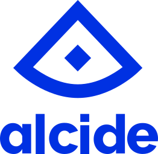 <code>alcide</code></a></td><td align="center"><a href="../logos/aliasvault.svg"> <code>aliasvault</code></a></td><td align="center"><a href="../logos/andotp.svg"> <code>andotp</code></a></td><td align="center"><a href="../logos/apiclarity.svg"> <code>apiclarity</code></a></td></tr>
<tr><td align="center"><a href="../logos/apolicy.svg"> <code>apolicy</code></a></td><td align="center"><a href="../logos/aserto.svg">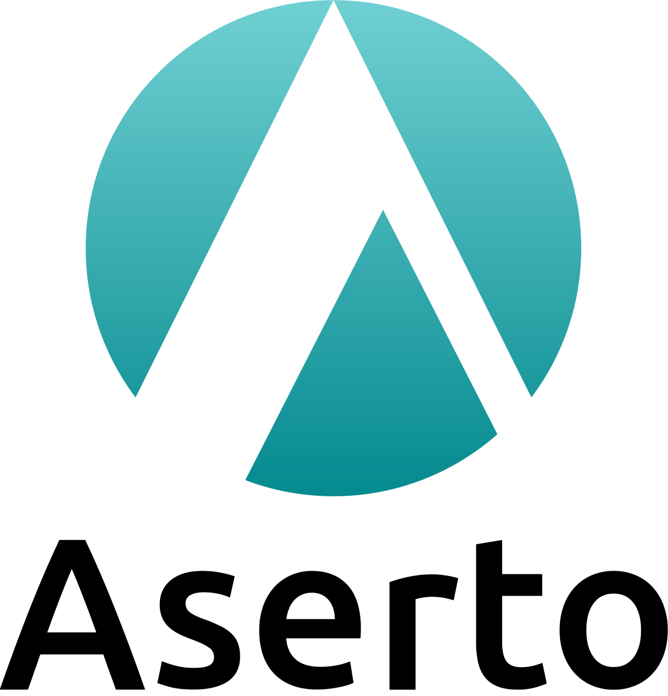 <code>aserto</code></a></td><td align="center"><a href="../logos/athenz.svg">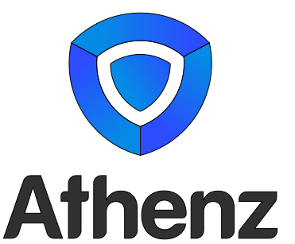 <code>athenz</code></a></td><td align="center"><a href="../logos/auth-js.svg"> <code>auth-js</code></a></td><td align="center"><a href="../logos/auth0.svg"> <code>auth0</code></a></td><td align="center"><a href="../logos/auth0-wordmark.svg"> <code>auth0-wordmark</code></a></td></tr>
<tr><td align="center"><a href="../logos/authelia.svg"> <code>authelia</code></a></td><td align="center"><a href="../logos/authentik.svg"> <code>authentik</code></a></td><td align="center"><a href="../logos/authing.svg">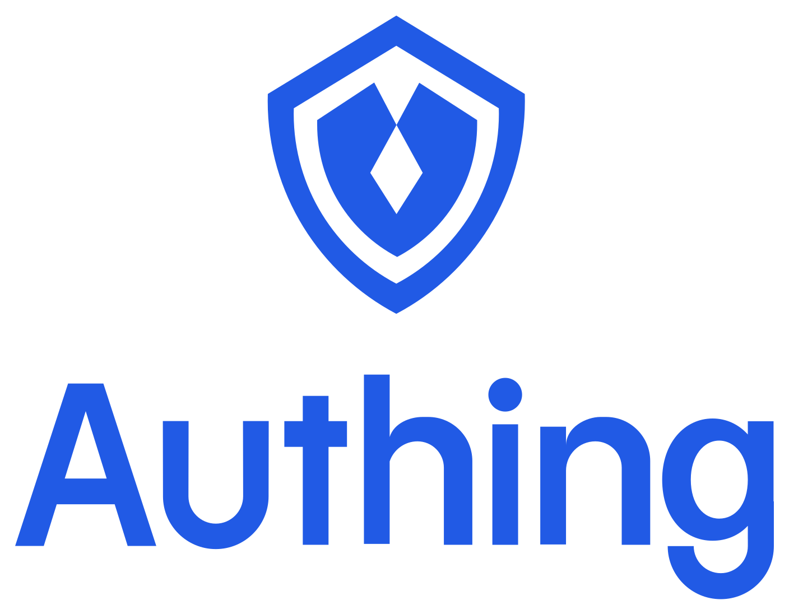 <code>authing</code></a></td><td align="center"><a href="../logos/authman.svg"> <code>authman</code></a></td><td align="center"><a href="../logos/authy.svg"> <code>authy</code></a></td><td align="center"><a href="../logos/authy-wordmark.svg"> <code>authy-wordmark</code></a></td></tr>
<tr><td align="center"><a href="../logos/azure-firewall.svg"> <code>azure-firewall</code></a></td><td align="center"><a href="../logos/azure-keyvault.svg"> <code>azure-keyvault</code></a></td><td align="center"><a href="../logos/bank-vaults.svg"> <code>bank-vaults</code></a></td><td align="center"><a href="../logos/better-auth.svg"> <code>better-auth</code></a></td><td align="center"><a href="../logos/better-auth-wordmark.svg">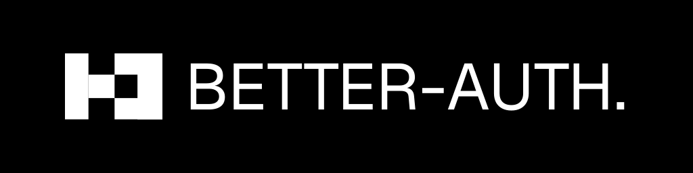 <code>better-auth-wordmark</code></a></td><td align="center"><a href="../logos/bitwarden.svg"> <code>bitwarden</code></a></td></tr>
<tr><td align="center"><a href="../logos/bitwarden-wordmark.svg"> <code>bitwarden-wordmark</code></a></td><td align="center"><a href="../logos/blackduck.svg"> <code>blackduck</code></a></td><td align="center"><a href="../logos/bloombase.svg"> <code>bloombase</code></a></td><td align="center"><a href="../logos/bpfman.svg">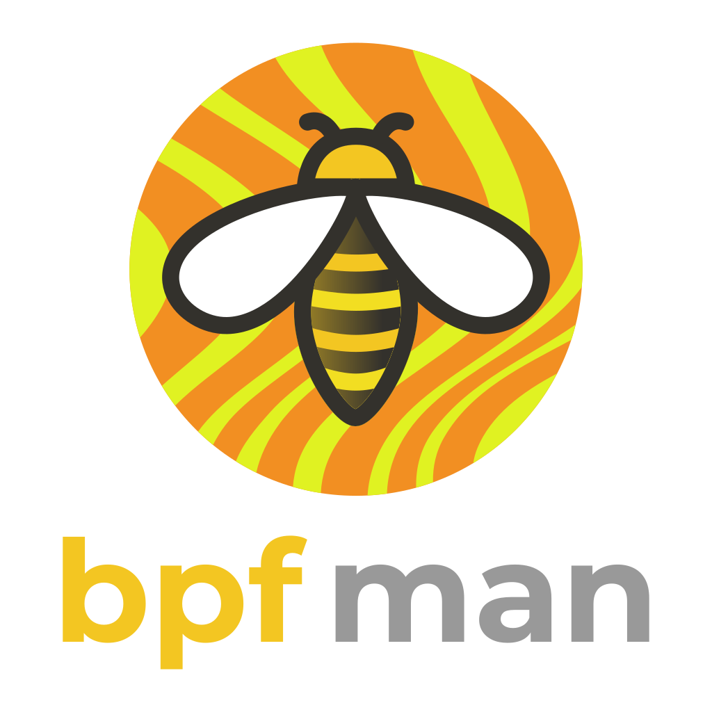 <code>bpfman</code></a></td><td align="center"><a href="../logos/bugcrowd.svg"> <code>bugcrowd</code></a></td><td align="center"><a href="../logos/capsule8.svg">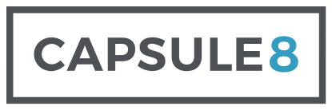 <code>capsule8</code></a></td></tr>
<tr><td align="center"><a href="../logos/cartography.svg"> <code>cartography</code></a></td><td align="center"><a href="../logos/casdoor.svg">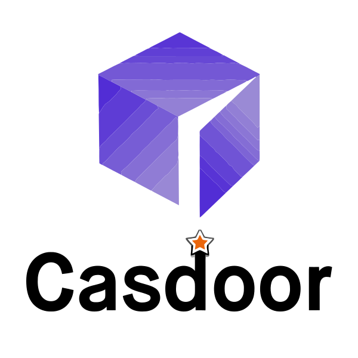 <code>casdoor</code></a></td><td align="center"><a href="../logos/cedar.svg"> <code>cedar</code></a></td><td align="center"><a href="../logos/cerbos.svg">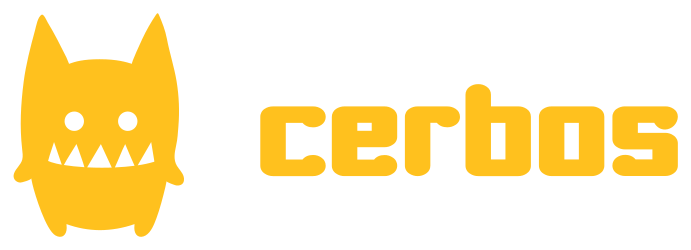 <code>cerbos</code></a></td><td align="center"><a href="../logos/certbot.svg"> <code>certbot</code></a></td><td align="center"><a href="../logos/chaitintech.svg"> <code>chaitintech</code></a></td></tr>
<tr><td align="center"><a href="../logos/checkov.svg"> <code>checkov</code></a></td><td align="center"><a href="../logos/chef-inspec.svg">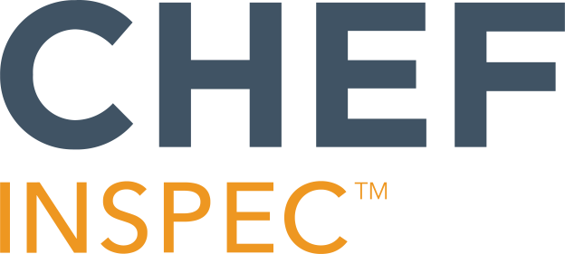 <code>chef-inspec</code></a></td><td align="center"><a href="../logos/china-mobile-cloud-cas.svg"> <code>china-mobile-cloud-cas</code></a></td><td align="center"><a href="../logos/clair.svg"> <code>clair</code></a></td><td align="center"><a href="../logos/clerk.svg"> <code>clerk</code></a></td><td align="center"><a href="../logos/clerk-wordmark.svg"> <code>clerk-wordmark</code></a></td></tr>
<tr><td align="center"><a href="../logos/cloudmatos.svg"> <code>cloudmatos</code></a></td><td align="center"><a href="../logos/community-bouncy-castle.svg"> <code>community-bouncy-castle</code></a></td><td align="center"><a href="../logos/confidential-containers.svg"> <code>confidential-containers</code></a></td><td align="center"><a href="../logos/conjur.svg">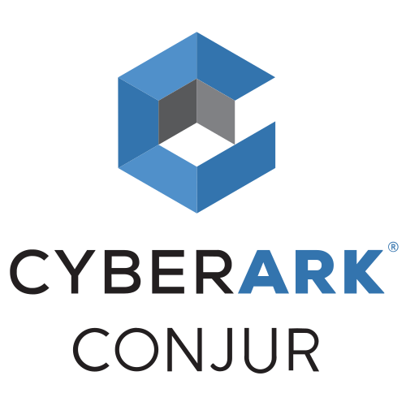 <code>conjur</code></a></td><td align="center"><a href="../logos/containerssh.svg">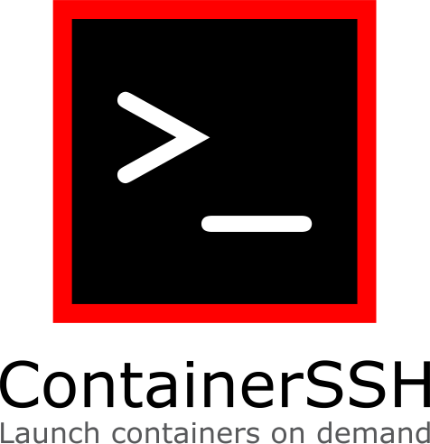 <code>containerssh</code></a></td><td align="center"><a href="../logos/copa.svg">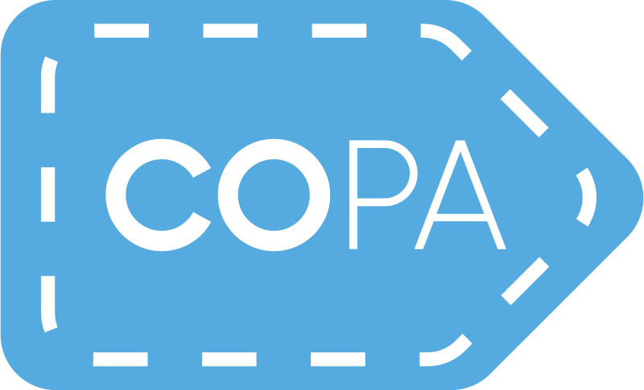 <code>copa</code></a></td></tr>
<tr><td align="center"><a href="../logos/curiefense.svg">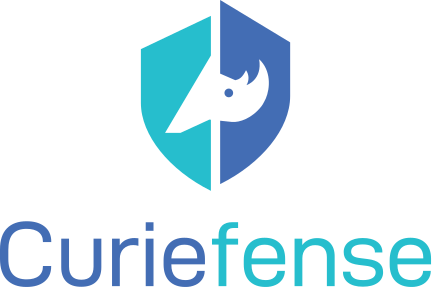 <code>curiefense</code></a></td><td align="center"><a href="../logos/dashlane.svg"> <code>dashlane</code></a></td><td align="center"><a href="../logos/dashlane-wordmark.svg"> <code>dashlane-wordmark</code></a></td><td align="center"><a href="../logos/datica.svg"> <code>datica</code></a></td><td align="center"><a href="../logos/dex.svg">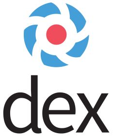 <code>dex</code></a></td><td align="center"><a href="../logos/digidentity.svg"> <code>digidentity</code></a></td></tr>
<tr><td align="center"><a href="../logos/dotenvx.svg">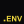 <code>dotenvx</code></a></td><td align="center"><a href="../logos/edgesecurity.svg"> <code>edgesecurity</code></a></td><td align="center"><a href="../logos/edgesecurity-wordmark.svg"> <code>edgesecurity-wordmark</code></a></td><td align="center"><a href="../logos/ejbca-community.svg"> <code>ejbca-community</code></a></td><td align="center"><a href="../logos/ente-auth.svg"> <code>ente-auth</code></a></td><td align="center"><a href="../logos/expressvpn.svg"> <code>expressvpn</code></a></td></tr>
<tr><td align="center"><a href="../logos/external-secrets.svg"> <code>external-secrets</code></a></td><td align="center"><a href="../logos/fairwinds-insights.svg"> <code>fairwinds-insights</code></a></td><td align="center"><a href="../logos/firewalla.svg"> <code>firewalla</code></a></td><td align="center"><a href="../logos/fugue.svg"> <code>fugue</code></a></td><td align="center"><a href="../logos/fusionauth.svg"> <code>fusionauth</code></a></td><td align="center"><a href="../logos/fusionauthio.svg"> <code>fusionauthio</code></a></td></tr>
<tr><td align="center"><a href="../logos/fusionauthio-wordmark.svg"> <code>fusionauthio-wordmark</code></a></td><td align="center"><a href="../logos/geetest.svg">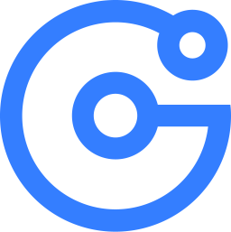 <code>geetest</code></a></td><td align="center"><a href="../logos/geetest-wordmark.svg"> <code>geetest-wordmark</code></a></td><td align="center"><a href="../logos/gitguardian.svg"> <code>gitguardian</code></a></td><td align="center"><a href="../logos/gnu-privacy-guard.svg"> <code>gnu-privacy-guard</code></a></td><td align="center"><a href="../logos/gnupg.svg"> <code>gnupg</code></a></td></tr>
<tr><td align="center"><a href="../logos/gnupg-wordmark.svg"> <code>gnupg-wordmark</code></a></td><td align="center"><a href="../logos/google-authenticator.svg"> <code>google-authenticator</code></a></td><td align="center"><a href="../logos/grafeas.svg"> <code>grafeas</code></a></td><td align="center"><a href="../logos/grype.svg">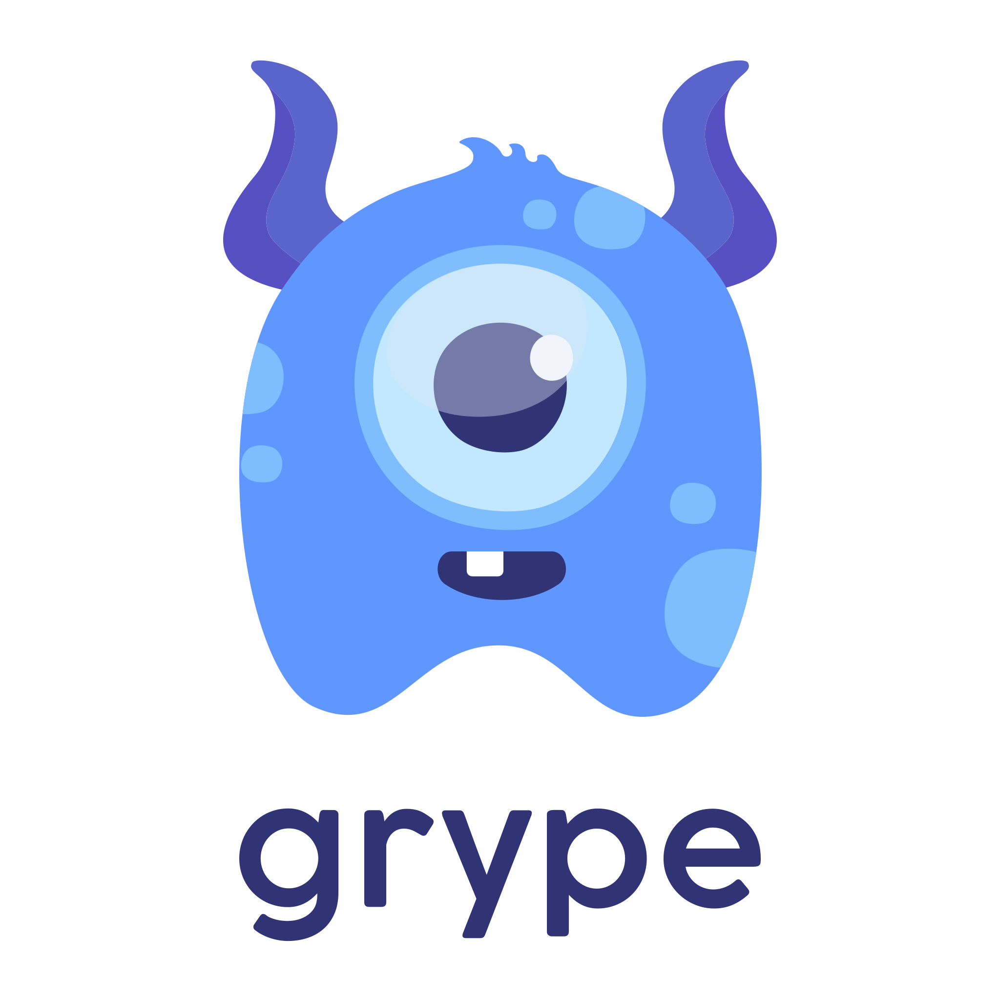 <code>grype</code></a></td><td align="center"><a href="../logos/hacker-one.svg"> <code>hacker-one</code></a></td><td align="center"><a href="../logos/hacker-one-wordmark.svg"> <code>hacker-one-wordmark</code></a></td></tr>
<tr><td align="center"><a href="../logos/hashicorp-vault.svg"> <code>hashicorp-vault</code></a></td><td align="center"><a href="../logos/hcaptcha.svg"> <code>hcaptcha</code></a></td><td align="center"><a href="../logos/hcaptcha-wordmark.svg"> <code>hcaptcha-wordmark</code></a></td><td align="center"><a href="../logos/hexa.svg"> <code>hexa</code></a></td><td align="center"><a href="../logos/in-toto.svg">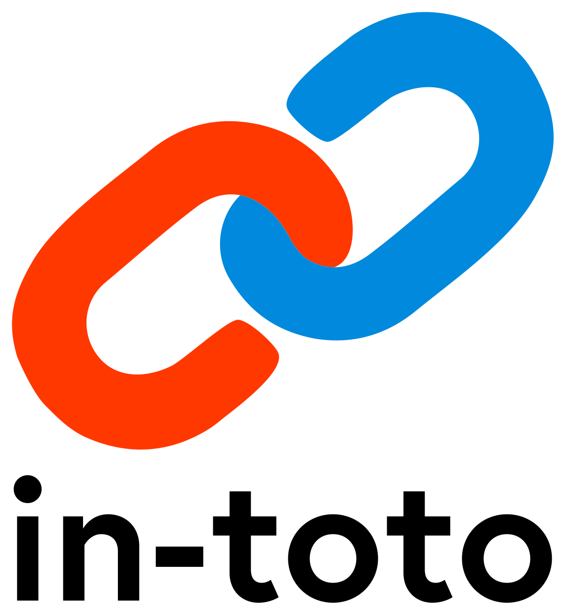 <code>in-toto</code></a></td><td align="center"><a href="../logos/jetstack-cert-manager.svg"> <code>jetstack-cert-manager</code></a></td></tr>
<tr><td align="center"><a href="../logos/jwt.svg">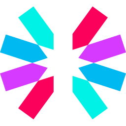 <code>jwt</code></a></td><td align="center"><a href="../logos/jwt-wordmark.svg"> <code>jwt-wordmark</code></a></td><td align="center"><a href="../logos/keepassdx.svg"> <code>keepassdx</code></a></td><td align="center"><a href="../logos/keepassxc.svg"> <code>keepassxc</code></a></td><td align="center"><a href="../logos/keeper-security.svg"> <code>keeper-security</code></a></td><td align="center"><a href="../logos/keybase.svg"> <code>keybase</code></a></td></tr>
<tr><td align="center"><a href="../logos/keycloak.svg"> <code>keycloak</code></a></td><td align="center"><a href="../logos/keylime.svg">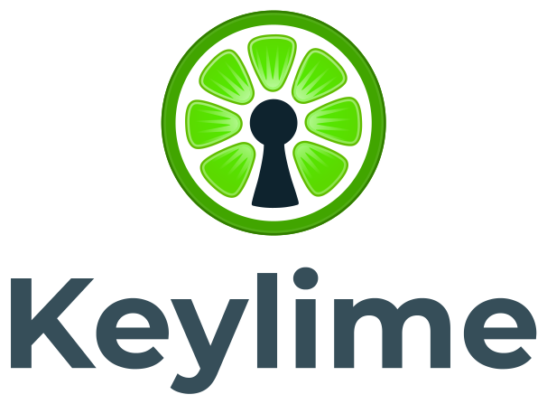 <code>keylime</code></a></td><td align="center"><a href="../logos/kics.svg">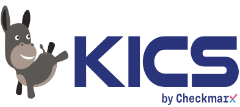 <code>kics</code></a></td><td align="center"><a href="../logos/kube-bench.svg">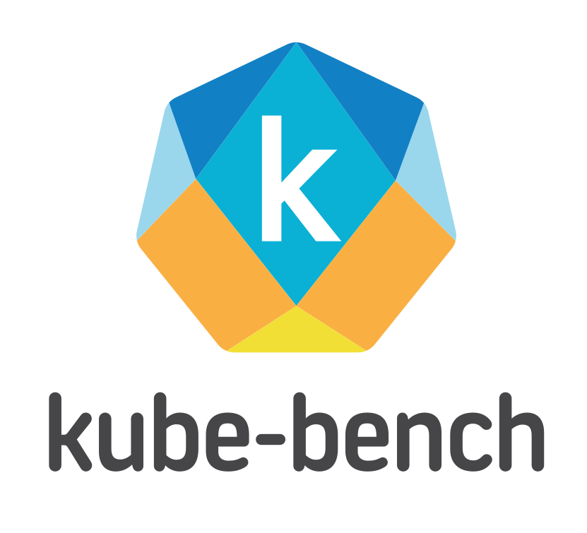 <code>kube-bench</code></a></td><td align="center"><a href="../logos/kube-hunter.svg">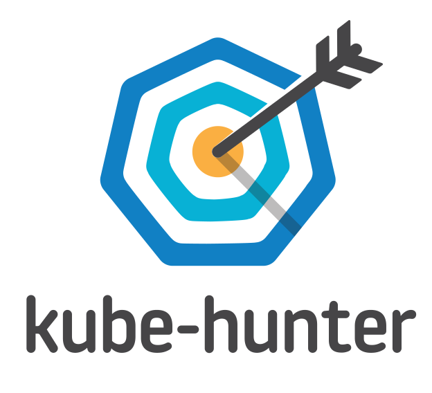 <code>kube-hunter</code></a></td><td align="center"><a href="../logos/kubearmor.svg">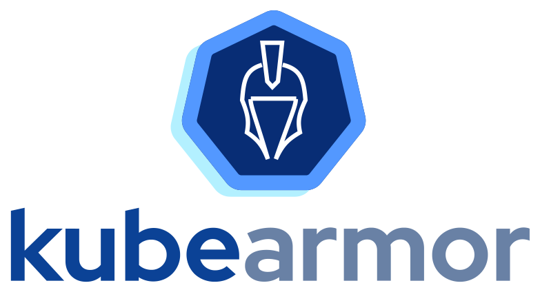 <code>kubearmor</code></a></td></tr>
<tr><td align="center"><a href="../logos/kubelinter.svg"> <code>kubelinter</code></a></td><td align="center"><a href="../logos/kubescape.svg">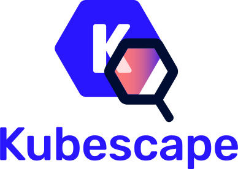 <code>kubescape</code></a></td><td align="center"><a href="../logos/kubewarden.svg">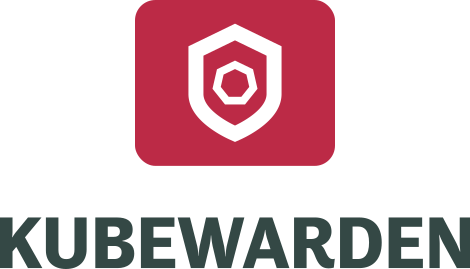 <code>kubewarden</code></a></td><td align="center"><a href="../logos/kyverno.svg">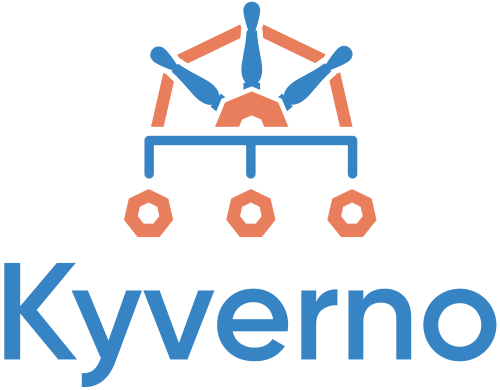 <code>kyverno</code></a></td><td align="center"><a href="../logos/lastpass.svg"> <code>lastpass</code></a></td><td align="center"><a href="../logos/lastpass-wordmark.svg"> <code>lastpass-wordmark</code></a></td></tr>
<tr><td align="center"><a href="../logos/letsencrypt.svg"> <code>letsencrypt</code></a></td><td align="center"><a href="../logos/letsencrypt-wordmark.svg"> <code>letsencrypt-wordmark</code></a></td><td align="center"><a href="../logos/matano.svg"> <code>matano</code></a></td><td align="center"><a href="../logos/mcafee.svg"> <code>mcafee</code></a></td><td align="center"><a href="../logos/metarget.svg">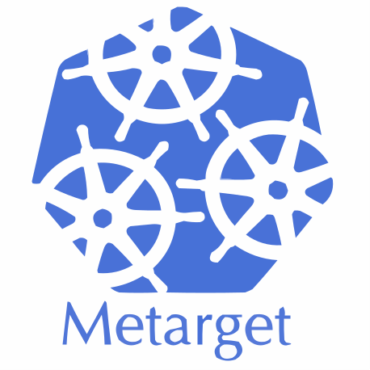 <code>metarget</code></a></td><td align="center"><a href="../logos/mondoo.svg"> <code>mondoo</code></a></td></tr>
<tr><td align="center"><a href="../logos/mullvad-vpn.svg"> <code>mullvad-vpn</code></a></td><td align="center"><a href="../logos/multifactor-authenticator.svg"> <code>multifactor-authenticator</code></a></td><td align="center"><a href="../logos/neuvector.svg"> <code>neuvector</code></a></td><td align="center"><a href="../logos/nordvpn.svg"> <code>nordvpn</code></a></td><td align="center"><a href="../logos/notary-project.svg"> <code>notary-project</code></a></td><td align="center"><a href="../logos/oauth.svg">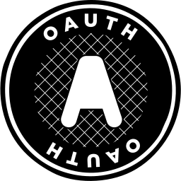 <code>oauth</code></a></td></tr>
<tr><td align="center"><a href="../logos/okta.svg"> <code>okta</code></a></td><td align="center"><a href="../logos/okta-wordmark.svg"> <code>okta-wordmark</code></a></td><td align="center"><a href="../logos/opa.svg">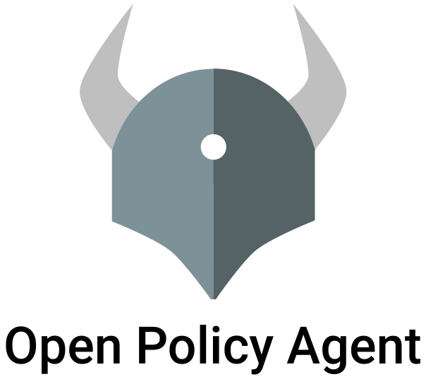 <code>opa</code></a></td><td align="center"><a href="../logos/opal.svg"> <code>opal</code></a></td><td align="center"><a href="../logos/open-policy-containers.svg"> <code>open-policy-containers</code></a></td><td align="center"><a href="../logos/openbugbounty.svg"> <code>openbugbounty</code></a></td></tr>
<tr><td align="center"><a href="../logos/openfga.svg">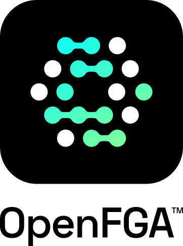 <code>openfga</code></a></td><td align="center"><a href="../logos/openmediavault.svg"> <code>openmediavault</code></a></td><td align="center"><a href="../logos/openscap.svg">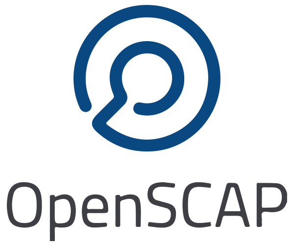 <code>openscap</code></a></td><td align="center"><a href="../logos/openvpn.svg"> <code>openvpn</code></a></td><td align="center"><a href="../logos/orcasec.svg"> <code>orcasec</code></a></td><td align="center"><a href="../logos/ory-hydra.svg"> <code>ory-hydra</code></a></td></tr>
<tr><td align="center"><a href="../logos/osquery.svg">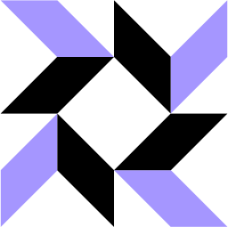 <code>osquery</code></a></td><td align="center"><a href="../logos/oxeye.svg">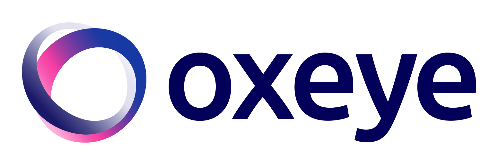 <code>oxeye</code></a></td><td align="center"><a href="../logos/paladin-cloud.svg"> <code>paladin-cloud</code></a></td><td align="center"><a href="../logos/paralus.svg">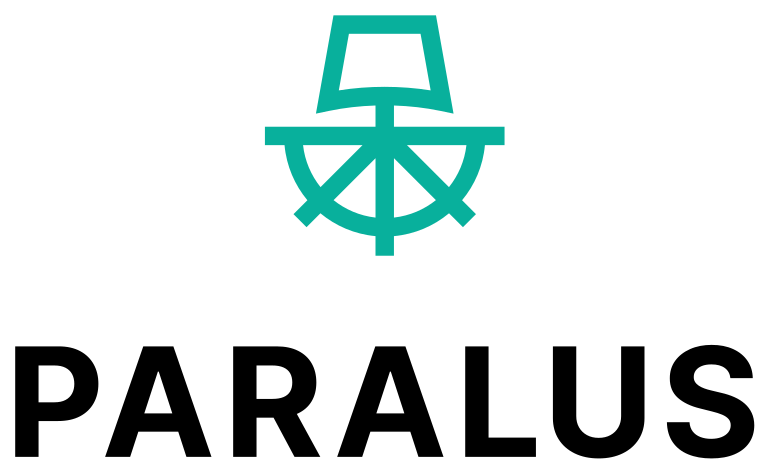 <code>paralus</code></a></td><td align="center"><a href="../logos/parrot-security.svg"> <code>parrot-security</code></a></td><td align="center"><a href="../logos/parsec.svg">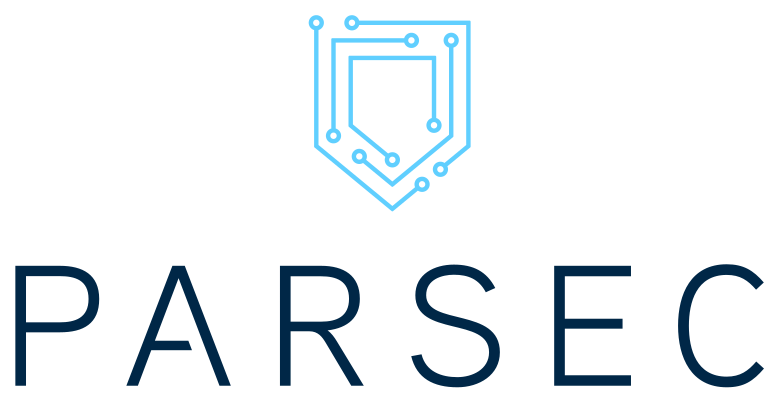 <code>parsec</code></a></td></tr>
<tr><td align="center"><a href="../logos/passage.svg">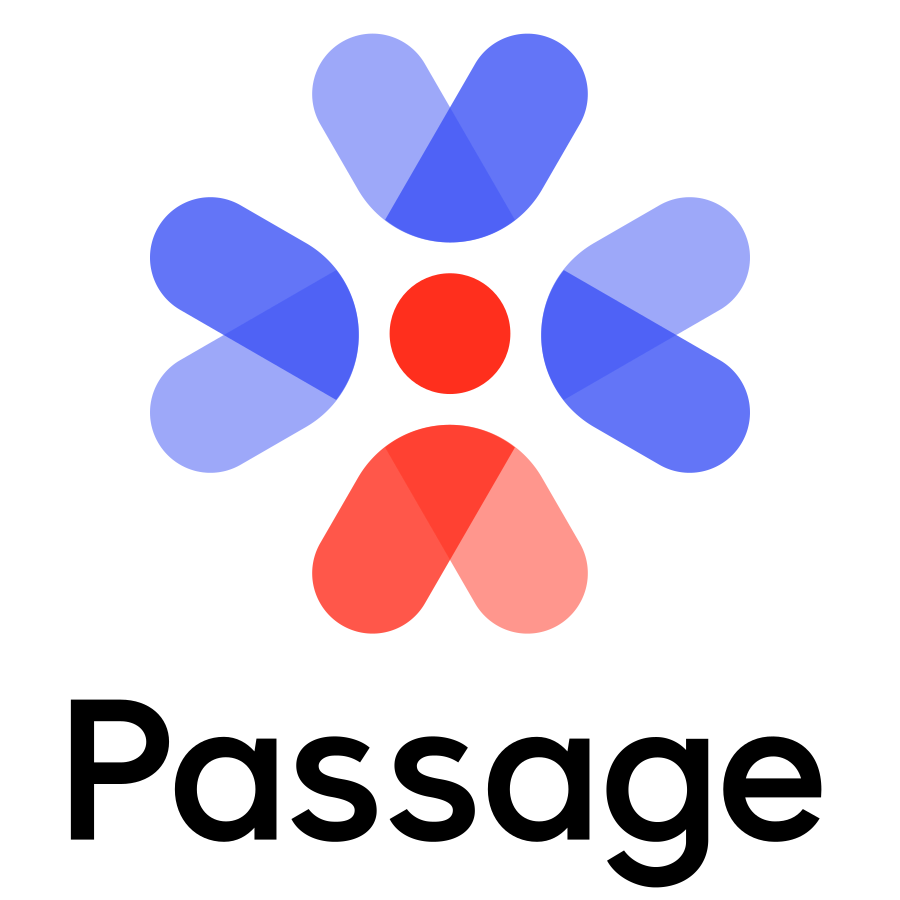 <code>passage</code></a></td><td align="center"><a href="../logos/passbolt.svg"> <code>passbolt</code></a></td><td align="center"><a href="../logos/passbolt-wordmark.svg"> <code>passbolt-wordmark</code></a></td><td align="center"><a href="../logos/passport.svg"> <code>passport</code></a></td><td align="center"><a href="../logos/pcisecuritystandards.svg"> <code>pcisecuritystandards</code></a></td><td align="center"><a href="../logos/pcisecuritystandards-wordmark.svg"> <code>pcisecuritystandards-wordmark</code></a></td></tr>
<tr><td align="center"><a href="../logos/permify.svg"> <code>permify</code></a></td><td align="center"><a href="../logos/pfsense.svg"> <code>pfsense</code></a></td><td align="center"><a href="../logos/pinniped.svg"> <code>pinniped</code></a></td><td align="center"><a href="../logos/pipelock.svg">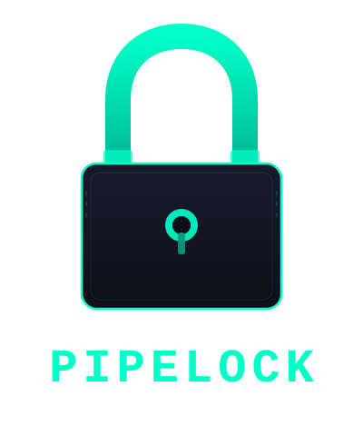 <code>pipelock</code></a></td><td align="center"><a href="../logos/pluto.svg"> <code>pluto</code></a></td><td align="center"><a href="../logos/pomerium.svg">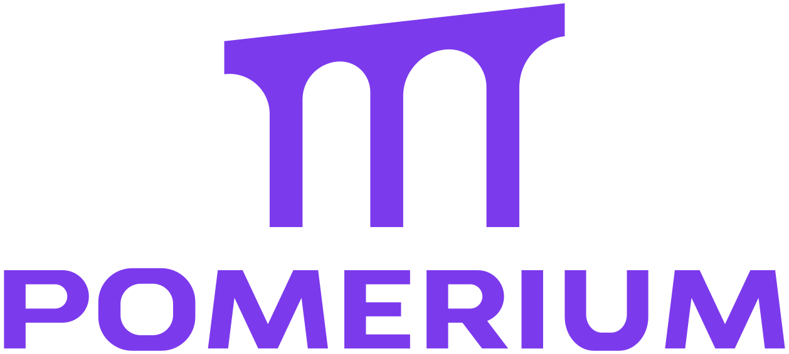 <code>pomerium</code></a></td></tr>
<tr><td align="center"><a href="../logos/portshift.svg"> <code>portshift</code></a></td><td align="center"><a href="../logos/private-division.svg"> <code>private-division</code></a></td><td align="center"><a href="../logos/project-sonobuoy.svg"> <code>project-sonobuoy</code></a></td><td align="center"><a href="../logos/pvy-vault.svg"> <code>pvy-vault</code></a></td><td align="center"><a href="../logos/pvy-vault-wordmark.svg"> <code>pvy-vault-wordmark</code></a></td><td align="center"><a href="../logos/pvy-vpn.svg"> <code>pvy-vpn</code></a></td></tr>
<tr><td align="center"><a href="../logos/pvy-vpn-wordmark.svg"> <code>pvy-vpn-wordmark</code></a></td><td align="center"><a href="../logos/qingteng.svg"> <code>qingteng</code></a></td><td align="center"><a href="../logos/qnap-firewall.svg"> <code>qnap-firewall</code></a></td><td align="center"><a href="../logos/qnap-vpn.svg"> <code>qnap-vpn</code></a></td><td align="center"><a href="../logos/ratify.svg"> <code>ratify</code></a></td><td align="center"><a href="../logos/rbac-lookup.svg"> <code>rbac-lookup</code></a></td></tr>
<tr><td align="center"><a href="../logos/rbac-manager.svg">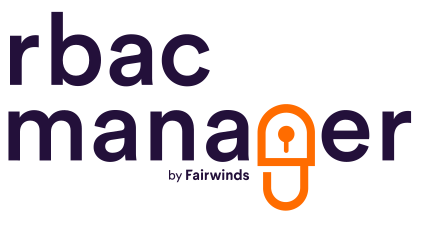 <code>rbac-manager</code></a></td><td align="center"><a href="../logos/recaptcha.svg"> <code>recaptcha</code></a></td><td align="center"><a href="../logos/rsa.svg"> <code>rsa</code></a></td><td align="center"><a href="../logos/rsa-wordmark.svg"> <code>rsa-wordmark</code></a></td><td align="center"><a href="../logos/rudder.svg">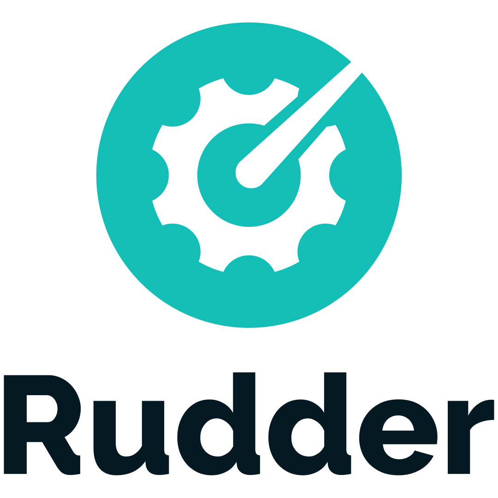 <code>rudder</code></a></td><td align="center"><a href="../logos/scribe.svg"> <code>scribe</code></a></td></tr>
<tr><td align="center"><a href="../logos/secureai-tools.svg"> <code>secureai-tools</code></a></td><td align="center"><a href="../logos/securecodebox.svg"> <code>securecodebox</code></a></td><td align="center"><a href="../logos/security-onion.svg"> <code>security-onion</code></a></td><td align="center"><a href="../logos/securityscorecard.svg"> <code>securityscorecard</code></a></td><td align="center"><a href="../logos/signserver-community.svg"> <code>signserver-community</code></a></td><td align="center"><a href="../logos/sigstore.svg"> <code>sigstore</code></a></td></tr>
<tr><td align="center"><a href="../logos/sigstore-wordmark.svg"> <code>sigstore-wordmark</code></a></td><td align="center"><a href="../logos/slimtoolkit.svg"> <code>slimtoolkit</code></a></td><td align="center"><a href="../logos/snyk.svg">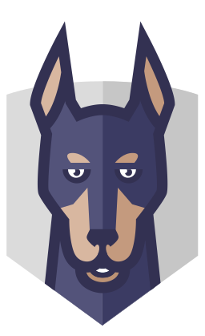 <code>snyk</code></a></td><td align="center"><a href="../logos/sops.svg"> <code>sops</code></a></td><td align="center"><a href="../logos/spiffe.svg">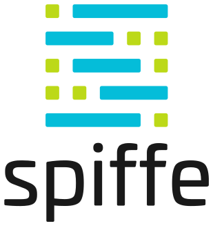 <code>spiffe</code></a></td><td align="center"><a href="../logos/spire.svg">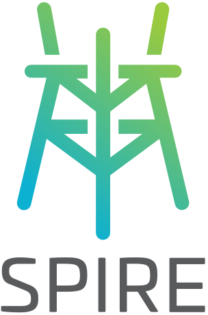 <code>spire</code></a></td></tr>
<tr><td align="center"><a href="../logos/spring-security.svg"> <code>spring-security</code></a></td><td align="center"><a href="../logos/spyderbat.svg">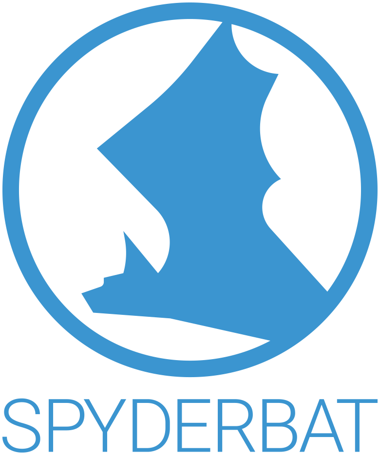 <code>spyderbat</code></a></td><td align="center"><a href="../logos/sso.svg">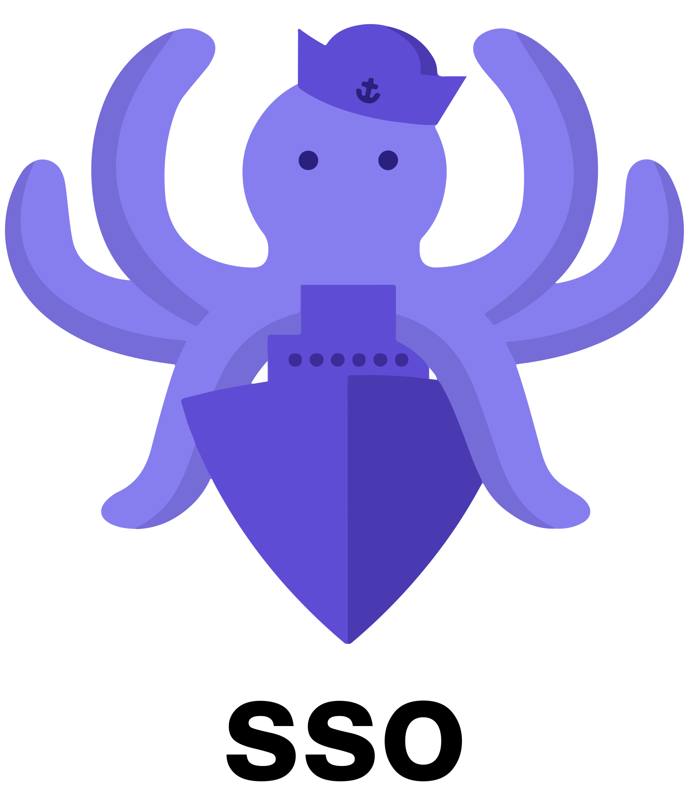 <code>sso</code></a></td><td align="center"><a href="../logos/stackhawk.svg">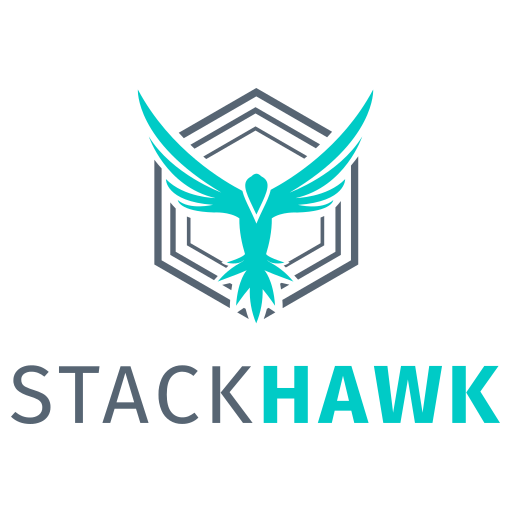 <code>stackhawk</code></a></td><td align="center"><a href="../logos/stackrox.svg"> <code>stackrox</code></a></td><td align="center"><a href="../logos/stormpath.svg"> <code>stormpath</code></a></td></tr>
<tr><td align="center"><a href="../logos/stytch.svg"> <code>stytch</code></a></td><td align="center"><a href="../logos/supertokens.svg"> <code>supertokens</code></a></td><td align="center"><a href="../logos/supertokens-wordmark.svg"> <code>supertokens-wordmark</code></a></td><td align="center"><a href="../logos/syft.svg">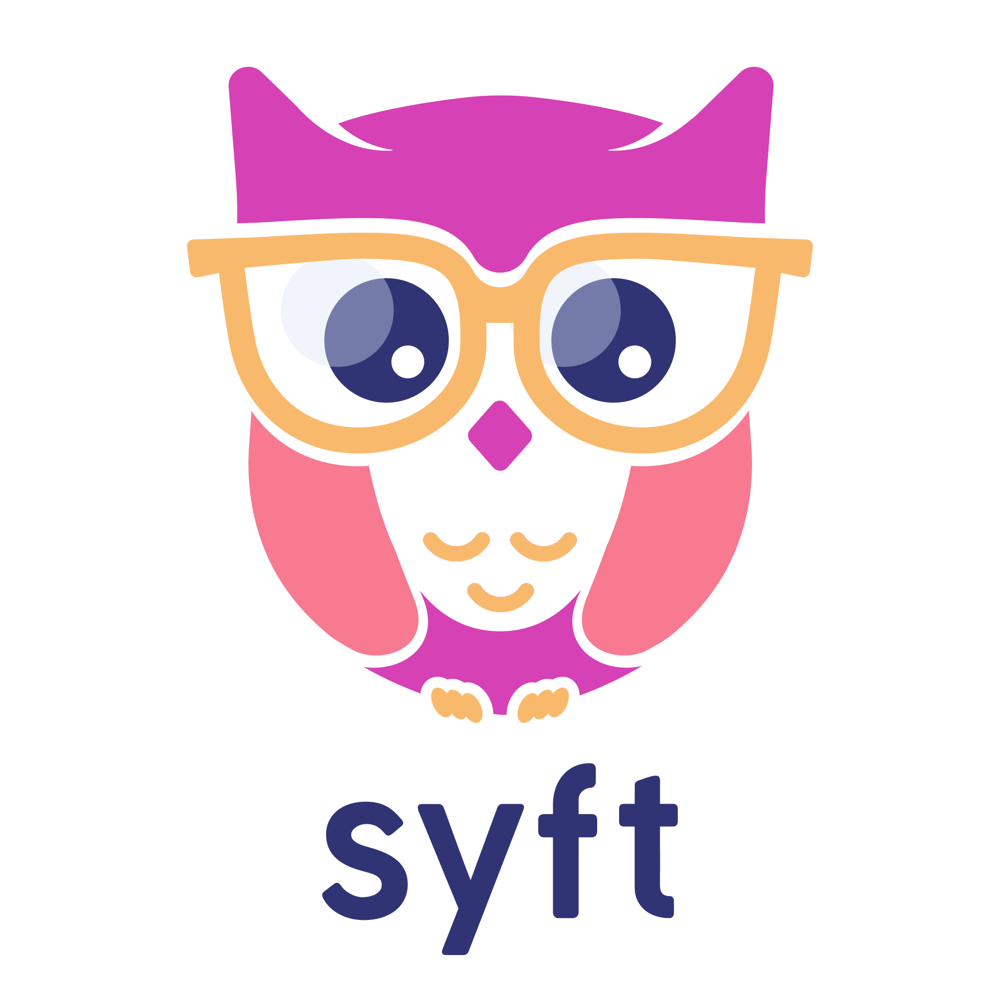 <code>syft</code></a></td><td align="center"><a href="../logos/symantec.svg"> <code>symantec</code></a></td><td align="center"><a href="../logos/symantec-wordmark.svg"> <code>symantec-wordmark</code></a></td></tr>
<tr><td align="center"><a href="../logos/sysdig-secure.svg"> <code>sysdig-secure</code></a></td><td align="center"><a href="../logos/tailscale.svg"> <code>tailscale</code></a></td><td align="center"><a href="../logos/teller.svg"> <code>teller</code></a></td><td align="center"><a href="../logos/tensor.svg"> <code>tensor</code></a></td><td align="center"><a href="../logos/terrascan.svg"> <code>terrascan</code></a></td><td align="center"><a href="../logos/tesseral.svg"> <code>tesseral</code></a></td></tr>
<tr><td align="center"><a href="../logos/tetragon-logo-wormark.svg"> <code>tetragon-logo-wormark</code></a></td><td align="center"><a href="../logos/the-update-framework-tuf.svg">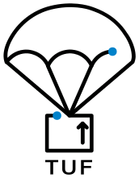 <code>the-update-framework-tuf</code></a></td><td align="center"><a href="../logos/threatmapper.svg"> <code>threatmapper</code></a></td><td align="center"><a href="../logos/tinyauth.svg"> <code>tinyauth</code></a></td><td align="center"><a href="../logos/tokenetes.svg">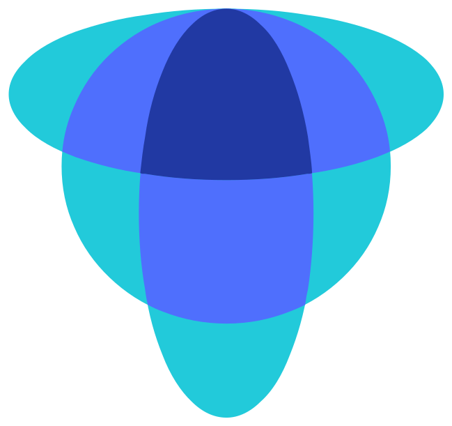 <code>tokenetes</code></a></td><td align="center"><a href="../logos/topaz.svg"> <code>topaz</code></a></td></tr>
<tr><td align="center"><a href="../logos/tor.svg"> <code>tor</code></a></td><td align="center"><a href="../logos/tracee.svg">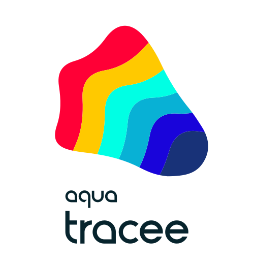 <code>tracee</code></a></td><td align="center"><a href="../logos/trend-micro.svg"> <code>trend-micro</code></a></td><td align="center"><a href="../logos/tuta.svg"> <code>tuta</code></a></td><td align="center"><a href="../logos/tutanota.svg"> <code>tutanota</code></a></td><td align="center"><a href="../logos/vaddy.svg"> <code>vaddy</code></a></td></tr>
<tr><td align="center"><a href="../logos/varmor.svg"> <code>varmor</code></a></td><td align="center"><a href="../logos/vault.svg"> <code>vault</code></a></td><td align="center"><a href="../logos/vault-wordmark.svg"> <code>vault-wordmark</code></a></td><td align="center"><a href="../logos/vaultwarden.svg"> <code>vaultwarden</code></a></td><td align="center"><a href="../logos/veinmind.svg"> <code>veinmind</code></a></td><td align="center"><a href="../logos/vouchervault.svg"> <code>vouchervault</code></a></td></tr>
<tr><td align="center"><a href="../logos/webauthn.svg"> <code>webauthn</code></a></td><td align="center"><a href="../logos/white-source.svg"> <code>white-source</code></a></td><td align="center"><a href="../logos/wireguard.svg"> <code>wireguard</code></a></td><td align="center"><a href="../logos/wireguard-wordmark.svg"> <code>wireguard-wordmark</code></a></td><td align="center"><a href="../logos/workos.svg"> <code>workos</code></a></td><td align="center"><a href="../logos/workos-wordmark.svg"> <code>workos-wordmark</code></a></td></tr>
<tr><td align="center"><a href="../logos/yubico.svg"> <code>yubico</code></a></td><td align="center"><a href="../logos/yubico-wordmark.svg"> <code>yubico-wordmark</code></a></td><td align="center"><a href="../logos/zerotier.svg"> <code>zerotier</code></a></td><td align="center"><a href="../logos/zettaset.svg"> <code>zettaset</code></a></td></tr>
</table>

[⬅️ Back to the full catalog](../README.md)
