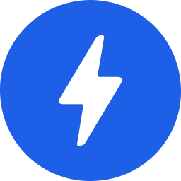
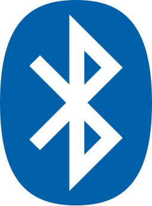
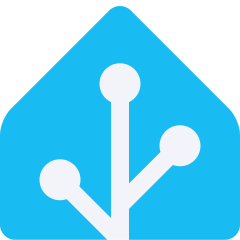
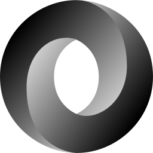
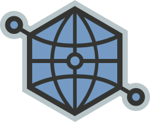
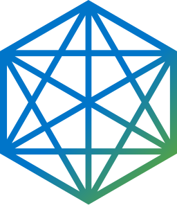
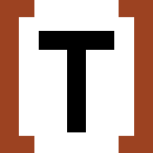

# 🌐 Web Standards & Protocols (62)

[⬅️ Back to the full catalog](../README.md) · [🖼️ Browse & download on the website](https://logos.lndev.me/)

<table>
<tr><td align="center"><a href="../logos/amp.svg"> <code>amp</code></a></td><td align="center"><a href="../logos/amp-wordmark.svg"> <code>amp-wordmark</code></a></td><td align="center"><a href="../logos/bluetooth.svg"> <code>bluetooth</code></a></td><td align="center"><a href="../logos/copyleft.svg"> <code>copyleft</code></a></td><td align="center"><a href="../logos/copyleft-pirate.svg"> <code>copyleft-pirate</code></a></td><td align="center"><a href="../logos/css.svg"> <code>css</code></a></td></tr>
<tr><td align="center"><a href="../logos/css-3.svg"> <code>css-3</code></a></td><td align="center"><a href="../logos/css-3-official.svg"> <code>css-3-official</code></a></td><td align="center"><a href="../logos/epub.svg"> <code>epub</code></a></td><td align="center"><a href="../logos/fetch.svg"> <code>fetch</code></a></td><td align="center"><a href="../logos/freedomdefined.svg"> <code>freedomdefined</code></a></td><td align="center"><a href="../logos/gravatar.svg"> <code>gravatar</code></a></td></tr>
<tr><td align="center"><a href="../logos/gravatar-wordmark.svg"> <code>gravatar-wordmark</code></a></td><td align="center"><a href="../logos/home-assistant.svg"> <code>home-assistant</code></a></td><td align="center"><a href="../logos/home-assistant-wordmark.svg"> <code>home-assistant-wordmark</code></a></td><td align="center"><a href="../logos/html-5.svg"> <code>html-5</code></a></td><td align="center"><a href="../logos/html5-boilerplate.svg"> <code>html5-boilerplate</code></a></td><td align="center"><a href="../logos/ieee.svg"> <code>ieee</code></a></td></tr>
<tr><td align="center"><a href="../logos/ietf.svg"> <code>ietf</code></a></td><td align="center"><a href="../logos/internet-archive.svg"> <code>internet-archive</code></a></td><td align="center"><a href="../logos/jamstack.svg"> <code>jamstack</code></a></td><td align="center"><a href="../logos/jamstack-wordmark.svg"> <code>jamstack-wordmark</code></a></td><td align="center"><a href="../logos/json.svg"> <code>json</code></a></td><td align="center"><a href="../logos/json-ld.svg"> <code>json-ld</code></a></td></tr>
<tr><td align="center"><a href="../logos/json-schema.svg"> <code>json-schema</code></a></td><td align="center"><a href="../logos/json-schema-wordmark.svg"> <code>json-schema-wordmark</code></a></td><td align="center"><a href="../logos/jsonfeed.svg"> <code>jsonfeed</code></a></td><td align="center"><a href="../logos/markdown.svg"> <code>markdown</code></a></td><td align="center"><a href="../logos/mdn.svg"> <code>mdn</code></a></td><td align="center"><a href="../logos/mdx.svg"> <code>mdx</code></a></td></tr>
<tr><td align="center"><a href="../logos/microformats.svg"> <code>microformats</code></a></td><td align="center"><a href="../logos/open-graph.svg"> <code>open-graph</code></a></td><td align="center"><a href="../logos/openjs-foundation.svg"> <code>openjs-foundation</code></a></td><td align="center"><a href="../logos/openjs-foundation-wordmark.svg"> <code>openjs-foundation-wordmark</code></a></td><td align="center"><a href="../logos/opensource.svg"> <code>opensource</code></a></td><td align="center"><a href="../logos/oshw.svg"> <code>oshw</code></a></td></tr>
<tr><td align="center"><a href="../logos/promises.svg"> <code>promises</code></a></td><td align="center"><a href="../logos/pwa.svg"> <code>pwa</code></a></td><td align="center"><a href="../logos/rest.svg"> <code>rest</code></a></td><td align="center"><a href="../logos/rss.svg"> <code>rss</code></a></td><td align="center"><a href="../logos/semantic-web.svg"> <code>semantic-web</code></a></td><td align="center"><a href="../logos/solid.svg"> <code>solid</code></a></td></tr>
<tr><td align="center"><a href="../logos/svg.svg"> <code>svg</code></a></td><td align="center"><a href="../logos/toml.svg"> <code>toml</code></a></td><td align="center"><a href="../logos/unicode.svg"> <code>unicode</code></a></td><td align="center"><a href="../logos/w3c.svg"> <code>w3c</code></a></td><td align="center"><a href="../logos/web-dev.svg"> <code>web-dev</code></a></td><td align="center"><a href="../logos/web-dev-wordmark.svg"> <code>web-dev-wordmark</code></a></td></tr>
<tr><td align="center"><a href="../logos/web-fundamentals.svg"> <code>web-fundamentals</code></a></td><td align="center"><a href="../logos/webcomponents.svg"> <code>webcomponents</code></a></td><td align="center"><a href="../logos/webgpu.svg"> <code>webgpu</code></a></td><td align="center"><a href="../logos/webhooks.svg"> <code>webhooks</code></a></td><td align="center"><a href="../logos/webmention.svg"> <code>webmention</code></a></td><td align="center"><a href="../logos/webplatform.svg"> <code>webplatform</code></a></td></tr>
<tr><td align="center"><a href="../logos/webrtc.svg"> <code>webrtc</code></a></td><td align="center"><a href="../logos/websocket.svg"> <code>websocket</code></a></td><td align="center"><a href="../logos/whatwg.svg"> <code>whatwg</code></a></td><td align="center"><a href="../logos/wifi.svg"> <code>wifi</code></a></td><td align="center"><a href="../logos/xmpp.svg"> <code>xmpp</code></a></td><td align="center"><a href="../logos/yaml.svg"> <code>yaml</code></a></td></tr>
<tr><td align="center"><a href="../logos/zigbee.svg"> <code>zigbee</code></a></td><td align="center"><a href="../logos/zwave.svg"> <code>zwave</code></a></td></tr>
</table>

[⬅️ Back to the full catalog](../README.md)
